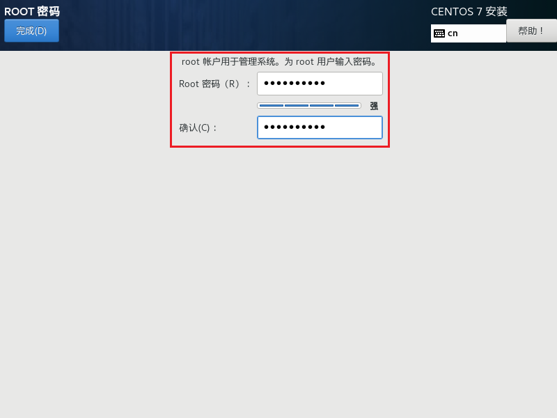

> 选择**中文-简体中文 (中国)**，继续

<!-- truncate -->

- **软件选择**

  > 点击**软件选择**
  >
  > 一般生产环境选择 **最小安装**，里面什么都没有，而学习阶段选择 **GNOME 桌面版**，选中：
  >
  >  - [ ] **传统 X Windows 系统的兼容性**
  >  - [ ] **兼容性程序库**
  >  - [ ] **开发工具**
  >
  > 开发工具中包含了JDK，GCC，MySQL等等，不用自己再安装了，当然后续可以卸载或者更新
  >
  > 然后点击**完成**

- **安装位置**

  > 点击完成后，会出现**安装源**和**软件选择**检查软件依赖关系的等待时间，等待期间不要乱动，等待结束后，点击下面的**安装位置**。
  >
  > 一般选择**自动配置分区**，为了更能熟悉Linux系统，这里选择**我要配置分区**，点击**完成**。

> 上面配置内存的时候，给了虚拟机20G的内存，而自定义分区的话，一般分成三个区
>
> 1. **boot分区**：引导分区，操作系统的内核及在引导过程中使用的文件，**建议给1G**
> 2. **swap分区**：交换分区，当实际内存不够用的时候，操作系统会从内存中取出一部分暂时不用的数据，放在交换分区中，从而为当前运行的程序腾出足够的内存空间，**建议跟内存大小一样2G**
> 3. **根分区**：就是root分区，**剩下17G都给根分区**
>
> 点击 **+** 号，添加分区

> **挂载点**选择 **/boot**，**期望容量**输入**1G**，点击**添加挂载点**后，将**设备类型**改成**标准分区**，**文件系统**改成**ext4**

> 同样方式创建**swap分区(挂载点选择swap，期望容量输入2G)**，将**设备类型**改成**标准分区**，**文件系统**改成**swap**
>
> 创建**根分区(挂载点选择/，期望容量输入17G)**，将**设备类型**改成**标准分区**，**文件系统**改成**ext4**
>
> 点击左上角**完成**后，点击**接受更改**

- **KDUMP**

  > 用于系统崩溃时捕获信息，如果是生产环境建议**勾选**，如果是学习的话可以**关掉**，节省内存。

- **网络和主机名**

  > 选择**网络和主机名**
  >
  > **更改主机名**后点**应用**，将右上角的**以太网**选项打开，表示联网，最后点击**完成**

- **SECURITY POLICY**

  > 安全策略，用于密码的校验等等，可以根据需求关闭

> 点击**开始安装**

> 设置**root密码**

> 一般不用root登录，因为权限太大了，所以点击**创建用户**，然后点击**完成**

> 配置完成后，等待一段时间安装，安装成功后，点击**重启**

> 重启后，点击**LICENSE INFORMATION**，然后选择**我同意许可协议**，再点击**完成**，出来后点击**完成配置**

> Linux默认情况下希望使用普通用户登录，如果需要使用root用户登录，可以点击**未列出**，输入**用户名**和**密码**然后点击**登录**即可，第一次可能需要等待时间较长

> 1. 选择**汉语**，点击**前进**
>
> 2. 选择**汉语拼音**，点击**前进**
>
> 3. 位置服务可以选择**关闭**，点击**前进**
> 4. 登录账号，这里可以点击**跳过**
> 5. 配置和安装完成

