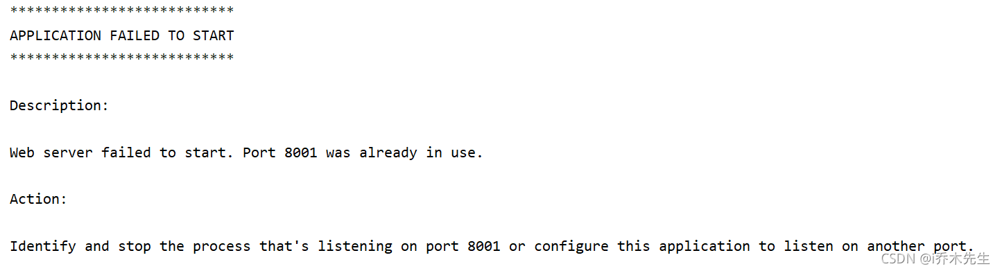
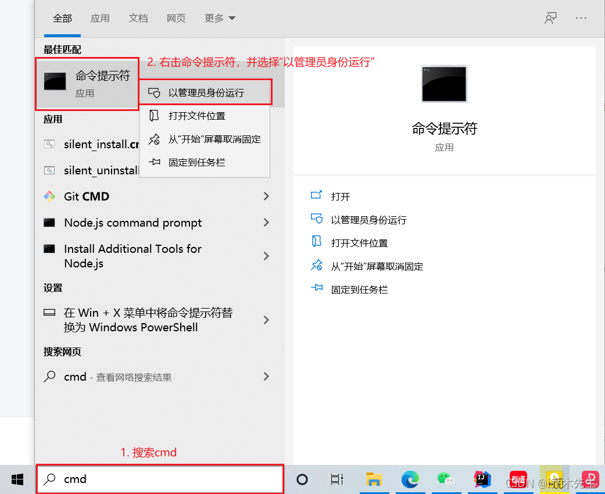
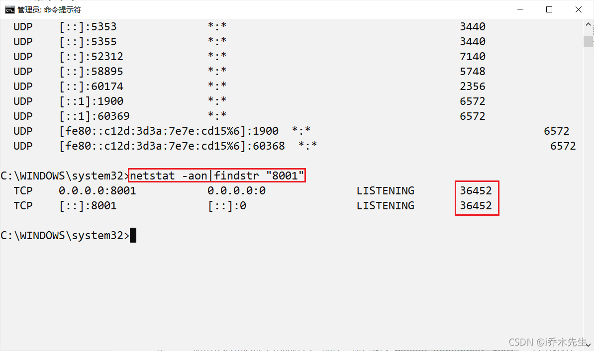
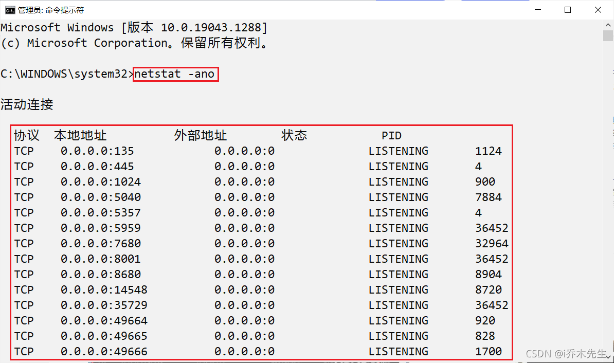
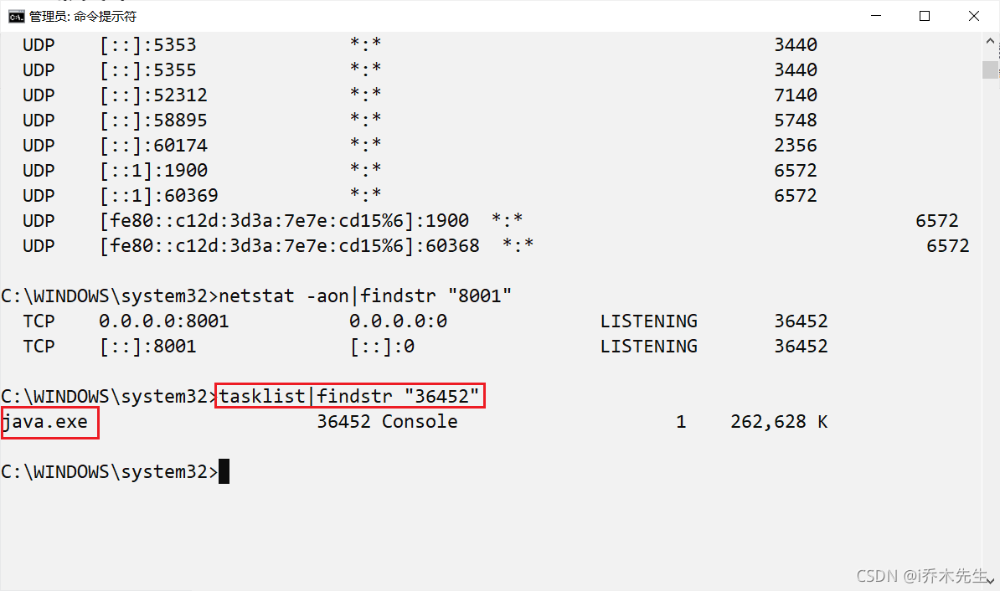
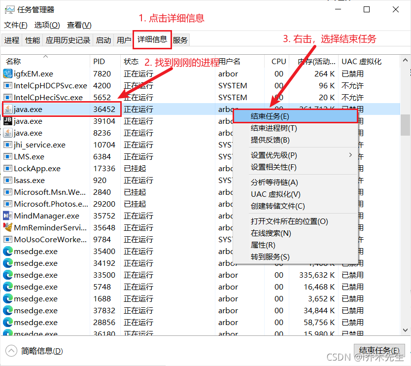

我总是在启动项目的时候失败，被告知端口号被占用，明明没有被占用(可能是系统卡了或者其它问题)，但是又不想改端口号，或者重启电脑，那怎么办呢？

<!-- truncate -->

 **第一步：** 打开命令行窗口，以管理员的身份运行

**第二步：** 如果我们知道被占用的端口号的话，可以输入 `netstat -aon|findstr "8001"` ，其中8001就是我们所要查询的端口号，8001需要加上英文的双引号，按回车键后，可以查询到8001端口的PID

> 如果不知道的话，进入命令提示符后，输入 `netstat -ano` 命令，然后回车，可以看到所有端口的情况，找到被占用的端口
> 

**第三步：** 输入 `tasklist|findstr "36452"` 命令，其中36452就是我们刚刚查询到的PID，将之替换即可，记得双引号是英文的，然后按下回车，就可以找到PID为35452的进程

**第四步：** 打开任务管理器(右击任务栏，选择任务管理器)
**第五步：** 选择详细信息，找到刚刚查询到的进程和PID，右击，选择结束任务，把进程结束掉，端口就被释放了

