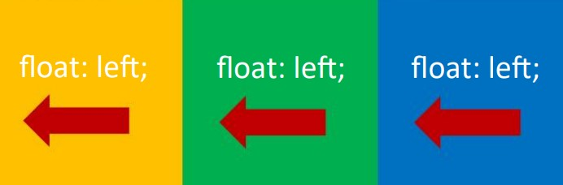
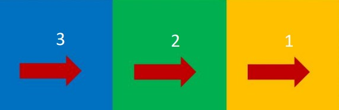
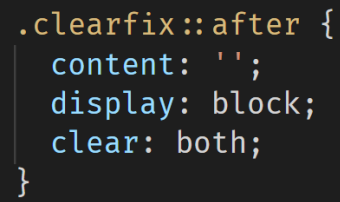
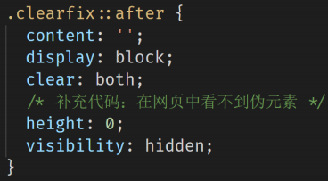
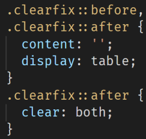

浮动用来实现并排，要浮动，并排的盒子都要设置浮动。

父盒子要有足够的宽度，否则子盒子会掉下去。子盒子会按顺序进行贴靠，如果没有足够空间，则会寻找再前一个兄弟元素。

> 浮动的元素不再区分块级元素、行内元素，已经脱离了标准文档流，一律能够设置宽度和高度，即使它是span或者a标签等。

**左浮动**

`float:left;` 即可设置左浮动

**右浮动**

`float:right;` 即可设置右浮动

## 浮动的特点

1. 浮动元素会脱标，在标准流中不占位置
2. 浮动元素比标准流高出半个级别，可以覆盖标准流中的元素
3. 浮动找浮动，下一个浮动元素会在上一个浮动元素后面左右浮动
4. 浮动元素有特殊的显示效果：① 一行可以显示多个 ② 可以设置宽高

> 浮动的元素不能通过`text-align:center` 或者 `margin:0 auto`

## 清除浮动

需要父元素有高度，从而不影响其他网页元素的布局。浮动一定要封闭到一个盒子中，否则就会对页面后续元素产生影响。

**直接设置父元素高度：**

简单粗暴，方便。有些布局中不能固定父元素高度。如：新闻列表、京东推荐模块。

**额外标签法：**

在父元素内容的最后添加一个块级元素，给添加的块级元素设置 `clear:both`。

会在页面中添加额外的标签，会让页面的HTML结构变得复杂。

给后面的父盒子设置`clear:both`属性。clear表示清除浮动对自己的影响，both表示左右浮动都清除。

**单伪元素清除法：**

用伪元素替代了额外标签，项目中使用，直接给标签加类即可清除浮动。

**双伪元素清除法：**

项目中使用，直接给标签加类即可清除浮动

**给父元素设置 `overflow : hidden`：**

让内部有浮动的父盒子形成BFC，它就能关闭住内部的浮动。此时最好的方法就是 `overflow:hidden` 属性。

  
## BFC规范

BFC（Box Formatting Context，块级格式化上下文）是页面上的一个隔离的独立容器，容器里面的子元素不会影响到 外面的元素，反之亦然

例如：一个盒子不设置`height`，当内容子元素都浮动时，无法撑起自身，这个盒子没有形成BFC

BFC可以取消盒子`margin`塌陷，BFC可以阻止元素被浮动元素覆盖

BFC盒子会默认包裹住内部子元素（标准流、浮动）→ 应用：清除浮动

BFC盒子本身与子元素之间不存在`margin`的塌陷现象 → 应用：解决`margin`的塌陷

### 创建BFC

1. `float`的值不是`none`
2. `position`的值不是`static`或者`relative`
3. `display`的值是`inline-block`、`flex`或者`inline-flex`
4. `overflow`属性取值不为`visible`。如：`auto`、`hidden`…

  

## 浏览器差异

IE6、7浏览器使用haslayout机制，和BFC规范略有差异，比如IE浏览器可以使用zoom:1属性“让盒子拥有layout”

如果要制作兼容到IE6、7的网页时，尽量让网页布局变得简单，内部有浮动的盒子要设置height属性，规范编程，不要 “玩杂技”