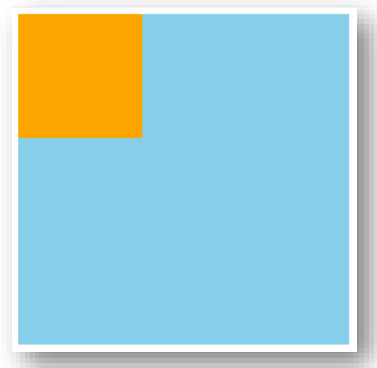
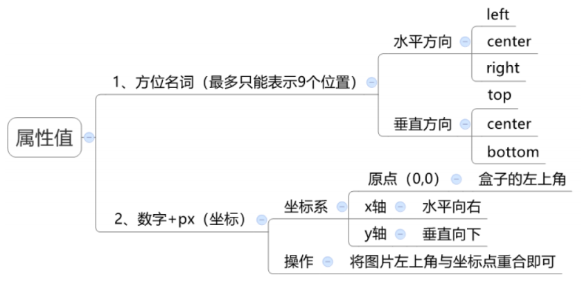

## 背景颜色

`background-color(bgc)`，颜色取值：关键字、rgb表示法、rgba表示法、十六进制……

> 背景颜色默认值是透明： `rgba(0,0,0,0)` 、`transparent`

背景颜色不会影响盒子大小，并能看清盒子的大小和位置，一般在布局中会习惯先给盒子设置背景颜色。



## 背景图片

`background-image(bgi)`，背景图片中url中可以省略引号，默认是在水平和垂直方向平铺的，仅给盒子起装饰效果，类似于背景颜色，不能撑开盒子。

```css
background-image: url('图片的路径');
```
  

## 背景平铺

`background-repeat(bgr)`：
- `repeat`：(默认值)水平和垂直方向都平铺
- `no-repeat`：不平铺
- `repeat-x`：沿水平方向(x轴)平铺
- `repeat-y`：沿垂直方向(y轴)平铺

## 背景位置

`background-position(bgp)`

```css
background-position: 水平方向位置 垂直方向位置;
```



  

方位名词取值和坐标取值可以混使用，第一个取值表示水平，第二个取值表示垂直。

## 背景大小

`background-size`，调整背景图片尺寸。

> 默认auto、cover（覆盖）、contain（包含） 或者跟px、%

```css
background-size: cover;
```


## 背景滚动

`background-attachment`，背景是否随页面滚动。相对于浏览器窗口的大小进行滚动。

> scroll（默认 滚动的）、fixed(固定）

```css
background-attachment: fixed;
```

## 背景属性连写

`background(bg)`，单个属性值的合写，取值之间以空格隔开。可以按照需求省略。在pc端，如果盒子大小和背景图片大小一样，此时可以直接写`background：url()` 。

```css
background: color image repeat attachment position/size;
background: 颜色   图片  重复    固定        位置/尺寸 ;
```


## 背景渐变

在 CSS 中，可以通过 `linear-gradient`（线性渐变）和 `radial-gradient`（径向渐变）为元素添加渐变背景。

**线性渐变**

1. 方向。 可以是方位名词， 也可以是 deg(角度）
2. 位置。 色标的位置。不是必须写的。

`linear-gradient(方向, 颜色1 位置,颜色2 位置...)`：线性渐变（方向可控）

```css
background: linear-gradient(to right, #ff6b6b, #4ecdc4)

background-image:linear-gradient(90deg, #ff6b6b 30%, #4ecdc4 70%)
```


**径向渐变**

`radial-gradient(形状,颜色1,颜色2... )`：径向渐变（形状和位置可控）


```css
background: radial-gradient(circle, #ff9a9e, #fad0c4)
```


**文字背景线性渐变**

```css
background: linear-gradient(to right, pink, red); /* 设置背景渐变 */

background-clip: text; /* 文字范围裁剪背景 */
-webkit-background-clip: text; /* 兼容性写法，照顾谷歌老版本浏览器 -webkit- */

-webkit-text-fill-color: transparent; /* 文本填充颜色设置为透明 */
```


[CSS盒子装饰](./CSS盒子装饰.md)


