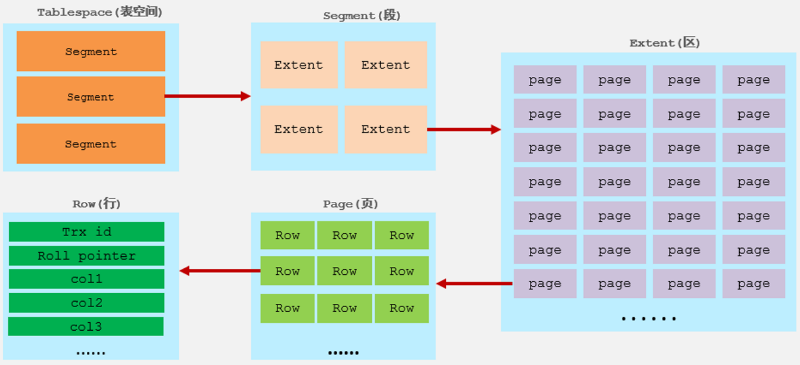
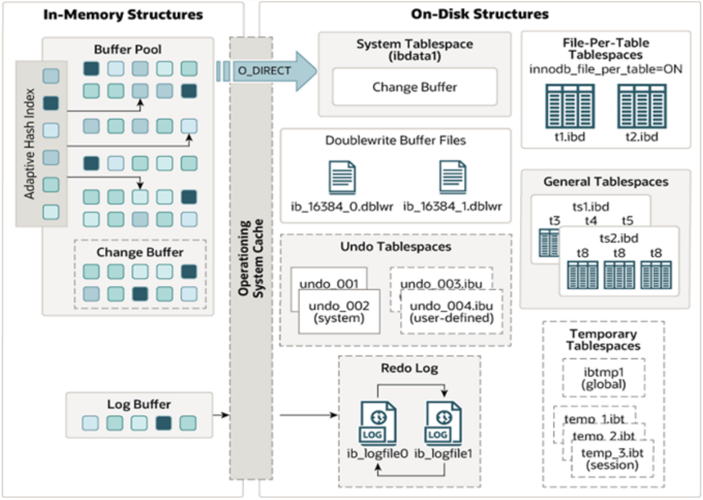
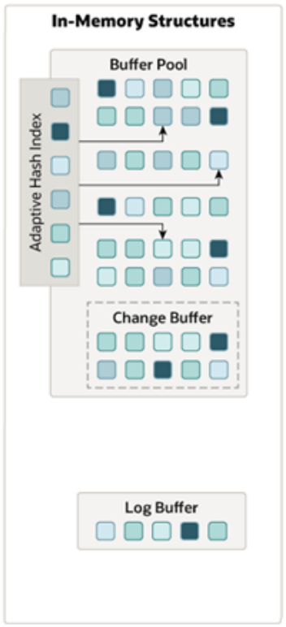
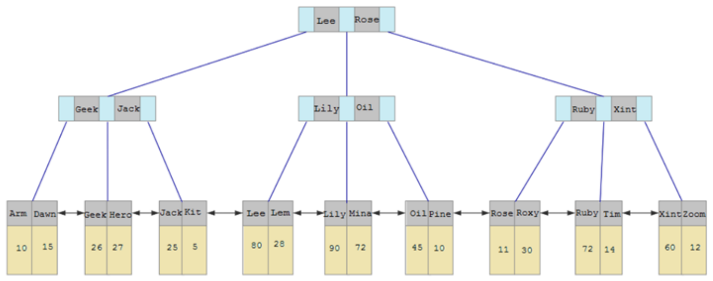
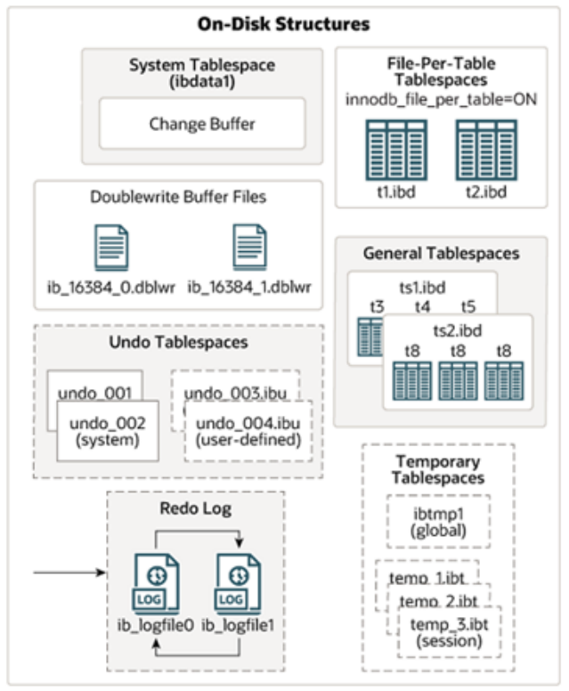
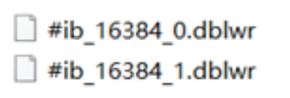
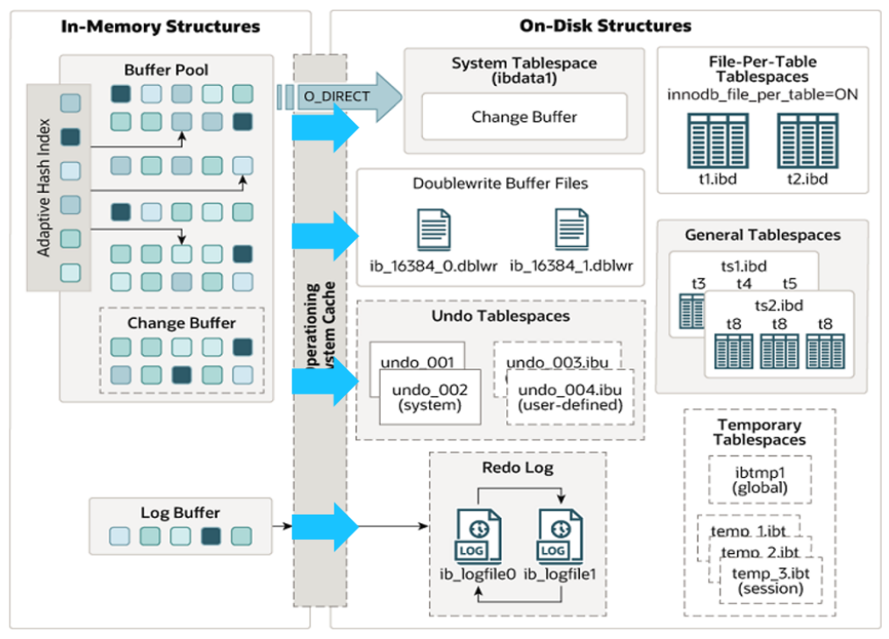
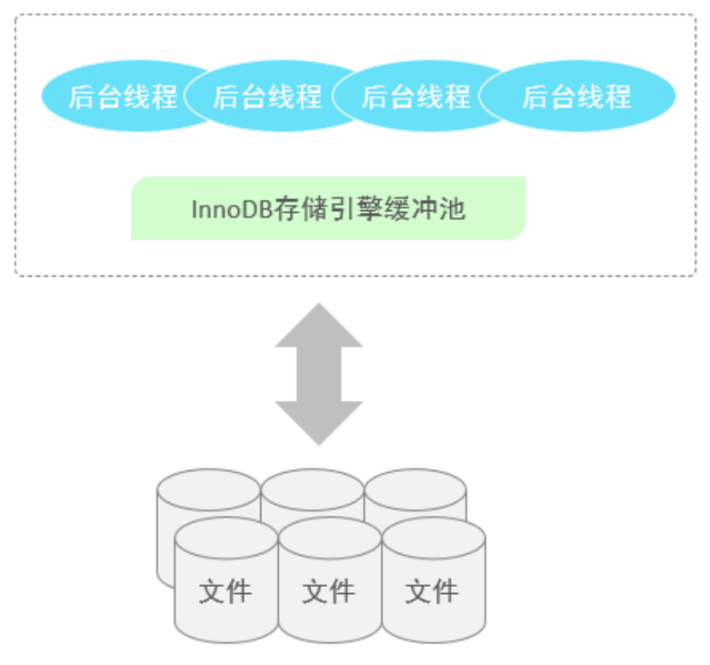
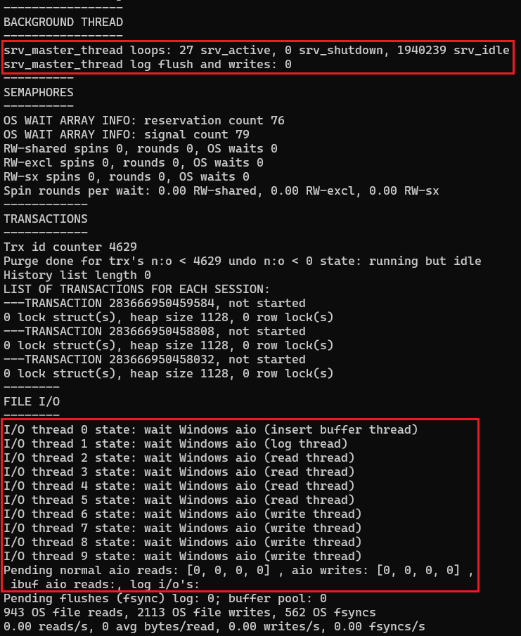

InnoDB的逻辑存储结构如下图所示：




## 存储结构

### 表空间

表空间是InnoDB存储引擎逻辑结构的最高层， 如果用户启用了参数 innodb\_file\_per\_table(在8.0版本中默认开启) ，则每张表都会有一个表空间（xxx.ibd），一个mysql实例可以对应多个表空间，用于存储记录、索引等数据。

### 段

段，分为数据段（Leaf node segment）、索引段（Non-leaf node segment）、回滚段（Rollback segment），InnoDB是索引组织表，数据段就是B+树的叶子节点， 索引段即为B+树的非叶子节点。段用来管理多个Extent（区）。

### 区

区，表空间的单元结构，每个区的大小为1M。 默认情况下，InnoDB存储引擎页大小为16K，即一个区中一共有64个连续的页。

### 页

页，是InnoDB 存储引擎磁盘管理的最小单元，每个页的大小默认为 16KB。为了保证页的连续性，InnoDB 存储引擎每次从磁盘申请 4-5 个区。

### 行

行，InnoDB 存储引擎数据是按行进行存放的。在行中，默认有两个隐藏字段：

* Trx\_id：每次对某条记录进行改动时，都会把对应的事务id赋值给trx\_id隐藏列。
* Roll\_pointer：每次对某条引记录进行改动时，都会把旧的版本写入到undo日志中，然后这个隐藏列就相当于一个指针，可以通过它来找到该记录修改前的信息。


## 架构

MySQL5.5 版本开始，默认使用InnoDB存储引擎，它擅长事务处理，具有崩溃恢复特性，在日常开发中使用非常广泛。下面是InnoDB架构图，左侧为内存结构，右侧为磁盘结构。




### 内存结构




在左侧的内存结构中，主要分为这么四大块儿：Buffer Pool、Change Buffer、Adaptive Hash Index、Log Buffer。 

#### Buffer Pool

InnoDB存储引擎基于磁盘文件存储，访问物理硬盘和在内存中进行访问，速度相差很大，为了尽可能弥补这两者之间的I/O效率的差值，就需要把经常使用的数据加载到缓冲池中，避免每次访问都进行磁盘I/O。

在InnoDB的缓冲池中不仅缓存了索引页和数据页，还包含了undo页、插入缓存、自适应哈希索引以及InnoDB的锁信息等等。

缓冲池 Buffer Pool，是主内存中的一个区域，里面可以缓存磁盘上经常操作的真实数据，在执行增删改查操作时，先操作缓冲池中的数据（若缓冲池没有数据，则从磁盘加载并缓存），然后再以一定频率刷新到磁盘，从而减少磁盘IO，加快处理速度。

缓冲池以Page页为单位，底层采用链表数据结构管理Page。根据状态，将Page分为三种类型：

* free page：空闲page，未被使用。
* clean page：被使用page，数据没有被修改过。
* dirty page：脏页，被使用page，数据被修改过，也中数据与磁盘的数据产生了不一致。

在专用服务器上，通常将多达80％的物理内存分配给缓冲池 。参数设置：`show variables like 'innodb_buffer_pool_size';`


#### Change Buffer

Change Buffer，更改缓冲区（针对于非唯一二级索引页），在执行DML语句时，如果这些数据Page没有在Buffer Pool中，不会直接操作磁盘，而会将数据变更存在更改缓冲区 Change Buffer中，在未来数据被读取时，再将数据合并恢复到Buffer Pool中，再将合并后的数据刷新到磁盘中。



与聚集索引不同，二级索引通常是非唯一的，并且以相对随机的顺序插入二级索引。同样，删除和更新可能会影响索引树中不相邻的二级索引页，如果每一次都操作磁盘，会造成大量的磁盘IO。有了ChangeBuffer之后，可以在缓冲池中进行合并处理，减少磁盘IO。


#### Adaptive Hash Index

自适应hash索引，用于优化对Buffer Pool数据的查询。MySQL的innoDB引擎中虽然没有直接支持hash索引，但是给我们提供了一个功能就是这个自适应hash索引。hash索引在进行等值匹配时，一般性能是要高于B+树的，因为hash索引一般只需要一次IO即可，而B+树，可能需要几次匹配，所以hash索引的效率要高，但是hash索引又不适合做范围查询、模糊匹配等。

InnoDB存储引擎会监控对表上各索引页的查询，如果观察到在特定的条件下hash索引可以提升速度，则建立hash索引，称之为自适应hash索引。

自适应哈希索引，无需人工干预，是系统根据情况自动完成。

参数： adaptive_hash_index


#### Log Buffer

Log Buffer：日志缓冲区，用来保存要写入到磁盘中的log日志数据（redo log 、undo log），默认大小为 16MB，日志缓冲区的日志会定期刷新到磁盘中。如果需要更新、插入或删除许多行的事务，增加日志缓冲区的大小可以节省磁盘 I/O。

参数:

* innodb_log_buffer_size：缓冲区大小
* innodb_flush_log_at_trx_commit：日志刷新到磁盘时机，取值主要包含以下三个：
  * 1: 日志在每次事务提交时写入并刷新到磁盘，默认值。
  * 0: 每秒将日志写入并刷新到磁盘一次。
  * 2: 日志在每次事务提交后写入，并每秒刷新到磁盘一次。


### 磁盘结构




#### System Tablespace

系统表空间是更改缓冲区的存储区域。如果表是在系统表空间而不是每个表文件或通用表空间中创建的，它也可能包含表和索引数据。(在MySQL5.x版本中还包含InnoDB数据字典、undolog等)

参数：innodb\_data\_file\_path


系统表空间，默认的文件名叫 ibdata1。


#### File-Per-Table Tablespaces

如果开启了innodb\_file\_per\_table开关 ，则每个表的文件表空间包含单个InnoDB表的数据和索引 ，并存储在文件系统上的单个数据文件中。

开关参数：innodb\_file\_per\_table ，该参数默认开启。


也就是说，每创建一个表，都会产生一个表空间文件，如图：


> MySQL自带的sys数据库中的表


#### General Tablespaces

通用表空间，需要通过 CREATE TABLESPACE 语法创建通用表空间，在创建表时，可以指定该表空间。

创建表空间

```sql
CREATE TABLESPACE ts_name ADD DATAFILE 'file_name' ENGINE = engine_name;
```

创建表时指定表空间

```sql
CREATE TABLE xxx ... TABLESPACE ts_name;
```


#### Undo Tablespaces

撤销表空间，MySQL实例在初始化时会自动创建两个默认的undo表空间（初始大小16M），用于存储undo log日志。


#### Temporary Tablespaces

InnoDB 使用会话临时表空间和全局临时表空间。存储用户创建的临时表等数据。


#### Doublewrite Buffer Files

双写缓冲区，innoDB引擎将数据页从Buffer Pool刷新到磁盘前，先将数据页写入双写缓冲区文件中，便于系统异常时恢复数据。




#### Redo Log

重做日志，是用来实现事务的持久性。该日志文件由两部分组成：重做日志缓冲（redo log buffer）以及重做日志文件（redo log）,前者是在内存中，后者在磁盘中。当事务提交之后会把所有修改信息都会存到该日志中，用于在刷新脏页到磁盘时，发生错误时，进行数据恢复使用。以循环方式写入重做日志文件，涉及两个文件：


### 后台线程

内存中的数据，写入到磁盘中。







在InnoDB的后台线程中，分为4类，分别是：Master Thread 、IO Thread、Purge Thread、Page Cleaner Thread。

#### Master Thread

核心后台线程，负责调度其他线程，还负责将缓冲池中的数据异步刷新到磁盘中, 保持数据的一致性，还包括脏页的刷新、合并插入缓存、undo页的回收。


#### IO Thread

在InnoDB存储引擎中大量使用了AIO来处理IO请求, 这样可以极大地提高数据库的性能，而IO Thread主要负责这些IO请求的回调。

| 线程类型             | 默认个数 | 职责                         |
| -------------------- | -------- | ---------------------------- |
| Read thread          | 4        | 负责读操作                   |
| Write thread         | 4        | 负责写操作                   |
| Log thread           | 1        | 负责将日志缓冲区刷新到磁盘   |
| Insert buffer thread | 1        | 负责将写缓冲区内容刷新到磁盘 |


可以通过以下的这条指令，查看到InnoDB的状态信息，其中就包含IO Thread信息。

```sql
show engine innodb status \G;
```





#### Purge Thread

主要用于回收事务已经提交了的undo log，在事务提交之后，undo log可能不用了，就用它来回收。


#### Page Cleaner Thread

协助 Master Thread 刷新脏页到磁盘的线程，它可以减轻 Master Thread 的工作压力，减少阻塞。

