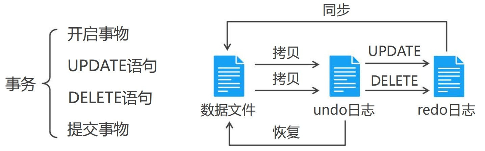
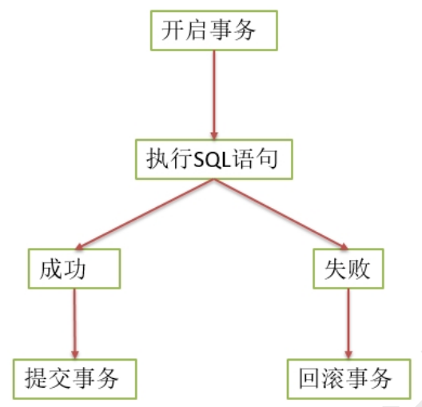
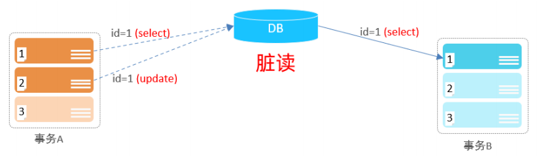
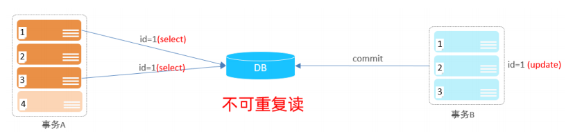
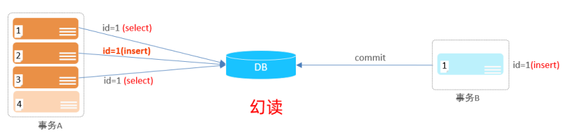
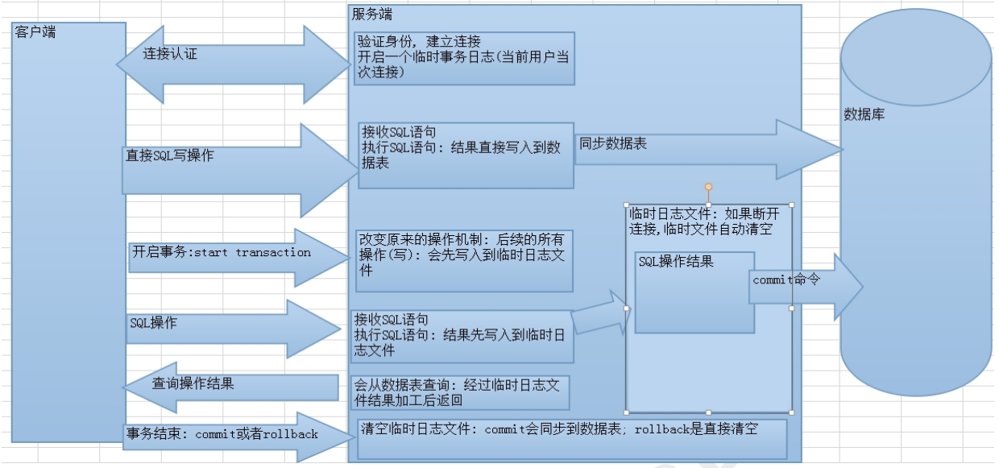

在实际的开发过程中，一个业务操作如：转账，往往是要多次访问数据库才能完成的。转账是一个用户扣钱，另一个用户加钱。如果其中有一条 SQL 语句出现异常，这条 SQL 就可能执行失败。

事务是**一组操作的集合**，它是一个不可分割的工作单位，事务会把所有的操作作为一个整体一起向系统提交或撤销操作请求，即这些操作**要么同时成功，要么同时失败**。

**RDBMS = SQL语句 + 事务（ACID）**




**MySQL中可以有两种方式进行事务的操作：**

* 手动提交事务  
* 自动提交事务


## 手动提交事务

**手动提交事务使用过程：**
* **执行成功的情况：** 开启事务 → 执行多条 SQL 语句 → 成功提交事务  
* **执行失败的情况：** 开启事务 → 执行多条 SQL 语句 → 事务的回滚




如果事务中 SQL 语句没有问题，commit 提交事务，会对数据库数据的数据进行改变。 如果事务中 SQL语句有问题，rollback 回滚事务，会回退到开启事务时的状态。

* `start transaction;` 或 `begin;`：开启事务。
* `commit;`：提交事务。
* `rollback;`：回滚事务。

```sql
-- 开启事务
start transaction;
-- 1. 查询张三余额
select * from account where name = '张三';
-- 2. 张三的余额减少1000
update account set money = money - 1000 where name = '张三';
-- 3. 李四的余额增加1000
update account set money = money + 1000 where name = '李四';
-- 如果正常执行完毕, 则提交事务
commit;
-- 如果执行过程中报错, 则回滚事务
-- rollback;
```


## 自动提交事务

MySQL 默认每一条 DML(增删改)语句都是一个单独的事务，每条语句都会自动开启一个事务，语句执行完毕自动提交事务，MySQL 默认开始自动提交事务。

* `select @@ autocommit;`：查看 MySQL 是否开启自动提交事务
* `set @@autocommit = 0;`：取消自动提交事务

> @@表示全局变量，1 表示开启，0 表示关闭


## 回滚点

在某些成功的操作完成之后，后续的操作有可能成功有可能失败，但是不管成功还是失败，前面操作都已经成功，可以在当前成功的位置设置一个回滚点。可以供后续失败操作返回到该位置，而不是返回所有操作，这个点称之为回滚点。

* `savepoint 名字`：设置回滚点	

* `rollback to 名字`：回到回滚点

  


## 事务的四大特性 ACID

* **原子性（Atomicity）**：事务是不可分割的最小操作单元，要么全部成功，要么全部失败。
* **一致性（Consistency）**：事务在执行前数据库的状态与执行后数据库的状态保持一致。如：转账前2个人的总金额是 2000，转账后 2 个人总金额也是 2000。
* **隔离性（Isolation）**：数据库系统提供的隔离机制，事务与事务之间不应该相互影响，执行时保持隔离的状态。
* **持久性（Durability）**：事务一旦提交或回滚，对数据库的修改是持久的。就算关机，也是保存下来的。


## 事务的隔离级别

事务在操作时的理想状态：所有的事务之间保持隔离，互不影响。

为了解决并发事务所引发的问题，在数据库中引入了事务隔离级别。主要有以下几种：

| **名字** | **隔离级别**     | **脏读** | **不可重复读** | **幻读** | **数据库默认隔离级别** |
| -------- | ---------------- | -------- | -------------- | -------- | ---------------------- |
| 读未提交 | read uncommitted | √        | √              | √        |                        |
| 读已提交 | read committed   | ×        | √              | √        | Oracle 和 SQL Server   |
| 可重复读 | repeatable read  | ×        | ×              | √        | MySQL                  |
| 序列化   | serializable     | ×        | ×              | ×        |                        |

上面的级别最低，下面的级别最高。隔离级别越高，性能越差，安全性越高。


### 脏读

一个事务读取到了另一个事务中尚未提交的数据。

比如B读取到了A未提交的数据。


### 不可重复读

一个事务中两次读取的数据内容不一致，要求的是一个事务中多次读取时数据是一致的，这是事务 update 时引发的问题。




事务A两次读取同一条记录，但是读取到的数据却是不一样的。


### 幻读

一个事务中两次读取的数据的数量不一致，要求在一个事务多次读取的数据的数量是一致的，这是 insert或delete 时引发的问题。


### 相关命令

查看事务隔离级别：

* `select @@tx_isolation;`：查询全局事务隔离级别
* `select @@transaction_isolation;`：查看事务的隔离级别

设置事务隔离级别：

* `set global transaction isolation level 级别字符串;`：设置事务隔离级别
* `set session transaction isolation level 级别字符串;`：设置当前窗口事务隔离级别

> 需要退出 MySQL 再重新登录才能看到隔离级别的变化


## 事务原理

事务开启之后, 所有的操作都会临时保存到事务日志中, 事务日志只有在得到 commit 命令才会同步到数据表中，其他任何情况都会清空事务日志(rollback，断开连接)。




**事务的步骤：**

1. 客户端连接数据库服务器，创建连接时创建此用户临时日志文件。
2. 开启事务以后，所有的操作都会先写入到临时日志文件中。
3. 所有的查询操作从表中查询，但会经过日志文件加工后才返回。
4. 如果事务提交则将日志文件中的数据写到表中，否则清空日志文件。

