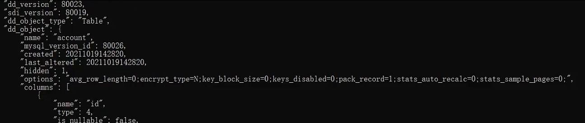
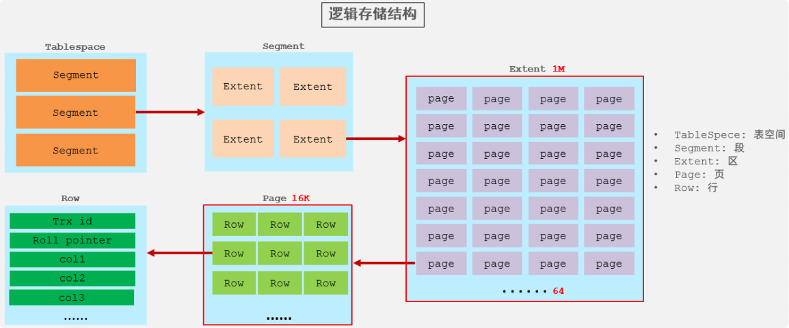
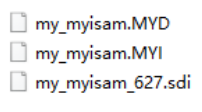

引擎是一个机器的核心组件。在合适的场景，选择合适的存储引擎。

存储引擎就是存储数据、建立索引、更新/查询数据等技术的实现方式。存储引擎是基于表的，而不是基于库的，所以存储引擎也可被称为表类型。在创建表的时候，指定选择的存储引擎，如果没有指定将自动选择默认的存储引擎。


## 常用命令

* 建表时指定存储引擎：

```sql
create table 表名(
字段1 字段1类型 [ comment 字段1注释 ] ,
......
字段n 字段n类型 [comment 字段n注释 ]
) engine = 存储引擎名 [ comment 表注释 ] ;
```

* `show engines;`：查询当前数据库支持的存储引擎。

* `show create table 表名;`：查询建表时的SQL。


```sql
-- 创建表 my_myisam , 并指定MyISAM存储引擎
create table my_myisam( 
    id int, 
    name varchar(10) 
) engine = MyISAM ;
```


## 存储引擎特点

### InnoDB

InnoDB是一种兼顾高可靠性和高性能的通用存储引擎，**在MySQL 5.5之后，InnoDB是默认的MySQL存储引擎。**

* DML操作遵循ACID模型，支持**事务**；
* **行级锁**，提高并发访问性能；
* 支持**外键**FOREIGN KEY约束，保证数据的完整性和正确性。


使用InnoDB存储引擎的数据表，都会有一个表空间文件`xxx.ibd` ，xxx代表的是表名，innoDB引擎的每张表都会对应这样一个表空间文件，**存储该表的表结构（frm-早期的 、sdi-新版的）、数据和索引**。

参数：

* `innodb_file_per_table`：表示多张表共用一个表空间文件还是每张表一个表空间文件。8.0版本默认为on，表示每张表都有一个表空间文件。

```sql
show variables like 'innodb_file_per_table';
```


如果该参数开启，代表对于InnoDB引擎的表，每一张表都对应一个ibd文件。 直接打开MySQL的数据存放目录： `C:\ProgramData\MySQL\MySQL Server 8.0\Data`， 这个目录下有很多文件夹，不同的文件夹代表不同的数据库。


该文件是基于二进制存储的，不能直接基于记事本打开，可以使用mysql提供的一个指令`ibd2sdi`，通过该指令就可以从ibd文件中提取sdi信息，而sdi数据字典信息中就包含该表的表结构。




#### 存储结构




* **表空间**：InnoDB存储引擎逻辑结构的最高层，ibd文件其实就是表空间文件，在表空间中可以包含多个Segment段。
* **段**：表空间是由各个段组成的，常见的段有数据段、索引段、回滚段等。InnoDB中对于段的管理，都是引擎自身完成，不需要人为对其控制，一个段中包含多个区。
* **区**：区是表空间的单元结构，每个区的大小为1M。 默认情况下，InnoDB存储引擎页大小为16K， 即一个区中一共有64个连续的页。
* **页**：页是组成区的最小单元，页也是InnoDB存储引擎磁盘管理的最小单元，每个页的大小默认为 16KB。为了保证页的连续性，InnoDB 存储引擎每次从磁盘申请4-5个区。
* **行**：InnoDB 存储引擎是面向行的，也就是说数据是按行进行存放的，在每一行中除了定义表时所指定的字段以外，还包含两个隐藏字段。


### MyISAM

MyISAM是MySQL早期的默认存储引擎。

* 不支持事务，不支持外键
* 支持表锁，不支持行锁
* 访问速度快


文件存储：

* `xxx.sdi`：存储表结构信息，里面是json格式的数据
* `xxx.MYD`：存储数据
* `xxx.MYI`：存储索引




### Memory

Memory引擎的表数据时存储在内存中的，由于受到硬件问题、或断电问题的影响，只能将这些表作为临时表或缓存使用。

* 内存存放
* hash索引（默认）


文件存储：

* `xxx.sdi`：存储表结构信息

> 因为存放在内存中，所以只有表结构文件。


## 存储引擎的区别

| **特点**         | **InnoDB**        | **MyISAM** | **Memory** |
| ---------------- | ----------------- | ---------- | ---------- |
| **存储限制**     | 64TB              | 有         | 有         |
| **事务安全**     | 支持              | \-         | \-         |
| **锁机制**       | 行锁              | 表锁       | 表锁       |
| **B+tree索引**   | 支持              | 支持       | 支持       |
| **Hash索引**     | \-                | \-         | 支持       |
| **全文索引**     | 支持(5.6版本之后) | 支持       | \-         |
| **空间使用**     | 高                | 低         | N/A        |
| **内存使用**     | 高                | 低         | 中等       |
| **批量插入速度** | 低                | 高         | 高         |
| **支持外键**     | 支持              | \-         | \-         |


## 存储引擎选择

### InnoDB

是Mysql的默认存储引擎，支持事务、外键。如果应用对事务的完整性有比较高的要求，在并发条件下要求数据的一致性，数据操作除了插入和查询之外，还包含很多的更新、删除操作，那么InnoDB存储引擎是比较合适的选择。


### MyISAM

如果应用是以读操作和插入操作为主，只有很少的更新和删除操作，并且对事务的完整性、并发性要求不是很高，那么选择这个存储引擎是非常合适的。


### MEMORY

将所有数据保存在内存中，访问速度快，通常用于临时表及缓存。MEMORY的缺陷就是对表的大小有限制，太大的表无法缓存在内存中，而且无法保障数据的安全性。

