## 安装

第一步： 在linux上创建MySQL文件夹

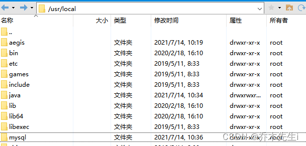

第二步：下载并上传MySQL安装包，上传到刚刚创建的目录中

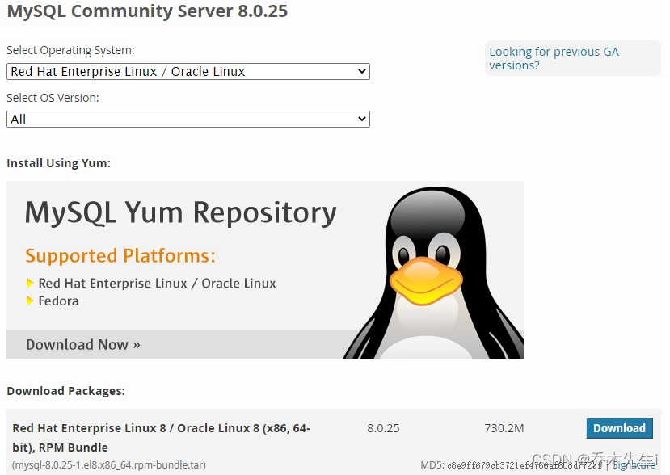

第三步：看下系统里面有没有自带的mysql，有的话卸载

```bash
rpm -qa | grep mysql
```

有的话卸载 `rpm -e 版本号 --nodeps`


第四步：解压安装包

```bash
tar -xvf mysql-8.0.25-1.el8.x86_64.rpm-bundle.tar 
```

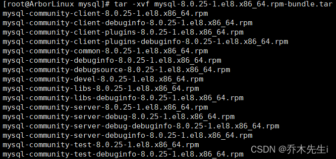

第五步：安装common

```bash
rpm -ivh mysql-community-common-8.0.25-1.el8.x86_64.rpm --nodeps --force 
```

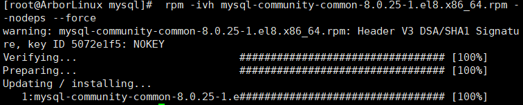

第六步：安装libs

```bash
rpm -ivh mysql-community-libs-8.0.25-1.el8.x86_64.rpm --nodeps --force
```

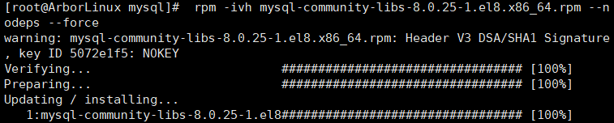

第七步：安装client

```bash
rpm -ivh mysql-community-client-8.0.25-1.el8.x86_64.rpm --nodeps --force
```

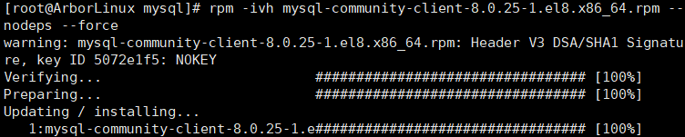


第八步：安装server

```bash
rpm -ivh mysql-community-server-8.0.25-1.el8.x86_64.rpm --nodeps --force
```
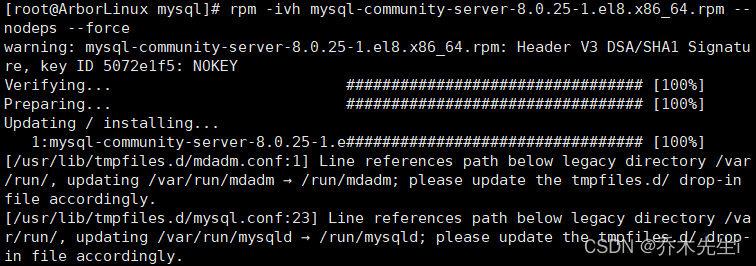


第九步：查看安装情况

```bash
rpm -qa | grep mysql
```

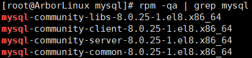

安装到这里结束，下面是配置


## 配置

第十步：对 mysql 数据库的初始化和相关配置

一行一行执行

```bash
mysqld --initialize;
chown mysql:mysql /var/lib/mysql -R;
systemctl start mysqld.service;
systemctl enable mysqld;
```

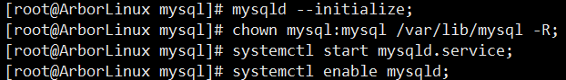


第十一步：查看数据库的密码

```bash
cat /var/log/mysqld.log | grep password
```

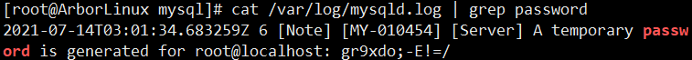


第十二步：登录

```bash
mysql -uroot -p
```

然后回车，后输入密码，然后再回车

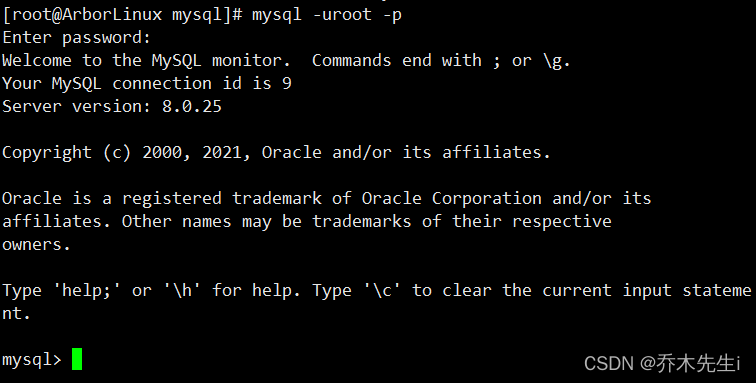


第十三步：改密码

```bash
ALTER USER 'root'@'localhost' IDENTIFIED WITH mysql_native_passwordBY '新密码';
```

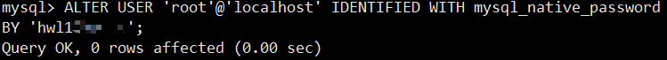


第十四步：退出并重新登录

```bash
exit;
mysql -uroot -p
```

然后回车，后输入密码，然后再回车

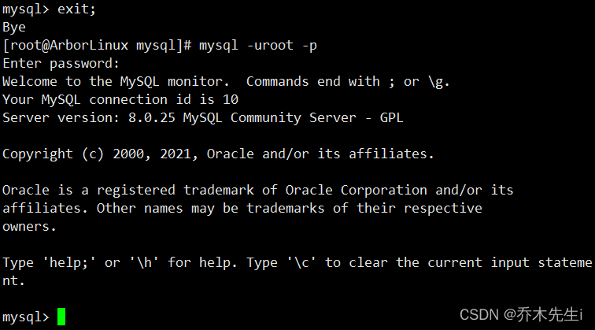


第十五步：远程访问授权

一行命令一个图，成功的话报OK

```bash
create user 'root'@'%' identified with mysql_native_password by 'root';
```

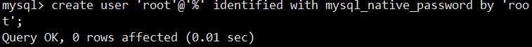


```bash
grant all privileges on *.* to 'root'@'%' with grant option;
```

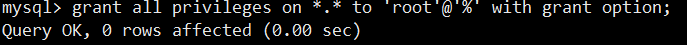


```bash
flush privileges;
```

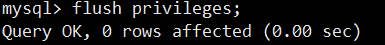


第十六步：修改root用户远程访问权限

一行一行执行

```bash
use mysql;
select host, user from user;
GRANT ALL ON *.* TO 'root'@'%';
flush privileges;
```

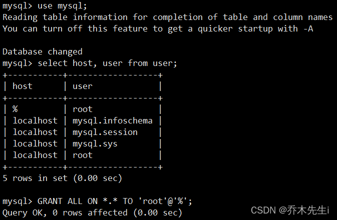


```bash
-- 修改密码为用不过期
mysql> ALTER USER 'root'@'%' IDENTIFIED BY 'password' PASSWORD EXPIRE NEVER; 
Query OK, 0 rows affected (0.02 sec)
 
-- 修改密码并指定加密规则为mysql_native_password
mysql> ALTER USER 'root'@'%' IDENTIFIED WITH mysql_native_password BY '123456';
Query OK, 0 rows affected (0.01 sec)
 
-- 刷新权限
mysql> flush privileges;
Query OK, 0 rows affected (0.01 sec)
```
