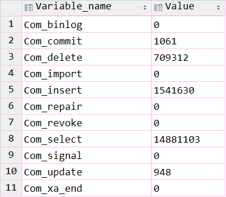
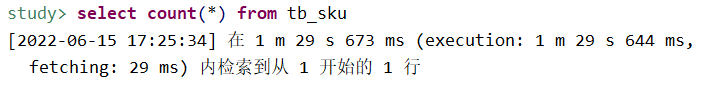

## SQL执行频率

MySQL 客户端连接成功后，通过 `show [session|global] status` 命令可以提供服务器状态信息。通过如下指令，可以查看当前数据库的insert、update、delete、delect的访问频次：

```sql
-- session 是查看当前会话;
-- global 是查询全局数据; 
show global status like 'Com_______';
```

* Com\_delete：删除次数
* Com\_insert：插入次数
* Com\_select：查询次数
* Com\_update：更新次数




> 通过上述指令，可以查看到当前数据库是以查询为主，还是以增删改为主，从而为数据库优化提供参考依据。 如果以增删改为主，可以考虑不进行索引优化。 如果以查询为主，要考虑对数据库的索引进行优化。


## 慢查询日志

慢查询日志记录了所有执行时间超过指定参数（long\_query\_time，单位：秒，默认10秒）的所有SQL语句的日志。

MySQL的慢查询日志默认不开启，可以查看系统变量 `slow_query_log`。

```sql
-- 查看慢查询日志是否开启
show variables like 'slow_query_log';
```

如果要开启慢查询日志，需要在MySQL的配置文件(`/etc/my.cnf`)中配置如下信息：

```powershell
# 开启MySQL慢日志查询开关
slow_query_log=1
# 设置慢日志的时间为2秒，SQL语句执行时间超过2秒，就会视为慢查询，记录慢查询日志
long_query_time=2
```

配置完毕之后，通过以下指令重新启动MySQL服务器进行测试，查看慢日志文件中记录的信息 `/var/lib/mysql/localhost-slow.log`。

**例如**：导入近1000w条数据。执行以下SQL：

```sql
select count(*) from tb_sku;
```

可以看到，耗时近90秒




## profile

`show profiles` 能够在做SQL优化时了解时间都耗费到了哪里。

通过 `have_profiling` 参数，能够看到当前MySQL是否支持profile操作：

```sql
select @@have_profiling ;
```


查看profile是否开启：

```sql
select @@profiling;
```


通过set语句在session/global级别开启profiling：

```sql
set profiling = 1;
```


执行一些SQL语句，然后就会记录SQL的耗时明细了。

```sql
-- 查看每一条SQL的耗时基本情况
show profiles;
-- 查看指定query_id的SQL语句各个阶段的耗时情况
show profile for query [query_id];
-- 查看指定query_id的SQL语句CPU的使用情况
show profile cpu for query [query_id];
```


## explain

explain或者desc命令获取 MySQL 如何执行select语句的信息，包括在select语句执行过程中表如何连接和连接的顺序。

```sql
-- 直接在select语句之前加上关键字 explain / desc
explain select 字段列表 from 表名 where 条件;
```


| **字段**          | **描述**                                                     |
| ----------------- |:------------------------------------------------------------ |
| id                | select查询的序列号，表示查询中执行select子句或者是操作表的顺序 **id相同，执行顺序从上到下；id不同，值越大，越先执行** |
| select\_type      | 表示select的类型，常见的取值(不止这么多)：`SIMPLE`：简单表，即不使用表连接或者子查询 `PRIMARY`：主查询，即外层的查询 `UNION`：UNION 中的第二个或者后面的查询语句 `SUBQUERY`：SELECT/WHERE之后包含了子查询 |
| **type**          | **表示连接类型，性能由好到差的连接类型为NULL(不查询表)、system(访问系统表)、const(主键或唯一索引)、eq\_ref、ref(非唯一索引)、range、 index(用了索引，遍历全部索引树)、all(全表扫描)。** |
| **possible\_key** | **显示可能应用在这张表上的索引，一个或多个。**               |
| **key**           | **实际使用的索引，如果为NULL，则没有使用索引。**             |
| **key\_len**      | **表示索引中使用的字节数， 该值为索引字段最大可能长度，并非实际使用长度，在不损失精确性的前提下， 长度越短越好 。** |
| **rows**          | **MySQL认为必须要执行查询的行数，在innodb引擎的表中，是一个估计值，可能并不总是准确的。** |
| **filtered**      | **表示返回结果的行数占需读取行数的百分比， filtered 的值越大越好。** |

