索引（index）是帮助MySQL高效获取数据的**数据结构(有序)**。在数据之外，数据库系统还维护着满足特定查找算法的数据结构，这些数据结构以某种方式引用（指向）数据， 这样就可以在这些数据结构上实现高级查找算法，这种数据结构就是索引。

在无索引情况下，就需要从第一行开始扫描，一直扫描到最后一行，全表扫描，性能很低。

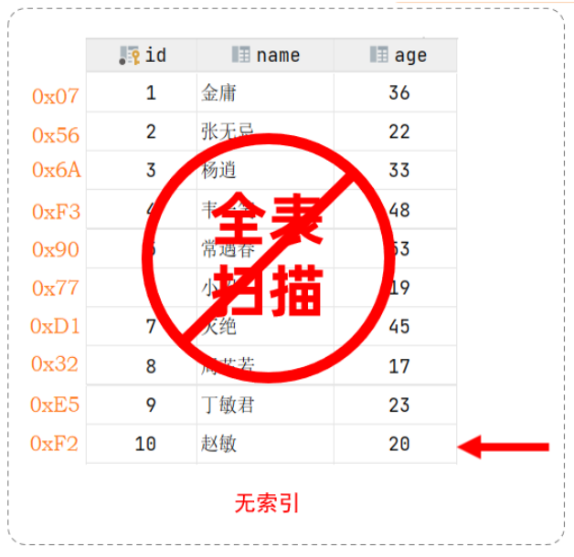

如果这张表建立了索引，假设索引结构就是二叉树，那么会对age这个字段建立一个二叉树的索引结构。进行查询时，只需要扫描三次就可以找到数据，极大的提高的查询的效率。

> 假设索引的结构是二叉树，不是索引的真实结构。

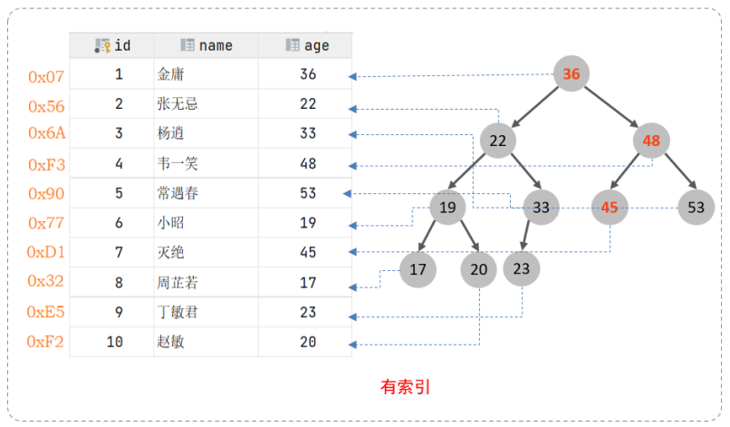


| **优势**                                                    | **劣势**                                                     |
| ----------------------------------------------------------- | ------------------------------------------------------------ |
| 提高数据检索效率，降低数据库IO成本                          | 索引列也占用空间                                             |
| 通过索引列对数据进行排序，降低数据排序的成本，降低CPU的消耗 | 索引大大提高了查询效率，也降低了更新表的速度，如对表进行INSERT、UPDATE、DELETE时，效率降低 |


## 索引结构

MySQL的索引是在存储引擎层实现的，不同的存储引擎有不同的索引结构，主要包含以下几种：

| **索引结构**        | **描述**                                                     |
| ------------------- | ------------------------------------------------------------ |
| B+Tree索引          | 最常见的索引类型，大部分引擎都支持 B+ 树索引                 |
| Hash索引            | 底层数据结构是用哈希表实现的，只有精确匹配索引列的查询才有效，不支持范围查询 |
| R-tree(空间索引）   | 空间索引是MyISAM引擎的一个特殊索引类型，主要用于地理空间数据类型，通常使用较少 |
| Full-text(全文索引) | 是一种通过建立倒排索引，快速匹配文档的方式。类似于Lucene，Solr，ES |


不同的存储引擎对于索引结构的支持情况：

| **索引**        | **InnoDB**      | **MyISAM** | **Memory** |
| --------------- | --------------- | ---------- | ---------- |
| **B+tree索引**  | 支持            | 支持       | 支持       |
| **Hash 索引**   | 不支持          | 不支持     | 支持       |
| **R-tree 索引** | 不支持          | 支持       | 不支持     |
| **Full-text**   | 5.6版本之后支持 | 支持       | 不支持     |


## 数据结构

### 二叉树

假如说MySQL的索引结构采用二叉树的数据结构，比较理想的结构如下：

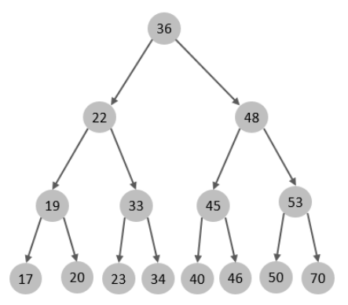

如果主键是顺序插入的，则会形成一个单向链表，结构如下：

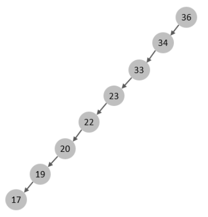

所以，如果选择二叉树作为索引结构，会存在以下缺点：

* 顺序插入时，会形成一个链表，查询性能大大降低。
* 大数据量情况下，层级较深，检索速度慢。


### 红黑树

红黑树是一颗自平衡二叉树，即使是顺序插入数据，最终形成的数据结构也是一颗平衡的二叉树，结构如下：

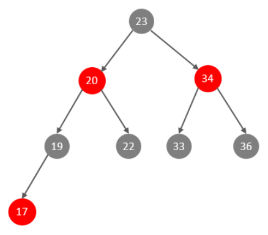


由于红黑树也是一颗二叉树，也会存在一个缺点：大数据量情况下，层级较深，检索速度慢。


### B-Tree(多路平衡查找树)

B-Tree，B树是一种多叉路衡查找树，相对于二叉树，B树每个节点可以有多个分支，即多叉。以一颗最大度数（max-degree）为5(5阶)的b-tree为例，那这个B树每个节点最多存储4个key，5个指针：

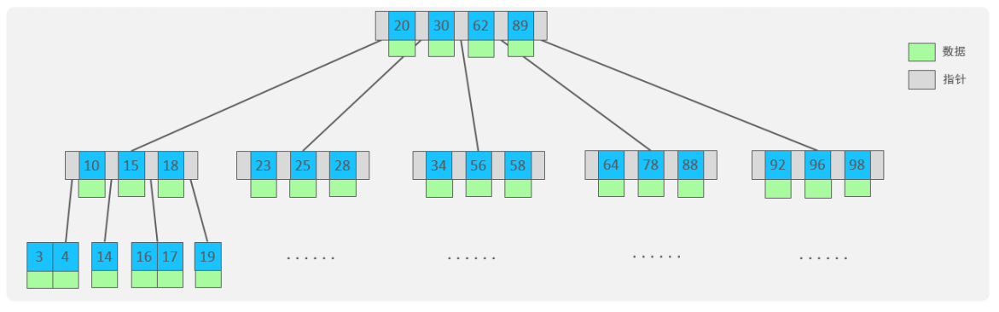


> 树的度数指的是一个节点的子节点个数。演示：[https://www.cs.usfca.edu/\~galles/visualization/BTree.html](https://www.cs.usfca.edu/~galles/visualization/BTree.html)


**特点：**

* 5阶的B树，每一个节点最多存储4个key，对应5个指针。
* 一旦节点存储的key数量到达5，就会裂变，中间元素向上分裂。
* 在B树中，非叶子节点和叶子节点都会存放数据。


### B+Tree

B+Tree是B-Tree的变种，以一颗最大度数（max-degree）为4（4阶）的b+tree为例，其结构示意图：

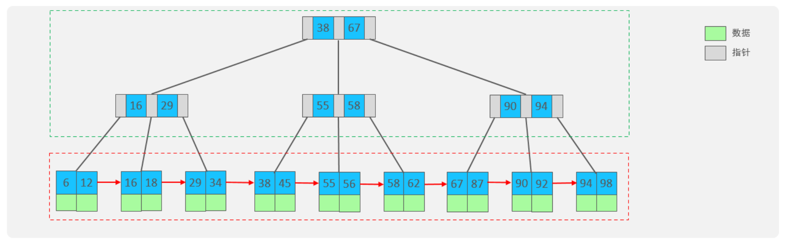


* 绿色框框起来的部分，是索引部分，仅仅起到索引数据的作用，不存储数据。
* 红色框框起来的部分，是数据存储部分，在其叶子节点中要存储具体的数据。

> 演示：[https://www.cs.usfca.edu/\~galles/visualization/BPlusTree.html](https://www.cs.usfca.edu/~galles/visualization/BPlusTree.html)

B+Tree 与 B-Tree相比，主要有以下三点区别：

* 所有的数据都会出现在叶子节点。
* 叶子节点形成一个单向链表。
* 非叶子节点仅仅起到索引数据作用，具体的数据都是在叶子节点存放的。


### MySQL的B+Tree

MySQL索引数据结构对经典的B+Tree进行了优化。在原B+Tree的基础上，增加一个指向相邻叶子节点的链表指针，就形成了带有顺序指针的B+Tree，提高区间访问的性能，利于排序。

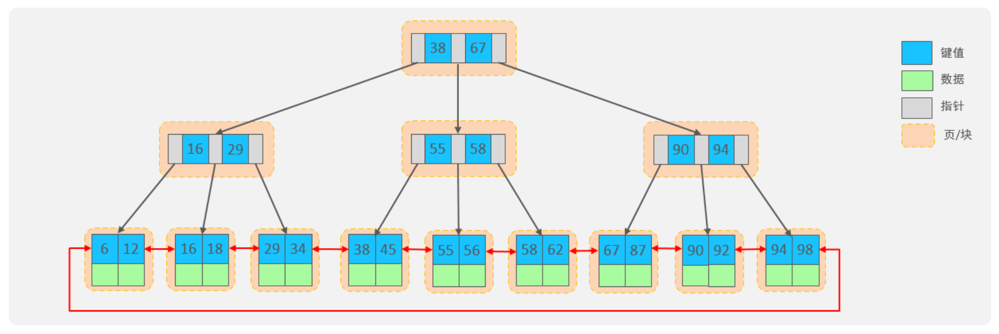


### Hash

哈希索引就是采用一定的hash算法，将键值换算成新的hash值，映射到对应的槽位上，然后存储在hash表中。

如果两个(或多个)键值，映射到一个相同的槽位上，他就产生了hash冲突（也称为hash碰撞），可以通过链表来解决。

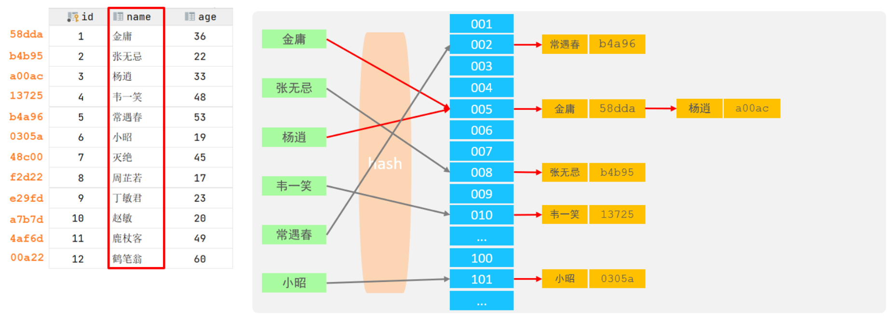


* Hash索引只能用于对等比较(=，in)，不支持范围查询（between，>，< ，...）
* 无法利用索引完成排序操作
* 查询效率高，通常(不存在hash冲突的情况)只需要一次检索就可以了，效率通常要高于B+tree索引

> 在MySQL中，支持hash索引的是Memory存储引擎。 而InnoDB中具有自适应hash功能，hash索引是InnoDB存储引擎根据B+Tree索引在指定条件下自动构建的。


## 索引分类

在MySQL数据库，将索引的具体类型主要分为以下几类：主键索引、唯一索引、常规索引、全文索引。

| **分类** | **含义**                                             | **特点**                 | **关键字** |
| -------- | ---------------------------------------------------- | ------------------------ | ---------- |
| 主键索引 | 针对于表中主键创建的索引                             | 默认自动创建，只能有一个 | primary    |
| 唯一索引 | 避免同一个表中某数据列中的值重复                     | 可以有多个               | unique     |
| 常规索引 | 快速定位特定数据                                     | 可以有多个               |            |
| 全文索引 | 全文索引查找的是文本中的关键词，而不是比较索引中的值 | 可以有多个               | fulltext   |


在InnoDB存储引擎中，根据索引的存储形式，又可以分为以下两种：

| **分类**                  | **含义**                                                   | **特点**             |
| ------------------------- | ---------------------------------------------------------- | -------------------- |
| 聚集索引(Clustered Index) | 将数据存储与索引放到了一块，索引结构的叶子节点保存了行数据 | 必须有，而且只有一个 |
| 二级索引(Secondary Index) | 将数据与索引分开存储，索引结构的叶子节点关联的是对应的主键 | 可以存在多个         |


### 聚集索引选取规则

* 如果存在主键，主键索引就是聚集索引。
* 如果不存在主键，将使用第一个唯一（UNIQUE）索引作为聚集索引。
* 如果表没有主键，或没有合适的唯一索引，则InnoDB会自动生成一个rowid作为隐藏的聚集索引。

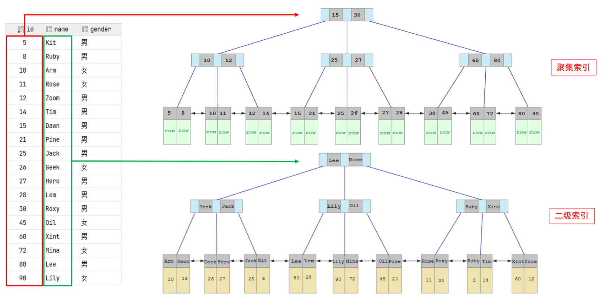


* 聚集索引的叶子节点下挂的是这一行的数据。
* 二级索引的叶子节点下挂的是该字段值对应的主键值。


## SQL的查找过程(回表查询)

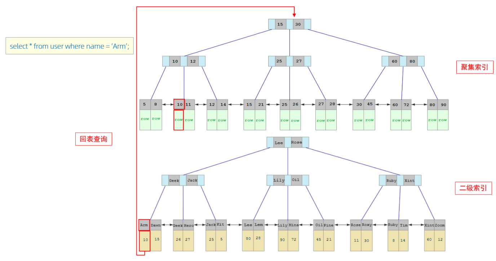


1. 由于是根据name字段进行查询，所以先根据name='Arm'到name字段的二级索引中进行匹配查找。但是在二级索引中只能查找到 Arm 对应的主键值 10。
2. 由于查询返回的数据是\*，所以此时，还需要根据主键值10，到聚集索引中查找10对应的记录，最终找到10对应的行row。
3. 最终拿到这一行的数据，直接返回即可。

> 这种先到二级索引中查找数据，找到主键值，然后再到聚集索引中根据主键值，获取数据的方式，就称之为**回表查询**。


## 索引语法

| **关键字** | **描述** |
| ---------- | -------- |
| index      | 索引     |


> 数据量很大，而且经常被查询的数据表可以设置索引，索引只添加在净长被用作检索条件的字段上面，不要在大字段上创建索引。

* `create [ unique | fulltext ] index 索引名 on 表名 (字段...);`：添加一个已有表的字段索引，字段可以设置多个，如果只设置一个字段的话，叫单列索引，如果多个字段，叫联合索引。
* `alter table 表名 add index [索引名] (字段...);`：添加一个已有表的字段索引。
* `show index from 表名;`：查看一个表的索引。
* `drop index 索引名称 on 表名;`：删除一个索引。

* 创建表时添加一个字段为索引字段：

```sql
create table 表名(
...... ,
index [索引名称] (字段),
...... 
);
```


```sql
-- 创建表时添加一个索引字段
create table t_message(
    id int primary key, -- 主键默认是索引字段
    type ENUM("公告","通报","通知") not null, -- 枚举类型，enum必须大写，三选一
    context varchar(200) not null,
    create_time timestamp not null,
    index idx_type (type) -- 将type字段设置为索引字段
);

-- 查看索引
show index from tb_user;

-- 创建索引
create index idx_user_email on tb_user(email);
create index idx_user_name on tb_user (name);
-- 或者
alter table tb_user
    add index idx_user_name (name);

-- 删除索引
drop index idx_user_name on tb_user;

-- 创建唯一索引
create unique index idx_user_phone on tb_user (phone);

-- 创建联合索引
create index idx_user_pro_age_sta on tb_user (profession, age, status);
```