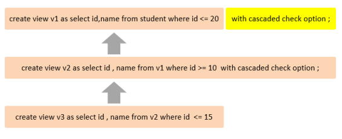
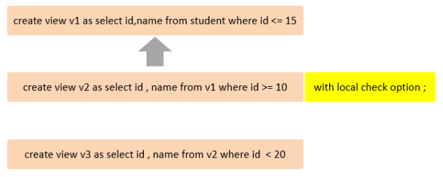

视图（View）是一种虚拟存在的表。视图中的数据并不在数据库中实际存在，行和列数据来自定义视图的查询中使用的表，并且是在使用视图时动态生成的。

通俗的讲，**视图只保存了查询的SQL逻辑，不保存查询结果。**


## 常用语法

也可以对视图进行增删改查的操作

* **创建视图**：(create \[or replace\]：创建或替换视图)

```sql
create [or replace] view 视图名称[(列名列表)] as select语句 [ with [cascaded | local] check option]
```

* **查看创建视图语句**：

```sql
show create view 视图名称;
```

* **查看视图数据**：

```sql
select * from 视图名称 ...... ;
```

* **修改视图**：两种写法

```sql
create [or replace] view 视图名称[(列名列表)] as select语句 [ with [cascaded | local] check option]

alter view 视图名称[(列名列表)] as select语句 [with [cascaded | local] check option]
```

* **删除视图：**

```sql
drop view [if exists] 视图名称 [,视图名称] ...
```


```sql
-- 创建视图
create or replace view stu_v_1 as select id, name from student where id <= 10;

-- 查询视图语法
show create view stu_v_1;

-- 查询视图
select * from stu_v_1 where id = 1;

-- 修改视图
create or replace view stu_v_1 as select id, name, no from student where id <= 10;
alter view stu_v_1 as select id, name from student where id <= 10;

-- 删除视图
drop view stu_v_1;

-- 插入数据
insert into stu_v_1 values (17, 'Tom');
```


在创建视图的时候，指定的条件为 `id<=10` ，id为17的数据，查询时是不符合条件的，没有查询出来，但是这条数据已经成功的插入到了基表中。

> **通过借助视图的检查选项**，在定义视图时，如果指定了条件，在插入、修改、删除数据时，可以做到**必须满足条件才能操作**，**否则不能够操作。**


## 检查选项

当使用 `with check option` 子句创建视图时，MySQL会通过视图检查正在更改的每个行，例如 插入，更新，删除，以使其符合视图的定义。 MySQL允许基于另一个视图创建视图，它还会检查依赖视图中的规则以保持一致性。为了确定检查的范围，mysql提供了两个选项： `cascaded` 和 `local`，默认值为 `cascaded`。


### cascaded级联

比如，v2视图是基于v1视图的，如果在v2视图创建的时候指定了检查选项为 cascaded，但是v1视图创建时未指定检查选项。 则在执行检查时，不仅会检查v2，还会级联检查v2的关联视图v1。




```sql
-- 不使用检查选项
create or replace view stu_v_1 as select id, name from student where id <= 10;
insert into stu_v_1 values (11, 'Tom'); -- 插入成功

-- 创建一个基于v1的视图
create or replace view stu_v_2 as select id, name from stu_v_1 where id <= 10 with cascaded check option;
insert into stu_v_2 values (12, 'Tom'); -- 插入失败，要同时满足 v1 v2 的条件，因为 v2 传递给了 v1

-- 创建一个基于v2的视图
create or replace view stu_v_3 as select id, name from stu_v_2 where id <= 10;
insert into stu_v_3 values (12, 'Tom'); -- 插入失败，要同时满足 v1 v2 的条件，v3 没有开启检查选项
```


### local本地

比如，v2视图是基于v1视图的，如果在v2视图创建的时候指定了检查选项为 local ，但是v1视图创建时未指定检查选项。 则在执行检查时，只会检查v2，不会检查v2的关联视图v1。




```sql
-- 不使用检查选项
create or replace view stu_v_1 as select id, name from student where id <= 10;
insert into stu_v_1 values (20, 'Tom'); -- 插入成功

-- 创建一个基于v1的视图
create or replace view stu_v_2 as select id, name from stu_v_1 where id <= 8 with local check option;
insert into stu_v_2 values (6, 'Tom'); -- 插入成功，要满足 v2 的条件和 v1 的条件，v1 没有条件，所以满足 v2 即可

-- 创建一个基于v2的视图
create or replace view stu_v_3 as select id, name from stu_v_2 where id <= 10;
insert into stu_v_3 values (9, 'Tom'); -- 插入失败，要同时满足 v1 v2 v3 的条件，v1 v3 没有开启检查选项
```


## 视图更新

要使视图可更新，视图中的行与基础表中的行之间必须存在一对一的关系。如果视图包含以下任何一项，则该视图不可更新：

1. 聚合函数或窗口函数（sum()、 min()、 max()、 count()等）
2. distinct
3. group by
4. having
5. union 或者 union all

```sql
-- 创建视图
create view stu_v_count as select count(*) from student;

-- 添加数据
insert into stu_v_count values(10); -- 添加失败
```


## 视图的作用

1. **简单**：视图不仅可以简化用户对数据的理解，也可以简化他们的操作。那些被经常使用的查询可以被定义为视图，从而使得用户不必为以后的操作每次指定全部的条件。
2. **安全**：数据库可以授权，但不能授权到数据库特定行和特定的列上。通过视图用户只能查询和修改他们所能见到的数据
3. **数据独立**：视图可帮助用户屏蔽真实表结构变化带来的影响。


例如：

1. 为了保证数据库表的安全性，开发人员在操作tb\_user表时，只能看到的用户的基本字段，屏蔽手机号和邮箱两个字段。

```sql
create view tb_user_view as select id, name, profession, age, gender, status, createtime from tb_user;
select * from tb_user_view;
```


2. 查询每个学生所选修的课程（三张表联查），这个功能在很多的业务中都有使用到，为了简化操作，定义一个视图。

```sql
create view tb_stu_course_view as
select s.name student_name, s.no student_no, c.name course_name
from student s,
     student_course sc,
     course c
where s.id = sc.studentid
  and sc.courseid = c.id;

select * from tb_stu_course_view;
```