---
tags:
  - MySQL
  - 软件安装
  - Windows
---

MySQL是应用最广泛、普及度最高的开源关系型数据库。

## 下载
- 官网：[https://www.mysql.com/](https://www.mysql.com/)

**第一步：** 页面拉到底部

**第二步：** 选择安装版本的MySQL
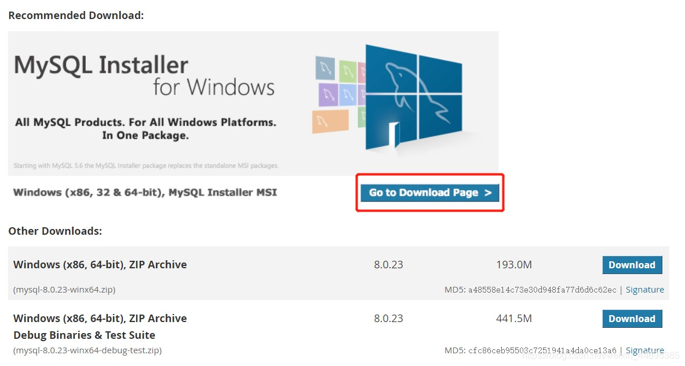

**第三步：** 下载
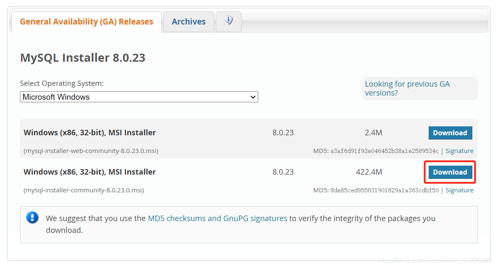

## 安装
**第一步：**  选择只安装MySQL数据库

**第二步：** 安装VC++程序包
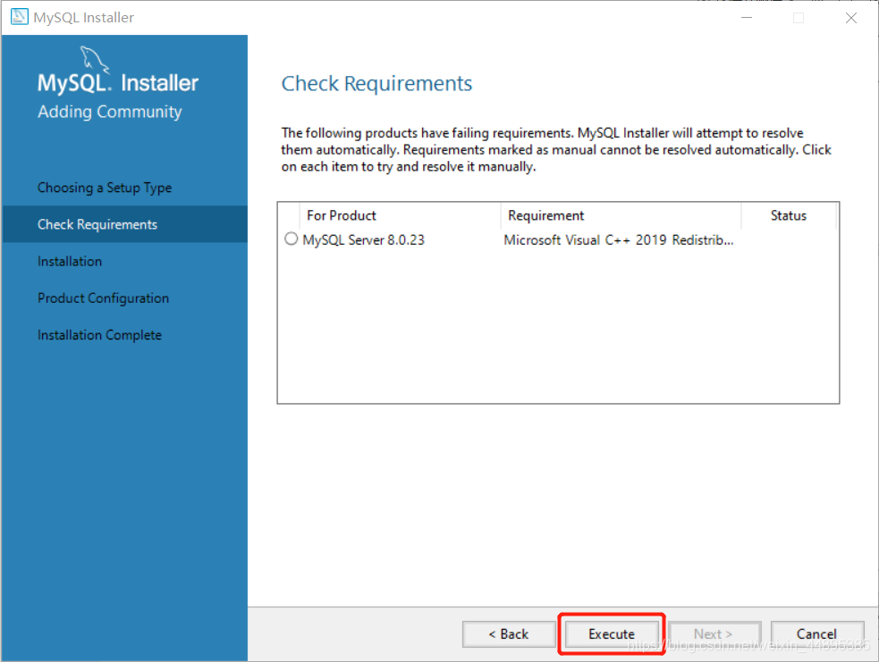

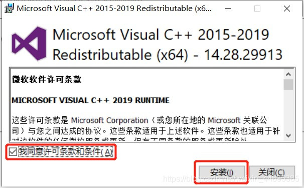

**第三步：** 安装MySQL

**第四步：** 安装成功
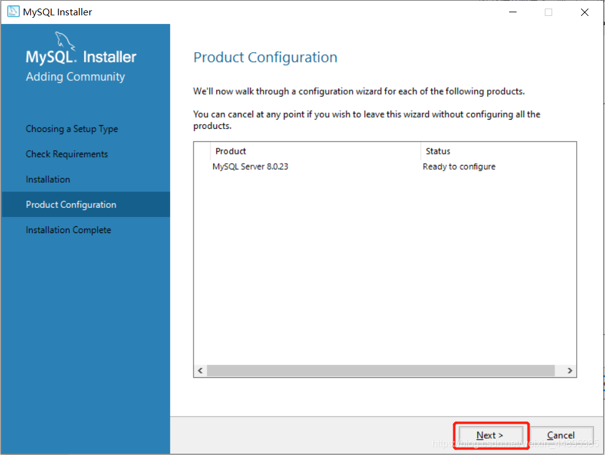

## 配置
**第一步：** 设置端口号，默认为3306

**第二步：** MySQL8.0引入了新的密码加密机制，建议选择第二项传统的加密形式

**第三步：** 设置管理员密码
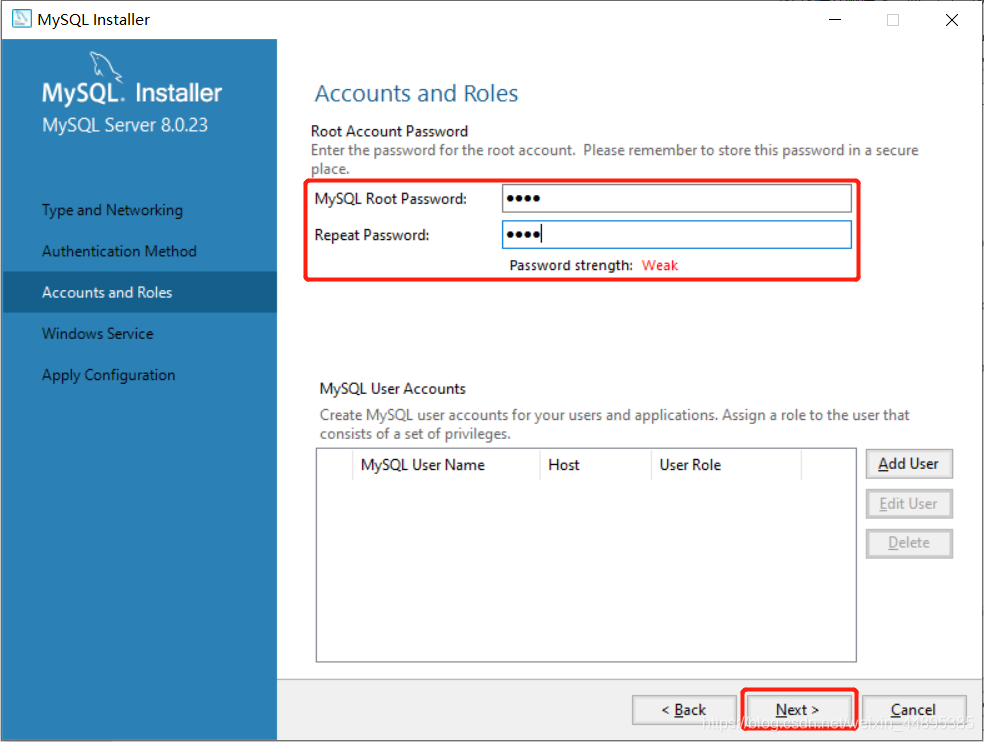

**第四步：** 设置MySQL服务在Windows中的名字，建议勾选开机自启
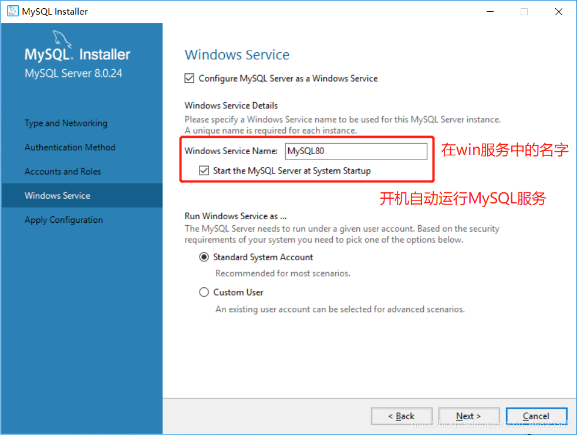

**第五步：** 执行配置
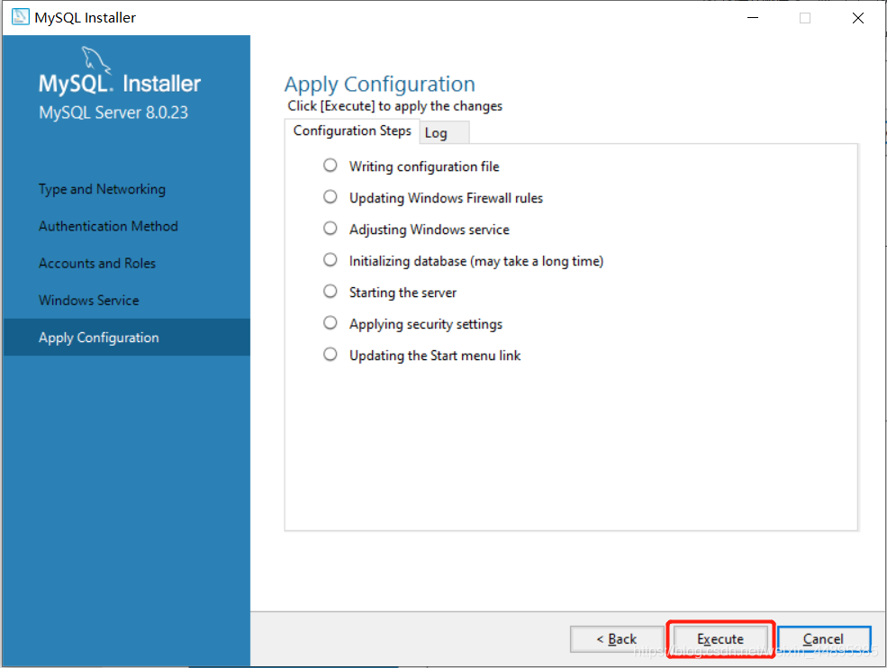

**第六步：** 全部绿了之后就完成了
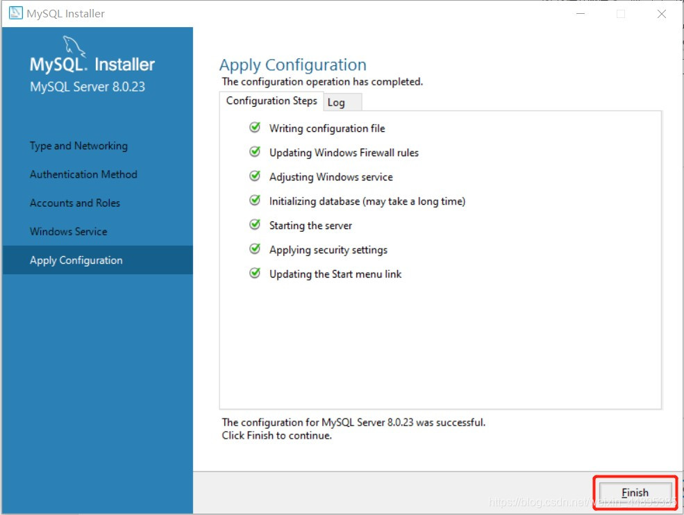

## 初始化
初始化可以使bin目录中的指令可以全局使用（配置环境变量）

**第一步：** 找到MySQL的bin目录（默认是这个目录）：`C:\Program Files\MySQL\MySQL Server 8.0\bin`

**第二步：** 此电脑→右键→属性

**第三步：** 高级系统设置→高级→环境变量
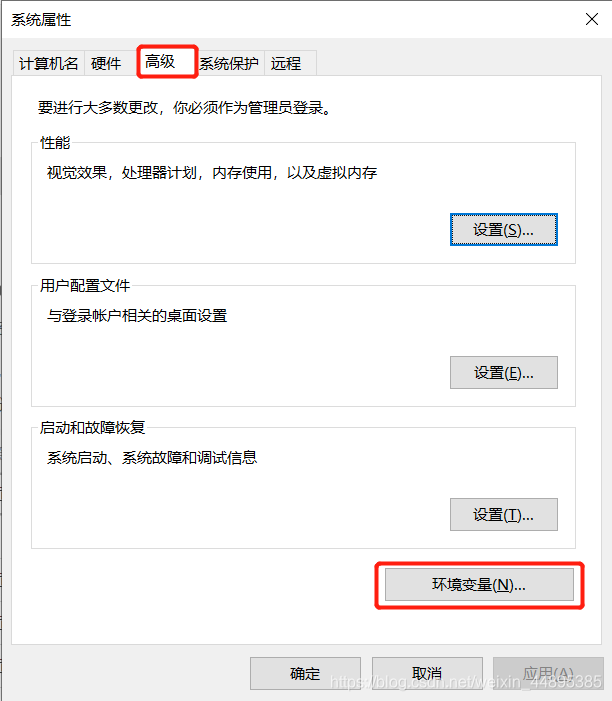

**第四步：** 找到系统变量，找到Path，点击编辑
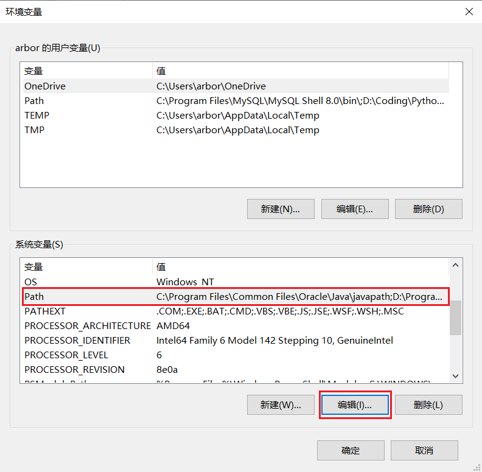

**第五步：** 把bin目录路径添加进去（记得加分号），然后一路点确定
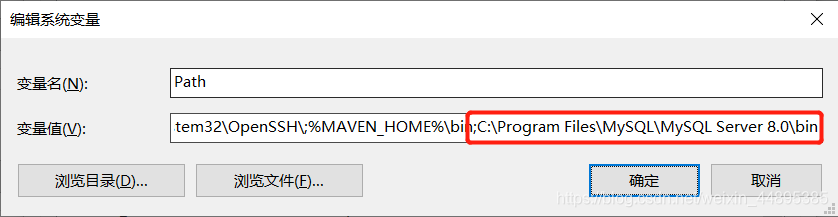

**第六步：** 打开cmd命令行，键入**mysql -uroot -p(密码)**，然后点回车

**第七步：** 输入查看数据库的命令 **show databases**，回车后打印出数据库结构则安装完成

## 数据库服务启动

MySQL 服务器启动方式有两种：

 1. 通过服务的方式自动启动
 2. 手动启动的方式：
	 -  cmd→services.msc 打开服务的窗口
	 - 使用管理员打开cmd：

> `net start mysql80`（安装时设置的服务名）：启动mysql的服务
> `net stop mysql80`（安装时设置的服务名）：关闭mysql服务

## 登录
在cmd命令行中执行：
- `mysql -u用户名(默认为：root) -p密码`
- `mysql -hip地址 -u用户名(默认为：root) -p连接目标的密码`
- `mysql --host=ip地址 --user=用户名(默认为：root) --password=连接目标的密码`

## 退出
在cmd命令行中执行：
- `exit`
- `quit`

