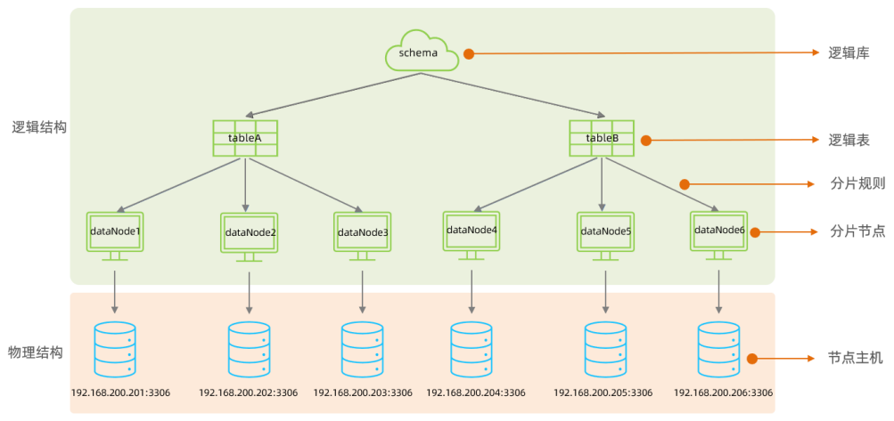
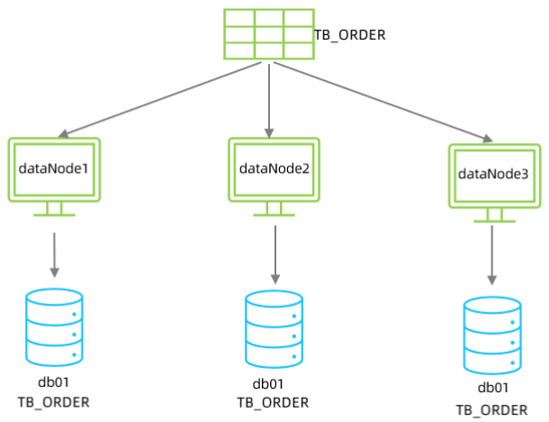

Mycat是开源的、活跃的、基于Java语言编写的MySQL数据库中间件。可以像使用mysql一样来使用mycat，对于开发人员来说根本感觉不到mycat的存在。

开发人员只需要连接MyCat即可，而具体底层用到几台数据库，每一台数据库服务器里面存储了什么数据，都无需关心。 具体的分库分表的策略，只需要在MyCat中配置即可。

优势：
- 性能可靠稳定
- 强大的技术团队
- 体系完善
- 社区活跃

下载地址：[http://dl.mycat.org.cn/](http://dl.mycat.org.cn/)，使用的是1.6.7.4版本。

## 安装

Mycat是采用java语言开发的开源的数据库中间件，支持Windows和Linux运行环境。所以，在使用Mycat之前，需要先安装JDK。

## 目录介绍

- bin : 存放可执行文件，用于启动停止mycat
- conf：存放mycat的配置文件
- lib：存放mycat的项目依赖包（jar）
- logs：存放mycat的日志文件

## 概念介绍

在MyCat的整体结构中，分为两个部分：上面的逻辑结构、下面的物理结构。

在MyCat的逻辑结构主要负责逻辑库、逻辑表、分片规则、分片节点等逻辑结构的处理，而具体的数据存储还是在物理结构，也就是数据库服务器中存储的。

## MyCat入门

tb_order 表中数据量很大，磁盘IO及容量都到达了瓶颈，现在需要对 tb_order 表进行数据分片，分为三个数据节点，每一个节点主机位于不同的服务器上, 具体的结构，参考下图：

  

### 环境准备

准备3台服务器：

- 192.168.200.210：MyCat中间件服务器，同时也是第一个分片服务器。
- 192.168.200.213：第二个分片服务器。
- 192.168.200.214：第三个分片服务器。