## 基本概念

### 当前读

读取的是记录的最新版本，读取时还要保证其他并发事务不能修改当前记录，会对读取的记录进行加锁。日常的操作，如：select ... lock in share mode(共享锁)，select ...for update、update、insert、delete(排他锁)都是一种当前读

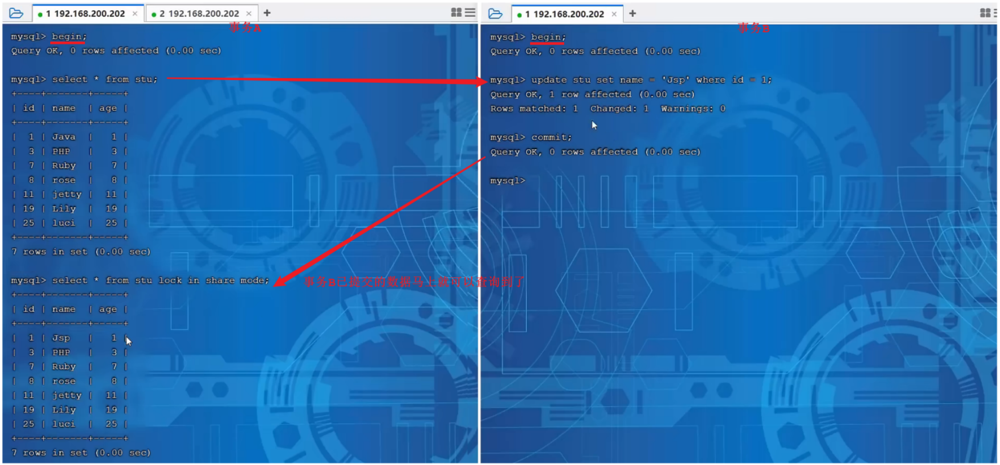

在测试中可以看到，即使是在默认的RR隔离级别下，事务A中依然可以读取到事务B最新提交的内容，因为在查询语句后面加上了 lock in share mode 共享锁，此时是当前读操作。当加排他锁的时候，也是当前读操作。

  

### 快照读

简单的select（不加锁）就是快照读，快照读，读取的是记录数据的可见版本，有可能是历史数据，不加锁，是非阻塞读。

- Read Committed：每次select，都生成一个快照读。
- Repeatable Read：开启事务后第一个select语句才是快照读的地方。
- Serializable：快照读会退化为当前读。

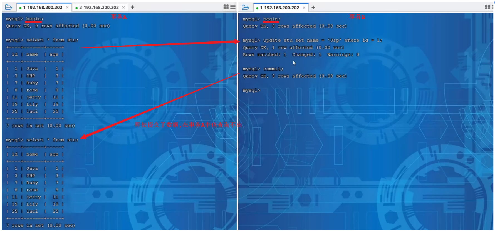

在测试中,即使事务B提交了数据,事务A中也查询不到。 原因就是因为普通的select是快照读，而在当前默认的RR隔离级别下，开启事务后第一个select语句才是快照读的地方，后面执行相同的select语句都是从快照中获取数据，可能不是当前的最新数据，这样也就保证了可重复读。

  

## MVCC

全称 Multi-Version Concurrency Control，多版本并发控制。指维护一个数据的多个版本，使得读写操作没有冲突，快照读为MySQL实现MVCC提供了一个非阻塞读功能。MVCC的具体实现，还需要依赖于数据库记录中的三个隐式字段、undo log日志、readView。

  

## 隐藏字段

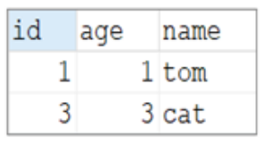

当创建了上面的这张表，在查看表结构的时候，就可以显式的看到这三个字段。 实际上除了这三个字段以外，InnoDB还会自动的给我们添加三个隐藏字段及其含义分别是：

| 隐藏字段        | 含义                                      |
| ----------- | --------------------------------------- |
| DB_TRX_ID   | 最近修改事务ID，记录插入这条记录或最后一次修改该记录的事务ID。       |
| DB_ROLL_PTR | 回滚指针，指向这条记录的上一个版本，用于配合undo log，指向上一个版本。 |
| DB_ROW_ID   | 隐藏主键，如果表结构没有指定主键，将会生成该隐藏字段。             |

而上述的前两个字段是肯定会添加的， 是否添加最后一个字段DB_ROW_ID，得看当前表有没有主键，如果有主键，则不会添加该隐藏字段。

测试：

- 查看有主键的表：

查看表结构信息ibd2sdi stu.ibd ，查看到的表结构信息中，有一栏 columns，在其中会看到处理建表时指定的字段以外，还有额外的两个字段 分别是：DB_TRX_ID 、 DB_ROLL_PTR ，因为该表有主键，所以没有DB_ROW_ID隐藏字段。

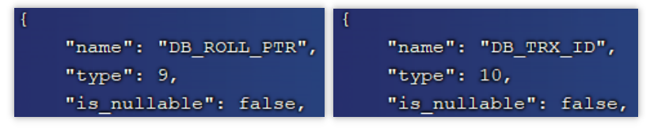

- 查看没有主键的表：

create table employee (id int , name varchar(10));

使用ibd2sdi employee.ibd 命令，查看到的表结构信息中，有一栏 columns，在其中会看到处理建表时指定的字段以外，还有额外的三个字段 分别是：DB_TRX_ID 、 DB_ROLL_PTR 、DB_ROW_ID，因为employee表是没有指定主键的。

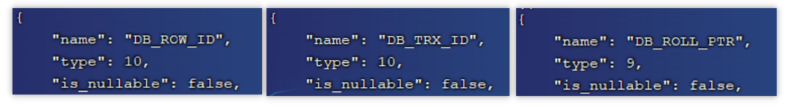

## undolog

回滚日志，在insert、update、delete的时候产生的便于数据回滚的日志。

当insert的时候，产生的undo log日志只在回滚时需要，在事务提交后，可被立即删除。

而update、delete的时候，产生的undo log日志不仅在回滚时需要，在快照读时也需要，不会立即被删除。

  

### 版本链

有一张表原始数据为：

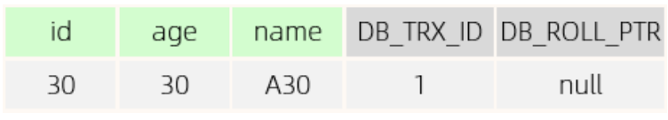

DB_TRX_ID : 代表最近修改事务ID，记录插入这条记录或最后一次修改该记录的事务ID，是自增的。

DB_ROLL_PTR ： 由于这条数据是才插入的，没有被更新过，所以该字段值为null。

有四个并发事务同时在访问这张表：

1. 当事务2执行第一条修改语句时，会记录undo log日志，记录数据变更之前的样子；然后更新记录，并且记录本次操作的事务ID，回滚指针，回滚指针用来指定如果发生回滚，回滚到哪一个版本。

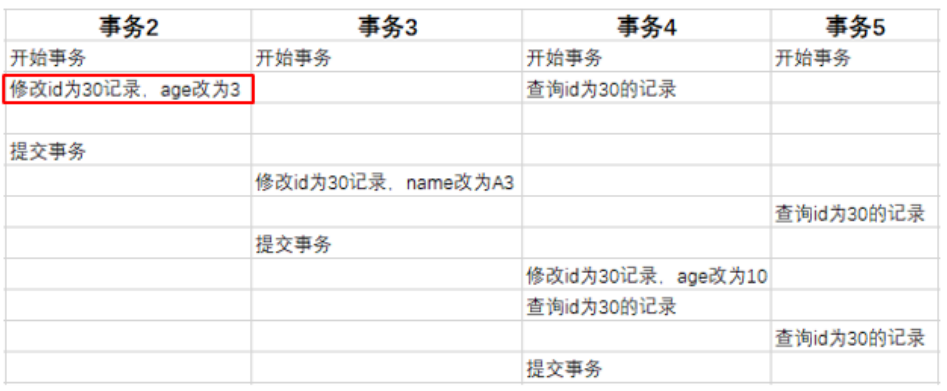

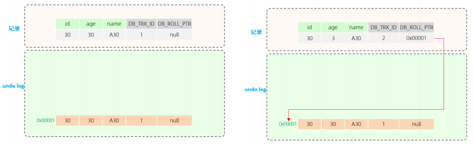

2. 当事务3执行第一条修改语句时，也会记录undo log日志，记录数据变更之前的样子; 然后更新记录，并且记录本次操作的事务ID，回滚指针，回滚指针用来指定如果发生回滚，回滚到哪一个版本。

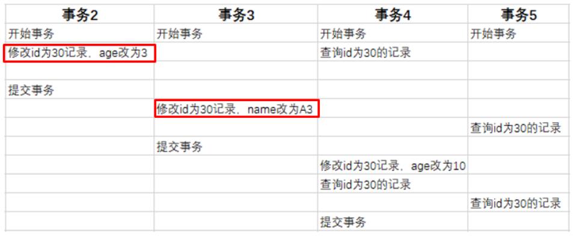

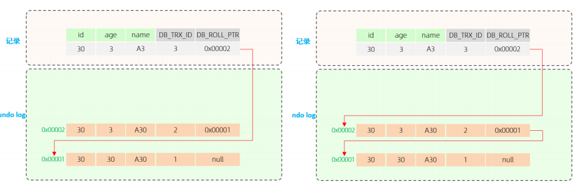

3. 当事务4执行第一条修改语句时，也会记录undo log日志，记录数据变更之前的样子; 然后更新记录，并且记录本次操作的事务ID，回滚指针，回滚指针用来指定如果发生回滚，回滚到哪一个版本。

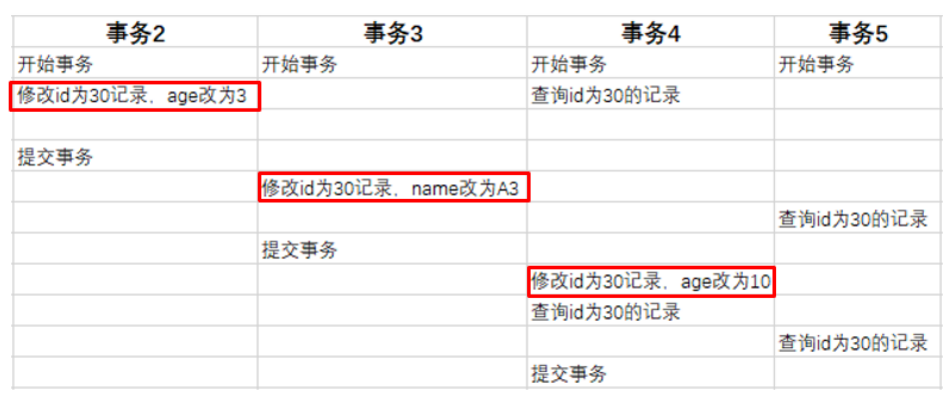

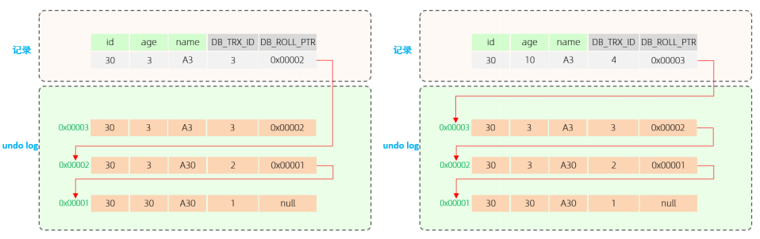

不同事务或相同事务对同一条记录进行修改，会导致该记录的undolog生成一条记录版本链表，链表的头部是最新的旧记录，链表尾部是最早的旧记录。

  

### readview

ReadView（读视图）是 快照读 SQL执行时MVCC提取数据的依据，记录并维护系统当前活跃的事务（未提交的）id。

ReadView中包含了四个核心字段：

| 字段             | 含义                             |
| -------------- | ------------------------------ |
| m_ids          | 当前活跃的事务ID集合                    |
| min_trx_id     | 最小活跃事务ID                       |
| max_trx_id     | 预分配事务ID，当前最大事务ID+1（因为事务ID是自增的） |
| creator_trx_id | ReadView创建者的事务ID               |

而在readview中就规定了版本链数据的访问规则：

trx_id 代表当前undolog版本链对应事务ID。

| 条件                                 | 是否可以访问                     | 说明                        |
| ---------------------------------- | -------------------------- | ------------------------- |
| `trx_id == creator_trx_id`           | 可以访问该版本                    | 成立，说明数据是当前这个事务更改的。        |
| `trx_id < min_trx_id`                | 可以访问该版本                    | 成立，说明数据已经提交了。             |
| `trx_id > max_trx_id`                | 不可以访问该版本                   | 成立，说明该事务是在ReadView生成后才开启。 |
| `min_trx_id <= trx_id <= max_trx_id` | 如果trx_id不在m_ids中，是可以访问该版本的 | 成立，说明数据已经提交。              |
  

不同的隔离级别，生成ReadView的时机不同：

- READ COMMITTED ：在事务中每一次执行快照读时生成ReadView。

- REPEATABLE READ：仅在事务中第一次执行快照读时生成ReadView，后续复用该ReadView。

  

## 原理分析

### RC隔离级别

RC隔离级别下，在事务中每一次执行快照读时生成ReadView。

分析事务5中，两次快照读读取数据，是如何获取数据：

在事务5中，查询了两次id为30的记录，由于隔离级别为Read Committed，所以每一次进行快照读都会生成一个ReadView，那么两次生成的ReadView如下。

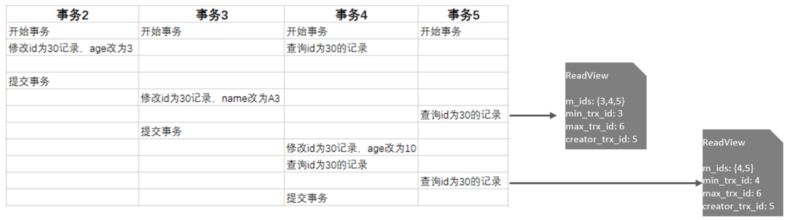

这两次快照读在获取数据时，就需要根据所生成的ReadView以及ReadView的版本链访问规则，到undolog版本链中匹配数据，最终决定此次快照读返回的数据。

先来看第一次快照读具体的读取过程：

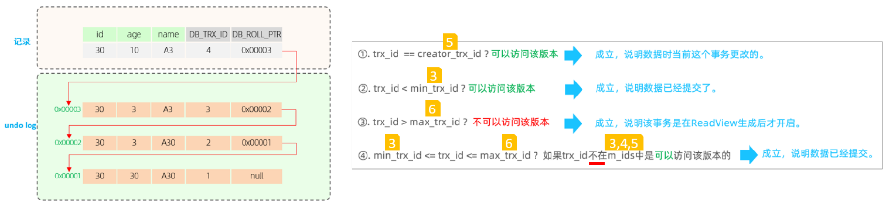

在进行匹配时，会从undo log的版本链，从上到下进行挨个匹配：

1. 先匹配下面这行记录，

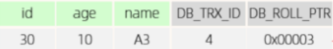

这条记录对应的trx_id为4，也就是将4带入右侧的匹配规则中。 ①不满足 ②不满足 ③不满足 ④也不满足，都不满足，则继续匹配undo log版本链的下一条。

2. 再匹配第二条

这条记录对应的trx_id为3，也就是将3带入右侧的匹配规则中。①不满足 ②不满足 ③不满足 ④也不满足 ，都不满足，则继续匹配undo log版本链的下一条。

3. 再匹配第三条

这条记录对应的trx_id为2，也就是将2带入右侧的匹配规则中。①不满足 ②满足 终止匹配，此次快照读，返回的数据就是版本链中记录的这条数据。

  

再来看第二次快照读具体的读取过程:

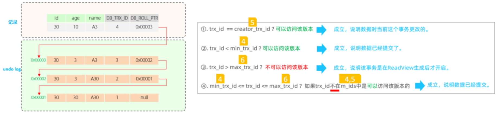

在进行匹配时，会从undo log的版本链，从上到下进行挨个匹配：

1. 先匹配下面这条记录：

这条记录，这条记录对应的trx_id为4，也就是将4带入右侧的匹配规则中。 ①不满足 ②不满足 ③不满足 ④也不满足 ，都不满足，则继续匹配undo log版本链的下一条。

2. 再匹配第二条

这条记录对应的trx_id为3，也就是将3带入右侧的匹配规则中。①不满足 ②满足 。终止匹配，此次快照读，返回的数据就是版本链中记录的这条数据。

  

### RR隔离级别

RR隔离级别下，仅在事务中第一次执行快照读时生成ReadView，后续复用该ReadView。 而RR 是可重复读，在一个事务中，执行两次相同的select语句，查询到的结果是一样的。

MySQL是如何做到可重复读的呢?

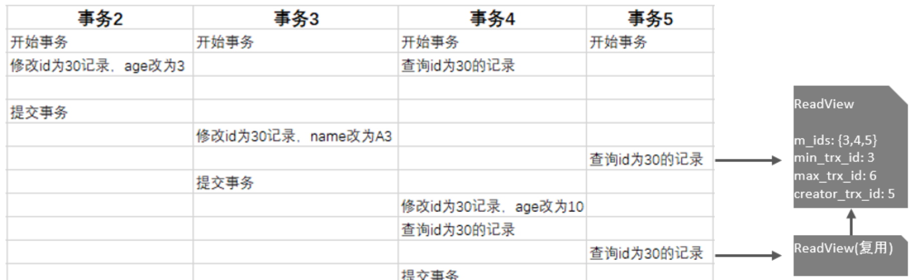

在RR隔离级别下，只是在事务中第一次快照读时生成ReadView，后续都是复用该ReadView，那么既然ReadView都一样， ReadView的版本链匹配规则也一样， 那么最终快照读返回的结果也是一样的。

所以呢，MVCC的实现原理就是通过 InnoDB表的隐藏字段、UndoLog 版本链、ReadView来实现的。而MVCC + 锁，则实现了事务的隔离性。 而一致性则是由redolog 与 undolog保证。

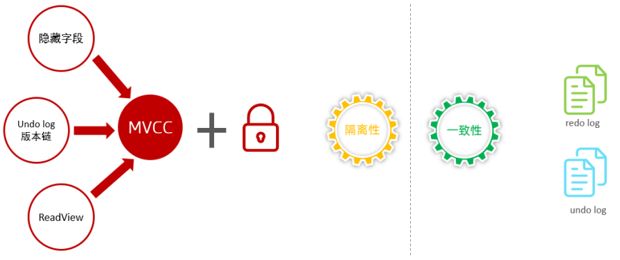