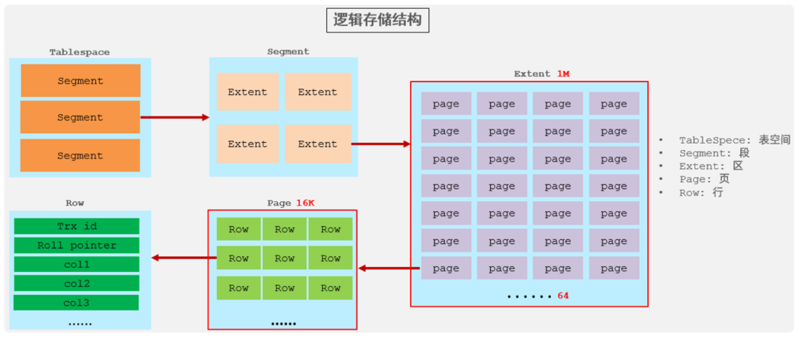
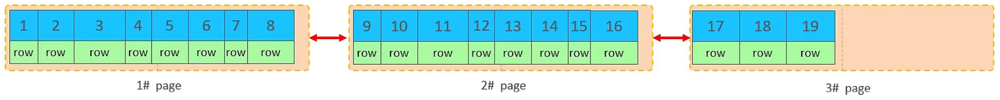
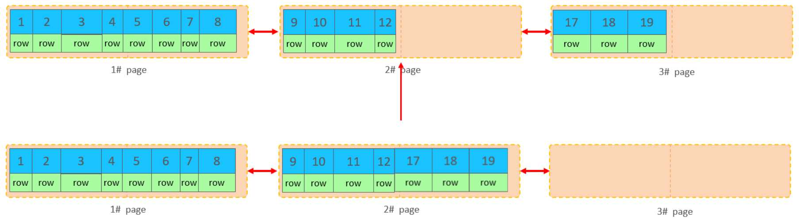
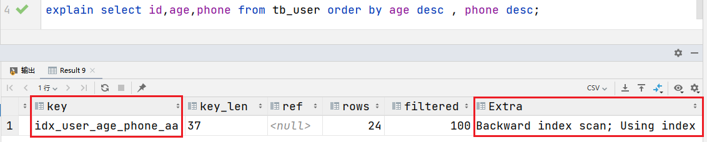
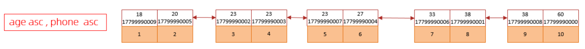
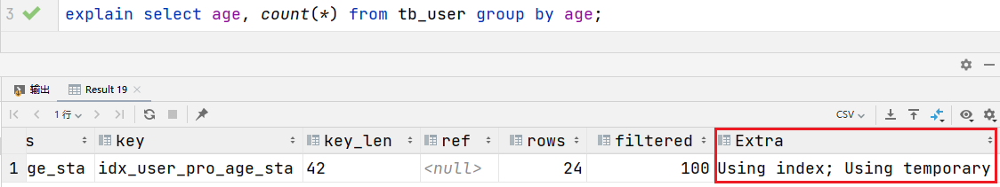
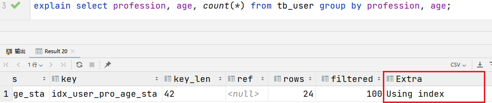
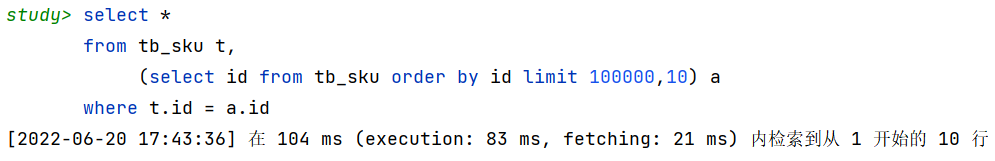

## 插入数据

### 批量插入数据

```sql
insert into tb_test values(1,'Tom'),(2,'Cat'),(3,'Jerry');
```


### 手动控制事务

```sql
start transaction;
insert into tb_test values(1,'Tom'),(2,'Cat'),(3,'Jerry');
insert into tb_test values(4,'Tom'),(5,'Cat'),(6,'Jerry'); 
insert into tb_test values(7,'Tom'),(8,'Cat'),(9,'Jerry');
commit;
```


### 主键顺序插入

顺序插入性能要高于乱序插入

* 主键乱序插入 : 8 1 9 21 88 2 4 15 89 5 7 3
* 主键顺序插入 : 1 2 3 4 5 7 8 9 15 21 88 89


### 大批量插入数据

如果一次性需要插入大批量数据(比如: 几百万的记录)，使用insert语句插入性能较低，此以使用MySQL数据库提供的load指令进行插入。

操作如下：

```sql
-- 客户端连接服务端时，加上参数 -–local-infile
mysql –-local-infile -u root -p
-- 查询load开关有没有开启，0：未开启 1：已开启
select @@local_infile;
-- 设置全局参数local_infile为1，开启从本地加载文件导入数据的开关
set global local_infile = 1;
-- 执行load指令将准备好的数据，加载到表结构中
-- 使用','分隔，使用'\n'分行
load data local infile '/root/sql1.log' into table tb_user fields terminated by ',' lines terminated by '\n' ;
```

> 主键顺序插入性能高于乱序插入


## 主键优化

### 数据组织方式

在InnoDB存储引擎中，表数据都是根据主键顺序组织存放的，这种存储方式的表称为**索引组织表**(index organized table **IOT**)。


行数据存储在聚集索引的叶子节点上：




在InnoDB引擎中，数据行是记录在逻辑结构 page 页中的，而每一个页的大小是固定的，默认16K。

一个页中所存储的行是有限的，如果插入的数据行row在该页存储不小，将会存储到下一个页中，页与页之间会通过指针连接。


### 页分裂

页可以为空，也可以填充一半，也可以填充100%。每个页包含了2-N行数据(如果一行数据过大，会行溢出)，根据主键排列。

**主键顺序插入：**

1. 从磁盘中申请页， 主键顺序插入
2. 第一个页没有满，继续往第一页插入
3. 当第一个也写满之后，再写入第二个页，页与页之间会通过指针连接
4. 当第二页写满了，再往第三页写入


 **主键乱序插入：**

1. 假如1#,2#页都已经写满了，存放了如图所示的数据


2. 此时插入id为50的记录，因为索引结构的叶子节点是有顺序的。应该存储在47之后。


3. 47所在的1#页，已经快满了，存储不了50对应的数据了。 此时会开辟一个新的页 3#。


4. 将1#页后一半的数据，移动到3#页，然后在3#页，插入50。


5. 1#的下一个页，应该是3#， 3#的下一个页是2#。 重新设置链表指针。


上述的这种现象，称之为 **"页分裂"**，是比较耗费性能的操作。


### 页合并

1. 目前表中已有数据的索引结构(叶子节点)如下：




2. 当删除一行记录时，没有被物理删除，而是被标记（flaged）为删除，并且它的空间变得允许被其他记录声明使用。


3. 当页中删除的记录达到 MERGE\_THRESHOLD（默认为页的50%），InnoDB会开始寻找最靠近的页（前或后）看看是否可以将两个页合并以优化空间使用。



4. 删除数据，并将页合并之后，再次插入新的数据21，则直接插入3#页。


这个里面所发生的合并页的这个现象，就称之为"**页合并**"。

> MERGE\_THRESHOLD：合并页的阈值，可以自己设置，在创建表或者创建索引时指定。


### 主键设计原则

* 满足业务需求的情况下，尽量降低主键的长度。
* 插入数据时，尽量选择顺序插入，选择使用AUTO\_INCREMENT自增主键。
* 尽量不要使用UUID做主键或者是其他自然主键，如身份证号。
* 业务操作时，避免对主键的修改。


## order by优化

**MySQL的排序有两种方式：**

* `Using filesort`：通过表的索引或全表扫描，读取满足条件的数据行，然后在排序缓冲区sort buffer中完成排序操作，所有不是通过索引直接返回排序结果的排序都叫 FileSort 排序。
* `Using index`：通过有序索引顺序扫描直接返回有序数据，这种情况即为using index，不需要额外排序，操作效率高。

对于以上的两种排序方式，`Using index`性能高，`Using filesort`性能低，在优化排序操作时，尽量优化为`Using index`。


1. 在表中没有索引的情况下，进行排序，是`Using filesort` ，性能较低


2. 创建索引，再进行排序，是`Using index` ，性能较高


3. 创建索引后，根据age, phone进行降序排序，此时Extra中出现了 `Backward index scan`，代表反向扫描索引，在MySQL中，默认索引的叶子节点从小到大排序，此时查询排序是从大到小，扫描就是反向扫描，就会出现 `Backward index scan`。 在MySQL8版本中，支持降序索引，可以创建降序索引




4. 根据phone，age进行升序排序，phone在前，age在后。排序时，也需要满足最左前缀法则，否则也会出现`filesort`。


5. 根据age, phone进行降序一个升序，一个降序。创建索引时，如果未指定顺序，默认按照升序排序，查询时一个升序一个降序，就会出现`Using filesort`，**可以在创建联合索引时，指定升序或者降序。**


**升序/降序联合索引结构图示：**




### order by优化原则

1. 根据排序字段建立合适的索引，多字段排序时，也遵循最左前缀法则。
2. 尽量使用覆盖索引。
3. 多字段排序，一个升序一个降序，需要注意联合索引在创建时的规则（ASC/DESC）。
4. 如果不可避免的出现filesort，大数据量排序时，可以适当增大排序缓冲区大小`sort_buffer_size`(默认256k)。


```sql
-- 查看缓冲区大小
show variables like 'sort_buffer_size';
```


## group by优化

1. 在没有索引的情况下，执行SQL，查询执行计划。使用了临时表，效率较低。


2. 创建一个联合索引，再执行前面相同的SQL查看执行计划，使用到了索引，性能较高。


3. 如果仅仅根据age分组，就会出现`Using temporary`；而如果是根据profession,age两个字段同时分组，则不会出现`Using temporary`。分组操作在联合索引中也符合最左前缀法则。





### group by优化原则

1. 在分组操作时，可以通过索引来提高效率。
2. 分组操作时，索引的使用也需满足最左前缀法则。


## limit优化

在数据量比较大时，如果进行limit分页查询，在查询时，越往后，分页查询效率越低。


一般分页查询时，通过创建 **覆盖索引** 能够比较好地提高性能，可以通过覆盖索引加子查询形式进行优化。

**通过下面这种方式，速度就会快很多：**




## count优化

如果数据量很大，在执行count操作时非常耗时。

* MyISAM 引擎会把一个表的总行数存在磁盘上，执行 count(\*) 的时候会直接返回这个数，效率很高；如果是带条件的count，MyISAM也慢。

* InnoDB 引擎执行 count(\*) 的时候，需要把数据一行一行地从引擎里面读出来，然后累积计数。

如果要大幅度提升InnoDB表的count效率，可以**自己计数**(可以借助于类似redis的数据库计数，如果是带条件的count又会比较麻烦)。

> `count()`是一个聚合函数，对于返回的结果集，一行行地判断，如果 count 函数的参数不是NULL，累计值就加 1，否则不加，最后返回累计值。

| **count用法** | **含义**                                                     |
| ------------- | ------------------------------------------------------------ |
| count(主键)   | InnoDB 引擎会遍历整张表，把每一行的**主键id**值都取出来，返回给服务层。服务层拿到主键后，直接按行进行累加(主键不可能为null) |
| count(字段)   |  **没有not null 约束**：InnoDB 引擎会遍历整张表把每一行的字段值都取出来，返回给服务层，服务层判断是否为null，不为null，计数累加。 **有not null 约束**：InnoDB 引擎会遍历整张表把每一行的字段值都取出来，返回给服务层，直接按行进行累加。 |
| count(数字)   | InnoDB 引擎遍历整张表，但不取值。服务层对于返回的每一行，放一个数字“1”进去，直接按行进行累加。 |
| count(\*)     | InnoDB引擎并不会把全部字段取出来，而是专门做了优化，不取值，服务层直接按行进行累加。 |

> 按照效率排序：count(字段) < count(主键 id) < count(1) ≈ count(\*)，所以尽量使用 count(\*)。


## update优化

**InnoDB的行锁是针对索引加的锁，不是针对记录加的锁，并且该索引不能失效，否则会从行锁升级为表锁 。**

1. 在执行SQL语句时，会锁定id为1这一行的数据，然后事务提交之后，行锁释放。

```sql
update course set name = 'javaEE' where id = 1 ;
```

2. 当开启多个事务，执行SQL时，行锁会升级为表锁。 导致update语句的性能大大降低。

```sql
update course set name = 'SpringBoot' where name = 'PHP' ;
```