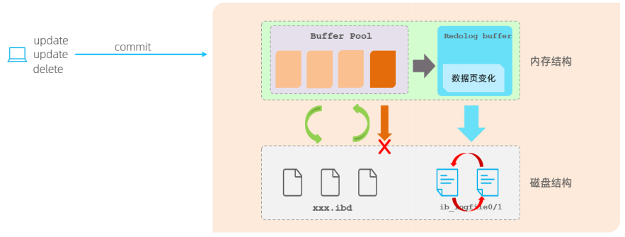

事务 是一组操作的集合，它是一个不可分割的工作单位，事务会把所有的操作作为一个整体一起向系统提交或撤销操作请求，即这些操作要么同时成功，要么同时失败。

  
## 事务特性

- 原子性（Atomicity）：事务是不可分割的最小操作单元，要么全部成功，要么全部失败。
- 一致性（Consistency）：事务完成时，必须使所有的数据都保持一致状态。
- 隔离性（Isolation）：数据库系统提供的隔离机制，保证事务在不受外部并发操作影响的独立环境下运行。
- 持久性（Durability）：事务一旦提交或回滚，它对数据库中的数据的改变就是永久的。

这四大特性，实际上分为两个部分。 其中的原子性、一致性、持久化，实际上是由InnoDB中的两份日志来保证的，一份是redo log日志，一份是undo log日志。 而持久性是通过数据库的锁，加上MVCC来保证的。

## redo log

重做日志，记录的是事务提交时数据页的物理修改，是用来实现事务的持久性。

该日志文件由两部分组成：重做日志缓冲（redo log buffer）以及重做日志文件（redo log file）,前者是在内存中，后者在磁盘中。当事务提交之后会把所有修改信息都存到该日志文件中, 用于在刷新脏页到磁盘,发生错误时, 进行数据恢复使用。

  

如果没有redolog，可能会存在的问题？

在InnoDB引擎中的内存结构中，主要的内存区域就是缓冲池，在缓冲池中缓存了很多的数据页。 在一个事务中，执行多个增删改的操作时，InnoDB引擎会先操作缓冲池中的数据，如果缓冲区没有对应的数据，会通过后台线程将磁盘中的数据加载出来，存放在缓冲区中，然后将缓冲池中的数据修改，修改后的数据页称为脏页。

而脏页则会在一定的时机，通过后台线程刷新到磁盘中，从而保证缓冲区与磁盘的数据一致。 而缓冲区的脏页数据并不是实时刷新的，而是一段时间之后将缓冲区的数据刷新到磁盘中，假如刷新到磁盘的过程出错了，而提示给用户事务提交成功，而数据却没有持久化下来，这就出现问题了，没有保证事务的持久性。

如何解决上述的问题呢？通过redolog如何解决这个问题。

有了redolog之后，当对缓冲区的数据进行增删改之后，会首先将操作的数据页的变化，记录在redo log buffer中。在事务提交时，会将redo log buffer中的数据刷新到redo log磁盘文件中。

过一段时间之后，如果刷新缓冲区的脏页到磁盘时，发生错误，此时就可以借助于redo log进行数据恢复，这样就保证了事务的持久性。 而如果脏页成功刷新到磁盘 或 或者涉及到的数据已经落盘，此时redolog就没有作用了，就可以删除了，所以存在的两个redolog文件是循环写的。

  

为什么每一次提交事务，要刷新redo log 到磁盘中呢，而不是直接将buffer pool中的脏页刷新到磁盘呢 ?

因为在业务操作中，我们操作数据一般都是随机读写磁盘的，而不是顺序读写磁盘。 而redo log在往磁盘文件中写入数据，由于是日志文件，所以都是顺序写的。顺序写的效率，要远大于随机写。 这种先写日志的方式，称之为 WAL（Write-Ahead Logging）。

## undo log

回滚日志，用于记录数据被修改前的信息 , 作用包含两个 : 提供回滚(保证事务的原子性) 和MVCC(多版本并发控制) 。

undo log和redo log记录物理日志不一样，它是逻辑日志。可以认为当delete一条记录时，undo log中会记录一条对应的insert记录，反之亦然，当update一条记录时，它记录一条对应相反的update记录。当执行rollback时，就可以从undo log中的逻辑记录读取到相应的内容并进行回滚。

Undo log销毁：undo log在事务执行时产生，事务提交时，并不会立即删除undo log，因为这些日志可能还用于MVCC。

Undo log存储：undo log采用段的方式进行管理和记录，存放在前面介绍的 rollback segment回滚段中，内部包含1024个undo log segment。