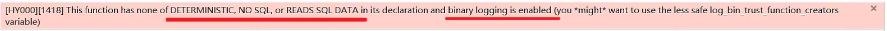

存储过程是事先经过编译并存储在数据库中的一段 SQL 语句的集合，调用存储过程可以简化很多工作，减少数据在数据库和应用服务器之间的传输，对于提高数据处理的效率是有好处的。

存储过程思想上很简单，就是数据库 SQL 语言层面的代码封装与重用。


* **封装**：可以把某一业务SQL封装在存储过程中，需要用到的时候直接调用即可。
* **可以接收参数，也可以返回数据**：再存储过程中，可以传递参数，也可以接收返回值。
* **减少网络交互，效率提升**：如果涉及到多条SQL，每执行一次都是一次网络传输。 而如果封装在存储过程中，我们只需要网络交互一次可能就可以了。


## 基本语法

* **创建：**

```sql
create procedure 存储过程名称 ([参数列表])
begin
    -- sql语句
end ;
```

* **调用：**

```sql
call 名称 ([参数]);
```

* **查看：**

```sql
-- 查询指定数据库的存储过程及状态信息
select * from information_schema.routines where routine_schema = '数据库名';

-- 查询某个存储过程的定义
show create procedure 存储过程名称;
```

* **删除：**

```sql
drop procedure [if exists] 存储过程名称;
```


```sql
-- 创建
create procedure p1()
begin
    select count(*) from student;
end;

-- 调用
call p1();

-- 查看数据库的存储过程和信息
select * from information_schema.ROUTINES where ROUTINE_SCHEMA = 'study';
-- 查看p1的创建语句
show create procedure p1;

-- 删除
drop procedure p1;
```


> 在命令行中，执行创建存储过程的SQL时，需要通过关键字 delimiter 指定SQL语句的结束符

例如：

```sql
-- 设置两个$$为结束符
delimiter $$;

-- 创建
create procedure p1()
begin
    select count(*) from student;
end$$

-- 调用
call p1()$$
```


## 变量

MySQL中变量分为三种类型：系统变量、用户定义变量、局部变量。


### 系统变量

系统变量是mysql服务器提供，不是用户定义的，属于服务器层面。分为全局变量（global）、会话变量（session）。

* **全局变量(global)**：全局变量针对于所有的会话。
* **会话变量(session)**：会话变量针对于单个会话，在另外一个会话窗口就不生效了。

> mysql服务重新启动之后，所设置的全局参数会失效，要想不失效，可以在 `/etc/my.cnf` 中配置

如果没有指定session/global，默认是session，会话变量。


* **查看系统变量：**

```sql
-- 查看所有系统变量
show [session | global] variables;

-- 可以通过like模糊匹配方式查找变量
show [session | global] variables like '......';

-- 查看指定变量的值
select @@[session | global] 系统变量名;
```

* **设置系统变量：**

```sql
set [session | global] 系统变量名 = 值;
set @@[session | global]系统变量名 = 值;
```


```sql
-- 查看所有会话变量
show session variables;
-- 模糊查询auto开头的系统变量
show global variables like 'auto%';
-- 查看某一个系统变量
select @@session.autocommit;
-- 设置系统变量的值
set session autocommit = 0;
set @@session.autocommit = 1;
```


### 用户定义变量

用户定义变量是用户根据需要自己定义的变量，用户变量不用提前声明，在用的时候直接用 "`@变量名`" 使用就可以。其作用域为当前连接。


* **赋值**：赋值时，可以使用 `=`，也可以使用 `:=` 。

```sql
set @var_name = expr [, @var_name = expr] ...;
set @var_name := expr [, @var_name := expr] ...;

select @var_name := expr [, @var_name := expr] ...;
select 字段名 into @var_name from 表名;
```

* **使用**：用户定义的变量无需对其进行声明或初始化，获取到的默认值为NULL。

```sql
select @var_name ;
```


```sql
-- 赋值
set @myname = 'arbor';
set @myage := 10;
set @mygender := '男', @myhobby := 'java';
select @myclolor := 'red';
select count(*) into @mycount from tb_user;

-- 使用
select @myname, @myage, @mygender, @myhobby;
select @myclolor, @mycount;
```


### 局部变量

局部变量是根据需要定义的在局部生效的变量，访问之前，需要 `declare` 声明。可用作存储过程内的局部变量和输入参数，局部变量的范围是在其内声明的 `begin ... end` 块。

* **声明：**

```sql
declare 变量名 变量类型 [default ... ] ;
```

> 变量类型就是数据库字段类型：int、bigint、char、varchar、date、time等。

* **赋值：**

```sql
set 变量名 = 值;
set 变量名 := 值;
select 字段名 into 变量名 from 表名 ...;
```


```sql
-- 声明局部变量 - declare
-- 赋值
create procedure p2()
begin
    declare stu_count int default 0;
    select count(*) into stu_count from student;
    select stu_count;
end;
call p2();
```


## if

if 用于做条件判断，具体的语法结构为：

```sql
if 条件1 then
    ..... 
elseif 条件2 then     -- 可选
    .....
else    -- 可选
    .....
end if;
```

在if条件判断的结构中，else if 结构可以有多个，也可以没有。 else结构可以有，也可以没有。


根据定义的分数score变量，判定当前分数对应的分数等级。

* score >= 85分，等级为优秀。
* score >= 60分 且 score < 85分，等级为及格。
* score < 60分，等级为不及格。

```sql
create procedure p3()
begin
    declare score int default 58;
    declare result varchar(10);

    if score >= 85 then
        set result := '优秀';
    elseif score >= 60 then
        set result := '及格';
    else
        set result := '不及格';
    end if;

    select result;
end;
call p3();
```


## 参数

参数的类型，主要分为以下三种：in、out、inout。 具体的含义如下：

* `in`：该类参数作为输入，也就是需要调用时传入值，默认
* `out`：该类参数作为输出，也就是该参数可以作为返回值
* `inout`：既可以作为输入参数，也可以作为输出参数

```sql
create procedure 存储过程名称 ([ in/out/inout 参数名 参数类型 ])
begin
    -- sql语句
end ;
```


根据定义的分数score变量，判定当前分数对应的分数等级。

* score >= 85分，等级为优秀。
* score >= 60分 且 score < 85分，等级为及格。
* score < 60分，等级为不及格。

```sql
create procedure p4(in score int, out result varchar(10))
begin
    if score >= 85 then
        set result := '优秀';
    elseif score >= 60 then
        set result := '及格';
    else
        set result := '不及格';
    end if;
end;
-- 定义用户变量 @result来接收返回的数据, 用户变量可以不用声明
call p4(18, @result);
select @result;
```


将传入的200分制的分数，进行换算，换算成百分制，然后返回。

```sql
create procedure p5(inout score double)
begin
    set score := score * 0.5;
end;
set @score = 198;    -- 先定义变量并赋值
call p5(@score);    -- 调用方法后得到新的值
select @score;    -- 输出的是新的值
```


## case

case结构及作用，和流程控制函数很类似。有两种语法格式：

* **语法一：**

```sql
-- 1. 当case_value的值为 when_value1时，执行statement_list1
-- 2. 当值为 when_value2时，执行statement_list2
-- 3. 否则就执行statement_list
case case_value
    when when_value1 then
        statement_list1 
    [when when_value2 then
        statement_list2]
    ...
    [else
        statement_list]
end case;
```

* **语法二：**

```sql
-- 1. 当条件search_condition1成立时，执行statement_list1
-- 2. 当条件search_condition2成立时，执行statement_list2
-- 3. 否则就执行statement_list
case
    when search_condition1 then
        statement_list1
    [when search_condition2 then
        statement_list2]
    ...
    [else
        statement_list]
end case;
```

> 如果判定条件有多个，多个条件之间，可以使用 and 或 or 进行连接。


根据传入的月份，判定月份所属的季节（要求采用case结构）。

* 1-3月份，为第一季度
* 4-6月份，为第二季度
* 7-9月份，为第三季度
* 10-12月份，为第四季度

```sql
create procedure p6(in month int)
begin
    declare result varchar(10);
    case
        when month >= 1 and month <= 3 then
            set result := '第一季度';
        when month >= 4 and month <= 6 then
            set result := '第二季度';
        when month >= 7 and month <= 9 then
            set result := '第三季度';
        when month >= 10 and month <= 12 then
            set result := '第四季度';
        else
            set result := '非法参数';
    end case;

    select concat('您输入的月份为: ', month, ', 所属的季度为: ', result);    -- 字符串拼接
end;
call p6(16);
```


## while

while循环是有条件的循环控制语句。满足条件后，再执行循环体中的SQL语句。具体语法为：

```sql
-- 先判定条件，如果条件为true，则执行逻辑，否则，不执行逻辑
while 条件 do
    -- sql逻辑...
end while;
```


计算从1累加到n的值，n为传入的参数值。

```sql
-- A. 定义局部变量, 记录累加之后的值;
-- B. 每循环一次, 就会对n进行减1 , 如果n减到0, 则退出循环
create procedure p7(in n int)
begin
    declare total int default 0;
    while n>0 do
        set total := total + n;
        set n := n - 1;
    end while;

    select total;
end;
call p7(100);
```


## repeat

repeat是有条件的循环控制语句, 当满足until声明的条件的时候，则退出循环 。具体语法为：

```sql
-- 先执行一次逻辑，然后判定until条件是否满足，如果满足，则退出。如果不满足，则继续下一次循环
repeat
    -- sql逻辑...
    until 条件
end repeat;
```


计算从1累加到n的值，n为传入的参数值。(使用repeat实现)

```sql
-- A. 定义局部变量, 记录累加之后的值;
-- B. 每循环一次, 就会对n进行-1 , 如果n减到0, 则退出循环
create procedure p8(in n int)
begin
    declare total int default 0;
    repeat
        set total := total + n;
        set n := n - 1;
        until n <= 0
    end repeat;

    select total;
end;
call p8(10);
call p8(100);
```


## loop

loop 实现简单的循环，如果不在sql逻辑中增加退出循环的条件，可以用其来实现简单的死循环。

loop可以配合一下两个语句使用：

* `leave`：配合循环使用，退出循环。
* `iterate`：必须用在循环中，作用是跳过当前循环剩下的语句，直接进入下一次循环。

```sql
[begin_label:]
    loop
        -- sql逻辑...
    end loop
[end_label];
```


```sql
leave label; -- 退出指定标记的循环体
iterate label; -- 直接进入下一次循环
```

> 上述语法中出现的`begin_label`，`end_label`，`label`指的都是自定义的标记。


计算从1累加到n的值，n为传入的参数值。

```sql
-- A. 定义局部变量, 记录累加之后的值;
-- B. 每循环一次, 就会对n进行-1 , 如果n减到0, 则退出循环 ----> leave xx
create procedure p9(in n int)
begin
    declare total int default 0;

    sum:loop
        if n<=0 then
            leave sum;
        end if;

        set total := total + n;
        set n := n - 1;
    end loop sum;

    select total;
end;
call p9(100);
```


计算从1到n之间的偶数累加的值，n为传入的参数值。

```sql
-- A. 定义局部变量, 记录累加之后的值;
-- B. 每循环一次, 就会对n进行-1 , 如果n减到0, 则退出循环 ----> leave xx
-- C. 如果当次累加的数据是奇数, 则直接进入下一次循环. --------> iterate xx
create procedure p10(in n int)
begin
    declare total int default 0;

    sum:loop
        if n<=0 then
            leave sum;
        end if;

        if n%2 = 1 then
            set n := n - 1;
            iterate sum;
        end if;

        set total := total + n;
        set n := n - 1;
    end loop sum;

    select total;
end;
call p10(100);
```


## 游标

游标（cursor）是用来存储查询结果集的数据类型 , 在存储过程和函数中可以使用游标对结果集进行循环的处理。游标的使用包括游标的声明、open、fetch 和 close，其语法分别如下。

* **声明游标：**

```sql
declare 游标名称 cursor for 查询语句;
```

* **打开游标：**

```sql
open 游标名称;
```

* **获取游标记录：**

```sql
fetch 游标名称 into 变量 [, 变量 ];
```

* **关闭游标：**

```sql
close 游标名称;
```


根据传入的参数uage，来查询用户表tb\_user中，所有的用户年龄小于等于uage的用户姓名(name)和专业(profession)，并将用户的姓名和专业插入到所创建的一张新表(id,name,profession)中。

```sql
-- A. 声明游标, 存储查询结果集
-- B. 准备: 创建表结构
-- C. 开启游标
-- D. 获取游标中的记录
-- E. 插入数据到新表中
-- F. 关闭游标
create procedure p11(in uage int)
begin
    -- 需要先声明变量，再声明游标
    declare uname varchar(100);
    declare upro varchar(100);
    declare u_cursor cursor for select name,profession from tb_user where age <= uage;    -- 声明游标，并存储

    -- 创建表
    drop table if exists tb_user_pro;
    create table if not exists tb_user_pro(
        id int primary key auto_increment,
        name varchar(100),
        profession varchar(100)
    );

    -- 开启游标
    open u_cursor;

    -- 获取游标的记录
    while true do
        fetch u_cursor into uname,upro;
        insert into tb_user_pro values (null, uname, upro);
    end while;

    close u_cursor;
end;
call p11(30);
```

因为while没有结束条件，所以会报错，但是数据是都插入了，需要使用条件处理程序来处理。


## 条件处理程序

条件处理程序（Handler）可以用来定义在流程控制结构执行过程中遇到问题时相应的处理步骤。具体语法为：

```sql
declare handler_action handler for condition_value [, condition_value] ... statement ;
```


**handler\_action 的取值：**

* `continue`：继续执行当前程序
* `exit`：终止执行当前程序


**condition\_value 的取值：**

* `sqlstate sqlstate_value`：状态码，如 02000
* `sqlwarning`：所有以01开头的sqlstate代码的简写
* `not found`：所有以02开头的sqlstate代码的简写
* `sqlexception`：所有没有被sqlwarning 或 not found捕获的sqlstate代码的简写


通过sqlstate指定具体的状态码

```sql
create procedure p11(in uage int)
begin
    declare uname varchar(100);
    declare upro varchar(100);
    declare u_cursor cursor for select name,profession from tb_user where age <= uage;

    -- 声明条件处理程序 ： 当SQL语句执行抛出的状态码为02000时，将关闭游标u_cursor，并退出
    declare exit handler for SQLSTATE '02000' close u_cursor;
    
    drop table if exists tb_user_pro;
    create table if not exists tb_user_pro(
        id int primary key auto_increment,
        name varchar(100),
        profession varchar(100)
    );

    open u_cursor;
    while true do
        fetch u_cursor into uname,upro;
        insert into tb_user_pro values (null, uname, upro);
    end while;

    close u_cursor;
end;
call p11(30);
```


通过sqlstate的代码简写方式 not found

> 02 开头的状态码，代码简写为 NOT FOUND

```sql
create procedure p11(in uage int)
begin
    declare uname varchar(100);
    declare upro varchar(100);
    declare u_cursor cursor for select name,profession from tb_user where age <= uage;

    -- 声明条件处理程序 ： 当SQL语句执行抛出的状态码为02开头时，将关闭游标u_cursor，并退出
    declare exit handler for not found close u_cursor;
    
    drop table if exists tb_user_pro;
    create table if not exists tb_user_pro(
        id int primary key auto_increment,
        name varchar(100),
        profession varchar(100)
    );

    open u_cursor;
    while true do
        fetch u_cursor into uname,upro;
        insert into tb_user_pro values (null, uname, upro);
    end while;

    close u_cursor;
end;
call p11(30);

```

错误状态码官方文档：

* [https://dev.mysql.com/doc/refman/8.0/en/declare-handler.html](https://dev.mysql.com/doc/refman/8.0/en/declare-handler.html)
* [https://dev.mysql.com/doc/mysql-errors/8.0/en/server-error-reference.html](https://dev.mysql.com/doc/mysql-errors/8.0/en/server-error-reference.html)


## 存储函数

存储函数是有返回值的存储过程，存储函数的参数只能是IN类型的。具体语法如下：

```sql
create function 存储函数名称 ([ 参数列表 ])
    returns type [characteristic ...]
    begin
        -- sql语句
        return ...;
    end;
```

**characteristic说明：**

* `deterministic`：相同的输入参数总是产生相同的结果
* `no sql`：不包含 sql 语句。
* `reads sql data`：包含读取数据的语句，但不包含写入数据的语句。


计算从1累加到n的值，n为传入的参数值。

```sql
create function fun1(n int)
    returns int deterministic

    begin
        declare total int default 0;

        while n>0 do
            set total := total + n;
            set n := n - 1;
        end while;

        return total;
    end;
select fun1(50);
```

> 在mysql8.0版本中binlog默认是开启的，一旦开启了，mysql就要求在定义存储过程时，需要指定characteristic特性，否则就会报如下错误。



