## 最左前缀法则

> 如果索引了多列（联合索引），要遵守最左前缀法则。
> 最左前缀法则指的是查询从索引的最左列开始，并且不跳过索引中的列。如果跳跃某一列，索引将会部分失效(后面的字段索引失效)。

在 `tb_user` 表中，有一个联合索引，这个联合索引涉及到三个字段，顺序分别为：`profession`，
`age`，`status`。

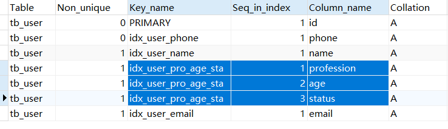


最左前缀法则是指，查询时，最左边的列 `profession` 必须存在，否则索引全部失效。而且中间不能跳过某一列，否则该列后面的字段索引将失效。


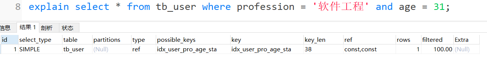
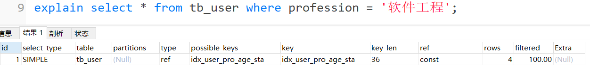


以上的这几组测试中，只要联合索引最左边的字段 profession存在，索引就会生效，只不过索引的长度不同。 由以上测试，可以推测出profession字段索引长度为36、age字段索引长度为2、status字段索引长度为4。


上面的测试，索引并未生效，因为不满足最左前缀法则，联合索引最左边的列profession不存在。

上述的SQL查询时，最左边的列profession字段存在，满足最左前缀法则的基本条件。查询时，跳过了age列，所以后面的列索引不会使用，索引部分生效。


## 范围查询

> 联合索引中，出现范围查询( `>`，`<` )，范围查询右侧的列索引失效。所以尽可能的使用 `>=` 或 `<=` 。


当范围查询使用 `>` 或 `< `时，联合索引长度为38，说明范围查询右边的status字段没有走索引。
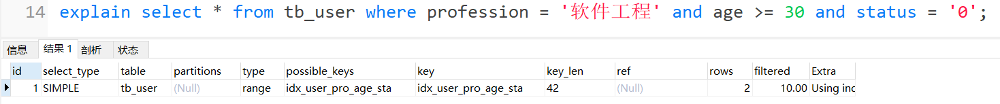
当范围查询使用 `>=` 或 `<= `时，联合索引的长度为42，说明所有的字段都走索引。


## 索引列运算

> 不要在索引列上进行运算操作，索引将失效。


当根据phone字段进行函数运算操作之后，索引失效。


## 字符串不加引号

> 字符串类型字段使用时，不加引号，索引将失效。


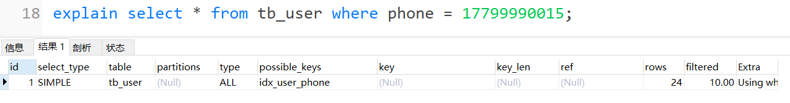


如果字符串不加单引号，对查询结果没什么影响，因为数据库存在隐式类型转换，索引将失效。


## 模糊查询

> 如果尾部模糊匹配，索引不会失效。如果是头部模糊匹配，索引失效。


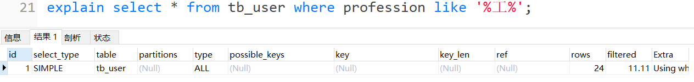

在like模糊查询中，在关键字后面加%，索引生效。而如果在关键字前面加了%，索引会失效。


## or连接条件

> 当or连接的条件，左右两侧字段都有索引时，索引才会生效。

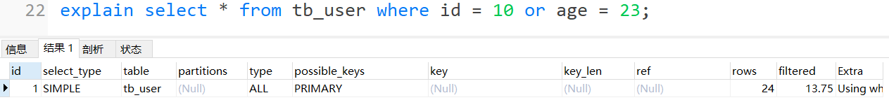

age没有索引，即使id有索引，索引也会失效。


age字段建立索引后，索引就生效了。


## 数据分布影响

> 如果MySQL评估使用索引比全表更慢，则不使用索引。

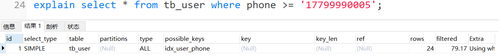


MySQL在查询时，会评估使用索引的效率与走全表扫描的效率，如果走全表扫描更快，则放弃索引，走全表扫描。 因为索引是用来索引少量数据的，如果通过索引查询返回大批量的数据，不如走全表扫描来的快，此时索引就会失效。


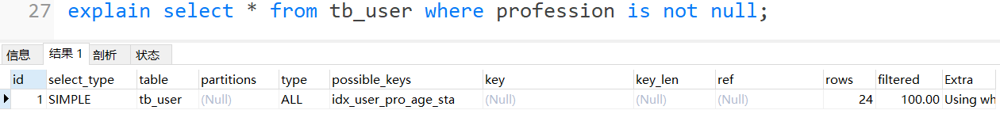


查询时MySQL会评估，走索引快还是全表扫描快，如果全表扫描更快，则放弃索引走全表扫描。 因此，`is null` 、`is not null` 是否走索引，得具体情况具体分析，并不是固定的。


## SQL提示

在下面字段同时有两个索引的情况下进行查询，可以看到，MySQL找到了两个索引，最终自动选择了联合索引。

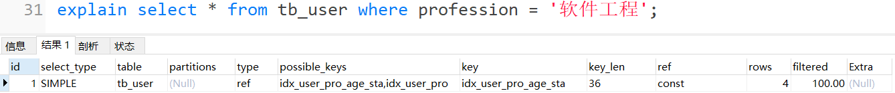


> SQL提示是优化数据库的一个重要手段，在SQL语句中加入一些人为的提示来达到优化操作的目的。


* `use index`： 建议MySQL使用哪一个索引完成此次查询(仅仅是建议，mysql内部还会再次进行评估)。
* `ignore index`： 忽略指定的索引。
* `force index`： 强制使用索引。

```sql
explain select * from tb_user use index(idx_user_pro) where profession = '软件工程';
explain select * from tb_user ignore index(idx_user_pro) where profession = '软件工程';
explain select * from tb_user force index(idx_user_pro) where profession = '软件工程';
```


## 覆盖索引

尽量使用覆盖索引，减少 `select *` 。覆盖索引是指查询使用了索引，并且需要返回的列，在该索引中已经全部能够找到 。


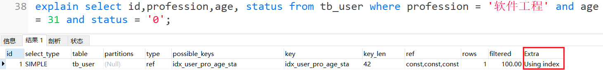


Extra含义：

* `Using where`、`Using Index` ：查找使用了索引，但是需要的数据都在索引列中能找到，所以不需要回表查询数据。
* `Using indexcondition`、`null`：查找使用了索引，但是需要回表查询数据。


因为，在tb\_user表中有一个联合索引 idx\_user\_pro\_age\_sta，该索引关联了三个字段profession、age、status，而这个索引也是一个二级索引，所以叶子节点下面挂的是这一行的主键id。 

* 当查询返回的数据在 id、profession、age、status 之中，则直接走二级索引返回数据。 
* 如果超出这个范围，就需要拿到主键id，再去扫描聚集索引，获取额外的数据。这个过程就是回表。 

如果使用 `select *` 查询所有字段值，容易造成回表查询（除非根据主键查询，只会扫描聚集索引）。

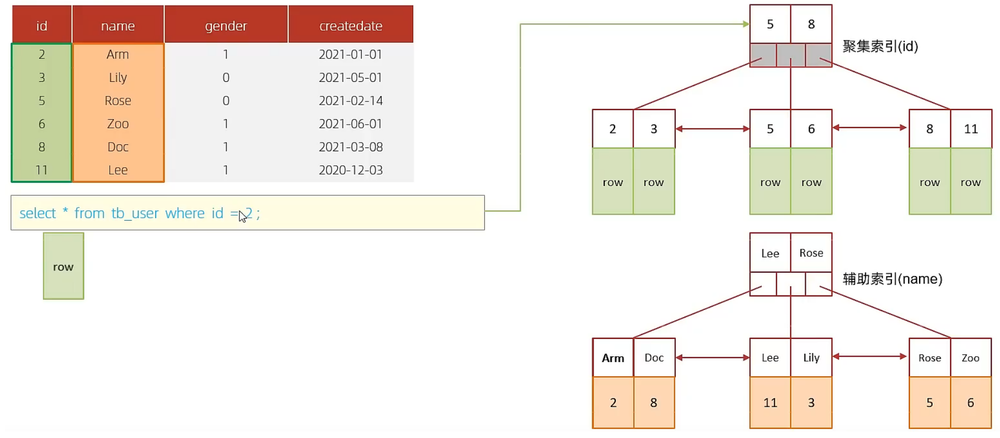


根据id查询，直接走聚集索引查询，一次索引扫描，直接返回数据，性能高。

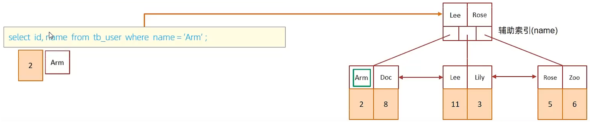


根据name字段查询二级索引，查询字段为 id，name，在name的二级索引中，这两个值可以直接获取到，因为覆盖索引，不需要回表查询，性能高。


在name的二级索引中，不包含gender，需要两次索引扫描回表查询，性能相对较差一点。


## 前缀索引

当字段类型为字符串(`varchar`，`text`，`longtext`等)时，有时候需要索引很长的字符串，这样索引会变得很大，查询时，浪费大量的磁盘IO， 影响查询效率。

此时可以只将字符串的一部分前缀，建立索引，这样可以大大节约索引空间，从而提高索引效率。

**语法：**

```sql
create index 索引名 on table_name(column(n)) ;
```

**可以根据索引的选择性来决定n的值**，选择性是指不重复的索引值（基数）和数据表的记录总数的比值，索引选择性越高则查询效率越高， 唯一索引的选择性是1，这是最好的索引选择性，性能也是最好的。

```sql
-- 获取email不重复且不为空的总数 / 总数
select count(distinct email) / count(*) from tb_user;
-- 截取前五个得到的值和截取前8个得到的值是一样的，那么只截取前五个会好一点，减少空间的使用
select count(distinct substring(email,1,5)) / count(*) from tb_user ;
```


为tb\_user表的email字段，建立长度为5的前缀索引。

```sql
create index idx_email_5 on tb_user(email(5));
```


## 单列索引与联合索引

* 单列索引：即一个索引只包含单个列。
* 联合索引：即一个索引包含了多个列。

> **在业务场景中，如果存在多个查询条件，考虑针对于查询字段建立索引时，建议建立联合索引，而非单列索引。**

在phone和name都有单列索引的情况下，使用and连接查询，发现MySQL只会选择一个索引，是会回表查询的，所以效率相对比较低。

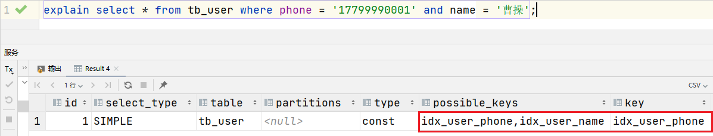


给phone和name创建联合索引，并使用联合索引查询，因为联合索引中包含 phone、name的信息，在叶子节点下挂的是对应的主键id，所以是无需回表查询的。

```sql
create unique index idx_user_phone_name on tb_user(phone,name);
explain select * from tb_user use index(idx_user_phone_name) where phone = '17799990001' and name = '曹操';
```

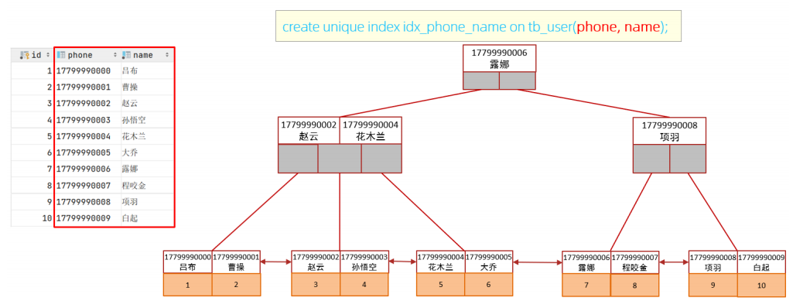


## 索引设计原则

1. 针对于数据量较大，且查询比较频繁的表建立索引。
2. 针对于常作为查询条件（where）、排序（order by）、分组（group by）操作的字段建立索引。
3. 尽量选择区分度高的列作为索引，尽量建立唯一索引，区分度越高，使用索引的效率越高。
4. 如果是字符串类型的字段，字段的长度较长，可以针对于字段的特点，建立前缀索引。
5. 尽量使用联合索引，减少单列索引，查询时，联合索引很多时候可以覆盖索引，节省存储空间，避免回表，提高查询效率。
6. 要控制索引的数量，索引并不是多多益善，索引越多，维护索引结构的代价也就越大，会影响增删改的效率。
7. 如果索引列不能存储NULL值，请在创建表时使用NOT NULL约束它。当优化器知道每列是否包含NULL值时，它可以更好地确定哪个索引最有效地用于查询。
