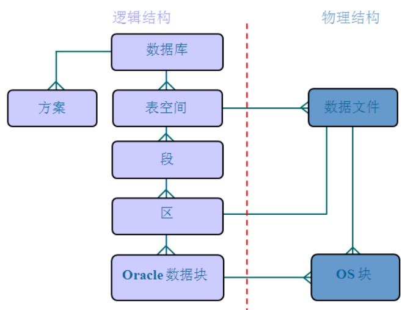

ORACLE 数据库系统是美国 ORACLE 公司（甲骨文）提供的以分布式数据库为核心的一组软件产品，是目前最流行的客户/服务器(CLIENT/SERVER)或 B/S 体系结构的数据库之一。比如SilverStream 就是基于数据库的一种中间件。ORACLE 数据库是目前世界上使用最为广泛的数据库管理系统，作为一个通用的数据库系统，它具有完整的数据管理功能；作为一个关系数据库，它是一个完备关系的产品；作为分布式数据库它实现了分布式处理功能。但它的所有知识，只要在一种机型上学习了 ORACLE 知识，便能在各种类型的机器上使用它。

## Oracle体系结构

**数据库：** Oracle 数据库是数据的物理存储。这就包括（数据文件 ORA 或者 DBF、控制文件、联机日志、参数文件）。其实 Oracle 数据库的概念和其它数据库不一样，这里的数据库是一个操作系统只有一个库。可以看作是 Oracle 就只有一个大数据库。

**实例：** 一个 Oracle 实例（Oracle Instance）有一系列的后台进程（Backguound Processes)和内存结构（Memory Structures)组成。一个数据库可以有 n 个实例。

**用户：** 用户是在实例下建立的。不同实例可以建相同名字的用户。

**表空间：** 表空间是 Oracle 对物理数据库上相关数据文件（ORA 或者 DBF 文件）的逻辑映射。一个数据库在逻辑上被划分成一到若干个表空间，每个表空间包含了在逻辑上相关联的一组结构。每个数据库至少有一个表空间(称之为 system 表空间)。每个表空间由同一磁盘上的一个或多个文件组成，这些文件叫数据文件(datafile)。一个数据文件只能属于一个表空间。

**数据文件（dbf、ora）：** 数据文件是数据库的物理存储单位。数据库的数据是存储在表空间中的，真正是在某一个或者多个数据文件中。而一个表空间可以由一个或多个数据文件组成，一个数据文件只能属于一个表空间。一旦数据文件被加入到某个表空间后，就不能删除这个文件，如果要删除某个数据文件，只能删除其所属于的表空间才行。表的数据，是有用户放入某一个表空间的，而这个表空间会随机把这些表数据放到一个或者多个数据文件中。

由于 oracle 的数据库不是普通的概念，oracle 是有用户和表空间对数据进行管理和存放的。但是表不是有表空间去查询的，而是由用户去查的。因为不同用户可以在同一个表空间建立同一个名字的表！这里区分就是用户了！

