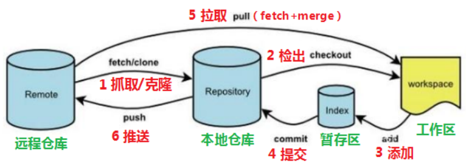
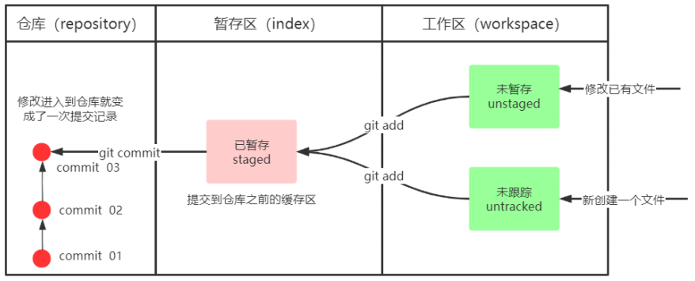
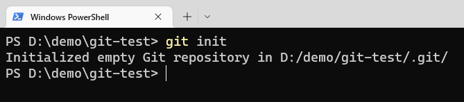
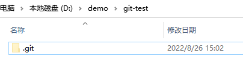

* Git GUI：Git提供的图形界面工具
* Git Bash：Git提供的命令行工具

Git工作流程图：



命令如下：

1. **clone(克隆)**：从远程仓库中克隆代码到本地仓库
2. **checkout(检出)**：从本地仓库中检出一个仓库分支然后进行修订
3. **add(添加)**：在提交前先将代码提交到暂存区
4. **commit(提交)**：提交到本地仓库。本地仓库中保存修改的各个历史版本
5. **fetch(抓取)**：从远程库，抓取到本地仓库，不进行任何的合并动作，一般操作比较少。
6. **pull(拉取)**：从远程库拉到本地库，自动进行合并(merge)，然后放到到工作区，相当于fetch+merge
7. **push(推送)**：修改完成后，需要和团队成员共享代码时，将代码推送到远程仓库


## 基本配置

* 设置用户名和邮箱：

```bash
git config --global user.name "name"
git config --global user.email "email"
```

* 查看配置信息：

```bash
git config --global user.name
git config --global user.email
```

* 常用指令配置别名：

```bash
# 1. 创建文件
touch ~/.bashrc
```


例如：

```bash
#用于输出git提交日志
alias git-log='git log --pretty=oneline --all --graph --abbrev-commit'
#用于输出当前目录所有文件及基本信息
alias ll='ls -al'
```


##### 乱码问题

1. 打开GitBash执行下面命令

```bash
git config --global core.quotepath false
```

2. `${git_home}/etc/bash.bashrc`文件最后加入下面两行

```bash
export LANG="zh_CN.UTF-8"
export LC_ALL="zh_CN.UTF-8"
```


## 基础操作指令

Git工作目录下对于文件的修改(增加、删除、更新)会存在几个状态，这些修改的状态会随着执行Git的命令而发生变化。



### 获取本地仓库

```bash
git init
```





如果创建成功后可在文件夹下看到隐藏的.git目录


### 查看修改的状态(status)

查看的修改的状态（暂存区、工作区）

```bash
git status
```


### 添加工作区到暂存区(add)

添加工作区一个或多个文件的修改到暂存区

```bash
git add 单个文件名|通配符
# 将所有修改加入暂存区：
git add .
```


### 提交暂存区到本地仓库(commit)

提交暂存区内容到本地仓库的当前分支

```bash
git commit -m '注释内容'
```


### 查看提交日志(log)

查看提交记录

```bash
git log [option]
# options：
# --all 显示所有分支
# --pretty=oneline 将提交信息显示为一行
# --abbrev-commit 使得输出的commitId更简短
# --graph 以图的形式显示
```


### 版本回退

版本切换，commitID 可以使用`git log`指令查看。

```bash
git reset --hard commitID
```


**查看已经删除的记录**

```bash
git reflog
```


### 添加文件至忽略列表

在工作目录中创建一个名为`.gitignore`的文件（文件名称固定），列出要忽略的文件模式。

例如：

```bash
/log/
target/
!.mvn/wrapper/maven-wrapper.jar
!**/src/main/**/target/
!**/src/test/**/target/
```