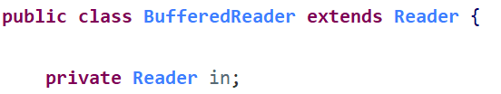

文件是保存数据的地方，文件在程序中是以流的形式来操作的。

* **流：** 数据在数据源(文件)和程序(内存)之间经历的路径
* **输入流：** 数据从数据源(文件)到程序(内存)的路径
* **输出流：** 数据从程序(内存)到数据源(文件)的路径


把数据的传输(如读写文件、网络通迅等)，可以看做是一种数据的流动，按照流动的方向，以内存为基准，分为 `输入input` 和 `输出output` ，即流向内存是输入流，流出内存的输出流。

Java中I/O操作主要是指使用`java.io` 包下的内容，进行输入、输出操作。**输入**也叫做**读取**数据，**输出**也叫做作**写出**数据。


根据数据的流向分为：**输入流**和**输出流**。


* **输入流**：把数据从其他设备上读取到内存中的流。
* **输出流**：把数据从内存中写出到其他设备上的流。


根据数据的类型分为：**字节流**和**字符流**。


* **字节流**：以字节为单位，读写数据的流。
* **字符流**：以字符为单位，读写数据的流。


根据流的角色分为：**节点流**、**处理流**/**包装流**


## IO流顶级父类

在Java的IO流中共设计40多个类，实际上非常规则，都是从如下四个抽象基类派生的。

由这四个类派生的子类名称都是以其父类名作为子类名后缀。

|  (抽象基类)  |  字节流    |  字符流  |
| ---------------- | -------------- | ------------ |
| 输入流           | `InputStream`  | `Reader`     |
| 输出流           | `OutputStream` | `Writer`     |


## 节点流和处理流

* 节点流可以从一个特定的数据源**读写数据**


* 处理流(**包装流**)是“连接”在已存在的流(节点流或处理流)之上，为程序提供更加强大的读写功能，如`BufferedReader`、`BufferedWriter`


> 比如，`BufferedReader` 继承自`Reader` 类，同时内部有个`Reader`类型的属性`in` ，该属性可以封装任意一个`Reader` 类型的子类，可以操作不同的数据源，只要是`Reader` 的子类




|  **分类**  |            | **字节输入流**           | **字节输出流**            | **字符输入流**      | **字符输出流**       |
| :--------: | ---------- | ------------------------ | ------------------------- | ------------------- | -------------------- |
|  抽象基类  |            | *`InputStream`*            | *`OutputStream`*            | *`Reader`*            | *`Writer`*             |
| **节点流** | 访问文件   | **`FileInputStream`**      | **`FileOutputStream`**      | **`FileReader`**      | **`FileWriter`**       |
|            | 访问数组   | **`ByteArrayInputStream`** | **`ByteArrayOutputStream`** | **`CharArrayReader`** | **`CharArrayWriter`**  |
|            | 访问管道   | **`PipedInputStream`**     | **`PipedOutputStream`**     | **`PipedReader`**     | **`PipedWriter`**      |
|            | 访问字符串 |                          |                           | **`StringReader`**    | **`StringWriter`**     |
| **处理流** | 缓冲流     | `BufferedInputStream`    | `BufferedOutputStream`    | `BufferedReader`    | `BufferedWriter`     |
|            | 转换流     |                          |                           | `InputStreamReader` | `OutputStreamWriter` |
|            | 对象流     | `ObjectInputStream`      | `ObjectOutputStream`      |                     |                      |
|            | 抽象基类   | *`FilterInputStream`*      | *`FilterOutputStream`*      | *`FilterReader`*      | *`FilterWriter`*       |
|            | 打印流     |                          | `PrintStream`             |                     | `PrintWriter`        |
|            | 推回输入流 | `PushbackInputStream`    |                           | `PushbackReader`    |                      |
|            | 特殊流     | `DataInputStream`        | `DataOutputStream`        |                     |                      |


## **节点流和处理流的区别和联系**

* 节点流是底层流/低级流，直接跟数据源相接。
* 处理流包装了节点流，既可以消除不同节点流的实现差异，也可以提供更方便的方法来完成输入输出。
* 处理流(包装流)对节点流进行包装，使用了**修饰器设计模式**，不会直接与数据源相连。


**处理流的功能主要体现在下面两个方面：**

* 性能的提高：主要以增加缓冲的方式来提高输入输出的效率。
* 操作的便捷：提供了一系列便捷的方法来一次输入输出大批量的数据，使用更加灵活方便。


## File类

`java.io.File`类是文件和目录路径名的抽象表示，主要用于文件和目录的创建、查找和删除等操作。

* **绝对路径**：从盘符开始的路径，这是一个完整的路径。
* **相对路径**：相对于项目目录的路径，这是一个便捷的路径，开发中经常使用。

一个File对象代表硬盘中实际存在的一个文件或者目录。无论该路径下是否存在文件或者目录，都不影响File对象的创建。

### 构造方法

* `File(String pathname)`：通过将给定的路径名字符串，转换为抽象路径名来创建新的 File实例。
* `File(String parent, String child)`：从父路径名字符串和子路径名字符串创建新的 File实例。
* `File(File parent, String child)`：从父抽象路径名和子路径名字符串创建新的 File实例。

```java
// 文件路径名  
String pathname = "D:\\aaa.txt";  
File file1 = new File(pathname);

// 文件路径名  
String pathname2 = "D:\\aaa\\bbb.txt";  
File file2 = new File(pathname2);   

// 通过父路径和子路径字符串  
String parent = "d:\\aaa";  
String child = "bbb.txt";  
File file3 = new File(parent, child);  

// 通过父级File对象和子路径字符串  
File parentDir = new File("d:\\aaa");  
String child = "bbb.txt";  
File file4 = new File(parentDir, child);  
```


### 创建删除功能的方法

* `boolean createNewFile()`：当且仅当具有该名称的文件尚不存在时，创建一个新的空文件，创建文件的路径必须存在，否则抛出异常只能创建文件，不能创建文件夹。
  * 若文件不存在，则创建文件，返回true
  * 若文件存在，则不创建文件，返回false。
* `boolean delete()`：删除由此File表示的文件或目录，不走回收站，直接在硬盘中删除，删除需谨慎。
  * 若文件/文件夹删除成功，返回true
  * 若文件夹中有内容，不会删除
  * 若构造方法中的路径不存在，返回false
* `boolean mkdir()`：创建由此File表示的目录，只能创建单级文件夹
  * 若文件夹不存在，则创建文件夹，返回true
  * 若文件夹存在，则不创建文件夹
  * 若构造方法给出的路径不存在，返回false
* `boolean mkdirs()`：创建由此File表示的目录，包括任何必需但不存在的父目录，以创建单级或多级文件夹
  * 若文件夹不存在，则创建文件夹，返回true
  * 若文件夹存在，则不创建文件夹，
  * 若构造方法给出的路径不存在，返回false

```java
public static void main(String[] args) throws IOException {  
    // 文件的创建  
    File f = new File("aaa.txt");  
    System.out.println("是否存在:"+f.exists()); // false  
    System.out.println("是否创建:"+f.createNewFile()); // true  
    System.out.println("是否存在:"+f.exists()); // true  

    // 目录的创建  
    File f2= new File("newDir");      
    System.out.println("是否存在:"+f2.exists());// false  
    System.out.println("是否创建:"+f2.mkdir()); // true  
    System.out.println("是否存在:"+f2.exists());// true  

    // 创建多级目录  
    File f3= new File("newDira\\newDirb");  
    System.out.println(f3.mkdir());// false  
    File f4= new File("newDira\\newDirb");  
    System.out.println(f4.mkdirs());// true  

    // 文件的删除  
    System.out.println(f.delete());// true  

    // 目录的删除  
    System.out.println(f2.delete());// true  
    System.out.println(f4.delete());// false  
} 
```


### 获取功能的方法

* `String getAbsolutePath()`：返回此File的绝对路径名字符串
* `String getPath()`：将此File转换为路径名字符串
* `String getName()`：返回由此File表示的文件或目录的名称
* `long length()`：返回由此File表示的文件的长度

```java
public static void main(String[] args) {  
    File f = new File("d:\\aaa\\bbb.java");       
    System.out.println("文件绝对路径:"+f.getAbsolutePath());  
    System.out.println("文件构造路径:"+f.getPath());  
    System.out.println("文件名称:"+f.getName());  
    System.out.println("文件长度:"+f.length()+"字节");  

    File f2 = new File("d:\\aaa");       
    System.out.println("目录绝对路径:"+f2.getAbsolutePath());  
    System.out.println("目录构造路径:"+f2.getPath());  
    System.out.println("目录名称:"+f2.getName());  
    System.out.println("目录长度:"+f2.length());  
}

// 输出结果：
// 文件绝对路径:d:\aaa\bbb.java  
// 文件构造路径:d:\aaa\bbb.java  
// 文件名称:bbb.java  
// 文件长度:636字节  

// 目录绝对路径:d:\aaa  
// 目录构造路径:d:\aaa  
// 目录名称:aaa  
// 目录长度:4096  
```


### 判断功能的方法

* `boolean exists()`：此File表示的文件或目录是否实际存在
* `boolean isDirectory()`：此File表示的是否为目录
* `boolean isFile()`：此File表示的是否为文件

> 若文件或文件夹不存在，则没必要判断是目录还是文件

```java
public static void main(String[] args) {  
    File f = new File("d:\\aaa\\bbb.java");  
    File f2 = new File("d:\\aaa");  
    // 判断是否存在  
    System.out.println("d:\\aaa\\bbb.java 是否存在:"+f.exists());  
    System.out.println("d:\\aaa 是否存在:"+f2.exists());  
    // 判断是文件还是目录  
    System.out.println("d:\\aaa 文件?:"+f2.isFile());  
    System.out.println("d:\\aaa 目录?:"+f2.isDirectory());  
}

// 输出结果：  
// d:\aaa\bbb.java 是否存在:true  
// d:\aaa 是否存在:true  
// d:\aaa 文件?:false  
// d:\aaa 目录?:true  
```


### 目录的遍历

* `String[] list()`：返回一个String数组，表示该File目录中的所有子文件或目录
* `File[] listFiles()`：返回一个File数组，表示该File目录中的所有的子文件或目录

`list`与`listFiles`方法遍历的是构造方法中的目录，构造方法中的路径不存在或不是一个文件夹，则抛出空指针异常，同时会获取隐藏文件。

调用`listFiles`方法的File对象，表示的必须是实际存在的目录，否则返回null，无法进行遍历。

```java
public static void main(String[] args) {  
    File dir = new File("d:\\java_code");  
    //获取当前目录下的文件以及文件夹的名称。  
    String[] names = dir.list();  
    for(String name : names){  
        System.out.println(name);  
    }  

    //获取当前目录下的文件以及文件夹对象，只要拿到了文件对象，那么就可以获取更多信息  
    File[] files = dir.listFiles();  
    for (File file : files) {  
        System.out.println(file);  
    }
}  
```

## 过滤器

### FileFilter接口

`java.io.FileFilter`是一个接口，是`File`的过滤器。该接口的对象可以传递给File类的 listFiles(FileFilter) 作为参数， 接口中只有一个方法。

- `boolean accept(File pathname)`：测试pathname是否应该包含在当前File目录中，符合则返回true。

```java
public class DiGuiDemo4 {  
	public static void main(String[] args) {  
		File dir = new File("D:\\aaa");  
		printDir2(dir);  
	}  

	public static void printDir2(File dir) {  
		// 匿名内部类方式,创建过滤器子类对象  
		File[] files = dir.listFiles(new FileFilter() {  
			@Override  
			public boolean accept(File pathname) {  
				return pathname.getName().endsWith(".java")||pathname.isDirectory();  
			}  
		});  

		// 循环打印  
		for (File file : files) {  
			if (file.isFile()) {  
				System.out.println("文件名:" + file.getAbsolutePath());  
			} else {  
				printDir2(file);  
			}  
		}  
	}  
}    
```

### FilenameFilter接口

`java.io.FilenameFilter`是一个接口，是File的过滤器。该接口的对象可以传递给File类的 listFiles(FileFilter) 作为参数， 接口中只有一个方法。

- `boolean accept(File dir, String name)`：测试指定文件是否应该包含在某一文件列表中。

接口作为参数，需要传递子类对象，重写其中方法。accept方法，参数为File，表示当前File下所有的子文件和子目录。保留住则返回true，过滤掉则返回false。

保留规则：

- 要么是.java文件。
- 要么是目录，用于继续遍历。

通过过滤器的作用，listFiles(FileFilter)返回的数组元素中，子文件对象都是符合条件的，可以直接打印。

```java
public class Demo03 {  
    public static void main(String[] args) {  
        // 创建File对象  
        File dir  = new File("E:\\aaa");  
        // 调用打印目录方法  
        printDir(dir);  
    }  

    private static void printDir(File dir) {  
        // 获取子文件和目录  
        File[] files = dir.listFiles((File d, String name)->{  
        	return new File(dir,name).isDirectory() || name.toLowerCase().endsWith(".java");  
        });  

        // 循环打印  
        for (File file : files) {  
        	if (file.isFile()) {  
        		System.out.println("文件名:" + file.getAbsolutePath());  
        	} else {  
        		// 是目录，继续遍历,形成递归  
        		printDir(file);  
        	}  
        }  
    }  
}  ```