## 如何判断对象可以回收

### 引用计数法

1. 当一个对象被其他对象引用，该对象计数 +1，当某个对象不再引用该对象，其计数 -1
2. 当一个对象没有被其他对象引用时，即计数为0，该对象就可以被回收

**缺点**：循环引用时，两个对象的计数都为1，导致两个对象都无法被释放

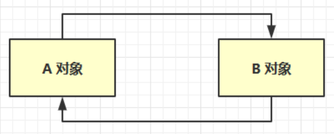


### 可达性分析算法

Java 虚拟机中的垃圾回收器采用可达性分析来探索所有存活的对象扫描堆中的对象，看是否能够沿着 GC Root对象 为起点的引用链找到该对象，找不到，表示可以回收。

> 首先确定根对象(肯定不能当成垃圾的被回收对象)，然后扫描堆，判断每个对象是否直接或间接被根对象引用，如果没有则回收。

可以作为GC Root的对象：

* 虚拟机栈（栈帧中的本地变量表）中引用的对象
* 方法区中类静态属性引用的对象
* 方法区中常量引用的对象

* 本地方法栈中JNI（即一般说的Native方法）引用的对象
* 所有被同步锁（synchronized关键字）持有的对象


## 四中引用


### 强引用

* 只有所有 GC Roots 对象都不通过【强引用】引用该对象，该对象才能被垃圾回收

> 如上图的A1对象，可以沿着根对象(GC Root)找到的对象都是强引用对象，当C对象和B对象都不直接或间接引用A1对象时，才能被垃圾回收。


### 软引用（SoftReference）

* 仅有软引用引用该对象时，在垃圾回收后，**内存仍不足**时会再次出发垃圾回收，回收软引用对象
* 可以配合引用队列来释放软引用自身

> 如上图A2，C对象通过软引用，引用了A2对象，如果B对象没有强引用A2对象，**在垃圾回收后，内存还是不够**，A2对象会被回收


软引用基本使用(堆内存设置为：`-Xmx20m` ，查看GC详情：`-XX:+PrintGCDetails -verbose:gc` )：

```java
List<SoftReference<byte[]>> list = new ArrayList<>();
for (int i = 0; i < 5; i++) {
    // 存
    SoftReference<byte[]> ref = new SoftReference<>(new byte[4 * 1024 * 1024]);
    list.add(ref);
}
for (SoftReference<byte[]> ref : list) {
    // 取，如果发生内存不足，这里取到的可能是null，因为被回收了
    System.out.println(ref.get());
}
```


软引用+引用队列基本使用(堆内存设置为：`-Xmx20m` )：

```java
List<SoftReference<byte[]>> list = new ArrayList<>();
// 引用队列
ReferenceQueue<byte[]> queue = new ReferenceQueue<>();
for (int i = 0; i < 5; i++) {
    // 关联了引用队列，当软引用所关联的byte[]被回收时，软引用自己会加入到 queue 中去
    SoftReference<byte[]> ref = new SoftReference<>(new byte[4 * 1024 * 1024], queue);
    System.out.println(ref.get());
    list.add(ref);
}

// 从队列中获取第一个无用的 软引用对象，并移除
// 因为队列先进先出，第一个出去后，第二个就是第一个
Reference<? extends byte[]> poll = queue.poll();
while (poll != null) {
    list.remove(poll);
    poll = queue.poll();
}

System.out.println("===========================");
for (SoftReference<byte[]> reference : list) {
    System.out.println(reference.get());
}
```


### 弱引用（WeakReference）

* 仅有弱引用引用该对象时，在垃圾回收时，无论内存是否充足，都会回收弱引用对象
* 可以配合引用队列来释放弱引用自身

> 如上图A3，C对象通过弱引用，引用了A3对象，如果B对象没有强引用A3对象，**在垃圾回收时**，A3对象会被回收


弱引用基本使用(堆内存设置为：`-Xmx20m` )：

弱引用与强引用类似，把 `SoftReference` 换成了 `WeakReference`  。

```java
//  list --> WeakReference --> byte[]
List<WeakReference<byte[]>> list = new ArrayList<>();
for (int i = 0; i < 10; i++) {
    WeakReference<byte[]> ref = new WeakReference<>(new byte[4 * 1024 * 1024]);
    list.add(ref);
    for (WeakReference<byte[]> w : list) {
        System.out.print(w.get() + " ");
    }
    System.out.println();
}
System.out.println("循环结束：" + list.size());
```


### 虚引用（PhantomReference）

必须配合引用队列使用，主要配合 `ByteBuffffer` 使用，被引用对象回收时，会将虚引用入队，由 `Reference Handler` 线程调用虚引用相关方法释放**直接内存**

> 如上图，B对象不再引用 `ByteBuffer` 对象，`ByteBuffer` 就会被回收。但是直接内存中的内存还未被回收。这时需要将虚引用对象 `Cleaner` 放入引用队列中，然后调用它的 `clean` 方法来释放直接内存。


### 终结器引用（FinalReference）

无需手动编码，但其内部配合引用队列使用，在垃圾回收时，终结器引用入队（被引用对象暂时没有被回收），再由 `Finalizer` 线程通过终结器引用找到被引用对象并调用它的 `finalize` 方法，第二次 GC 时才能回收被引用对象

> 如上图，B对象不再引用A4对象。这时终结器对象就会被放入引用队列中，引用队列会根据它，找到它所引用的对象。然后调用被引用对象的finalize方法。调用以后，该对象就可以被垃圾回收了。因为执行finalize方法的线程优先级很低，所以效率很低，不容易被释放内存。


## 垃圾回收算法

### 标记清除

Mark Sweep，在虚拟机执行垃圾回收的过程中，先采用标记算法确定可回收对象，然后垃圾收集器根据标识清除相应的内容，给堆内存腾出相应的空间

> 这里的清除并不是将内存空间字节清零，而是记录这段内存的起始地址，下次分配内存的时候，会直接覆盖这段内存。

* 速度较快
* 会造成内存碎片，由于内存不连续，一旦分配较大内存的对象，会造成内存溢出问题

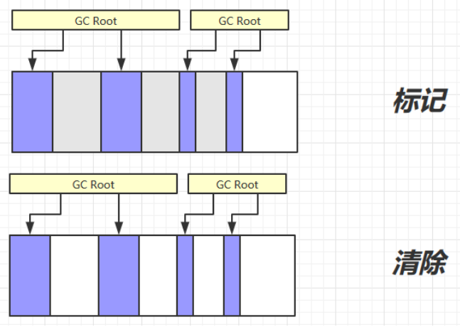


### 标记整理

Mark Compact，在虚拟机执行垃圾回收的过程中，先采用标记算法确定可回收对象，然后整理剩余的对象，将可用的对象移动到一起，使内存更加紧凑，连续的空间就更多。

* 速度慢
* 没有内存碎片


### 复制

Copy，将内存分为等大小的两个区域，FROM 和 TO。GC Root 引用的对象会被复制到 TO 中，再回收 FROM 中的对象，然后交换 FROM 和 TO 的内存地址，从而 TO 为空，供下次回收使用。

* 不会有内存碎片
* 需要占用双倍内存空间


## 分代垃圾回收


1. 对象首先分配在伊甸园区域
2. **新生代(伊甸园)空间不足时，触发 Minor GC (小型垃圾回收)**

>    1. 第一次回收：因为 FROM 中是空的，会将 伊甸园 中强引用的对象存放到 TO 中(垃圾回收复制算法)，并将 TO 中的对象“寿命”加1(说明存活了一次)，将 伊甸园 中的垃圾清空，最后交换 FROM 和 TO 的引用
>    2. 第二次回收：这一次是将 伊甸园 和 FROM 中的强引用的对象存入 TO 中，并将寿命加1，再清除 伊甸园 和 FROM 中的垃圾对象，最后交换 FROM 和 TO 的引用
>    3. 第N次回收：与第二次类似....

3. Minor GC 会引发 Stop The World，暂停其它用户的线程，等垃圾回收结束，用户线程才恢复运行
4. 当对象寿命超过阈值时(可能不用超过阈值)，会晋升至老年代，最大寿命是15（4bit，最大值就是 1111，10进制是15）
5. 当老年代空间不足，会先尝试触发 Minor GC，如果之后空间仍不足，触发 FULL GC，STW的时间更长


### 相关VM参数

| 含义               | 参数                                                         |
| ------------------ | ------------------------------------------------------------ |
| 堆初始大小         | \-Xms                                                        |
| 堆最大大小         | \-Xmx 或 -XX:MaxHeapSize=size                                |
| 新生代大小         | \-Xmn 或 (-XX:NewSize=size + -XX:MaxNewSize=size )           |
| 幸存区比例（动态） | \-XX:InitialSurvivorRatio=ratio 和 -XX:+UseAdaptiveSizePolicy |
| 幸存区比例         | \-XX:SurvivorRatio=ratio                                     |
| 晋升阈值           | \-XX:MaxTenuringThreshold=threshold                          |
| 晋升详情           | \-XX:+PrintTenuringDistribution                              |
| GC详情             | \-XX:+PrintGCDetails -verbose:gc                             |
| FullGC 前 MinorGC  | \-XX:+ScavengeBeforeFullGC                                   |


设置JVM参数：

`-Xms20M -Xmx20M -Xmn10M -XX:+UseSerialGC -XX:+PrintGCDetails -verbose:gc` 

```java
public static void main(String[] args) {
}
```


Minor GC：

垃圾回收不是 Full GC 开头的话就是 Minor GC，不会清理老年代中的对象

```java
public static void main(String[] args) {
    ArrayList<byte[]> list = new ArrayList<>();
    list.add(new byte[7 * 1024 * 1024]);    // 7MB
    list.add(new byte[512 * 1024]);         // 512KB
    list.add(new byte[512 * 1024]);         // 512KB
}
```

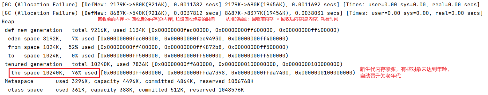


大对象直接晋升老年代：

当新生代空间不足，老年代空间足够，会将大对象直接晋升为老年代，不用触发垃圾回收

```java
public static void main(String[] args) {
    ArrayList<byte[]> list = new ArrayList<>();
    list.add(new byte[8 * 1024 * 1024]);    // 8MB
}
```

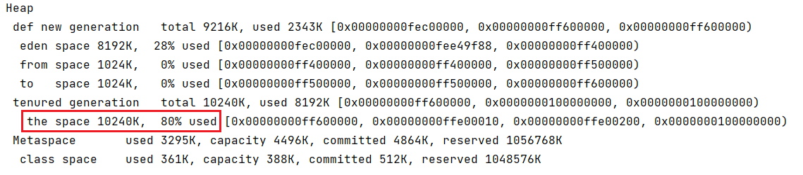


Full GC：

Full GC 回收之后发现内存还是不足，就会报错

```java
public static void main(String[] args) {
    ArrayList<byte[]> list = new ArrayList<>();
    list.add(new byte[8 * 1024 * 1024]);    // 8MB
    list.add(new byte[8 * 1024 * 1024]);    // 8MB
}
```

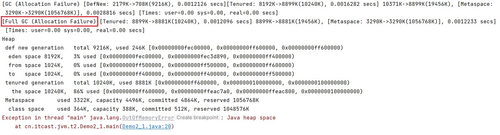


多线程不会导致主线程崩溃：

堆是共享的，当一个线程因为堆空间不足挂掉时，会立即释放堆空间内存，给其他线程使用

```java
public static void main(String[] args) throws InterruptedException {
    new Thread(() -> {
        ArrayList<byte[]> list = new ArrayList<>();
        list.add(new byte[8 * 1024 * 1024]);    // 8MB
        list.add(new byte[8 * 1024 * 1024]);    // 8MB
    }).start();
    System.out.println("sleep....");
    Thread.sleep(1000L);
}
```

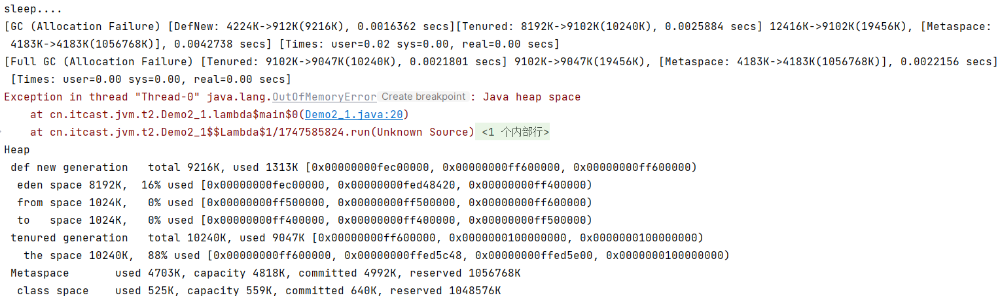


## 垃圾回收器

相关概念：

* **并行收集**：指多条垃圾收集线程并行工作，但此时用户线程仍处于等待状态
* **并发收集**：指用户线程与垃圾收集线程同时工作（不一定是并行的可能会交替执行）。用户程序在继续运行，而垃圾收集程序运行在另一个CPU上
* **吞吐量**：即CPU用于运行用户代码的时间与CPU总消耗时间的比值（吞吐量 = 运行用户代码时间 / ( 运行用户代码时间 + 垃圾收集时间 )），例如：虚拟机共运行100分钟，垃圾收集器花掉1分钟，那么吞吐量就是99%


### 串行单线程

堆内存较小，适合个人电脑

> 开启串行垃圾回收器：`-XX:+UseSerialGC = Serial + SerialOld`  ，新生代(Serial) ，老年代(SerialOld)

> 新生代是复制算法，老年代是标记整理，两个分别执行，新生代内存不足时触发新生代的垃圾清理，老年代则触发老年代的。

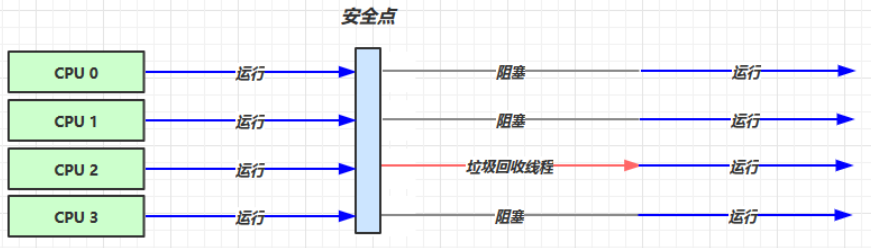

* **安全点**：让其他线程都在这个点停下来，以免垃圾回收时移动对象地址，使得其他线程找不到被移动的对象。
* **阻塞**：因为是串行的，只有一个垃圾回收线程。且在该线程执行回收工作时，其他线程进入**阻塞**状态。


### 吞吐量优先

多线程，堆内存较大，多核 cpu，**【少餐多食】让单位时间内 STW 的时间最短**， 0.2 0.2 = 0.4，垃圾回收时间占比最低，这样就称吞吐量高。

* `-XX:+UseParallelGC` \~ `-XX:+UseParallelOldGC`  ：开启吞吐量优先垃圾回收，JDK1.8及之后自动开启，开启其中一个，另一个也会被自动开启
* `-XX:+UseAdaptiveSizePolicy`  ：新生代采用自适应大小的策略，动态调整 伊甸园 和 幸存区 的大小
* `-XX:GCTimeRatio=ratio`  ：调整垃圾回收和总时间的占比(默认是99，一般设置19，1 / (1 + ratio)，如果ratio是99，虚拟机共运行100分钟，垃圾收集器花掉1分钟，那么吞吐量就是99%)
* `-XX:MaxGCPauseMillis=ms`  ：每次垃圾回收最大暂停毫秒数(默认200毫秒)，和上面的冲突
* `-XX:ParallelGCThreads=n`  ：控制 `ParallelGC`  运行垃圾回收的线程数，默认为 CPU 的核心数

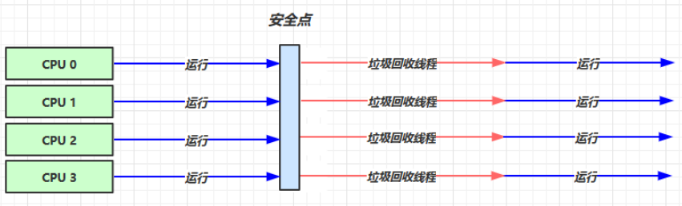


### 响应时间优先

多线程，堆内存较大，多核 cpu，**【少食多餐】尽可能让单次 STW 的时间最短**， 0.1 0.1 0.1 0.1 0.1 = 0.5

* `-XX:+UseConcMarkSweepGC` \~ `-XX:+UseParNewGC` \~ `SerialOld`  ：
* `-XX:ParallelGCThreads=n` \~ `-XX:ConcGCThreads=threads`  ：
* `-XX:CMSInitiatingOccupancyFraction=percent`  ：控制CMS垃圾清理的时机，比如设置80，在老年代内存占用到80%的时候，就触发垃圾回收(预留空间给浮动垃圾)
* `-XX:+CMSScavengeBeforeRemark`  ：

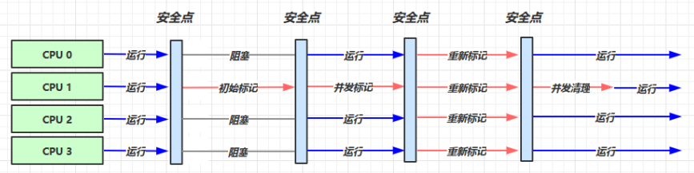

* 初始标记：标记 GC Roots 能直接到的对象。速度很快，存在Stop The World
* 并发标记：进行 GC Roots Tracing 的过程，找出存活对象且用户线程可并发执行
* 重新标记：为了修正并发标记期间因用户程序继续运行而导致标记产生变动的那一部分对象的标记记录。存在Stop The World
* 并发清理：对标记的对象进行清除回收


## G1

Garbage First，JDK 9以后默认使用，而且替代了CMS 收集器

* 2004 论文发布
* 2009 JDK 6u14 体验
* 2012 JDK 7u4 官方支持
* 2017 JDK 9 默认


适用场景：

* 同时注重吞吐量（Throughput）和低延迟（Low latency），默认的暂停目标是 200 ms
* 超大堆内存，会将堆划分为多个大小相等的 Region
* 整体上是 标记+整理 算法，两个区域之间是 复制 算法


相关 JVM 参数：

* `-XX:+UseG1GC`  ：启动G1，JDK8默认是CMS
* `-XX:G1HeapRegionSize=size`  
* `-XX:MaxGCPauseMillis=time`  


### 垃圾回收阶段


新生代伊甸园垃圾回收 –> 内存不足，新生代回收+并发标记 –> 混合收集，回收新生代伊甸园、幸存区、老年代内存 –> 新生代伊甸园垃圾回收（重新开始）


#### Young Collection

存在**Stop The World**

**分区算法region**：分代是按对象的生命周期划分，分区则是将堆空间划分连续几个不同小区间，每一个小区间独立回收，可以控制一次回收多少个小区间，方便控制 GC 产生的停顿时间

E：伊甸园，S：幸存区，O：老年代


#### Young Collection + CM

* CM：并发标记
* 在 Young GC 时会**对 GC Root 进行初始标记**
* 在老年代**占用堆内存的比例**达到阈值时，对进行并发标记（不会STW），阈值可以根据用户来进行设定

`-XX:InitiatingHeapOccupancyPercent=percent` ：默认45%

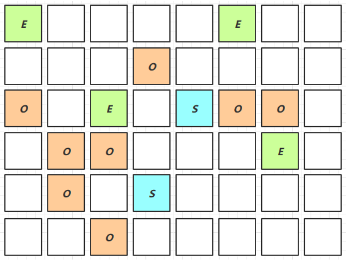


#### Mixed Collection

会对 E、S、O 进行全面垃圾回收

* 最终标记（Remark）会 STW
* 拷贝存活（Evacuation）会 STW

`-XX:MaxGCPauseMillis=ms` ：用于指定最长的停顿时间

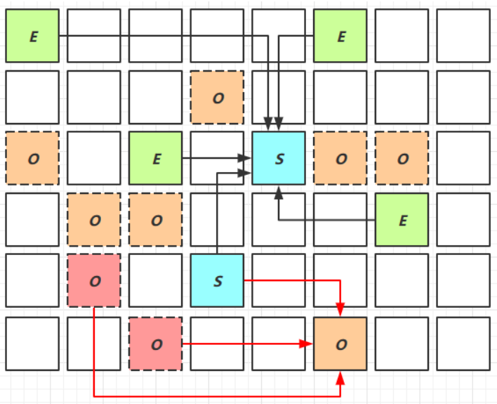

> 为什么有的老年代被拷贝了，有的没拷贝？因为指定了最大停顿时间，如果对所有老年代都进行回收，耗时可能过高。为了保证时间不超过设定的停顿时间，会**回收最有价值的老年代**（回收后，能够得到更多内存）


### Full GC

#### SerialGC

* 新生代内存不足发生的垃圾收集 - minor gc
* 老年代内存不足发生的垃圾收集 - full gc


#### ParallelGC

* 新生代内存不足发生的垃圾收集 - minor gc
* 老年代内存不足发生的垃圾收集 - full gc


#### CMS

* 新生代内存不足发生的垃圾收集 - minor gc
* 老年代内存不足
* (并发收集失败的时候会触发Full GC)


#### G1

* 新生代内存不足发生的垃圾收集 - minor gc
* 老年代内存不足
* (垃圾产生太快，并行标记和复制速度跟不上垃圾产生的速度，退化成串行收集，就会触发Full GC)


### Young Collection 跨代引用

新生代回收的跨代引用（老年代引用新生代）问题

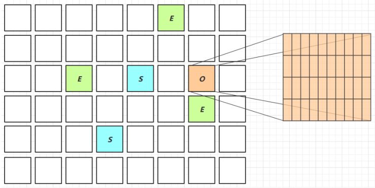

老年代被划为一个个卡表(一个卡表大约为512K)，如果该区域引用了新生代对象，则该区域被称为脏卡。遍历对象是否被强引用时，就可以只关注脏卡的卡表，减少搜索范围，提高效率。


* 卡表与Remembered Set：Remembered Set 存在于E（新生代）中，用于保存新生代对象对应的脏卡
* 在引用变更时通过post-write barried + dirty card queue (异步+队列完成脏卡的更新操作)
* concurrent refinement threads 更新 Remembered Set


### Remark

重新标记阶段，pre-write barrier + satb\_mark\_queue

* 黑色：已被处理，需要保留的
* 灰色：正在处理中的
* 白色：还未处理的


1. 在并发标记过程中，有可能A被处理了以后未引用C，但该处理过程还未结束，在处理过程结束之前A引用了C，这时就会用到remark
2. 之前C未被引用，这时A引用了C，就会给C加一个写屏障，写屏障的指令会被执行，将C放入一个队列当中，并将C变为 处理中 状态
3. 在并发标记阶段结束以后，重新标记阶段会STW，然后将放在该队列中的对象重新处理，发现有强引用引用它，就会处理它

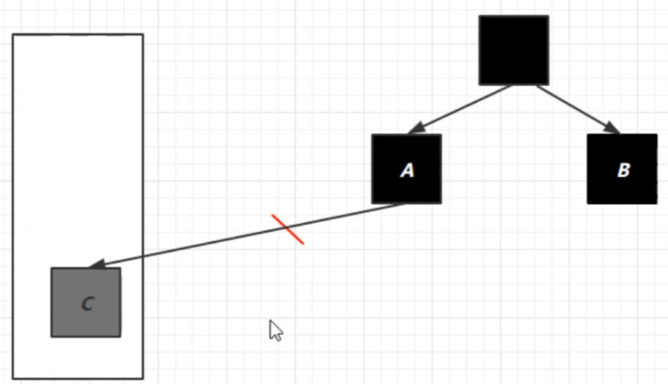


### JDK 8u20 字符串去重

* 优点：节省大量内存
* 缺点：略微多占用了 cpu 时间，新生代回收时间略微增加

`-XX:+UseStringDeduplication`  ：默认打开

```java
String s1 = new String("hello"); // char[]{'h','e','l','l','o'}
String s2 = new String("hello"); // char[]{'h','e','l','l','o'}
```

* 将所有新分配的字符串放入一个队列
* 当新生代回收时，G1并发检查是否有字符串重复
* 如果它们值一样，让它们引用同一个 char\[\]
  * 与 String.intern() 不一样，String.intern() 关注的是字符串对象
  * 而字符串去重关注的是 char\[\]
  * 在 JVM 内部，使用了不同的字符串表


### JDK 8u40 并发标记类卸载

所有对象都经过并发标记后，就能知道哪些类不再被使用，当一个类加载器的所有类都不再使用，则卸载它所加载的所有类

`-XX:+ClassUnloadingWithConcurrentMark` ：默认启用


### JDK 8u60 回收巨型对象

一个对象大于 region 的一半时，称之为巨型对象

* G1 不会对巨型对象进行拷贝，回收时被优先考虑
* G1 会跟踪老年代所有 incoming 引用，这样老年代 incoming 引用为0 的巨型对象就可以在新生代垃圾回收时处理掉


### JDK 9 并发标记起始时间的调整

并发标记必须在堆空间占满前完成，否则退化为 FullGC

* JDK 9 之前需要使用 `-XX:InitiatingHeapOccupancyPercent`
* JDK 9 可以动态调整： `-XX:InitiatingHeapOccupancyPercent` 用来设置初始值，进行数据采样并动态调整，总会添加一个安全的空档空间


### JDK 9 更高效的回收

* 250+增强
* 180+bug修复

[https://docs.oracle.com/en/java/javase/12/gctuning](https://docs.oracle.com/en/java/javase/12/gctuning)


## 垃圾回收调优

* 掌握 GC 相关的 VM 参数，会基本的空间调整
* 掌握相关工具
* 明白一点：调优跟应用、环境有关，没有放之四海而皆准的法则


### 调优领域

* 内存
* 锁竞争
* cpu 占用
* io


### 确定目标

* 【低延迟】还是【高吞吐量】，选择合适的回收器
* CMS，G1，ZGC (低延迟)
* ParallelGC (高吞吐量)
* Zing


### 最快的 GC

答案是不发生 GC

查看 FullGC 前后的内存占用，考虑下面几个问题：

* 数据是不是太多？(比如一次从数据库查出很多数据)
* 数据表示是否太臃肿？
  * 对象图 (比如数据查询只查用到的数据)
  * 对象大小 (Object对象最小16字节，Integer对象大约24字节，int只有4字节)
* 是否存在内存泄漏？ (比如一个static Map只存数据不删除数据，可以使用软引用、弱引用、第三方缓存)


### 新生代调优

新生代的特点：

* 所有的 new 操作的内存分配非常廉价 (每个线程都有个TLAB thread-local allocation buffffer区域，创建对象时，如果这里有内存，会现在这块区域存放对象)

* 死亡对象的回收代价是零
* 大部分对象用过即死
* Minor GC 的时间远远低于 Full GC


越大越好吗？

`-Xmn`

Sets the initial and maximum size (in bytes) of the heap for the young generation (nursery). GC is performed in this region more often than in other regions. If the size for the young generation is too small, then a lot of minor garbage collections are performed. If the size is too large, then only full garbage collections are performed, which can take a long time to complete. Oracle recommends that you keep the size for the young generation greater than 25% and less than 50% of the overall heap size.

* 新生代能容纳所有【并发量 \* (请求-响应)】的数据
* 幸存区大到能保留【当前活跃对象+需要晋升对象】
* 晋升阈值配置得当，让长时间存活对象尽快晋升
  * `-XX:MaxTenuringThreshold=threshold`
  * `-XX:+PrintTenuringDistribution`

```java
Desired survivor size 48286924 bytes, new threshold 10 (max 10)
- age 1: 28992024 bytes, 28992024 total
- age 2: 1366864 bytes, 30358888 total
- age 3: 1425912 bytes, 31784800 total
...
```


### 老年代调优

以 CMS 为例

* CMS 的老年代内存越大越好
* 先尝试不做调优，如果没有 Full GC 那么已经...，否则先尝试调优新生代
* 观察发生 Full GC 时老年代内存占用，将老年代内存预设调大 1/4 \~ 1/3
  * `-XX:CMSInitiatingOccupancyFraction=percent`