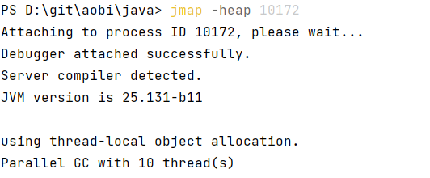
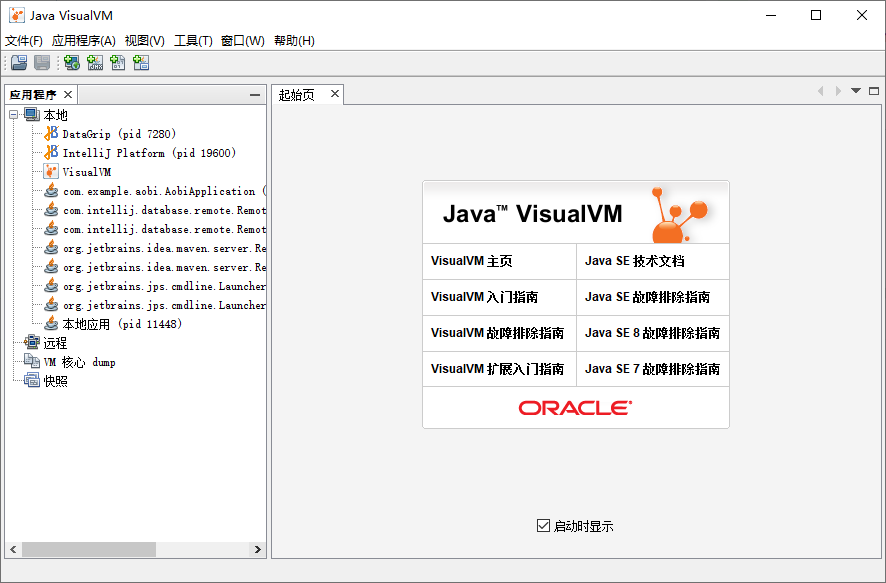

Heap (堆)，通过**new关键字创建的对象**都会使用堆内存

* 它是**线程共享**的，堆中对象都需要考虑线程安全的问题
* 有垃圾回收机制


## 堆内存溢出

`java.lang.OutofMemoryError ：java heap space` ：堆内存溢出

设置堆空间大小： `-Xmx2m`

```java
/**
 * 演示堆内存溢出 java.lang.OutOfMemoryError: Java heap space
 * -Xmx8m ，最大堆空间的jvm虚拟机参数，默认是4g
 */
public class main1 {
    public static void main(String[] args) {
        int i = 0;
        try {
            ArrayList<String> list = new ArrayList<>();// new 一个list 存入堆中
            String a = "hello";
            while (true) {
                list.add(a);// 不断地向list 中添加 a
                a = a + a;
                i++;
            }
        } catch (Throwable e) {// list 使用结束，被jc 垃圾回收
            e.printStackTrace();
            System.out.println(i);
        }
    }
}
```


## 堆内存诊断

### jps 工具

查看当前系统中有哪些 java 进程


### jmap 工具

查看堆内存占用情况 `jmap - heap 进程id`




### jconsole 工具

图形界面的，多功能的监测工具，可以连续监测


### jvisualvm 工具

可视化的展示虚拟机的内容



