研究一下两组字节码指令，一个是构造方法的字节码指令：

2a b7 00 01 b1

* 2a：aload_0 加载 slot 0 的局部变量，即 this，做为下面的 invokespecial 构造方法调用的参数
* b7：invokespecial 预备调用构造方法，哪个方法呢？
  * 00 01：引用常量池中 #1 项，即【 `Method java/lang/Object."":()V` 】
* b1：表示返回


主方法的字节码指令

b2 00 02 12 03 b6 00 04 b1

* b2：getstatic 用来加载静态变量，哪个静态变量呢？(System.out)
  * 00 02：引用常量池中 #2 项，即【Field java/lang/System.out:Ljava/io/PrintStream;】
* 12：ldc 加载参数，哪个参数呢？（字符串常量 HelloWorld）
  * 03：引用常量池中 #3 项，即 【String hello world】
* b6：invokevirtual 预备调用成员方法，哪个方法呢？
  * 00 04：引用常量池中 #4 项，即【Method java/io/PrintStream.println:(Ljava/lang/String;)V】
* b1：表示返回


## javap 工具

自己分析类文件结构太麻烦了，Oracle 提供了 javap 工具来反编译 class 文件

`javap -v [class文件]`  ：-v 打印出类的信息

```java
Classfile /C:/Users/long/Desktop/HelloWorld.class
  Last modified 2023-5-23; size 426 bytes
  MD5 checksum 4efac412ef483c8a3fe7489c87d15c8c
  Compiled from "HelloWorld.java"
public class HelloWorld
  minor version: 0
  major version: 52                       // 52是JDK8
  flags: ACC_PUBLIC, ACC_SUPER
Constant pool:
   #1 = Methodref          #6.#15         // java/lang/Object."<init>":()V
   #2 = Fieldref           #16.#17        // java/lang/System.out:Ljava/io/PrintStream;
   #3 = String             #18            // hello world!
   #4 = Methodref          #19.#20        // java/io/PrintStream.println:(Ljava/lang/String;)V
   #5 = Class              #21            // HelloWorld
   #6 = Class              #22            // java/lang/Object
   #7 = Utf8               <init>
   #8 = Utf8               ()V
   #9 = Utf8               Code
  #10 = Utf8               LineNumberTable
  #11 = Utf8               main
  #12 = Utf8               ([Ljava/lang/String;)V
  #13 = Utf8               SourceFile
  #14 = Utf8               HelloWorld.java
  #15 = NameAndType        #7:#8          // "<init>":()V
  #16 = Class              #23            // java/lang/System
  #17 = NameAndType        #24:#25        // out:Ljava/io/PrintStream;
  #18 = Utf8               hello world!
  #19 = Class              #26            // java/io/PrintStream
  #20 = NameAndType        #27:#28        // println:(Ljava/lang/String;)V
  #21 = Utf8               HelloWorld
  #22 = Utf8               java/lang/Object
  #23 = Utf8               java/lang/System
  #24 = Utf8               out
  #25 = Utf8               Ljava/io/PrintStream;
  #26 = Utf8               java/io/PrintStream
  #27 = Utf8               println
  #28 = Utf8               (Ljava/lang/String;)V
{
  public HelloWorld();
    descriptor: ()V
    flags: ACC_PUBLIC
    Code:
      stack=1, locals=1, args_size=1
         0: aload_0
         1: invokespecial #1                  // Method java/lang/Object."<init>":()V
         4: return
      LineNumberTable:
        line 1: 0

  public static void main(java.lang.String[]);
    descriptor: ([Ljava/lang/String;)V
    flags: ACC_PUBLIC, ACC_STATIC
    Code:
      stack=2, locals=1, args_size=1
         0: getstatic     #2                  // Field java/lang/System.out:Ljava/io/PrintStream;
         3: ldc           #3                  // String hello world!
         5: invokevirtual #4                  // Method java/io/PrintStream.println:(Ljava/lang/String;)V
         8: return
      LineNumberTable:
        line 3: 0
        line 4: 8
}
SourceFile: "HelloWorld.java"
```


## 图解方法执行流程

### 原始Java代码

```java
package cn.itcast.jvm.t3.bytecode;
/**
* 演示 字节码指令 和 操作数栈、常量池的关系
*/
public class Demo3_1 {
    public static void main(String[] args) {
        int a = 10;
        int b = Short.MAX_VALUE + 1;
        int c = a + b;
        System.out.println(c);
    }
}
```


### 编译后的字节码

```java
Classfile /C:/Users/zq300/Desktop/Demo3_1.class
  Last modified 2023-5-23; size 458 bytes
  MD5 checksum c348d73829d4e1d222149a658eb88331
  Compiled from "Demo3_1.java"
public class cn.itcast.jvm.t3.bytecode.Demo3_1
  minor version: 0
  major version: 52
  flags: ACC_PUBLIC, ACC_SUPER
Constant pool:
   #1 = Methodref          #7.#16         // java/lang/Object."<init>":()V
   #2 = Class              #17            // java/lang/Short
   #3 = Integer            32768
   #4 = Fieldref           #18.#19        // java/lang/System.out:Ljava/io/PrintStream;
   #5 = Methodref          #20.#21        // java/io/PrintStream.println:(I)V
   #6 = Class              #22            // cn/itcast/jvm/t3/bytecode/Demo3_1
   #7 = Class              #23            // java/lang/Object
   #8 = Utf8               <init>
   #9 = Utf8               ()V
  #10 = Utf8               Code
  #11 = Utf8               LineNumberTable
  #12 = Utf8               main
  #13 = Utf8               ([Ljava/lang/String;)V
  #14 = Utf8               SourceFile
  #15 = Utf8               Demo3_1.java
  #16 = NameAndType        #8:#9          // "<init>":()V
  #17 = Utf8               java/lang/Short
  #18 = Class              #24            // java/lang/System
  #19 = NameAndType        #25:#26        // out:Ljava/io/PrintStream;
  #20 = Class              #27            // java/io/PrintStream
  #21 = NameAndType        #28:#29        // println:(I)V
  #22 = Utf8               cn/itcast/jvm/t3/bytecode/Demo3_1
  #23 = Utf8               java/lang/Object
  #24 = Utf8               java/lang/System
  #25 = Utf8               out
  #26 = Utf8               Ljava/io/PrintStream;
  #27 = Utf8               java/io/PrintStream
  #28 = Utf8               println
  #29 = Utf8               (I)V
{
  public cn.itcast.jvm.t3.bytecode.Demo3_1();
    descriptor: ()V
    flags: ACC_PUBLIC
    Code:
      stack=1, locals=1, args_size=1
         0: aload_0
         1: invokespecial #1                  // Method java/lang/Object."<init>":()V
         4: return
      LineNumberTable:
        line 6: 0

  public static void main(java.lang.String[]);
    descriptor: ([Ljava/lang/String;)V
    flags: ACC_PUBLIC, ACC_STATIC
    Code:
      stack=2, locals=4, args_size=1
         0: bipush        10
         2: istore_1
         3: ldc           #3                  // int 32768
         5: istore_2
         6: iload_1
         7: iload_2
         8: iadd
         9: istore_3
        10: getstatic     #4                  // Field java/lang/System.out:Ljava/io/PrintStream;
        13: iload_3
        14: invokevirtual #5                  // Method java/io/PrintStream.println:(I)V
        17: return
      LineNumberTable:
        line 8: 0
        line 9: 3
        line 10: 6
        line 11: 10
        line 12: 17
}
SourceFile: "Demo3_1.java"
```


### 常量池载入运行时常量池


### 方法字节码载入方法区


### main线程开始运行，分配栈帧内存

（stack=2，locals=4）


### 执行引擎开始执行字节码

#### bipush 10

* 将一个 byte 压入操作数栈（其长度会补齐 4 个字节）

> 类似的指令还有：
>
> * sipush 将一个 short 压入操作数栈（其长度会补齐 4 个字节）
> * ldc 将一个 int 压入操作数栈
> * ldc2\_w 将一个 long 压入操作数栈（分两次压入，因为 long 是 8 个字节）
> * 这里小的数字都是和字节码指令存在一起，超过 short 范围的数字存入了常量池


#### istore_1

将操作数栈顶数据弹出，存入局部变量表的 slot 1

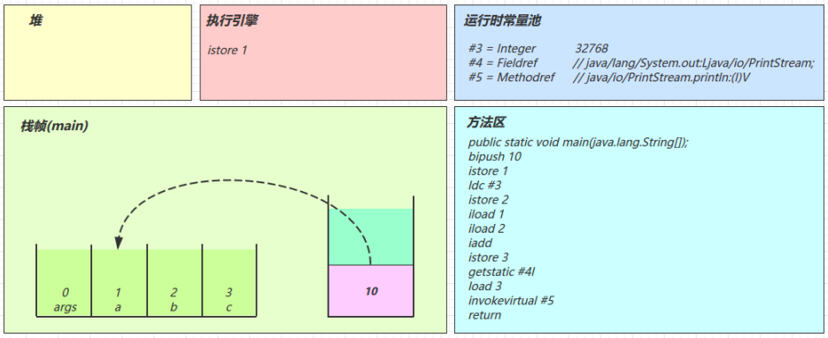

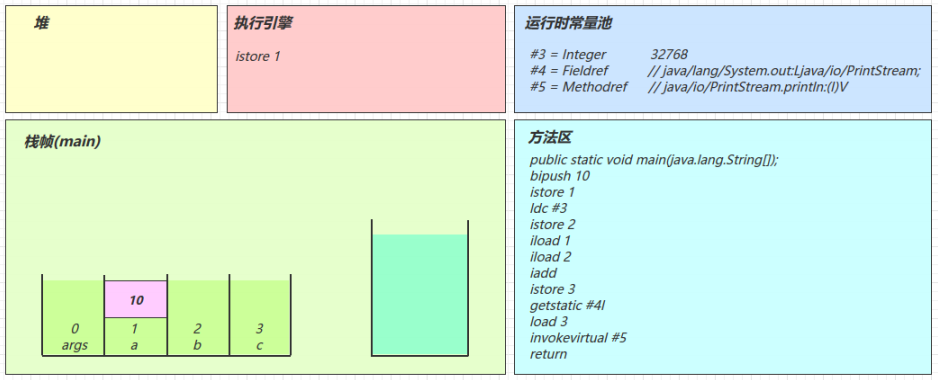


#### ldc #3

从常量池加载 #3 数据到操作数栈

> Short.MAX\_VALUE 是 32767，所以 32768 = Short.MAX\_VALUE + 1 实际是在编译期间计算好的

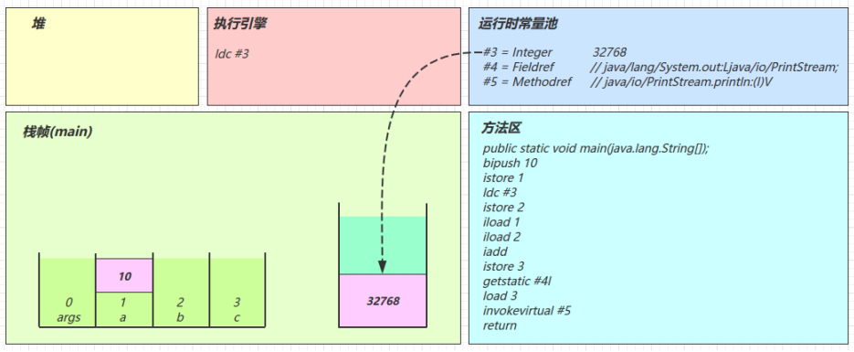


#### istore_2

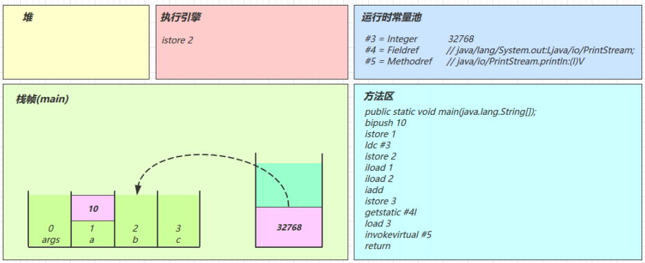


#### iload_1


#### iload_2


#### iadd


#### istore_3


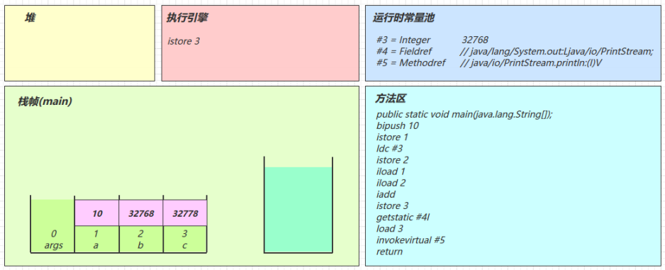


#### getstatic #4

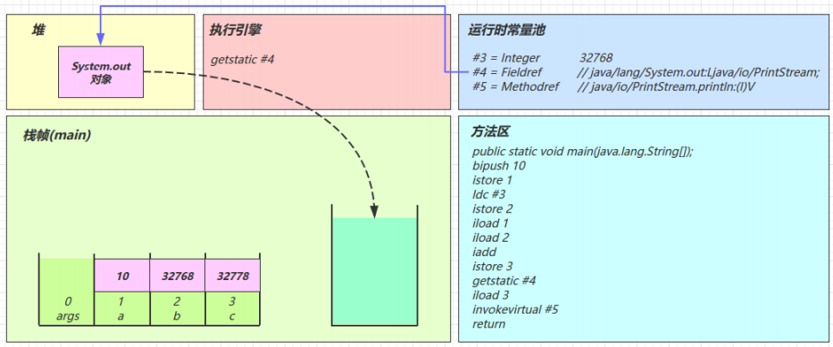

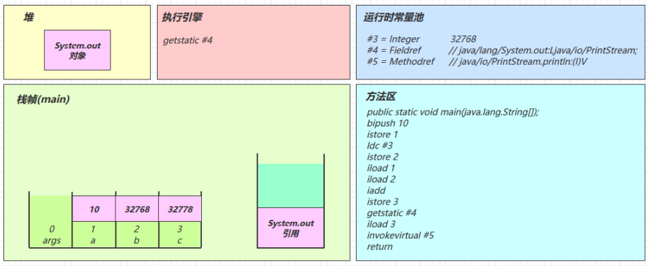


#### iload_3


#### invokevirtual #5

* 找到常量池 #5 项
* 定位到方法区 `java/io/PrintStream.println:(I)V`  方法
* 生成新的栈帧（分配 locals、stack等）
* 传递参数，执行新栈帧中的字节码


* 执行完毕，弹出栈帧
* 清除 main 操作数栈内容

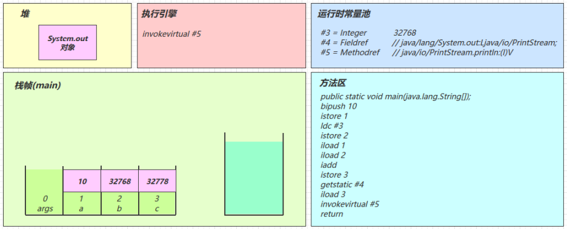


#### return

* 完成 main 方法调用，弹出 main 栈帧
* 程序结束


> 注意 iinc 指令是直接在局部变量 slot 上进行运算

> a++ 和 ++a 的区别是先执行 iload 还是 先执行 iinc


## 条件判断指令

| 指令 | 助记符     | 含义             |
| ---- | ---------- | ---------------- |
| 0x99 | ifeq       | 判断是否 `==` 0    |
| 0x9a | ifne       | 判断是否 `!=` 0    |
| 0x9b | iflt       | 判断是否 `<` 0     |
| 0x9c | ifge       | 判断是否 `>=` 0    |
| 0x9d | ifgt       | 判断是否 `>` 0     |
| 0x9e | ifle       | 判断是否 `<=` 0    |
| 0x9f | if\_icmpeq | 两个int是否 `==`   |
| 0xa0 | if\_icmpne | 两个int是否 `!=`   |
| 0xa1 | if\_icmplt | 两个int是否 `<`    |
| 0xa2 | if\_icmpge | 两个int是否 `>=`   |
| 0xa3 | if\_icmpgt | 两个int是否 `>`    |
| 0xa4 | if\_icmple | 两个int是否 `<=`   |
| 0xa5 | if\_acmpeq | 两个引用是否 `==`  |
| 0xa6 | if\_acmpne | 两个引用是否 `!=`  |
| 0xc6 | ifnull     | 判断是否 `==` null |
| 0xc7 | ifnonnull  | 判断是否 `!=` null |

> byte，short，char 都会按 int 比较，因为操作数栈都是 4 字节

> goto 用来进行跳转到指定行号的字节码


源码：

```java
public class Demo3_3 {
    public static void main(String[] args) {
        int a = 0;
        if(a == 0) {
            a = 10;
        } else {
            a = 20;
        }
    }
}
```


字节码：

```java
0: iconst_0            // -1~5之间的数，用iconst表示，放入操作数栈
1: istore_1            // 存入a变量
2: iload_1             // 将a变量从局部变量表中加载进来，放入操作数栈
3: ifne         12     // 判断操作数栈中的数是不是不等于0，如果不等于0，跳到第12行
6: bipush       10     // 没有跳到第12行的话，给操作数栈存入10
8: istore_1            // 将操作数栈中的10赋值给a
9: goto         15     // 跳转到第15行
12: bipush      20     // 给操作数栈存入20
14: istore_1           // 将操作数栈中的20赋值给a
15: return             // 没有后续代码了，返回
```


## 循环控制指令

其实循环控制还是前面介绍的那些指令，例如 while 循环：

```java
public class Demo3_4 {
    public static void main(String[] args) {
        int a = 0;
        while (a < 10) {
            a++;
        }
    }
}
```


字节码：

```java
0: iconst_0            // 操作数栈存入0
1: istore_1            // 把0赋值a
2: iload_1             // 把a的值加载到操作数栈
3: bipush     10       // 把10放到操作数栈中
5: if_icmpge  14       // 将0和10比较，if_icmpge，0 >= 10 ？ 如果条件成立，跳到第14行
8: iinc       1, 1     // 不成立则自增1
11: goto      2        // 跳转到第二行，开始新的一轮比较
14: return             // 返回
```


练习：

Java源码：

```java
public class Demo3_6_1 {
	public static void main(String[] args) {
		int i = 0;
		int x = 0;
		while (i < 10) {
			x = x++;
			i++;
		}
		System.out.println(x); // 结果是 0
	}
}
```

字节码：

```java
 0: iconst_0
 1: istore_1
 2: iconst_0
 3: istore_2
 4: iload_1
 5: bipush        10
 7: if_icmpge     21
10: iload_2
11: iinc          2, 1
14: istore_2
15: iinc          1, 1
18: goto          4
21: getstatic     #2                  // Field java/lang/System.out:Ljava/io/PrintStream;
24: iload_2
25: invokevirtual #3                  // Method java/io/PrintStream.println:(I)V
28: return
```

1. 先将x的值放入操作数栈中
2. ++操作是在局部变量表中执行的，所以 x = 1
3. 再将操作数栈中的值赋给x

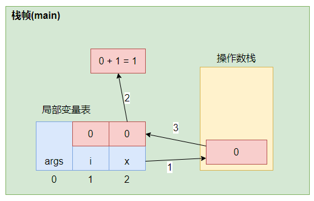


## 构造方法

### `<cinit>()V`

```java
public class Demo3_8_1 {
    static int i = 10;
    static {
        i = 20;
    }
    static {
        i = 30;
    }
}
```

编译器会按从上至下的顺序，收集所有 static 静态代码块和静态成员赋值的代码，合并为一个特殊的方法 `<cinit>()V`：

```java
 0: bipush 10
 2: putstatic     #2 // Field i:I
 5: bipush 20
 7: putstatic     #2 // Field i:I
10: bipush 30
12: putstatic     #2 // Field i:I
15: return
```

`<cinit>()V` 方法会在类加载的初始化阶段被调用。


### `<init>()V`

```java
public class Demo3_8_2 {
    private String a = "s1";
    {
        b = 20;
    }
    private int b = 10;
    {
        a = "s2";
    }

    public Demo3_8_2(String a, int b) {
        this.a = a;
        this.b = b;
    }
    public static void main(String[] args) {
        Demo3_8_2 d = new Demo3_8_2("s3", 30);
        System.out.println(d.a);
        System.out.println(d.b);
    }
}
```

编译器会按从上至下的顺序，收集所有 {} 代码块和成员变量赋值的代码，形成新的构造方法，但原始构造方法内的代码总是在最后。

```java
 0: aload_0
 1: invokespecial     #1     // super.<init>()V
 4: aload_0
 5: ldc               #2     // <- "s1"
 7: putfield          #3     // -> this.a
10: aload_0
11: bipush            20     // <- 20
13: putfield          #4     // -> this.b
16: aload_0
17: bipush            10     // <- 10
19: putfi             #4     // -> this.b
22: aload_0
23: ldc               #5     // <- "s2"
25: putfield          #3     // -> this.a
28: aload_0                  // ------------------------------
29: aload_1                  // <- slot 1(a) "s3"            |
30: putfield          #3     // -> this.a                    |
33: aload_0                  //                              |
34: iload_2                  // <- slot 2(b) 30              |
35: putfield #4              // -> this.b --------------------
38: return
```


## 方法调用

Java源码：

```java
public class Demo3_9 {

    public Demo3_9() { }
    private void test1() { }
    private final void test2() { }
    public void test3() { }
    public static void test4() { }

    public static void main(String[] args) {
        Demo3_9 d = new Demo3_9();
        d.test1();
        d.test2();
        d.test3();
        d.test4();
        Demo3_9.test4();
    }
}
```


字节码：

```java
 0: new               #2     // class cn/itcast/jvm/t3/bytecode/Demo3_9
 3: dup
 4: invokespecial     #3     // Method "<init>":()V
 7: astore_1
 8: aload_1
 9: invokespecial     #4     // Method test1:()V
12: aload_1
13: invokespecial     #5     // Method test2:()V     (私有方法是静态绑定，效率比动态绑定高)
16: aload_1
17: invokevirtual     #6     // Method test3:()V     (公有方法可能会被重写，需要动态绑定)
20: aload_1
21: pop
22: invokestatic      #7     // Method test4:()V
25: invokestatic      #7     // Method test4:()V
28: return
```

* new 是创建【对象】，给对象分配堆内存，执行成功会将【对象引用】压入操作数栈
* dup 是赋值操作数栈栈顶的内容(把new出来对象的**引用**复制一份)，一个配合 invokespecial 调用该对象的构造方法 "`<init>`":()V （会消耗掉栈顶一个引用），另一个配合 astore\_1 赋值给局部变量
* 最终方法（final），私有方法（private），构造方法都是由 invokespecial 指令来调用，属于静态绑定
* 普通成员方法是由 invokevirtual 调用，属于动态绑定，即支持多态
* 成员方法与静态方法调用的另一个区别是，执行方法前是否需要【对象引用】
* 比较有意思的是 d.test4(); 是通过【对象引用】调用一个静态方法，可以看到在调用
  invokestatic 之前执行了 pop 指令，把【对象引用】从操作数栈弹掉了
* 还有一个执行 invokespecial 的情况是通过 super 调用父类方法


## 多态的原理

Java源码：

```java
package cn.itcast.jvm.t3.bytecode;
import java.io.IOException;
/**
* 演示多态原理，注意加上下面的 JVM 参数，禁用指针压缩
* -XX:-UseCompressedOops -XX:-UseCompressedClassPointers
*/
public class Demo3_10 {
    public static void test(Animal animal) {
        animal.eat();
        System.out.println(animal.toString());
    }

    public static void main(String[] args) throws IOException {
        test(new Cat());
        test(new Dog());
        System.in.read();
    }
}

abstract class Animal {

    public abstract void eat();

    @Override
    public String toString() {
        return "我是" + this.getClass().getSimpleName();
    }
}

class Dog extends Animal {
    @Override
    public void eat() {
        System.out.println("啃骨头");
    }
}

class Cat extends Animal {
    @Override
    public void eat() {
        System.out.println("吃鱼");
    }
}
```

1. 运行代码：停在 System.in.read() 方法上，这时运行 jps 获取进程 id
2. 运行 HSDB 工具：进入 JDK 安装目录，执行 `java -cp ./lib/sa-jdi.jar sun.jvm.hotspot.HSDB`  ，进入图形界面 attach 进程 id
3. 查找某个对象：打开 Tools -> Find Object By Query，输入 `select d from cn.itcast.jvm.t3.bytecode.Dog d` 点击 Execute 执行

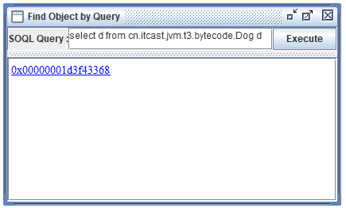

4. 查看对象内存结构：点击超链接可以看到对象的内存结构，此对象没有任何属性，因此只有对象头的 16 字节，前 8 字节是 MarkWord，后 8 字节就是对象的 Class 指针，但目前看不到它的实际地址

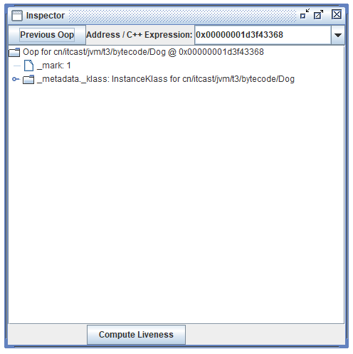

5. 查看对象 Class 的内存地址：可以通过 Windows -> Console 进入命令行模式，执行

```bash
mem 0x00000001d3f43368 2
```

mem 有两个参数，参数 1 是对象地址，参数 2 是查看 2 行（即 16 字节）

结果中第二行 0x00000000262d4508 即为 Class 的内存地址

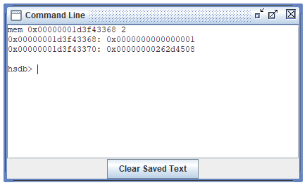

6. 查看类的 vtable
   * 方法1：Alt+R 进入 Inspector 工具，输入刚才的 Class 内存地址，看到如下界面

   * 方法2：或者 Tools -> Class Browser 输入 Dog 查找，可以得到相同的结果


无论通过哪种方法，都可以找到 Dog Class 的 vtable 长度为 6，意思就是 Dog 类有 6 个虚方法（多态相关的，final，static 不会列入）

那么这 6 个方法都是谁呢？从 Class 的起始地址开始算，偏移 0x1b8 就是 vtable 的起始地址，进行计算得到（内存地址尾数相加）：

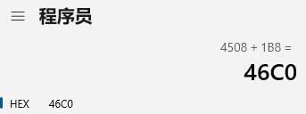

通过 Windows -> Console 进入命令行模式，执行：

```bash
mem 0x00000000262d46C0 6
```

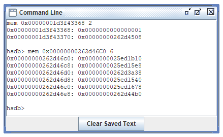

就得到了 6 个虚方法的入口地址


7. 验证方法地址：通过 Tools -> Class Browser 查看每个类的方法定义，比较可知


对号入座，发现

* eat() 方法是 Dog 类自己的
* toString() 方法是继承 Animal 类的
* finalize() ，equals()，hashCode()，clone() 都是继承 Object 类的


**当执行 invokevirtual 指令时，**

1. 先通过栈帧中的对象引用找到对象
2. 分析对象头，找到对象的实际 Class
3. Class 结构中有 vtable，它在类加载的链接阶段就已经根据方法的重写规则生成好了
4. 查表得到方法的具体地址
5. 执行方法的字节码


## 异常处理

### try-catch

Java源码：

```java
public class Demo3_11_1 {
    public static void main(String[] args) {
        int i = 0;
        try {
            i = 10;
        } catch (Exception e) {
            i = 20;
        }
    }
}
```


字节码：

```java
public static void main(java.lang.String[]);
    descriptor: ([Ljava/lang/String;)V
    flags: ACC_PUBLIC, ACC_STATIC
    Code:
        stack=1, locals=3, args_size=1
            0: iconst_0
            1: istore_1
            2: bipush     10
            4: istore_1
            5: goto       12
            8: astore_2
            9: bipush     20
            11: istore_1
            12: return
        Exception table:
              from   to    target   type
                2     5      8     Class     java/lang/Exception
        LineNumberTable: ...
        LocalVariableTable:
            Start   Length  Slot  Name       Signature
                9     3      2     e         Ljava/lang/Exception;
                0     13     0     args      [Ljava/lang/String;
                2     11     1     i         I
        StackMapTable: ...
    MethodParameters: ...
}
```

* 可以看到多出来一个 Exception table 的结构，\[from, to) 是前闭后开的检测范围，一旦这个范围内的字节码执行出现异常，则通过 type 匹配异常类型，如果一致，进入 target 所指示行号
* 8 行的字节码指令 astore\_2 是将异常对象引用存入局部变量表的 slot 2 位置


### 多个 single-catch 块的情况

Java源码：

```java
public class Demo3_11_2 {
    public static void main(String[] args) {
        int i = 0;
        try {
            i = 10;
        } catch (ArithmeticException e) {
            i = 30;
        } catch (NullPointerException e) {
            i = 40;
        } catch (Exception e) {
            i = 50;
        }
    }
}
```


字节码：

```java
public static void main(java.lang.String[]);
    descriptor: ([Ljava/lang/String;)V
    flags: ACC_PUBLIC, ACC_STATIC
    Code:
        stack=1, locals=3, args_size=1
            0: iconst_0
            1: istore_1
            2: bipush     10
            4: istore_1
            5: goto       26
            8: astore_2
            9: bipush 30
            11: istore_1
            12: goto      26
            15: astore_2
            16: bipush    40
            18: istore_1
            19: goto      26
            22: astore_2
            23: bipush    50
            25: istore_1
            26: return
        Exception table:
              from   to   target type
                2     5     8     Class     java/lang/ArithmeticException
                2     5     15    Class     java/lang/NullPointerException
                2     5     22    Class     java/lang/Exception
        LineNumberTable: ...
        LocalVariableTable:
            Start   Length Slot Name     Signature
                9     3     2     e     Ljava/lang/ArithmeticException;
                16    3     2     e     Ljava/lang/NullPointerException;
                23    3     2     e     Ljava/lang/Exception;
                0     27    0     args  [Ljava/lang/String;
                2     25    1     i     I
        StackMapTable: ...
    MethodParameters: ...
```

因为异常出现时，只能进入 Exception table 中一个分支，所以局部变量表 slot 2 位置被共用


### multi-catch 的情况

Java源码：

```java
public class Demo3_11_3 {
    public static void main(String[] args) {
        try {
            Method test = Demo3_11_3.class.getMethod("test");
            test.invoke(null);
        } catch (NoSuchMethodException | IllegalAccessException |
                InvocationTargetException e) {
            e.printStackTrace();
        }
    }

    public static void test() {
        System.out.println("ok");
    }
}
```


字节码：

```java
public static void main(java.lang.String[]);
    descriptor: ([Ljava/lang/String;)V
    flags: ACC_PUBLIC, ACC_STATIC
    Code:
        stack=3, locals=2, args_size=1
            0: ldc               #2
            2: ldc               #3
            4: iconst_0
            5: anewarray         #4
            8: invokevirtual     #5
            11: astore_1
            12: aload_1
            13: aconst_null
            14: iconst_0
            15: anewarray         #6
            18: invokevirtual     #7
            21: pop
            22: goto 30
            25: astore_1
            26: aload_1
            27: invokevirtual     #11 // e.printStackTrace:()V
            30: return
        Exception table:
            from     to     target     type
            0        22     25         Class java/lang/NoSuchMethodException
            0        22     25         Class java/lang/IllegalAccessException
            0        22     25         Class java/lang/reflect/InvocationTargetException
        LineNumberTable: ...
        LocalVariableTable:
            Start     Length     Slot     Name     Signature
            12        10         1        test     Ljava/lang/reflect/Method;
            26        4          1        e        Ljava/lang/ReflectiveOperationException;
            0         31         0        args     [Ljava/lang/String;
        StackMapTable: ...
    MethodParameters: ...
```


### finally

Java源码：

```java
public class Demo3_11_4 {
    public static void main(String[] args) {
        int i = 0;
        try {
            i = 10;
        } catch (Exception e) {
            i = 20;
        } finally {
            i = 30;
        }
    }
}
```


字节码：

```java
public static void main(java.lang.String[]);
    descriptor: ([Ljava/lang/String;)V
    flags: ACC_PUBLIC, ACC_STATIC
    Code:
        stack=1, locals=4, args_size=1
            0: iconst_0
            1: istore_1             // 0 -> i
            2: bipush       10      // try ------------------------
            4: istore_1             // 10 -> i                    |
            5: bipush       30      // finally                    |
            7: istore_1             // 30 -> i                    |
            8: goto 27              // return ---------------------
            11: astore_2            // catch Exceptin -> e ---------
            12: bipush      20      //                             |
            14: istore_1            // 20 -> i                     |
            15: bipush      30      // finally                     |
            17: istore_1            // 30 -> i                     |
            18: goto        27      // return ----------------------
            21: astore_3            // catch any -> slot 3 ---------
            22: bipush      30       // finally                    |
            24: istore_1            // 30 -> i                     |
            25: aload_3             // <- slot 3                   |
            26: athrow              // throw -----------------------
            27: return
        Exception table:
            from     to     target     type
            2        5      11         Class java/lang/Exception
            2        5      21         any     // 剩余的异常类型，比如 Error
            11       15     21         any     // 剩余的异常类型，比如 Error
        LineNumberTable: ...
        LocalVariableTable:
            Start     Length     Slot      Name     Signature
            12        3          2         e        Ljava/lang/Exception;
            0         28         0         args     [Ljava/lang/String;
            2         26         1         i I
        StackMapTable: ...
    MethodParameters: ...
```

可以看到 finally 中的代码被复制了 3 份，分别放入 try 流程，catch 流程以及 catch 剩余的异常类型流程


#### finally 出现了 return

Java源码：

```java
public class Demo3_12_2 {
    public static void main(String[] args) {
        int result = test();
        System.out.println(result);
    }
    public static int test() {
        try {
            return 10;
        } finally {
            return 20;
        }
    }
}
```


字节码：

```java
public static int test();
    descriptor: ()I
    flags: ACC_PUBLIC, ACC_STATIC
    Code:
        stack=1, locals=2, args_size=0
        0: bipush     10     // <- 10 放入栈顶
        2: istore_0          // 10 -> slot 0 (从栈顶移除了)
        3: bipush     20     // <- 20 放入栈顶
        5: ireturn           // 返回栈顶 int(20)
        6: astore_1          // catch any -> slot 1
        7: bipush     20     // <- 20 放入栈顶
        9: ireturn           // 返回栈顶 int(20)
    Exception table:
        from     to     target     type
        0        3      6          any
    LineNumberTable: ...
    StackMapTable: ...
```

* 由于 finally 中的 ireturn 被插入了所有可能的流程，因此返回结果肯定以 finally 的为准
* 至于字节码中第 2 行，似乎没啥用，看下面一节
* 跟上例中的 finally 相比，发现没有 athrow 了，如果在 finally 中出现了 return，会吞掉异常

下面这段代码不会报错：

```java
public class Demo3_12_1 {
    public static void main(String[] args) {
        int result = test();
        System.out.println(result);
    }
    public static int test() {
        try {
            int i = 1/0;
            return 10;
        } finally {
            return 20;
        }
    }
}
```


#### finally 对返回值影响

Java源码：

```java
public class Demo3_12_2 {
    public static void main(String[] args) {
        int result = test();
        System.out.println(result);
    }
    public static int test() {
        int i = 10;
        try {
            return i;
        } finally {
            i = 20;
        }
    }
}
```


字节码：

```java
public static int test();
    descriptor: ()I
    flags: ACC_PUBLIC, ACC_STATIC
    Code:
        stack=1, locals=3, args_size=0
        0: bipush     10     // <- 10 放入栈顶
        2: istore_0          // 10 -> i
        3: iload_0           // <- i(10)
        4: istore_1          // 10 -> slot 1，暂存至 slot 1，目的是为了固定返回值
        5: bipush     20     // <- 20 放入栈顶
        7: istore_0          // 20 -> i
        8: iload_1           // <- slot 1(10) 载入 slot 1 暂存的值
        9: ireturn           // 返回栈顶的 int(10)
        10: astore_2
        11: bipush     20
        13: istore_0
        14: aload_2
        15: athrow
    Exception table:
        from     to     target     type
        3        5      10         any
    LineNumberTable: ...
    LocalVariableTable:
        Start     Length     Slot     Name     Signature
        3         13         0        i        I
    StackMapTable: ...
```


## synchronized

Java代码：

```java
public class Demo3_13 {
    public static void main(String[] args) {
        Object lock = new Object();
        synchronized (lock) {
            System.out.println("ok");
        }
    }
}
```


字节码：

```java
public static void main(java.lang.String[]);
    descriptor: ([Ljava/lang/String;)V
    flags: ACC_PUBLIC, ACC_STATIC
    Code:
        stack=2, locals=4, args_size=1
        0: new               #2     // new Object
        3: dup
        4: invokespecial     #1     // invokespecial <init>:()V
        7: astore_1                 // lock引用 -> lock
        8: aload_1                  // <- lock （synchronized开始）
        9: dup
        10: astore_2                // lock引用 -> slot 2
        11: monitorenter            // monitorenter(lock引用)
        12: getstatic        #3     // <- System.out
        15: ldc              #4     // <- "ok"
        17: invokevirtual    #5     // invokevirtual println:(Ljava/lang/String;)V
        20: aload_2                 // <- slot 2(lock引用)
        21: monitorexit             // monitorexit(lock引用)
        22: goto             30
        25: astore_3                // any -> slot 3
        26: aload_2                 // <- slot 2(lock引用)
        27: monitorexit             // monitorexit(lock引用)
        28: aload_3
        29: athrow
        30: return
    Exception table:
        from     to     target     type
        12       22     25         any
        25       28     25         any
    LineNumberTable: ...
    LocalVariableTable:
        Start     Length     Slot     Name     Signature
        0         31         0        args     [Ljava/lang/String;
        8         23         1        lock     Ljava/lang/Object;
    StackMapTable: ...
    MethodParameters: ...
```

方法级别的 synchronized 不会在字节码指令中有所体现
