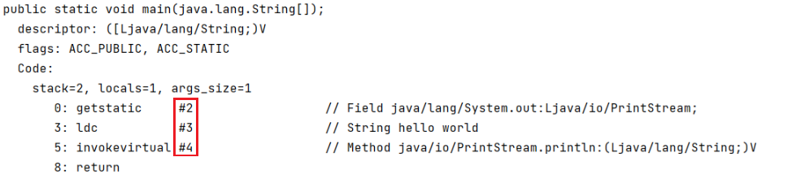
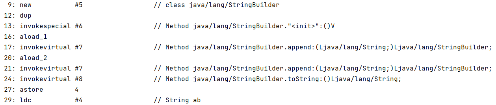

方法区(Method Area) 是各个**线程共享**的内存区域，它用于存储已被虚拟机加载的类信息(比如class文件)、常量、静态变量、即时编译器编译后的代码等数据。（什么是类信息：**类版本号、方法、接口**。）

官方对于方法区的定义：[https://docs.oracle.com/javase/specs/jvms/se8/html/jvms-2.html](https://docs.oracle.com/javase/specs/jvms/se8/html/jvms-2.html)


* 1.6是永久代实现，使用的堆内存
* 1.8是元空间实现，使用的本地内存


## 方法区内存溢出

* 1.8以前会导致永久代内存溢出 `java.lang.OutOfMemoryError: PermGen space`
  * \-XX:MaxPermSize=8m
* 1.8以后会导致元空间内存溢出 `java.lang.OutOfMemoryError: Metaspace`
  * \-XX:MaxMetaspaceSize=8m


```java
/**
 * 演示元空间内存溢出 java.lang.OutOfMemoryError: Metaspace
 * -XX:MaxMetaspaceSize=8m
 */
public class Demo1_8 extends ClassLoader { // 可以用来加载类的二进制字节码
    public static void main(String[] args) {
        int j = 0;
        try {
            Demo1_8 test = new Demo1_8();
            for (int i = 0; i < 10000; i++, j++) {
                // ClassWriter 作用是生成类的二进制字节码
                ClassWriter cw = new ClassWriter(0);
                // 版本号， public， 类名, 包名, 父类， 接口
                cw.visit(Opcodes.V1_8, Opcodes.ACC_PUBLIC, "Class" + i, null, "java/lang/Object", null);
                // 返回 byte[]
                byte[] code = cw.toByteArray();
                // 执行了类的加载
                test.defineClass("Class" + i, code, 0, code.length); // Class 对象
            }
        } finally {
            System.out.println(j);
        }
    }
}
```


## 运行时常量池

**常量池**：就是一张表，虚拟机指令根据这张常量表找到要执行的类名、方法名、参数类型、字面量等信息

**运行时常量池**：常量池是 \*.class 文件中的，**当该类被加载，它的常量池信息就会放入运行时常量池，并把里面的符号地址变为真实地址**


通过使用 javap 命令反编译 class 文件后，可以得到类的一些信息：

常量池：


HelloWorld 方法：




> 系统会在HelloWorld方法反编译后得到的指令，去常量池中查找，比如第0条指令，后面是 `#2` ，则会在常量池中寻找，而常量池中的 `#2` 后面还有 `#6.#20`  也会依次寻找 `#6`  和 `#20` 。


## StringTable

* 常量池中的字符串仅是符号，第一次用到时才变为对象
* 利用串池的机制，来避免重复创建字符串对象
* 字符串变量拼接的原理是 StringBuilder（1.8）
* 字符串常量拼接的原理是编译期优化
* 可以使用 intern 方法，主动将串池中还没有的字符串对象放入串池
  * 1.8 将这个字符串对象尝试放入串池，如果有则并不会放入，如果没有则放入串池， 会把串池中的对象返回
  * 1.6 将这个字符串对象尝试放入串池，如果有则并不会放入，如果没有会把此对象复制一份，放入串池，会把串池中的对象返回


### 常量池与串池的关系

常量池中的信息，都会被加载到运行时常量池中，这时的 a b ab 都还是常量池中的符号(没有成为java对象)，只有在被用到的时候(类似懒加载机制)，并且**串池(hashtable结构 不可扩容)** 中不存在，才会被存入串池中。

```java
String s1 = "a"; 
String s2 = "b";
String s3 = "ab";
```


所以当这三行代码都执行了之后，**串池(StringTable)** 中的数据应该为：`["a", "b", "ab"]`


### 字符串变量拼接(1.8)

字符串变量之间的拼接，底层使用的StringBuilder类

```java
String s4 = s1 + s2;   // new StringBuilder().append("a").append("b").toString()  new String("ab")
System.out.println(s3 == s4);   // false
```



StringBuilder类的toString方法底层使用的是 `new String(xxx)` ，所以产生的对象是在堆中，而s3对象在串池中，所以 s3 和 s4 不相等。


### 编译期优化

```java
String s5 = "a" + "b";  // javac 在编译期间的优化，结果已经在编译期确定为ab
System.out.println(s3 == s5);    // ture
```

这里也能看到 s3 和 s5 指向的都是 `#4`，因为 `"a"` + `"b"` 是确定的，编译的时候会直接变成 `"ab"` 。


### 字符串加载延迟

```java
System.out.println();  // 字符串个数 2256
System.out.print("1"); // 字符串个数 2257
System.out.print("2"); // 字符串个数 2258
System.out.print("3"); // 字符串个数 2259
System.out.print("4"); // 字符串个数 2260
System.out.print("1"); // 字符串个数 2260
System.out.print("2"); // 字符串个数 2260
System.out.print("3"); // 字符串个数 2260
System.out.print("4"); // 字符串个数 2260
```

字符串只有在被执行的时候，才会进入串池，如果串池中已经有了，就不会新添加。


### intern方法(1.8)

将字符串对象尝试放入串池，如果有则并不会放入，如果没有则放入串池，会把串池中的对象返回。

* 如果**串池中没有**这个字符串，将字符串对象放入串池，也就是说，放入的和返回的是**同一个对象**
* 如果**串池中有**这个字符串，就直接返回串池中的对象，准备放入串池的对象和返回的**不是同一个对象**

```java
String x = "ab";
String s = new String("a") + new String("b");
// 串池：ab,  a,  b
// 堆：new String("a"),  new String("b"),  new String("ab")

String s2 = s.intern();    // 因为ab已经在串池了，s对象放入串池失败，返回的s2是串池中的对象
System.out.println(s2 == x); // true
System.out.println(s == x);  // false

// 如果没有x变量，则 "ab" = s = s2
```


### intern方法(1.6)

将这个字符串对象尝试放入串池，如果有则并不会放入，如果没有会把此对象复制一份，放入串池，会把串池中的对象返回。

> 复制的对象和原对象不是同一个对象

* 如果**串池中没有**这个字符串，将字符串对象复制一份，复制的对象和原来的对象内存地址值是不一样的，放入的和返回的**不是同一个对象**
* 如果**串池中有**这个字符串，就直接返回串池中的对象，准备放入串池的对象和返回的**不是同一个对象**

```java
String s = new String("a") + new String("b");
// 串池：a,  b
// 堆：new String("a"),  new String("b"),  new String("ab")

String s2 = s.intern();   // s 拷贝一份，放入串池
String x = "ab";          // x 拿到的是串池中的对象

System.out.println(s2 == x);    // false
System.out.println(s == x);     // false

// 如果是jdk1.8，则不会拷贝， s = s2 = x
```


### StringTable位置

* JDK1.6，StringTable是属于**常量池**的一部分。
* JDK1.8，StringTable是放在**堆**中的。


### StringTable垃圾回收

StringTable在内存紧张时，会触发垃圾回收，回收那些没有被引用的字符串。


### StringTable性能调优

串池的底层用的是HashTable，数组+链表的数据结构

使用 `-XX:+PrintStringTableStatistics`  参数可以打印串池的信息：

```Plain Text
StringTable statistics:
Number of buckets       :     60013 =    480104 bytes, avg   8.000
Number of entries       :    481491 =  11555784 bytes, avg  24.000
Number of literals      :    481491 =  29750584 bytes, avg  61.788
Total footprint         :           =  41786472 bytes
Average bucket size     :     8.023
Variance of bucket size :     8.084
Std. dev. of bucket size:     2.843
Maximum bucket size     :        23
```

> 可以看到，默认的数组大小为 60013 个，串池中的字符串的数量为 481491 个。


如果系统中字符串用到的比较多的话，可以适当的将串池的数组长度调大：

```Plain Text
-XX:StringTableSize=桶个数
```

> 桶个数应在1009以上。


> **当桶的个数变多时，Hash碰撞的几率就变小，链表的长度会变短，因为HashTable中的值是不重复的，链表变短后，校验字符串是否重复的时间会变短，从而提升效率。**


可以通过**intern方法减少重复入池**，保证相同的字符串在StringTable中只存储一份：

```java
List<String> address = new ArrayList<>();
for (int i = 0; i < 10; i++) {
    try (BufferedReader reader = new BufferedReader(/* 此处读取文件... */)) {
        String line;
        while (true) {
            line = reader.readLine();
            if (line == null) {
                break;
            }
            address.add(line/*.intern()*/);
        }
    }
}
```

> 在这种情况下使用intern方法，占用内存的大小会比不使用intern方法占用内存的大小 小得多。


> 追溯到readLine底层，使用的是new String来构建字符串的，所以直接是存放在堆内存中，如果不使用intern方法，则所有的字符串对象都在堆内存中，而使用后剩余9次循环添加到集合的对象则是串池中的对象，理论上节约了十分之九的内存。


