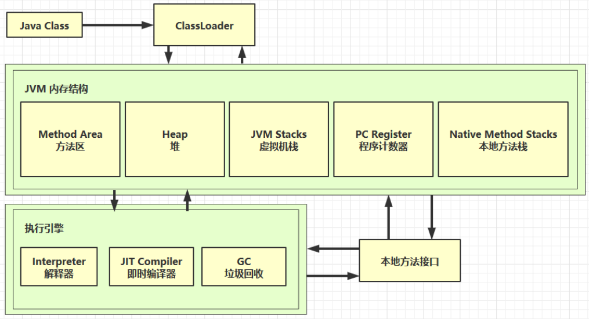
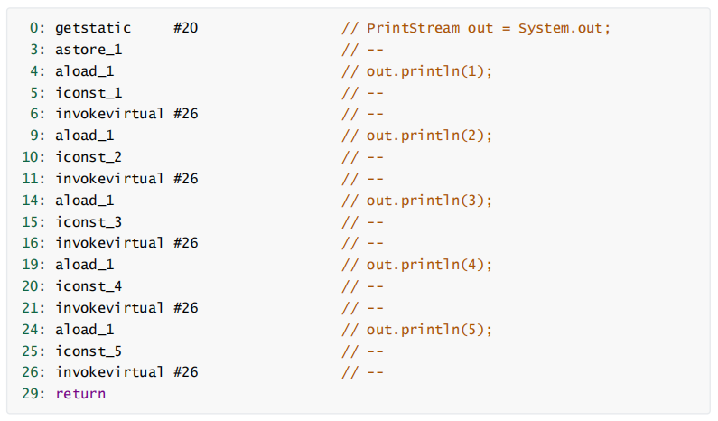
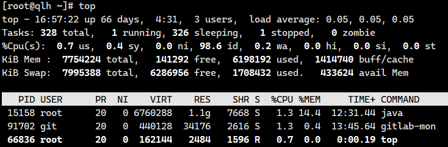
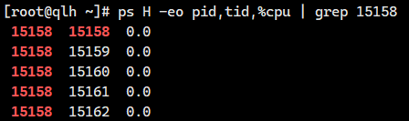
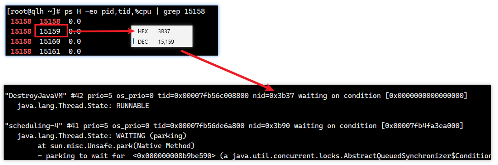

参考资料：[https://www.javainterviewpoint.com/java-virtual-machine-architecture-in-java/](https://www.javainterviewpoint.com/java-virtual-machine-architecture-in-java/)


## 程序计数器

Program Counter Register 程序计数器（是通过寄存器实现的），用于保存JVM中下一条所要执行的指令的地址。

PC 寄存器用来存储指向下一条指令的地址，即将要执行的指令代码。由执行引擎读取下一条指令。



> 左边是二进制字节码，右边是Java编译后的代码，程序计数器就是用于记住下一条jvm指令的执行地址，比如现在是“0”，那他就会记住“3”，因为“3”在“0”的下面，而JVM会将指令 交给 解释器，解释器再将转为 机器码，交于CPU执行。


特点：

* **是线程私有的**：
  * CPU会为每个线程分配时间片，当当前线程的时间片使用完以后，CPU就会去执行另一个线程中的代码
  * 程序计数器是每个线程所私有的，当另一个线程的时间片用完，又返回来执行当前线程的代码时，通过程序计数器可以知道应该执行哪一句指令
* **不会存在内存溢出**


## 虚拟机栈

Java Virtual Machine Stacks (Java 虚拟机栈)，栈：先入后出

* 每个**线程**运行需要的内存空间，称为**虚拟机栈**
* 每个栈由多个**栈帧**组成，对应着每次方法调用时所占用的内存空间(参数、局部变量、返回地址)
* 每个线程只能有一个**活动栈帧**，对应当前正在执行的那个方法


IDEA中的虚拟机栈：


### 常见问题

1. **垃圾回收是否涉及栈内存？**

> 不需要。因为虚拟机栈中是由一个个栈帧组成的，在方法执行完毕后，对应的栈帧就会被弹出栈。所以无需通过垃圾回收机制去回收内存。


2. **栈内存分配越大越好吗？**

> 不是。因为物理内存是一定的，栈内存越大，可以支持更多的递归调用，但是可执行的线程数就会越少。

> 使用 `-Xss`  可以设置栈内存大小，比如物理内存是100Mb，当栈内存为1Mb时，可以同时有100个线程，而当栈内存为2Mb时，最多同时只有50个线程了。


3. **方法内的局部变量是否线程安全？**

> 如果方法内部局部变量没有逃离方法的作用访问，它是线程安全的

> 如果是局部变量引用了对象，并逃离方法的范围，需要考虑线程安全问题

```java
public class main1 {
    public static void main(String[] args) {

    }
    //下面各个方法会不会造成线程安全问题？

    //不会
    public static void m1() {
        StringBuilder sb = new StringBuilder();
        sb.append(1);
        sb.append(2);
        sb.append(3);
        System.out.println(sb.toString());
    }

    //会，可能会有其他线程使用这个对象
    public static void m2(StringBuilder sb) {
        sb.append(1);
        sb.append(2);
        sb.append(3);
        System.out.println(sb.toString());
    }

    //会，其他线程可能会拿到这个线程的引用
    public static StringBuilder m3() {
        StringBuilder sb = new StringBuilder();
        sb.append(1);
        sb.append(2);
        sb.append(3);
        return sb;
    }
}
```


### 栈内存溢出

`Java.lang.stackOverflowError`：栈内存溢出


导致栈内存溢出的情况：


* 栈帧过多导致栈内存溢出
* 栈帧过大导致栈内存溢出


### 线程运行诊断

Linux环境下运行某些程序的时候，可能导致CPU的占用过高，使用 `top` 命令可以查看CPU的使用情况：




`ps H -eo pid,tid,%cpu | grep 进程id`  ，刚才通过top查到的进程号，用ps命令进一步定位是哪个线程引起的cpu占用过高：




`jstack 进程id` ，通过ps命令看到的tid来对比定位，注意jstack查找出的线程id是16进制的，需要转换

这样就知道那个线程占用过多的CPU了，进一步定位到问题代码的源码行数

还可以展示出死锁的信息




## 本地方法栈

Native Method Stacks

一些带有**native关键字**的方法就是需要JAVA去调用本地的C或者C++方法，因为JAVA有时候没法直接和操作系统底层交互，所以需要用到本地方法。

