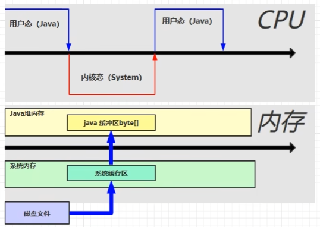
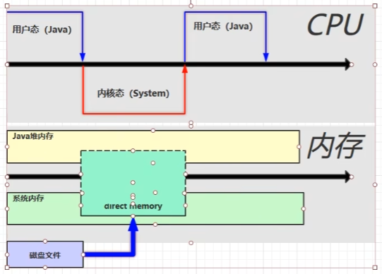

Direct Memory

* 常见于 NIO 操作时，用于数据缓冲区
* 分配回收成本较高，但读写性能高
* 不受 JVM 内存回收管理


普通的IO：

> 读入文件会先将文件放入系统的内存，再将文件放入Java的堆内存，Java才能读取，比较浪费时间、浪费性能。




NIO：

> 开辟一块系统和Java都能访问到的内存区域，无需将文件再次缓冲到Java的堆内存当中，提高效率。




直接内存也会导致内存溢出，比如运行下面的代码：

```java
static int _100Mb = 1024 * 1024 * 100;
public static void main(String[] args) {
    List<ByteBuffer> list = new ArrayList<>();
    int i = 0;
    try {
        while (true) {
            ByteBuffer byteBuffer = ByteBuffer.allocateDirect(_100Mb);
            list.add(byteBuffer);
            i++;
        }
    } finally {
        System.out.println(i);
    }
}
```


可以看到下面的结果：


## 分配和回收原理

直接内存的回收不是通过JVM的垃圾回收来释放的，而是通过 `unsafe.freeMemory()` 方法来手动释放

```java
import sun.misc.Unsafe;

Unsafe unsafe = getUnsafe();    // Java内部使用的对象，可以通过反射获取对象
// 分配内存 1Gb = 1024 * 1024 * 1024
long base = unsafe.allocateMemory(_1Gb);
unsafe.setMemory(base, 1024 * 1024 * 1024, (byte) 0);
// 释放内存
unsafe.freeMemory(base);
```


而NIO中的ByteBuffer类就是用到了该原理：

1. 在DirectByteBuffer类(ByteBuffer的子类)的构造器中，使用了 `unsafe.allocateMemory(size)`  来获取内存空间
2. ByteBuffer的实现类内部，使用了Cleaner(虚引用类型)对象来监测ByteBuffer对象是否被回收
3. 如果被回收，则会触发Cleaner对象的 `clean()` 方法
4. `clean()` 方法又会调用创建Cleaner时传入的Deallocator对象(该对象实现了Runnable接口，是一个单独的线程，用来调用 `unsafe.freeMemory(address)` 方法)

Demo：

```java
ByteBuffer byteBuffer = ByteBuffer.allocateDirect(1024 * 1024 * 1024);
System.out.println("分配完毕...");
System.out.println("开始释放...");
byteBuffer = null;
System.gc(); // 显式的垃圾回收，把byteBuffer对象回收掉，然后会自动触发Cleaner的clean()方法
System.in.read();
```


## 禁用显式回收对直接内存的影响

可以使用 `-XX:+DisableExplicitGC` 命令来显式的禁用代码中的 `System.gc()` 作用(使用该方法影响性能，不光要回收新生代，还有老年代)。

但是如果禁用掉，上面的Demo中的ByteBuffer对象则会长时间存在，程序占用的1Gb的直接内存也不会释放。

此时，建议使用Unsafe类的 `freeMemory()` 方法手动释放直接内存。

