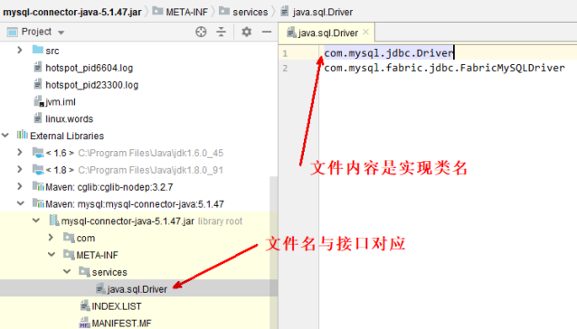
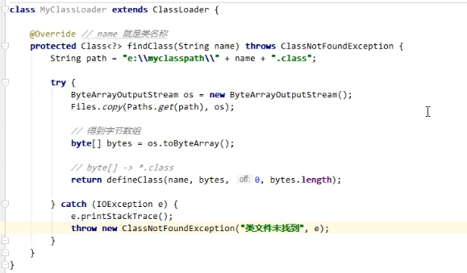
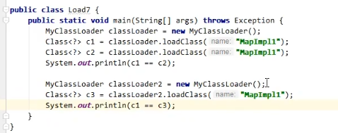

以 JDK 8 为例：

| **名称**                | **加载哪的类**         | **说明**                      |
| ----------------------- | ---------------------- | ----------------------------- |
| Bootstrap ClassLoader   | JAVA\_HOME/jre/lib     | 无法直接访问                  |
| Extension ClassLoader   | JAVA\_HOME/jre/lib/ext | 上级为 Bootstrap，显示为 null |
| Application ClassLoader | classpath              | 上级为 Extension              |
| 自定义类加载器          | 自定义                 | 上级为 Application            |


## 启动类加载器

创建一个类：

```java
package cn.itcast.jvm.t3.load;
public class F {
    static {
        System.out.println("bootstrap F init");
    }
}
```


执行：

```java
package cn.itcast.jvm.t3.load;
public class Load5_1 {
    public static void main(String[] args) throws ClassNotFoundException {
        Class<?> aClass = Class.forName("cn.itcast.jvm.t3.load.F");
        System.out.println(aClass.getClassLoader());
    }
}
```


输出：

```Plain Text
E:\git\jvm\out\production\jvm>java -Xbootclasspath/a:. cn.itcast.jvm.t3.load.Load5
bootstrap F init
null
```


设置JVM参数：

\-Xbootclasspath 表示设置 bootclasspath，其中 /a:. 表示将当前目录追加至 bootclasspath 之后

可以用这个办法替换核心类

* `java -Xbootclasspath:`
* `java -Xbootclasspath/a:<追加路径>`
* `java -Xbootclasspath/p:<追加路径>`


## 扩展类加载器

```java
package cn.itcast.jvm.t3.load;
public class G {
    static {
        System.out.println("classpath G init");
    }
}
```


执行：

```java
public class Load5_2 {
    public static void main(String[] args) throws ClassNotFoundException {
        Class<?> aClass = Class.forName("cn.itcast.jvm.t3.load.G");
        System.out.println(aClass.getClassLoader());
    }
}
```


输出：

```Plain Text
classpath G init
sun.misc.Launcher$AppClassLoader@18b4aac2
```


写一个同名的类

```java
package cn.itcast.jvm.t3.load;
public class G {
    static {
        System.out.println("ext G init");
    }
}
```

打个 jar 包

```bash
E:\git\jvm\out\production\jvm>jar -cvf my.jar cn/itcast/jvm/t3/load/G.class
已添加清单
正在添加: cn/itcast/jvm/t3/load/G.class(输入 = 481) (输出 = 322)(压缩了 33%)
```

将 jar 包拷贝到 JAVA\_HOME/jre/lib/ext

重新执行 Load5\_2

输出

```Plain Text
ext G init
sun.misc.Launcher$ExtClassLoader@29453f44
```


> 没打jar包的时候，用的是应用类加载器，打了jar包后用的是扩展类加载器，并且只加载了jar包中的类，没有加载应用中自己写的类，类加载时会先看上级有没有加载过，有的话就不会再加载了。


## 双亲委派模式

所谓的双亲委派，就是指调用类加载器的 loadClass 方法时，查找类的规则

> 这里的双亲，翻译为上级似乎更为合适，因为它们并没有继承关系

```java
protected Class<?> loadClass(String name, boolean resolve) throws ClassNotFoundException {
    synchronized (getClassLoadingLock(name)) {
        // 1. 检查该类是否已经加载
        Class<?> c = findLoadedClass(name);
        if (c == null) {
            long t0 = System.nanoTime();
            try {
                if (parent != null) {
                    // 2. 有上级的话，委派上级 loadClass
                    c = parent.loadClass(name, false);
                } else {
                    // 3. 如果没有上级了（ExtClassLoader），则委派BootstrapClassLoader
                    c = findBootstrapClassOrNull(name);
                }
            } catch (ClassNotFoundException e) {
            }

            if (c == null) {
                long t1 = System.nanoTime();
                // 4. 每一层找不到，调用 findClass 方法（每个类加载器自己扩展）来加载
                c = findClass(name);
                // 5. 记录耗时
                sun.misc.PerfCounter.getParentDelegationTime().addTime(t1 - t0);
                sun.misc.PerfCounter.getFindClassTime().addElapsedTimeFrom(t1);
                sun.misc.PerfCounter.getFindClasses().increment();
            }
        }

        if (resolve) {
            resolveClass(c);
        }
        return c;
    }
}
```


例如：

```java
public class Load5_3 {
    public static void main(String[] args) throws ClassNotFoundException {
        Class<?> aClass = Load5_3.class.getClassLoader().loadClass("cn.itcast.jvm.t3.load.H");
        System.out.println(aClass.getClassLoader());
    }
}
```

执行流程为：

1. sun.misc.Launcher\$AppClassLoader //1 处， 开始查看已加载的类，结果没有
2. sun.misc.Launcher\$AppClassLoader // 2 处，委派上级 sun.misc.Launcher\$ExtClassLoader.loadClass()
3. sun.misc.Launcher\$ExtClassLoader // 1 处，查看已加载的类，结果没有
4. sun.misc.Launcher\$ExtClassLoader // 3 处，没有上级了，则委派 BootstrapClassLoader查找
5. BootstrapClassLoader 是在 JAVA\_HOME/jre/lib 下找 H 这个类，显然没有
6. sun.misc.Launcher\$ExtClassLoader // 4 处，调用自己的 findClass 方法，是在JAVA\_HOME/jre/lib/ext 下找 H 这个类，显然没有，回到 sun.misc.Launcher\$AppClassLoader的 // 2 处
7. 继续执行到 sun.misc.Launcher\$AppClassLoader // 4 处，调用它自己的 findClass 方法，在classpath 下查找，找到了


## 线程上下文类加载器

在使用 JDBC 时，都需要加载 Driver 驱动，不知道你注意到没有，不写

```java
Class.forName("com.mysql.jdbc.Driver")
```

也是可以让 com.mysql.jdbc.Driver 正确加载的，你知道是怎么做的吗？

让我们追踪一下源码：

```java
public class DriverManager {

// 注册驱动的集合
private final static CopyOnWriteArrayList<DriverInfo> registeredDrivers = new CopyOnWriteArrayList<>();

// 初始化驱动
static {
    loadInitialDrivers();
    println("JDBC DriverManager initialized");
}
```

先不看别的，看看 DriverManager 的类加载器：

```java
System.out.println(DriverManager.class.getClassLoader());
```

打印 null，表示它的类加载器是 Bootstrap ClassLoader，会到 JAVA\_HOME/jre/lib 下搜索类，但JAVA\_HOME/jre/lib 下显然没有 mysql-connector-java-5.1.47.jar 包，这样问题来了，在DriverManager 的静态代码块中，怎么能正确加载 com.mysql.jdbc.Driver 呢？

继续看 loadInitialDrivers() 方法：

```java
private static void loadInitialDrivers() {
    String drivers;
    try {
        drivers = AccessController.doPrivileged(new PrivilegedAction<String>() {
            public String run() {
                return System.getProperty("jdbc.drivers");
            }
        });
    } catch (Exception ex) {
        drivers = null;
    }

    // 1）使用 ServiceLoader 机制加载驱动，即 SPI
    AccessController.doPrivileged(new PrivilegedAction<Void>() {
        public Void run() {
            ServiceLoader<Driver> loadedDrivers = ServiceLoader.load(Driver.class);
            Iterator<Driver> driversIterator = loadedDrivers.iterator();
            try{
                while(driversIterator.hasNext()) {
                    driversIterator.next();
                }
            } catch(Throwable t) {
                // Do nothing
            }
            return null;
        }
    });
    println("DriverManager.initialize: jdbc.drivers = " + drivers);

    // 2）使用 jdbc.drivers 定义的驱动名加载驱动
    if (drivers == null || drivers.equals("")) {
        return;
    }
    String[] driversList = drivers.split(":");
    println("number of Drivers:" + driversList.length);
    for (String aDriver : driversList) {
        try {
            println("DriverManager.Initialize: loading " + aDriver);
            // 这里的 ClassLoader.getSystemClassLoader() 就是应用程序类加载器
            Class.forName(aDriver, true, ClassLoader.getSystemClassLoader());
        } catch (Exception ex) {
            println("DriverManager.Initialize: load failed: " + ex);
        }
    }
}
```

先看 2）发现它最后是使用 Class.forName 完成类的加载和初始化，关联的是应用程序类加载器，因此可以顺利完成类加载

再看 1）它就是大名鼎鼎的 Service Provider Interface （SPI）约定如下，在 jar 包的 META-INF/services 包下，以接口全限定名名为文件，文件内容是实现类名称



这样就可以使用

```java
ServiceLoader<接口类型> allImpls = ServiceLoader.load(接口类型.class);
Iterator<接口类型> iter = allImpls.iterator();
while(iter.hasNext()) {
    iter.next();
}
```

来得到实现类，体现的是【面向接口编程+解耦】的思想，在下面一些框架中都运用了此思想：

* JDBC
* Servlet 初始化器
* Spring 容器
* Dubbo（对 SPI 进行了扩展）

接着看 ServiceLoader.load 方法：

```java
public static <S> ServiceLoader<S> load(Class<S> service) {
    // 获取线程上下文类加载器
    ClassLoader cl = Thread.currentThread().getContextClassLoader();
    return ServiceLoader.load(service, cl);
}
```

线程上下文类加载器是当前线程使用的类加载器，默认就是应用程序类加载器，它内部又是由Class.forName 调用了线程上下文类加载器完成类加载，具体代码在 ServiceLoader 的内部类LazyIterator 中：

```java
private S nextService() {
    if (!hasNextService())
        throw new NoSuchElementException();

    String cn = nextName;
    nextName = null;
    Class<?> c = null;
    try {
        c = Class.forName(cn, false, loader);
    } catch (ClassNotFoundException x) {
        fail(service,"Provider " + cn + " not found");
    }

    if (!service.isAssignableFrom(c)) {
        fail(service, "Provider " + cn + " not a subtype");
    }

    try {
        S p = service.cast(c.newInstance());
        providers.put(cn, p);
        return p;
    } catch (Throwable x) {
        fail(service, "Provider " + cn + " could not be instantiated", x);
    }
    throw new Error(); // This cannot happen
}
```


## 自定义类加载器

问问自己，什么时候需要自定义类加载器

1. 想加载非 classpath 随意路径中的类文件
2. 都是通过接口来使用实现，希望解耦时，常用在框架设计
3. 这些类希望予以隔离，不同应用的同名类都可以加载，不冲突，常见于 tomcat 容器


步骤：

1. 继承 ClassLoader 父类
2. 要遵从双亲委派机制，重写 findClass 方法，注意不是重写 loadClass 方法，否则不会走双亲委派机制
3. 读取类文件的字节码
4. 调用父类的 defineClass 方法来加载类
5. 使用者调用该类加载器的 loadClass 方法


示例：

准备好两个类文件放入 E:\\myclasspath，它实现了 java.util.Map 接口，可以先反编译看一下：






输出 ：  true  false

两个类对象相等的前提是类加载器也相等

