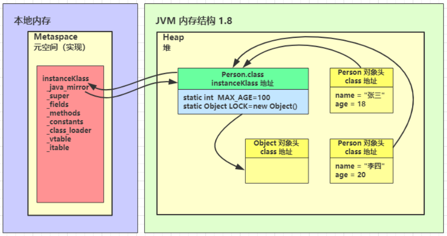
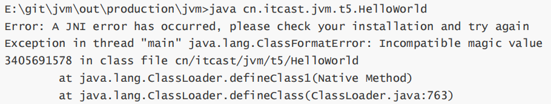

## 加载

将类的字节码载入方法区中，内部采用 C++ 的 instanceKlass 描述 java 类，它的重要 field 有：

* \_java\_mirror 即 java 的类镜像，例如对 String 来说，就是 String.class，作用是把 klass 暴露给 java 使用
* \_super 即父类
* \_fields 即成员变量
* \_methods 即方法
* \_constants 即常量池
* \_class\_loader 即类加载器
* \_vtable 虚方法表
* \_itable 接口方法表

如果这个类还有父类没有加载，先加载父类

加载和链接可能是交替运行的

> instanceKlass 这样的【元数据】是存储在方法区（1.8 后的元空间内），但 \_java\_mirror是存储在堆中，可以通过前面介绍的 HSDB 工具查看




## 链接

### 验证

验证类是否符合 JVM规范，安全性检查

用 UE 等支持二进制的编辑器修改 HelloWorld.class 的魔数，在控制台运行



### 准备

为 static 变量分配空间，设置默认值

* static 变量在 JDK 7 之前存储于 instanceKlass 末尾，从 JDK 7 开始，存储于 \_java\_mirror 末尾
* static 变量分配空间和赋值是两个步骤，分配空间在准备阶段完成，赋值在初始化阶段完成
* static 变量是 final 的基本类型，以及字符串常量，那么编译阶段值就确定了，赋值在准备阶段完成
* 如果 static 变量是 final 的，但属于引用类型，那么赋值也会在初始化阶段完成


### 解析

将常量池中的符号引用解析为直接引用

```java
public class Load2 {
    public static void main(String[] args) throws ClassNotFoundException, IOException {
        ClassLoader classloader = Load2.class.getClassLoader();
        // loadClass 方法不会导致类的解析和初始化
        Class<?> c = classloader.loadClass("cn.itcast.jvm.t3.load.C");
        // 这里就会解析 C类了，C类声明了D类的成员变量，所以也会加载D类
        // new C();
        System.in.read();
    }
}

class C {
    D d = new D();
}

class D {
}
```


## 初始化

### `<cinit>()V` 方法

初始化即调用 `<cinit>()V` ，虚拟机会保证这个类的『构造方法』的线程安全

### 发生的时机

概括得说，类初始化是【懒惰的】

* main 方法所在的类，总会被首先初始化
* 首次访问这个类的静态变量或静态方法时
* 子类初始化，如果父类还没初始化，会引发
* 子类访问父类的静态变量，只会触发父类的初始化
* Class.forName
* new 会导致初始化


不会导致类初始化的情况

* 访问类的 static final 静态常量（基本类型和字符串）不会触发初始化
* 类对象.class 不会触发初始化
* 创建该类的数组不会触发初始化
* 类加载器的 loadClass 方法
* Class.forName 的参数 2 为 false 时


```java
class A {
    static int a = 0;
    static {
        System.out.println("a init");
    }
}

class B extends A {
    final static double b = 5.0;
    static boolean c = false;
    static {
        System.out.println("b init");
    }
}
```


验证（实验时请先全部注释，每次只执行其中一个）

```java
public class Load3 {
    static {
        System.out.println("main init");
    }

    public static void main(String[] args) throws ClassNotFoundException {
        // 1. 静态常量（基本类型和字符串）不会触发初始化
        System.out.println(B.b);
        // 2. 类对象.class 不会触发初始化
        System.out.println(B.class);
        // 3. 创建该类的数组不会触发初始化
        System.out.println(new B[0]);
        // 4. 不会初始化类 B，但会加载 B、A
        ClassLoader cl = Thread.currentThread().getContextClassLoader();
        cl.loadClass("cn.itcast.jvm.t3.B");
        // 5. 不会初始化类 B，但会加载 B、A
        ClassLoader c2 = Thread.currentThread().getContextClassLoader();
        Class.forName("cn.itcast.jvm.t3.B", false, c2);

        // 1. 首次访问这个类的静态变量或静态方法时
        System.out.println(A.a);
        // 2. 子类初始化，如果父类还没初始化，会引发
        System.out.println(B.c);
        // 3. 子类访问父类静态变量，只触发父类初始化
        System.out.println(B.a);
        // 4. 会初始化类 B，并先初始化类 A
        Class.forName("cn.itcast.jvm.t3.B");
    }
}
```


### 懒惰初始化单例模式

```java
public final class Singleton {
    private Singleton() { }
    // 内部类中保存单例
    private static class LazyHolder {
        static final Singleton INSTANCE = new Singleton();
    }

    // 第一次调用 getInstance 方法，才会导致内部类加载和初始化其静态成员
    public static Singleton getInstance() {
        return LazyHolder.INSTANCE;
    }
}
```

以上的实现特点是：

* 懒惰实例化
* 初始化时的线程安全是有保障的


