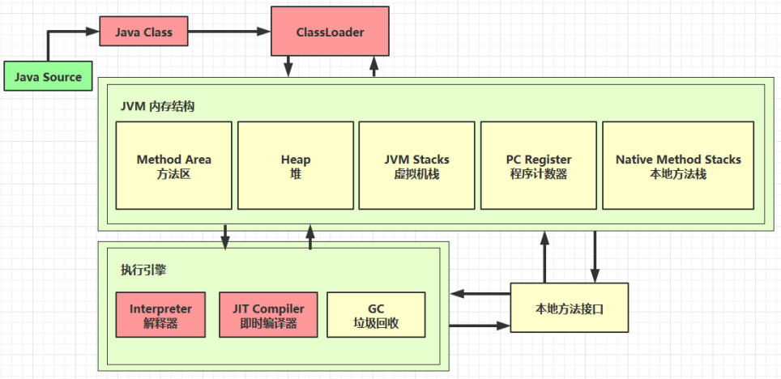

参考文献：[https://docs.oracle.com/javase/specs/jvms/se8/html/jvms-4.html](https://docs.oracle.com/javase/specs/jvms/se8/html/jvms-4.html)


HelloWorld.java

```java
public class HelloWorld {
    public static void main(String[] args) {
        System.out.println("hello world");
    }
}
```

执行 `javac -parameters -d . HellowWorld.java`

编译为 `HelloWorld.class` 后是这个样子的：

```Plain Text
[root@localhost ~]# od -t xC HelloWorld.class
0000000 ca fe ba be 00 00 00 34 00 23 0a 00 06 00 15 09
0000020 00 16 00 17 08 00 18 0a 00 19 00 1a 07 00 1b 07
0000040 00 1c 01 00 06 3c 69 6e 69 74 3e 01 00 03 28 29
0000060 56 01 00 04 43 6f 64 65 01 00 0f 4c 69 6e 65 4e
0000100 75 6d 62 65 72 54 61 62 6c 65 01 00 12 4c 6f 63
0000120 61 6c 56 61 72 69 61 62 6c 65 54 61 62 6c 65 01
0000140 00 04 74 68 69 73 01 00 1d 4c 63 6e 2f 69 74 63
0000160 61 73 74 2f 6a 76 6d 2f 74 35 2f 48 65 6c 6c 6f
0000200 57 6f 72 6c 64 3b 01 00 04 6d 61 69 6e 01 00 16
0000220 28 5b 4c 6a 61 76 61 2f 6c 61 6e 67 2f 53 74 72
0000240 69 6e 67 3b 29 56 01 00 04 61 72 67 73 01 00 13
0000260 5b 4c 6a 61 76 61 2f 6c 61 6e 67 2f 53 74 72 69
0000300 6e 67 3b 01 00 10 4d 65 74 68 6f 64 50 61 72 61
0000320 6d 65 74 65 72 73 01 00 0a 53 6f 75 72 63 65 46
0000340 69 6c 65 01 00 0f 48 65 6c 6c 6f 57 6f 72 6c 64
0000360 2e 6a 61 76 61 0c 00 07 00 08 07 00 1d 0c 00 1e
0000400 00 1f 01 00 0b 68 65 6c 6c 6f 20 77 6f 72 6c 64
0000420 07 00 20 0c 00 21 00 22 01 00 1b 63 6e 2f 69 74
0000440 63 61 73 74 2f 6a 76 6d 2f 74 35 2f 48 65 6c 6c
0000460 6f 57 6f 72 6c 64 01 00 10 6a 61 76 61 2f 6c 61
0000500 6e 67 2f 4f 62 6a 65 63 74 01 00 10 6a 61 76 61
0000520 2f 6c 61 6e 67 2f 53 79 73 74 65 6d 01 00 03 6f
0000540 75 74 01 00 15 4c 6a 61 76 61 2f 69 6f 2f 50 72
0000560 69 6e 74 53 74 72 65 61 6d 3b 01 00 13 6a 61 76
0000600 61 2f 69 6f 2f 50 72 69 6e 74 53 74 72 65 61 6d
0000620 01 00 07 70 72 69 6e 74 6c 6e 01 00 15 28 4c 6a
0000640 61 76 61 2f 6c 61 6e 67 2f 53 74 72 69 6e 67 3b
0000660 29 56 00 21 00 05 00 06 00 00 00 00 00 02 00 01
0000700 00 07 00 08 00 01 00 09 00 00 00 2f 00 01 00 01
0000720 00 00 00 05 2a b7 00 01 b1 00 00 00 02 00 0a 00
0000740 00 00 06 00 01 00 00 00 04 00 0b 00 00 00 0c 00
0000760 01 00 00 00 05 00 0c 00 0d 00 00 00 09 00 0e 00
0001000 0f 00 02 00 09 00 00 00 37 00 02 00 01 00 00 00
0001020 09 b2 00 02 12 03 b6 00 04 b1 00 00 00 02 00 0a
0001040 00 00 00 0a 00 02 00 00 00 06 00 08 00 07 00 0b
0001060 00 00 00 0c 00 01 00 00 00 09 00 10 00 11 00 00
0001100 00 12 00 00 00 05 01 00 10 00 00 00 01 00 13 00
0001120 00 00 02 00 14
```


根据 JVM 规范，类文件结构如下：

```Plain Text
ClassFile {
    u4                magic;
    u2                minor_version;
    u2                major_version;
    u2                constant_pool_count;
    cp_info           constant_pool[constant_pool_count-1];
    u2                access_flags;
    u2                this_class;
    u2                super_class;
    u2                interfaces_count;
    u2                interfaces[interfaces_count];
    u2                fields_count;
    field_info        fields[fields_count];
    u2                methods_count;
    method_info       methods[methods_count];
    u2                attributes_count;
    attribute_info    attributes[attributes_count];
}
```


## 魔数

0~3 字节，表示它是否是【class】类型的文件

0000000 **ca fe ba be** 00 00 00 34 00 23 0a 00 06 00 15 09


## 版本

4\~7 字节，表示类的版本 00 34（52）表示是 Java 8

0000000 ca fe ba be **00 00 00 34** 00 23 0a 00 06 00 15 09


## 常量池


| Constant Type                | Value(十进制) |
| ---------------------------- | ------------- |
| CONSTANT\_Class              | 7             |
| CONSTANT\_Fieldref           | 9             |
| CONSTANT\_Methodref          | 10            |
| CONSTANT\_InterfaceMethodref | 11            |
| CONSTANT\_String             | 8             |
| CONSTANT\_Integer            | 3             |
| CONSTANT\_Float              | 4             |
| CONSTANT\_Long               | 5             |
| CONSTANT\_Double             | 6             |
| CONSTANT\_NameAndType        | 12            |
| CONSTANT\_Utf8               | 1             |
| CONSTANT\_MethodHandle       | 15            |
| CONSTANT\_MethodType         | 16            |
| CONSTANT\_InvokeDynamic      | 18            |


8\~9 字节，表示常量池长度，00 23（35）表示常量池有 #1\~#34 项，注意 #0 项不计入，也没有值

0000000 ca fe ba be 00 00 00 34 **00 23** 0a 00 06 00 15 09


第#1项 0a 表示一个 Method 信息，00 06 和 00 15（21） 表示它引用了常量池中 #6 和 #21 项来获得这个方法的【所属类】和【方法名】

0000000 ca fe ba be 00 00 00 34 00 23 **0a 00 06 00 15** 09


第#2项 09 表示一个 Field 信息，00 16（22）和 00 17（23） 表示它引用了常量池中 #22 和 # 23 项来获得这个成员变量的【所属类】和【成员变量名】

0000000 ca fe ba be 00 00 00 34 00 23 0a 00 06 00 15 **09**

0000020 **00 16 00 17** 08 00 18 0a 00 19 00 1a 07 00 1b 07


第#3项 08 表示一个字符串常量名称，00 18（24）表示它引用了常量池中 #24 项

0000020 00 16 00 17 **08 00 18** 0a 00 19 00 1a 07 00 1b 07


第#4项 0a 表示一个 Method 信息，00 19（25） 和 00 1a（26） 表示它引用了常量池中 #25 和 #26 项来获得这个方法的【所属类】和【方法名】

0000020 00 16 00 17 08 00 18 **0a 00 19 00 1a** 07 00 1b 07


第#5项 07 表示一个 Class 信息，00 1b（27） 表示它引用了常量池中 #27 项

0000020 00 16 00 17 08 00 18 0a 00 19 00 1a **07 00 1b** 07


第#6项 07 表示一个 Class 信息，00 1c（28） 表示它引用了常量池中 #28 项

0000020 00 16 00 17 08 00 18 0a 00 19 00 1a 07 00 1b **07**

0000040 **00 1c** 01 00 06 3c 69 6e 69 74 3e 01 00 03 28 29


第#7项 01 表示一个 utf8 串，00 06 表示长度，3c 69 6e 69 74 3e 是【`<init>`】

0000040 00 1c **01 00 06 3c 69 6e 69 74 3e** 01 00 03 28 29


第#8项 01 表示一个 utf8 串，00 03 表示长度，28 29 56 是【()V】其实就是表示无参、无返回值

0000040 00 1c 01 00 06 3c 69 6e 69 74 3e **01 00 03 28 29**

0000060 **56** 01 00 04 43 6f 64 65 01 00 0f 4c 69 6e 65 4e


第#9项 01 表示一个 utf8 串，00 04 表示长度，43 6f 64 65 是【Code】

0000060 56 **01 00 04 43 6f 64 65** 01 00 0f 4c 69 6e 65 4e


第#10项 01 表示一个 utf8 串，00 0f（15） 表示长度，4c 69 6e 65 4e 75 6d 62 65 72 54 61 62 6c 65是【LineNumberTable】

0000060 56 01 00 04 43 6f 64 65 **01 00 0f 4c 69 6e 65 4e**

0000100 **75 6d 62 65 72 54 61 62 6c 65** 01 00 12 4c 6f 63


第#11项 01 表示一个 utf8 串，00 12（18） 表示长度，4c 6f 63 61 6c 56 61 72 69 61 62 6c 65 54 61 62 6c 65是【LocalVariableTable】

0000100 75 6d 62 65 72 54 61 62 6c 65 **01 00 12 4c 6f 63**

0000120 **61 6c 56 61 72 69 61 62 6c 65 54 61 62 6c 65** 01


第#12项 01 表示一个 utf8 串，00 04 表示长度，74 68 69 73 是【this】

0000120 61 6c 56 61 72 69 61 62 6c 65 54 61 62 6c 65 **01**

0000140 **00 04 74 68 69 73** 01 00 1d 4c 63 6e 2f 69 74 63


第#13项 01 表示一个 utf8 串，00 1d（29） 表示长度，是【Lcn/itcast/jvm/t5/HelloWorld;】

0000140 00 04 74 68 69 73 **01 00 1d 4c 63 6e 2f 69 74 63**

0000160 **61 73 74 2f 6a 76 6d 2f 74 35 2f 48 65 6c 6c 6f**

0000200 **57 6f 72 6c 64 3b** 01 00 04 6d 61 69 6e 01 00 16


第#14项 01 表示一个 utf8 串，00 04 表示长度，74 68 69 73 是【main】

0000200 57 6f 72 6c 64 3b **01 00 04 6d 61 69 6e** 01 00 16


第#15项 01 表示一个 utf8 串，00 16（22） 表示长度，是【(\[Ljava/lang/String;)V】其实就是参数为字符串数组，无返回值

0000200 57 6f 72 6c 64 3b 01 00 04 6d 61 69 6e **01 00 16**

0000220 **28 5b 4c 6a 61 76 61 2f 6c 61 6e 67 2f 53 74 72**

0000240 **69 6e 67 3b 29 56** 01 00 04 61 72 67 73 01 00 13


第#16项 01 表示一个 utf8 串，00 04 表示长度，是【args】

0000240 69 6e 67 3b 29 56 **01 00 04 61 72 67 73** 01 00 13


第#17项 01 表示一个 utf8 串，00 13（19） 表示长度，是【\[Ljava/lang/String;】

0000240 69 6e 67 3b 29 56 01 00 04 61 72 67 73 **01 00 13**

0000260 **5b 4c 6a 61 76 61 2f 6c 61 6e 67 2f 53 74 72 69**

0000300 **6e 67 3b** 01 00 10 4d 65 74 68 6f 64 50 61 72 61


第#18项 01 表示一个 utf8 串，00 10（16） 表示长度，是【MethodParameters】

0000300 6e 67 3b **01 00 10 4d 65 74 68 6f 64 50 61 72 61**

0000320 **6d 65 74 65 72 73** 01 00 0a 53 6f 75 72 63 65 46


第#19项 01 表示一个 utf8 串，00 0a（10） 表示长度，是【SourceFile】

0000320 6d 65 74 65 72 73 **01 00 0a 53 6f 75 72 63 65 46**

0000340 **69 6c 65** 01 00 0f 48 65 6c 6c 6f 57 6f 72 6c 64


第#20项 01 表示一个 utf8 串，00 0f（15） 表示长度，是【HelloWorld.java】

0000340 69 6c 65 **01 00 0f 48 65 6c 6c 6f 57 6f 72 6c 64**

0000360 **2e 6a 61 76 61** 0c 00 07 00 08 07 00 1d 0c 00 1e


第#21项 0c 表示一个 【名+类型】，00 07 00 08 引用了常量池中 #7 #8 两项

0000360 2e 6a 61 76 61 **0c 00 07 00 08** 07 00 1d 0c 00 1e


第#22项 07 表示一个 Class 信息，00 1d（29） 引用了常量池中 #29 项

0000360 2e 6a 61 76 61 0c 00 07 00 08 **07 00 1d** 0c 00 1e


第#23项 0c 表示一个 【名+类型】，00 1e（30） 00 1f （31）引用了常量池中 #30 #31 两项

0000360 2e 6a 61 76 61 0c 00 07 00 08 07 00 1d **0c 00 1e**

0000400 **00 1f** 01 00 0b 68 65 6c 6c 6f 20 77 6f 72 6c 64


第#24项 01 表示一个 utf8 串，00 0f（15） 表示长度，是【hello world】

0000400 00 1f **01 00 0b 68 65 6c 6c 6f 20 77 6f 72 6c 64**


第#25项 07 表示一个 Class 信息，00 20（32） 引用了常量池中 #32 项

0000420 **07 00 20** 0c 00 21 00 22 01 00 1b 63 6e 2f 69 74


第#26项 0c 表示一个 【名+类型】，00 21（33） 00 22（34）引用了常量池中 #33 #34 两项

0000420 07 00 20 **0c 00 21 00 22** 01 00 1b 63 6e 2f 69 74


第#27项 01 表示一个 utf8 串，00 1b（27） 表示长度，是【cn/itcast/jvm/t5/HelloWorld】

0000420 07 00 20 0c 00 21 00 22 **01 00 1b 63 6e 2f 69 74**

0000440 **63 61 73 74 2f 6a 76 6d 2f 74 35 2f 48 65 6c 6c**

0000460 **6f 57 6f 72 6c 64** 01 00 10 6a 61 76 61 2f 6c 61


第#28项 01 表示一个 utf8 串，00 10（16） 表示长度，是【java/lang/Object】

0000460 6f 57 6f 72 6c 64 **01 00 10 6a 61 76 61 2f 6c 61**

0000500 **6e 67 2f 4f 62 6a 65 63 74** 01 00 10 6a 61 76 61


第#29项 01 表示一个 utf8 串，00 10（16） 表示长度，是【java/lang/System】

0000500 6e 67 2f 4f 62 6a 65 63 74 **01 00 10 6a 61 76 61**

0000520 2**f 6c 61 6e 67 2f 53 79 73 74 65 6d** 01 00 03 6f


第#30项 01 表示一个 utf8 串，00 03 表示长度，是【out】

0000520 2f 6c 61 6e 67 2f 53 79 73 74 65 6d **01 00 03 6f**

0000540 **75 74** 01 00 15 4c 6a 61 76 61 2f 69 6f 2f 50 72


第#31项 01 表示一个 utf8 串，00 15（21） 表示长度，是【Ljava/io/PrintStream;】

0000540 75 74 **01 00 15 4c 6a 61 76 61 2f 69 6f 2f 50 72**

0000560 **69 6e 74 53 74 72 65 61 6d 3b** 01 00 13 6a 61 76


第#32项 01 表示一个 utf8 串，00 13（19） 表示长度，是【java/io/PrintStream】

0000560 69 6e 74 53 74 72 65 61 6d 3b **01 00 13 6a 61 76**

0000600 **61 2f 69 6f 2f 50 72 69 6e 74 53 74 72 65 61 6d**


第#33项 01 表示一个 utf8 串，00 07 表示长度，是【println】

0000620 **01 00 07 70 72 69 6e 74 6c 6e** 01 00 15 28 4c 6a


第#34项 01 表示一个 utf8 串，00 15（21） 表示长度，是【(Ljava/lang/String;)V】

0000620 01 00 07 70 72 69 6e 74 6c 6e **01 00 15 28 4c 6a**

0000640 **61 76 61 2f 6c 61 6e 67 2f 53 74 72 69 6e 67 3b**

0000660 **29 56** 00 21 00 05 00 06 00 00 00 00 00 02 00 01


## 访问标识与继承信息

21 表示该 class 是一个类，公共的

0000660 29 56 **00 21** 00 05 00 06 00 00 00 00 00 02 00 01


05 表示根据常量池中 #5 找到本类全限定名

0000660 29 56 00 21 **00 05** 00 06 00 00 00 00 00 02 00 01


06 表示根据常量池中 #6 找到父类全限定名

0000660 29 56 00 21 00 05 **00 06** 00 00 00 00 00 02 00 01


表示接口的数量，本类为 0

0000660 29 56 00 21 00 05 00 06 **00 00** 00 00 00 02 00 01


| Flag Name       | Value  | Interpretation                                               |
| --------------- | ------ | ------------------------------------------------------------ |
| ACC\_PUBLIC     | 0x0001 | Declared public; may be accessed from outside its package.   |
| ACC\_FINAL      | 0x0010 | Declared final ; no subclasses allowed.                      |
| ACC\_SUPER      | 0x0020 | Treat superclass methods specially when invoked by the invokespecial instruction. |
| ACC\_INTERFACE  | 0x0200 | Is an interface, not a class.                                |
| ACC\_ABSTRACT   | 0x0400 | Declared abstract; must not be instantiated.                 |
| ACC\_SYNTHETIC  | 0x1000 | Declared synthetic; not present in the source code.          |
| ACC\_ANNOTATION | 0x2000 | Declared as an annotation type.                              |
| ACC\_ENUM       | 0x4000 | Declared as an enum type.                                    |


## Field 信息

表示成员变量数量，本类为 0

0000660 29 56 00 21 00 05 00 06 00 00 **00 00** 00 02 00 01

| FieldType     | Type      | Interpretation                                               |
| ------------- | --------- | ------------------------------------------------------------ |
| B             | byte      | signed byte                                                  |
| C             | char      | Unicode character code point in the Basic Multilingual Plane, encoded with UTF-16 |
| D             | double    | double-precision flfloating-point value                      |
| F             | float     | single-precision flfloating-point value                      |
| I             | int       | integer                                                      |
| J             | long      | long integer                                                 |
| L ClassName ; | reference | an instance of class ClassName                               |
| S             | short     | signed short                                                 |
| Z             | boolean   | true or false                                                |
| \[            | reference | one array dimension                                          |


## Method 信息

表示方法数量，本类为 2

0000660 29 56 00 21 00 05 00 06 00 00 00 00 **00 02** 00 01

一个方法由 访问修饰符，名称，参数描述，方法属性数量，方法属性组成


---

粗体代表访问修饰符（本类中是 public）

黄色代表引用了常量池 #07 项作为方法名称

绿色代表引用了常量池 #08 项作为方法参数描述

红色代表方法属性数量，本方法是 1


粗体代表方法属性：

* 00 09 表示引用了常量池 #09 项，发现是【Code】属性
* 00 00 00 2f 表示此属性的长度是 47
* 00 01 表示【操作数栈】最大深度
* 00 01 表示【局部变量表】最大槽（slot）数
* 00 00 00 05 表示字节码长度，本例是 5
  * 2a b7 00 01 b1 是字节码指令
* 00 00 00 02 表示方法细节属性数量，本例是 2
* 00 0a 表示引用了常量池 #10 项，发现是【LineNumberTable】属性
  * 00 00 00 06 表示此属性的总长度，本例是 6
  * 00 01 表示【LineNumberTable】长度
  * 00 00 表示【字节码】行号
  * 00 04 表示【java 源码】行号
* 00 0b 表示引用了常量池 #11 项，发现是【LocalVariableTable】属性
  * 00 00 00 0c 表示此属性的总长度，本例是 12
  * 00 01 表示【LocalVariableTable】长度
  * 00 00 表示局部变量生命周期开始，相对于字节码的偏移量
  * 00 05 表示局部变量覆盖的范围长度
  * 00 0c 表示局部变量名称，本例引用了常量池 #12 项，是【this】
  * 00 0d 表示局部变量的类型，本例引用了常量池 #13 项，是【Lcn/itcast/jvm/t5/HelloWorld;】
  * 00 00 表示局部变量占有的槽位（slot）编号，本例是 0


0000660 29 56 00 21 00 05 00 06 00 00 00 00 00 02 **00 01**

0000700 `00 07` `00 08` `00 01` **00 09 00 00 00 2f 00 01 00 01**

0000720 **00 00 00 05 2a b7 00 01 b1 00 00 00 02 00 0a 00**

0000740 **00 00 06 00 01 00 00 00 04 00 0b 00 00 00 0c 00**

0000760 **01 00 00 00 05 00 0c 00 0d 00 00** 00 09 00 0e 00


---

粗体代表访问修饰符（本类中是 public static）

黄色代表引用了常量池 #14 项作为方法名称

绿色代表引用了常量池 #15 项作为方法参数描述

红色代表方法属性数量，本方法是 2


粗体代表方法属性（属性1）：

* 00 09 表示引用了常量池 #09 项，发现是【Code】属性
* 00 00 00 37 表示此属性的长度是 55
* 00 02 表示【操作数栈】最大深度
* 00 01 表示【局部变量表】最大槽（slot）数
* 00 00 00 05 表示字节码长度，本例是 9
  * b2 00 02 12 03 b6 00 04 b1 是字节码指令
* 00 00 00 02 表示方法细节属性数量，本例是 2
* 00 0a 表示引用了常量池 #10 项，发现是【LineNumberTable】属性
* 00 00 00 0a 表示此属性的总长度，本例是 10
  * 00 02 表示【LineNumberTable】长度
  * 00 00 表示【字节码】行号
  * 00 06 表示【java 源码】行号
  * 00 08 表示【字节码】行号
  * 00 07 表示【java 源码】行号
* 00 0b 表示引用了常量池 #11 项，发现是【LocalVariableTable】属性
* 00 00 00 0c 表示此属性的总长度，本例是 12
  * 00 01 表示【LocalVariableTable】长度
  * 00 00 表示局部变量生命周期开始，相对于字节码的偏移量
  * 00 09 表示局部变量覆盖的范围长度
  * 00 10 表示局部变量名称，本例引用了常量池 #16 项，是【args】
  * 00 11 表示局部变量的类型，本例引用了常量池 #17 项，是【\[Ljava/lang/String;】
  * 00 00 表示局部变量占有的槽位（slot）编号，本例是 0

0000760 01 00 00 00 05 00 0c 00 0d 00 00 **00 09** *00 0e* ***00***

0001000 *0f* ***00 02*** **00 09 00 00 00 37 00 02 00 01 00 00 00**

0001020 **09 b2 00 02 12 03 b6 00 04 b1 00 00 00 02 00 0a**

0001040 **00 00 00 0a 00 02 00 00 00 06 00 08 00 07 00 0b**

0001060 **00 00 00 0c 00 01 00 00 00** 09 00 10 00 11 00 00


粗体代表方法属性（属性2）：

* 00 12 表示引用了常量池 #18 项，发现是【MethodParameters】属性
* 00 00 00 05 表示此属性的总长度，本例是 5
  * 01 参数数量
  * 00 10 表示引用了常量池 #16 项，是【args】
  * 00 00 访问修饰符

0001100 **00 12 00 00 00 05 01 00 10 00 00** 00 01 00 13 00

0001120 00 00 02 00 14


## 附加属性

* 00 01 表示附加属性数量
* 00 13 表示引用了常量池 #19 项，即【SourceFile】
* 00 00 00 02 表示此属性的长度
  * 00 14 表示引用了常量池 #20 项，即【HelloWorld.java】

0001100 00 12 00 00 00 05 01 00 10 00 00 **00 01 00 13 00**

0001120 **00 00 02 00 14**
