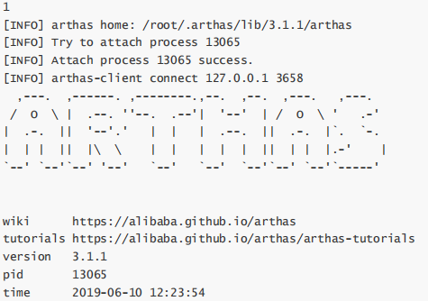

## 即时编译

### 分层编译

（TieredCompilation）

```java
public class JIT1 {
    public static void main(String[] args) {
        for (int i = 0; i < 200; i++) {
            long start = System.nanoTime();
            for (int j = 0; j < 1000; j++) {
                new Object();
            }
            long end = System.nanoTime();
            System.out.printf("%d\t%d\n",i,(end - start));
        }
    }
}
```


部分输出：

```Plain Text
0 96426
1 52907
2 44800
3 119040
4 65280
5 47360
6 45226
7 47786
59 57600
60 83200
61 7024204
62 49493
63 20907
64 20907
65 20053
66 20906
67 20907
132 20053
133 15360
134 136533
135 43093
136 853
137 853
138 853
198 853
199 854
```


JVM 将执行状态分成了 5 个层次：

* 0 层，解释执行（Interpreter）
* 1 层，使用 C1 即时编译器编译执行（不带 profifiling）
* 2 层，使用 C1 即时编译器编译执行（带基本的 profifiling）
* 3 层，使用 C1 即时编译器编译执行（带完全的 profifiling）
* 4 层，使用 C2 即时编译器编译执行

> profifiling 是指在运行过程中收集一些程序执行状态的数据，例如【方法的调用次数】，【循环的回边次数】等


即时编译器（JIT）与解释器的区别

* 解释器是将字节码解释为机器码，下次即使遇到相同的字节码，仍会执行重复的解释
* JIT 是将一些字节码编译为机器码，并存入 Code Cache，下次遇到相同的代码，直接执行，无需再编译
* 解释器是将字节码解释为针对所有平台都通用的机器码
* JIT 会根据平台类型，生成平台特定的机器码

对于占据大部分的不常用的代码，我们无需耗费时间将其编译成机器码，而是采取解释执行的方式运行；另一方面，对于仅占据小部分的热点代码，我们则可以将其编译成机器码，以达到理想的运行速度。 执行效率上简单比较一下 Interpreter < C1 < C2，总的目标是发现热点代码（hotspot名称的由来），优化之


刚才的一种优化手段称之为【逃逸分析】，发现新建的对象是否逃逸。可以使用 -XX:-DoEscapeAnalysis 关闭逃逸分析，再运行刚才的示例观察结果

参考资料：https://docs.oracle.com/en/java/javase/12/vm/java-hotspot-virtual-machine-performance-enhancements.html#GUID-D2E3DC58-D18B-4A6C-8167-4A1DFB4888E4


### 方法内联

（Inlining）

```java
private static int square(final int i) {
    return i * i;
}
```


```java
System.out.println(square(9));
```

如果发现 square 是热点方法，并且长度不太长时，会进行内联，所谓的内联就是把方法内代码拷贝、粘贴到调用者的位置：

```java
System.out.println(9 * 9);
```

还能够进行常量折叠（constant folding）的优化

```java
System.out.println(81);
```


实验：

```java
public class JIT2 {

    // -XX:+UnlockDiagnosticVMOptions -XX:+PrintInlining （解锁隐藏参数）打印inlining 信息
    // -XX:CompileCommand=dontinline,*JIT2.square 禁止某个方法 inlining
    // -XX:+PrintCompilation 打印编译信息

    public static void main(String[] args) {
        int x = 0;
        for (int i = 0; i < 500; i++) {
            long start = System.nanoTime();
            for (int j = 0; j < 1000; j++) {
                x = square(9);
            }
            long end = System.nanoTime();
            System.out.printf("%d\t%d\t%d\n",i,x,(end - start));
        }
    }

    private static int square(final int i) {
        return i * i;
    }
}
```


### 字段优化

JMH 基准测试请参考：http://openjdk.java.net/projects/code-tools/jmh/

创建 maven 工程，添加依赖如下

```java
<dependency>
    <groupId>org.openjdk.jmh</groupId>
    <artifactId>jmh-core</artifactId>
    <version>${jmh.version}</version>
</dependency>

<dependency>
    <groupId>org.openjdk.jmh</groupId>
    <artifactId>jmh-generator-annprocess</artifactId>
    <version>${jmh.version}</version>
    <scope>provided</scope>
</dependency>
```


编写基准测试代码：

```java
package test;

import org.openjdk.jmh.annotations.*;
import org.openjdk.jmh.runner.Runner;
import org.openjdk.jmh.runner.RunnerException;
import org.openjdk.jmh.runner.options.Options;
import org.openjdk.jmh.runner.options.OptionsBuilder;
import java.util.Random;
import java.util.concurrent.ThreadLocalRandom;

@Warmup(iterations = 2, time = 1)
@Measurement(iterations = 5, time = 1)
@State(Scope.Benchmark)
public class Benchmark1 {

    int[] elements = randomInts(1_000);

    private static int[] randomInts(int size) {
        Random random = ThreadLocalRandom.current();
        int[] values = new int[size];
        for (int i = 0; i < size; i++) {
            values[i] = random.nextInt();
        }
        return values;
    }

    @Benchmark
    public void test1() {
        for (int i = 0; i < elements.length; i++) {
            doSum(elements[i]);
        }
    }

    @Benchmark
    public void test2() {
        int[] local = this.elements;
        for (int i = 0; i < local.length; i++) {
            doSum(local[i]);
        }
    }

    @Benchmark
    public void test3() {
        for (int element : elements) {
            doSum(element);
        }
    }

    static int sum = 0;

    @CompilerControl(CompilerControl.Mode.INLINE)
    static void doSum(int x) {
        sum += x;
    }

    public static void main(String[] args) throws RunnerException {
        Options opt = new OptionsBuilder()
            .include(Benchmark1.class.getSimpleName())
            .forks(1)
            .build();
        new Runner(opt).run();
    }
}
```


首先启用 doSum 的方法内联，测试结果如下（每秒吞吐量，分数越高的更好）：

```Plain Text
Benchmark             Mode     Samples     Score         Score error     Units
t.Benchmark1.test1    thrpt     5         2420286.539     390747.467     ops/s
t.Benchmark1.test2    thrpt     5         2544313.594     91304.136      ops/s
t.Benchmark1.test3    thrpt     5         2469176.697     450570.647     ops/s
```


接下来禁用 doSum 方法内联

```java
@CompilerControl(CompilerControl.Mode.DONT_INLINE)
static void doSum(int x) {
    sum += x;
}
```

测试结果如下：

```Plain Text
Benchmark             Mode     Samples     Score         Score error     Units
t.Benchmark1.test1    thrpt     5         296141.478     63649.220       ops/s
t.Benchmark1.test2    thrpt     5         371262.351     83890.984       ops/s
t.Benchmark1.test3    thrpt     5         368960.847     60163.391       ops/s
```


在刚才的示例中，doSum 方法是否内联会影响 elements 成员变量读取的优化：

如果 doSum 方法内联了，刚才的 test1 方法会被优化成下面的样子（伪代码）：

```java
@Benchmark
public void test1() {
    // elements.length 首次读取会缓存起来 -> int[] local
    for (int i = 0; i < elements.length; i++) { // 后续 999 次 求长度 <- local
        sum += elements[i]; // 1000 次取下标 i 的元素 <- local
    }
}
```

可以节省 1999 次 Field 读取操作

但如果 doSum 方法没有内联，则不会进行上面的优化


## 反射优化

```java
package cn.itcast.jvm.t3.reflect;

import java.io.IOException;
import java.lang.reflect.InvocationTargetException;
import java.lang.reflect.Method;

public class Reflect1 {
    public static void foo() {
        System.out.println("foo...");
    }

    public static void main(String[] args) throws Exception {
        Method foo = Reflect1.class.getMethod("foo");
        for (int i = 0; i <= 16; i++) {
            System.out.printf("%d\t", i);
            foo.invoke(null);
        }
        System.in.read();
    }
}
```

foo.invoke 前面 0 \~ 15 次调用使用的是 MethodAccessor 的 NativeMethodAccessorImpl 实现

```java
package sun.reflect;

import java.lang.reflect.InvocationTargetException;
import java.lang.reflect.Method;
import sun.reflect.misc.ReflectUtil;

class NativeMethodAccessorImpl extends MethodAccessorImpl {
    private final Method method;
    private DelegatingMethodAccessorImpl parent;
    private int numInvocations;

    NativeMethodAccessorImpl(Method method) {
        this.method = method;
    }

    public Object invoke(Object target, Object[] args)
            throws IllegalArgumentException, InvocationTargetException {
        // inflationThreshold 膨胀阈值，默认 15
        if (++this.numInvocations > ReflectionFactory.inflationThreshold()
                && !ReflectUtil.isVMAnonymousClass(this.method.getDeclaringClass())) {
            // 使用 ASM 动态生成的新实现代替本地实现，速度较本地实现快 20 倍左右
            MethodAccessorImpl generatedMethodAccessor = (MethodAccessorImpl)
                (new MethodAccessorGenerator())
                    .generateMethod(
                        this.method.getDeclaringClass(),
                        this.method.getName(),
                        this.method.getParameterTypes(),
                        this.method.getReturnType(),
                        this.method.getExceptionTypes(),
                        this.method.getModifiers()
                    );
            this.parent.setDelegate(generatedMethodAccessor);
        }

        // 调用本地实现
        return invoke0(this.method, target, args);
    }

    void setParent(DelegatingMethodAccessorImpl parent) {
        this.parent = parent;
    }

    private static native Object invoke0(Method method, Object target, Object[] args);
}
```

当调用到第 16 次（从0开始算）时，会采用运行时生成的类代替掉最初的实现，可以通过 debug 得到类名为 sun.reflflect.GeneratedMethodAccessor1

可以使用阿里的 arthas 工具：

```Plain Text
java -jar arthas-boot.jar
[INFO] arthas-boot version: 3.1.1
[INFO] Found existing java process, please choose one and hit RETURN.
* [1]: 13065 cn.itcast.jvm.t3.reflect.Reflect1
```

选择 1 回车表示分析该进程



再输入【jad + 类名】来进行反编译


注意

通过查看 ReflectionFactory 源码可知 sun.reflflect.noInflflation 可以用来禁用膨胀（直接生成 GeneratedMethodAccessor1，但首次生成比较耗时，如果仅反射调用一次，不划算）

sun.reflflect.inflflationThreshold 可以修改膨胀阈值