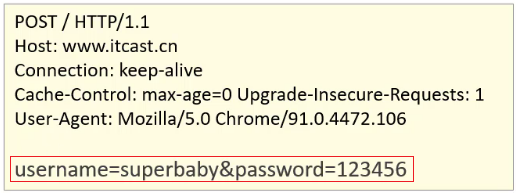
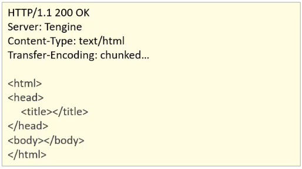

**Web是全球广域网，也称为万维网(www)，能够通过浏览器访问的网站。**

在日常的生活中，经常会使用浏览器去访问百度、京东等这些网站，这些网站统称为Web网站。

## 软件架构

### 桌面应用

桌面应用俗称单击应用，软件所有数据都保存在电脑的本地硬盘中

* **优点：** 易于使用，结构简单
* **缺点：** 数据难以共享，安全性差，更新不及时


### C/S：Client-Server模式

Client/Server结构(C/S结构)是指客户端和服务器结构，在用户本地有一个客户端程序，在远程有一个服务器端程序

* **优点：** 数据方便共享，安全性高
* **缺点：** 必须安装客户端，升级与维护困难


### B/S：Broswer-Server模式

Broswer-Server(B/S)模式即浏览器和服务器架构模式，只需要一个浏览器，用户通过不同的网址(URL)，客户访问不同的服务器端程序。

* 优点：开发简单，无需安装客户端，数据易于共享
* 缺点：相较于C/S模式，执行速度与用户体验相对较弱，对硬件要求过高

客户端只需要浏览器，应用程序的逻辑和数据都存储在服务器端。浏览器只需要请求服务器，获取Web资源，服务器把Web资源发送给浏览器即可。


## 请求与响应

* 从浏览器发出送给服务器的数据包称为“请求(Request)”
* 从服务器返回给浏览器的结果称为“响应(Response)”


## 资源分类

### 静态资源

使用静态网页开发技术发布的资源

* 所有用户访问，得到的结果是一样的。如：文本，图片，音频、视频, HTML,CSS,JavaScript
* 如果用户请求的是静态资源，那么服务器会直接将静态资源发送给浏览器。
* 浏览器中内置了静态资源的解析引擎，可以展示静态资源

### 动态资源

使用动态网页及时发布的资源

* 所有用户访问，得到的结果可能不一样。如：jsp/servlet,php,asp...
* 如果用户请求的是动态资源，那么服务器会执行动态资源，转换为静态资源，再发送给浏览器


## HTTP

**HyperText Transfer Protocol**，超文本传输协议，规定了浏览器和服务器之间**数据传输的规则**。

* 数据传输的规则指的是请求数据和响应数据需要按照指定的格式进行传输。
* 如果想知道具体的格式，可以打开浏览器，点击`F12`打开开发者工具，点击`Network`来查看某一次请求的请求数据和响应数据具体的格式内容。

### 历史版本
- 1.0：每一次请求响应都会建立新的连接
- 1.1：复用连接

### HTTP协议特点

* **基于TCP协议：** 面向连接，安全

> TCP是一种面向连接的(建立连接之前是需要经过三次握手)、可靠的、基于字节流的传输层通信协议，在数据传输方面更安全。

* **基于请求-响应模型的：** 一次请求对应一次响应

> 请求和响应是一一对应关系

* **HTTP协议是无状态协议：** 对于事物处理没有记忆能力。每次请求-响应都是独立的

> 无状态指的是客户端发送HTTP请求给服务端之后，服务端根据请求响应数据，响应完后，不会记录任何信息。这种特性有优点也有缺点，**缺点：多次请求间不能共享数据**；**优点：速度快**。


### 请求数据格式

请求数据总共分为三部分内容，分别是**请求行**、**请求头**、**请求体**


#### 请求行

HTTP请求中的第一行数据，请求行包含三块内容，分别是`GET[请求方式] /[请求URL路径] HTTP/1.1[HTTP协议及版本]`，请求方式有七种，最常用的是`GET`和`POST`


#### 请求头

第二行开始，格式为`key: value`形式，请求头中会包含若干个属性，常见的HTTP请求头有：

```Plain Text
Host：表示请求的主机名
User-Agent：浏览器版本,例如Chrome浏览器的标识类似Mozilla/5.0 ...Chrome/79，IE浏览器的标识类似Mozilla/5.0 (Windows NT ...)like Gecko；
Accept：表示浏览器能接收的资源类型，如text/*，image/*或者*/*表示所有；
Accept-Language：表示浏览器偏好的语言，服务器可以据此返回不同语言的网页；
Accept-Encoding：表示浏览器可以支持的压缩类型，例如gzip, deflate等。
```


#### 请求体

POST请求的最后一部分，存储请求参数




如上图红线框的内容就是请求体的内容，请求体和请求头之间是有一个空行隔开。此时浏览器发送的是POST请求。

* GET请求请求参数在请求行中，没有请求体，POST请求请求参数在请求体中。
* GET请求请求参数大小有限制，POST没有。


### 响应数据格式

响应数据总共分为三部分内容，分别是**响应行**、**响应头**、**响应体**。




#### 响应行

响应数据的第一行,响应行包含三块内容，分别是`HTTP/1.1[HTTP协议及版本]`、`200[响应状态码]`、 `ok[状态码的描述]`。


#### 响应头

第二行开始，格式为`key：value`形式，响应头中会包含若干个属性，常见的HTTP响应头有：

```Plain Text
Content-Type：表示该响应内容的类型，例如text/html，image/jpeg；
Content-Length：表示该响应内容的长度（字节数）；
Content-Encoding：表示该响应压缩算法，例如gzip；
Cache-Control：指示客户端应如何缓存，例如max-age=300表示可以最多缓存300秒
```


#### 响应体

最后一部分。存放响应数据。


#### 响应状态码

状态码大全：[https://cloud.tencent.com/developer/chapter/13553](https://cloud.tencent.com/developer/chapter/13553)

| **分类** | **说明**                                                     |
| -------- | ------------------------------------------------------------ |
| 1xx      | **响应中**——临时状态码，表示请求已经接受，告诉客户端应该继续请求或者如果它已经完成则忽略它 |
| 2xx      | **成功**——表示请求已经被成功接收，处理已完成                 |
| 3xx      | **重定向**——重定向到其它地方：它让客户端再发起一个请求以完成整个处理。 |
| 4xx      | **客户端错误**——处理发生错误，责任在客户端，如：客户端的请求一个不存在的资源，客户端未被授权，禁止访问等 |
| 5xx      | **服务器端错误**——处理发生错误，责任在服务端，如：服务端抛出异常，路由出错，HTTP版本不支持等 |


#### 常用状态码

| **状态码** | **英文描述**                    | **解释**                                                     |
| ---------- | ------------------------------- | ------------------------------------------------------------ |
| 200        | OK                              | 客户端请求成功，即**处理成功**，这是我们最想看到的状态码     |
| 302        | Found                           | 指示所请求的资源已移动到由`Location`响应头给定的 URL，浏览器会自动重新访问到这个页面 |
| 304        | Not Modified                    | 告诉客户端，你请求的资源至上次取得后，服务端并未更改，你直接用你本地缓存吧。隐式重定向 |
| 400        | Bad Request                     | 客户端请求有**语法错误**，不能被服务器所理解                 |
| 403        | Forbidden                       | 服务器收到请求，但是**拒绝提供服务**，比如：没有权限访问相关资源 |
| 404        | Not Found                       | **请求资源不存在**，一般是URL输入有误，或者网站资源被删除了  |
| 428        | Precondition Required           | **服务器要求有条件的请求**，告诉客户端要想访问该资源，必须携带特定的请求头 |
| 429        | Too Many Requests               | **太多请求**，可以限制客户端请求某个资源的数量，配合 Retry-After(多长时间后可以请求)响应头一起使用 |
| 431        | Request Header Fields Too Large | **请求头太大**，服务器不愿意处理请求，因为它的头部字段太大。请求可以在减少请求头域的大小后重新提交。 |
| 405        | Method Not Allowed              | 请求方式有误，比如应该用GET请求方式的资源，用了POST          |
| 500        | Internal Server Error           | **服务器发生不可预期的错误**。服务器出异常了，赶紧看日志去吧 |
| 503        | Service Unavailable             | **服务器尚未准备好处理请求**，服务器刚刚启动，还未初始化好   |
| 511        | Network Authentication Required | **客户端需要进行身份验证才能获得网络访问权限**               |
