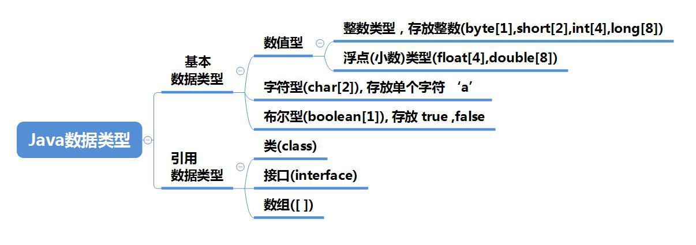
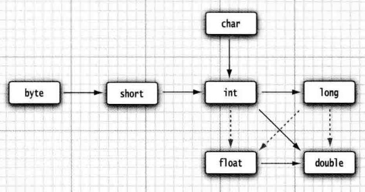

每一种数据都定义了明确的数据类型，在内存中分配了不同大小的内存空间(字节)。



Java是一种强类型语言。必须为每一个变量声明一种类型。在Java中一共有**8种基本类型（primitive type）**，其中有4种整型、2种浮点类型、1种用于表示Unicode编码的字符单元的字符类型char和1种用于表示真值的boolean类型。


## 整型

整型用于表示没有小数部分的数值，它允许是负数。

| **类型**         | **存储需求** | **取值范围**                                                 |
| ---------------- | ------------ | ------------------------------------------------------------ |
| int \[整型\]     | 4字节        | \-2 147 483 648 \~ 2 147 483 647（正好超过20亿）\-231 \~ 231-1 |
| short \[短整型\] | 2字节        | \-32 768 \~ 32 767 \-215 \~ 215-1                         |
| long \[长整型\]  | 8字节        | \-9 223 372 036 854 775 808 \~ 9 223 372 036 854 775 807 \-263 \~ 263-1 |
| byte \[字节\]    | 1字节        | \-128 \~ 127                                                 |


Java各整数类型有固定的范围和字段长度，不受具体OS［操作系统］的影晌，以保证java程序的可移植性。

Java的整型常量（具体值）默认为`int`型，声明long型常量须后加`L`或`l`（如`400000000000L`）。

int 类型最常用，long用于表示大数字。

byte 和 short 类型主要用于特定的应用场合。

* `bit`：计算机中的最小存储单位。
* `byte`：计算机中基本存储单元。
* `1 byte = 8 bit`


从Java 7开始，加上前缀 0b 或 0B 就可以写二进制数。可以为数字字面量加下划线（如1\_000\_000）。

* 十六进制数值前缀：0X或0x（如0xCAFE）。
* 八进制数值前缀：0（如010）。
* 二进制数值前缀：0B或0b（如0b1001）。


```java
public static void main(String[] args) {
    // Java的整型常量（具体值）默认为int型，声明long型常量须后加L或l
    int n1 = 1; // int类型 4字节
    //int n2 = 2L;  // 2L是long类型，直接赋值给int类型会报错
    long n3 = 3L;   // 这样不会报错
}
```


## 浮点类型

浮点类型用于表示有小数部分的数值。`浮点数=符号位+指数位+尾数位`

尾数部分可能丢失，造成精度损失(小数都是近似值)。

| **类型**          | **存储需求** | **取值范围**                                         |
| ----------------- | ------------ | ---------------------------------------------------- |
| float \[单精度\]  | 4字节        | 大约±3.402 823 47E+38F（有效位数为6\~7位）           |
| double \[双精度\] | 8字节        | 大约±1.797 693 134 862 315 70E+308（有效位数为15位） |

与整数类型类似，Java浮点类型也有固定的范围和字段长度，不受具体OS的影晌。

Java的浮点型常量（具体值）默认为double型，声明float型变量须后加 f 或 F（如3.14F），也可以在浮点数值后加面添加后缀D或d来表示double类型（如3.14D）。


**浮点型常量有两种表示形式：**

* 十进制数形式：如：5.12、512.0f、.512 （必须有小数点）
* 科学计数法形式：如：5.12e2［5.12\*10的2次方］、5.12E-2 ［5.12/10的2次方］

通常情况下，应该使用double型，因为它比float型更精确。

对运算结果是小数的进行相等判断时，应该是以两个数的差值的绝对值，在某个精度范围类判断。

```java
public static void main(String[] args) {
    //  Java的浮点型常量（具体值）默认为double型，声明float型变量须后加 f 或 F
    //float num1 = 1.1; // 会报错，float类型需要加上f或者F
    float num2 = 1.1f;

    double num3 = 1.1;
    double num4 = 1.1F;
    // 十进制数形式：如：5.12、512.0f、.512 （必须有小数点）
    double num5 = .512; // 等价于0.512
    System.out.println(num5);
    // 科学计数法形式：如：5.12e2［5.12*10的2次方］、5.12E-2 ［5.12/10的2次方］
    double num6 = 5.12e2;
    double num7 = 5.12e-2;
    // 通常情况下，应该使用double型，因为它比float型更精确。
    double num8 = 2.1234567851;
    float num9 = 2.1234567851F;
    // 浮点数精度问题
    double num10 = 2.7; // 结果：2.7
    double num11 = 8.1 / 3; // 结果：2.6999999999999997
    if(num10 == num11) {
        // 不会进入该条件判断，因为num10和num11不相等
        System.out.println("相等");
    }
    // 正确的写法    如果差值小于0.0001，则认为相等
    if (Math.abs(num11 - num10) < 0.0001) {
        System.out.println("认为相等");
    }
}
```


可以使用十六进制数表示浮点数值（如`0.125=2-3`，可表示成`0x1.0p-3`），在十六进制表示法中，尾数采用十六进制，p表示指数，指数采用十进制，指数的基数是2

**用于表示溢出和出错情况的三个特殊的浮点数值：**

* 正无穷大（`Double.POSITIVE_INFINITY`）
* 负无穷大（`Double.NEGATIVE_INFINITY`）
* NaN（不是一个数字，`Double.NaN`）

这三个特殊的值，可以以相应的Float类型的常量表示，在实际应用中很少遇到。

**检测一个特定的值是否等于Double.NaN:**

```java
if(Double.isNaN(x))
```


## boolean类型

`boolean`（布尔）类型有两个值：`false`和`true`，用来判定逻辑条件，没有null值。**占1个字节。**整型值和布尔值之间不能进行相互转换。

```java
public static void main(String[] args) {
    boolean isPass = true;
    if (isPass == true) {
        System.out.println("成绩合格");
    } else {
        System.out.println("成绩不合格，下次努力");
    }
}
```


## char类型

char类型用于表示单个字符，也可以用于表示Unicode字符，是两个字节(可以存放汉字)。

char类型的字面量值要用单引号括起来。

char类型的值可以表示为十六进制值，其范围从`\u0000`到`\Uffff`。

在Java中char的本质是一个整数，在输出时，是Unicode码对应的字符。是可以进行运算的。


字符型存储到计算机中，需要将字符对应的码值(整数)找到，比如`'a'`：

* **存储：**'a' → 码值97 → 二进制(110 0001) → 存储
* **读取：**二进制(110 0001) → 97 → 'a' → 显示


```java
public static void main(String[] args) {
    char c1  = 'a';
    char c2  = '\t';
    char c3  = '韩';
    char c4  = 97;
    System.out.println(c1);
    System.out.println(c2);
    System.out.println(c3);
    System.out.println(c4);
    System.out.println("------------------------");
    char c5 = 38889;
    System.out.println(c5);
    char c6 = 'a';
    System.out.println((int)c6);
    // 在 char类型 和 int类型 计算的过程中，
    // char类型 的字符先查询编码表，得到97，再和10求和，结果为107。
    // char类型提升为了int类型。char类型内存2个字节，int类型内存4个字节。
    System.out.println(c6 + 10);
}
```


## 数据类型转换

### 自动类型转换

将 `取值范围小的类型` 自动提升为 `取值范围大的类型` 。代码不需要进行特殊处理，自动完成。

> char → int → long → float → double

> byte → short → int → long → float → double


精度小的类型自动转换为精度大的类型

```java
public static void main(String[] args) {
    int a = 'a';    // 编译成功
    double b = 10;  // 编译成功
    int n1 = 10;
    // float f1 = n1 + 1.1; // 编译失败
    double d1 = n1 + 1.1;   // 编译成功
    float f2 = n1 +1.1F;    // 编译成功
    // 当把一个具体的数赋值给byte时，先判断该数是否在byte范围(-128~127)内，如果是就赋值成功
    byte b1 = 10;   // 编译成功
    // byte b2 = 1000;  // 编译失败
    int n2 = 1;
    // 如果是变量赋值，先判断该数的类型
    // byte b3 = n2;    // 编译失败
    // byte、short和char不能相互自动转换
    // char c1 = b1;    // 编译失败
    // byte、short和char可以进行计算，计算时会先转换为int
    byte b4 = 1;
    short s1 = 1;
    // short s2 = b4 + s1;  // 编译错误
    int n3 = b4 + s1;   // 编译成功
    // byte b5 = b1 + b4;   // 编译失败
    byte n100 = 1;
    short n200 = 100;
    int n300 = 5;
    double n400 = 20;
    double n500 = n100 + n200 + n300 + n400;    // 结果是double类型，编译成功
    float n500 = n100 + n200 + n300 + n400;     // 结果是double类型，编译失败
    int n500 = n100 + n200 + n300 + n400;       // 结果是double类型，编译失败
}
```


> 有多种类型的数据混合运算时，系统自动将所有数据类型转换成容量最大的数据类型，然后再进行计算。

> byte、short和char之间不会相互自动转换，但是可以进行计算，计算会转换为int类型。

> boolean类型不参与转换。





6个实心箭头，表示无信息丢失的转换；有 3 个虚箭头，表示可能有精度损失的转换。

* 如果两个操作数中有一个是 double 类型， 另一个操作数就会转换为 double 类型。
* 否则，如果其中一个操作数是 float 类型，另一个操作数将会转换为 float 类型。
* 否则， 如果其中一个操作数是 long 类型， 另一个操作数将会转换为 long 类型。
* 否则， 两个操作数都将被转换为 int 类型。


### 强制类型转换

将 `取值范围大的类型` 强制转换成 `取值范围小的类型` 。代码需要进行特殊的格式处理，不能自动完成。

* `数据类型 变量名 = （数据类型）被转数据值;`

> 强转符号只针对最近的操作数有效，可以使用小括号提升优先级

> char类型可以保存int的常量值，但不能保存int类型的变量值，所以需要强转

> byte、short和char之间进行计算会转换为int类型

```java
public static void main(String[] args) {
    // 强转只针对最近的操作数有效，这里只对10有效
    // int x = (int) 10 * 3.5 + 6 * 1.5;    // 编译失败

    // 可以使用小括号提高优先级
    int y = (int) (10 * 3.5 + 6 * 1.5);    // 编译成功
    System.out.println(y);

    // char类型可以保存int常量，但是不能保存int变量
    char c1 = 100;
    int n1 = 100;
    // char c2 = n1;    // 编译失败
    char c3 = (char) n1;    // 编译成功
    System.out.println(c3);
}
```

* int 强制转成 short 砍掉2个字节，可能造成数据丢失。
* boolean类型不能发生数据类型转换。
* 浮点转成整数，直接取消小数点，可能造成数据损失精度。

如果将一个数值强制转换为另一种类型， 而又超出了目标类型的表示范围，结果就会截断成一个完全不同的值。例如，（byte ) 300 的实际值为 44。


### 基本数据类型和String的转换

在程序开发中，需要经常将基本数据类型转换为`String`类型，或者将`String`类型转换为基本数据类型。

* **基本数据类型转String类型：** 将基本数据类型的值 +`""`即可
* **String类型转基本数据类型：** 通过基本类型的包装类调用`parseXXX`方法

在将String类型转成基本数据类型时，要确保String类型能够转成有效的数据。比如，可以把`"123"`，转成一个整数，但是不能把`"hello"`转成一个整数。如果格式不正确，就会抛出异常，程序就会终止。

```java
public static void main(String[] args) {
    // 基本数据类型转String
    int n1 = 100;
    float f1 = 1.1F;
    double d1 = 4.5;
    boolean b1 = true;
    String s1 = n1 + "";
    String s2 = f1 + "";
    String s3 = d1 + "";
    String s4 = b1 + "";
    System.out.println(s1 + " " + s2 + " " + s3 + " " + s4);

    // String类型转基本数据类型
    // 使用基本数据类型的包装类的相应方法得到基本数据类型
    String s5 = "123";
    int n2 = Integer.parseInt(s5);
    double d2 = Double.parseDouble(s5);
    float f2 = Float.parseFloat(s5);
    long l2 = Long.parseLong(s5);
    byte b2 = Byte.parseByte(s5);
    boolean b = Boolean.parseBoolean("true");
    short s = Short.parseShort(s5);

    System.out.println(n2 + " " + d2 + " " + f2 + " " + l2 + " " 
        + b2 + " " + b + " " + s);

    // 将字符串转为char，通常是取字符串中的某一个字符
    System.out.println(s5.charAt(0));    // 代表取s5中的第一个字符

    String s6 = "hello";
    int num = Integer.parseInt(s6);    // 编译正确，运行异常
    System.out.println(num);
}
```

