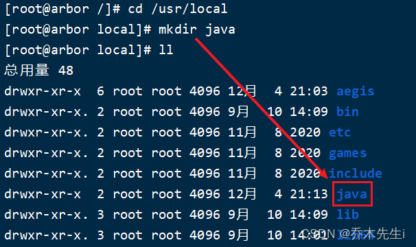
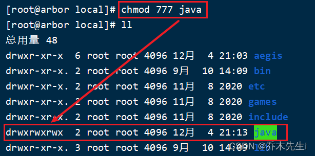
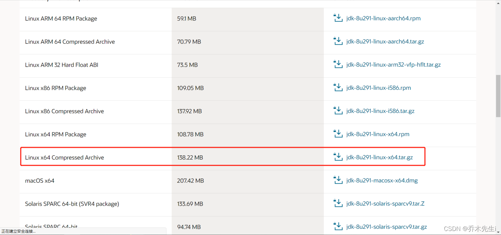
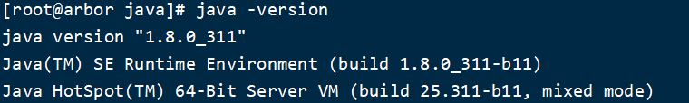

---
tags:
- Java
- 软件安装
- Linux
---


**第一步：**

1. 检查系统是否自带jdk，输入命令 `java -version`
2. 如果系统有jdk，则输入：`rpm -qa | grep java` 检测jdk的安装包（rpm命令符没有时要下载一个输入：`apt-get install + 命令名称`）
3. 接着进行一个个删除包，输入：`rpm -e --nodeps + 包名`
4. 最后再次：`rpm -qa | grep java`检查是否删除完即可

没有的话如下图


**第二步：** 创建一个java的文件夹，通常安装到`/usr/local`目录下




**第三步：** 修改文件夹的权限 

输入：`chmod 777 java`




**第四步：** 下载Linux的jdk，根据自己系统版本选择




**第五步：** 将下载的文件传输到服务器中


**第六步：** 解压这个文件

输入：`tar -zxvf 文件名`


**第七步：** 编辑配置文件，进入编辑

输入：`vim /etc/profile`


**第八步：** 添加配置，然后保存并退出

这里java的版本号记得写对

```java
export JAVA_HOME=/usr/local/java/jdk1.8.0_311
export JRE_HOME=${JAVA_HOME}/jre
export CLASSPATH=.:${JAVA_HOME}/lib:${JRE_HOME}/lib:$CLASSPATH
export JAVA_PATH=${JAVA_HOME}/bin:${JRE_HOME}/bin
export PATH=$PATH:${JAVA_PATH}
```


**第九步：** 让配置文件生效

输入：`source /etc/profile`


**第十步：** 验证

输入：`java -version`


