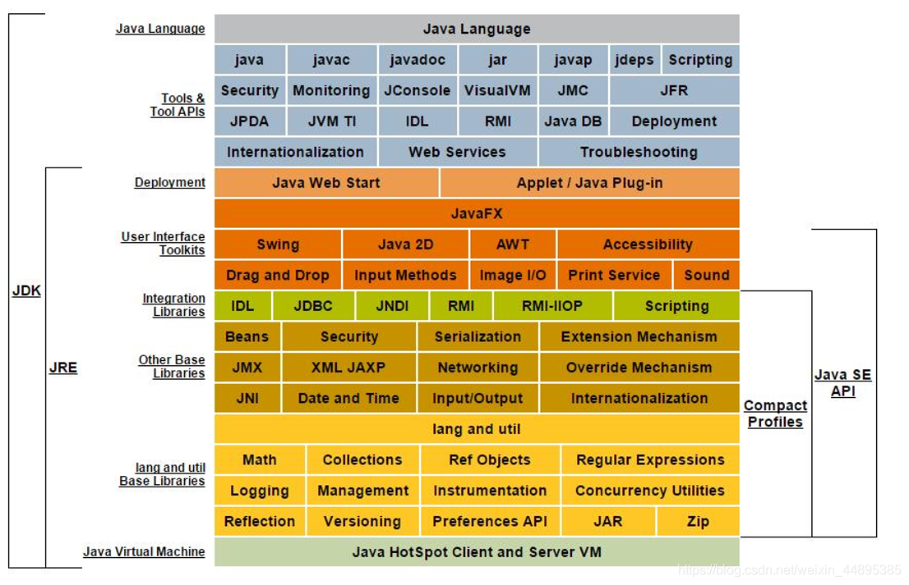

---
tags:
  - Java
  - 软件安装
  - Windows
---

## JDK、JRE
  
**JDK(Java Development Kit Java开发工具包)：**  
  
> JDK是提供给Java开发人员使用的，其中包含了java的开发工具，也包括了JRE。所以安装了JDK，就不用在单独安装JRE了。  
> 其中的开发工具：编译工具(javac.exe) 打包工具(jar.exe)等  
  
**JRE(Java Runtime Environment Java运行环境)：**  
  
> 包括Java虚拟机(JVM Java Virtual Machine)和Java程序所需的核心类库等，如果想要运行一个开发好的Java程序，计算机中只需要安装JRE即可。  
  

  
JDK = JRE + 开发工具集（例如Javac编译工具等）  
  
JRE = JVM + Java SE标准类库  

  
## Java虚拟机的内存划分
  
为了提高运算效率，就对空间进行了不同区域的划分，因为每一片区域都有特定的处理数据方式和内存管理方式。  
  
| 区域名称  | 作用                              |  
|:------|:--------------------------------|  
| 寄存器   | 给CPU使用，和开发无关。                   |  
| 本地方法栈 | JVM在使用操作系统功能的时候使用，和开发无关。        |  
| 方法区   | 存储可以运行的class文件。                 |  
| 堆内存   | 存储对象或者数组，new来创建的，都存储在堆内存。       |  
| 方法栈   | 方法运行时使用的内存，比如main方法运行，进入方法栈中执行。 |  
  
## 下载、安装
  
安装路径不要有中文或者空格等特殊符号。如果操作系统是64位的，软件尽量选择支持64位的（除非软件本身不区分）。当提示安装 JRE  时，正常在JDK安装时已经装过了，但是为了后续使用Eclipse等开发工具不报错，建议也根据提示安装JRE。  
  
## Windows 配置环境变量
  
在dos命令行中敲入javac，出现错误提示，是因为当前执行的程序在当前目录下如果不存在，windows系统会在系统中已有的一个名为path的环境变量指定的目录中查找。如果仍未找到，会出现以上的错误提示。所以进入到  
jdk安装路径\bin目录下，执行javac，会看到javac参数提示信息。  
  
每次执行 java 的工具都要进入到bin目录下，是非常麻烦的。根据windows系统在查找可执行程序的原理，可以将java工具所在路径定义到  
path 环境变量中，让系统帮我们去找运行执行的程序。  
  
配置方法：  
  
1. 我的电脑--属性--高级系统设置--环境变量  
2. 编辑 path 环境变量，在变量值开始处加上java工具所在目录，后面用 “ ; ”和其他值分隔 开即可。  
3. 打开DOS命令行，任意目录下敲入javac。如果出现javac 的参数信息，配置成功。  

  
> 变量名：`JAVA_HOME`  
> 变量值：`C:\Program Files (x86)\Java\jdk1.8.0_91`  
> 要根据自己的实际路径配置  
  
> 变量名：`Path`  
> 变量值：`%JAVA_HOME%\bin;%JAVA_HOME%\jre\bin;`  
  
> 检查：运行cmd  
> 分别输入：java、javac、java -version