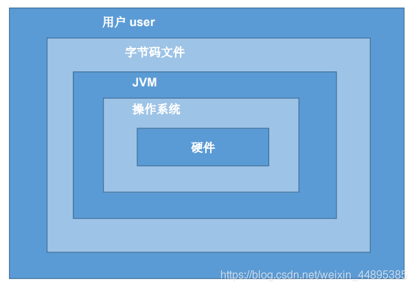

---
tags:
  - Java
---

  
## 计算机编程语言

计算机语言：人与计算机交流的方式。计算机语言有很多种。如：C，C++，Java，PHP，Kotlin，Python，Scala等。  
  
**第一代语言：机器语言**  
  
> 指令以二进制代码形式存在。  
  
**第二代语言：汇编语言**  
  
> 使用助记符表示一条机器指令。  
> 

  
**第三代语言：高级语言**  
  
> - C、Pascal、Fortran面向过程的语言  
> - C++面向过程/面向对象  
> - Java跨平台的纯面向对象的语言  
> - .NET跨语言的平台  
> - Python、Scala…  
  
## Java语言概述
  
Java是**SUN(Stanford University Network，斯坦福大学网络公司) 1995**年推出的一门高级编程语言。  
  
是一种面向Internet的编程语言。Java一开始富有吸引力是因为Java程序可以在Web浏览器中运行。这些Java程序被称为Java小程序（applet）。applet使用现代的图形用户界面与Web用户进行交互。  
applet内嵌在HTML代码中。  
  
随着Java技术在web方面的不断成熟，已经成为Web应用程序的首选开发语言。  
  
后台开发：Java、PHP、Python、Go、Node.js  
  
### Java简史
  
> 1991年 Green项目，开发语言最初命名为Oak (橡树)  
> 1994年，开发组意识到Oak 非常适合于互联网  
> 1996年，发布JDK1.0，约8.3万个网页应用Java技术来制作  
> 1997年，发布JDK 1.1，JavaOne会议召开，创当时全球同类会议规模之最  
> 1998年，发布JDK 1.2，同年发布企业平台J2EE  
> 1999年，Java分成J2SE、J2EE和J2ME，JSP/Servlet技术诞生  
> **2004年，发布里程碑式版本：JDK1.5，为突出此版本的重要性，更名为JDK 5.0**  
> 2005年，J2SE -> JavaSE，J2EE -> JavaEE，J2ME -> JavaME  
> 2009年，Oracle公司收购SUN，交易价格74亿美元  
> 2011年，发布JDK 7.0  
> **2014年，发布JDK8.0，是继JDK 5.0以来变化最大的版本**  
> 2017年，发布JDK 9.0，最大限度实现模块化  
> 2018年3月，发布JDK 10.0，版本号也称为18.3  
> 2018年9月，发布JDK 11.0，版本号也称为18.9  
> 2019年3月，发布JDK 12.0，Java 12是短期支持版本，可在下一个版本发布之前获得Oracle的商业支持。  
> 2019年9月，发布JDK 13.0 ，此版本中添加了“文本块”。  
  
### Java技术体系平台
  
Java SE(Java Standard Edition)标准版：  
  
> 支持面向桌面级应用（如Windows下的应用程序）的Java平台，提供了完整的Java核心API，此版本以前称为J2SE  
  
Java EE(Java Enterprise Edition)企业版：  
  
> 是为开发企业环境下的应用程序提供的一套解决方案。该技术体系中包含的技术如:Servlet、Jsp等，主要针对于Web应用程序开发。版本以前称为J2EE  
  
Java ME(Java Micro Edition)小型版：  
  
> 支持Java程序运行在移动终端（手机、PDA）上的平台，对Java API有所精简，并加入了针对移动终端的支持，此版本以前称为J2ME  
  
Java Card：  
  
> 支持一些Java小程序（Applets）运行在小内存设备（如智能卡）上的平台  
  
### Java在各领域的应用
  
从Java的应用领域来分，Java语言的应用方向主要表现在以下几个方面：  
  
- **企业级应用：** 主要指复杂的大企业的软件系统、各种类型的网站。Java的安全机制以及它的跨平台的优势，使它在分布式系统领域开发中有广泛应用。应用领域包括金融、电信、交通、电子商务等。  
- **Android平台应用：** Android应用程序使用Java语言编写。Android开发水平的高低很大程度上取决于Java语言核心能力是否扎实。  
- **大数据平台开发：** 各类框架有Hadoop，spark，storm，flink等，就这类技术生态圈来讲，还有各种中间件如flume，kafka，sqoop等等  
  ，这些框架以及工具大多数是用Java编写而成，但提供诸如Java，scala，Python，R等各种语言API供编程。  
- **移动领域应用：** 主要表现在消费和嵌入式领域，是指在各种小型设备上的应用，包括手机、PDA、机顶盒、汽车通信设备等。  
  
### Java语言的诞生
  
java之父James Gosling团队在开发”Green”项目时，发现C缺少垃圾回收系统，还有可移植的安全性、分布程序设计和多线程功能。最后，他们想要一种易于移植到各种设备上的平台。  
  
Java确实是从C语言和C++语言继承了许多成份，甚至可以将Java看成是**类C语言**  
发展和衍生的产物。比如Java语言的变量声明，操作符形式，参数传递，流程控制等方面和C语言、C++语言完全相同。但同时，Java是一个*  
*纯粹的面向对象**的程序设计语言，它继承了C++语言面向对象技术的核心。Java **舍弃了C语言中容易引起错误的指针**  
（以引用取代）、运算符重载（operatoroverloading）、多重继承（以接口取代）等特性， **增加了垃圾回收器功能**  
用于回收不再被引用的对象所占据的内存空间。JDK1.5又引入了泛型编程（Generic Programming）、类型安全的枚举、不定长参数和自动装/拆箱。  
  
### 主要特性
  
- **Java语言是易学的。** Java语言的语法与C语言和C++语言很接近，使得大多数程序员很容易学习和使用Java。  
- **Java语言是强制面向对象的。** Java语言提供类、接口和继承等原语，为了简单起见，只支持类之间的单继承，但支持接口之间的多继承，并支持类与接口之间的实现机制（关键字为implements）。  
- **Java语言是分布式的。** Java语言支持Internet应用的开发，在基本的Java应用编程接口中有一个网络应用编程接口（java  
  net），它提供了用于网络应用编程的类库，包括URL、URLConnection、Socket、ServerSocket等。Java的RMI（远程方法激活）机制也是开发分布式应用的重要手段。  
- **Java语言是健壮的。** Java的强类型机制、异常处理、垃圾的自动收集等是- Java程序健壮性的重要保证。对指针的丢弃是Java的明智选择。  
- **Java语言是安全的。** Java通常被用在网络环境中，为此，Java提供了一个安全机制以防恶意代码的攻击。如：安全防范机制（类ClassLoader），如分配不同的名字空间以防替代本地的同名类、字节代码检查。  
- **Java语言是体系结构中立的。** Java程序（后缀为java的文件）在Java平台上被编译为体系结构中立的字节码格式（后缀为class的文件），然后可以在实现这个Java平台的任何系统中运行。  
- **Java语言是解释型的。** 如前所述，Java程序在Java平台上被编译为字节码格式，然后可以在实现这个Java平台的任何系统的解释器中运行。  
  Java是性能略高的。与那些解释型的高级脚本语言相比，Java的性能还是较优的。  
- **Java语言是原生支持多线程的。** 在Java语言中，线程是一种特殊的对象，它必须由Thread类或其子（孙）类来创建。  
  
### Java语言运行机制及运行过程
  
#### Java语言的特点  
  
**特点一：面向对象**  
  
> **两个基本概念：** 类、对象  
> **三大特性：** 封装、继承、多态  
  
  
  
**特点二：健壮性**  
  
> 吸收了C/C++语言的优点，但去掉了其影响程序健壮性的部分（如指针、内存的申请与释放等），提供了一个相对安全的内存管理和访问机制  
  
**特点三：跨平台性**  
  
> **跨平台性：** 通过Java语言编写的应用程序在不同的系统平台上都可以运行。“**Write once , Run Anywhere**”  
> **原理：** 只要在需要运行 java 应用程序的操作系统上，先安装一个Java虚拟机 (JVM **J**ava **V**irtual **M**achine)  
> 即可。由JVM来负责Java程序在该系统中的运行。  
  
#### 跨平台性  
  
因为有了JVM，同一个Java 程序在三个不同的操作系统中都可以执行。这样就实现了Java 程序的跨平台性。  

  
#### Java虚拟机 (Java Virtal Machine)  
  
JVM是一个虚拟的计算机，具有指令集并使用不同的存储区域。负责执行指令，管理数据、内存、寄存器。  
  
对于不同的平台，有不同的虚拟机。只有某平台提供了对应的java虚拟机，java程序才可在此平台运行。Java虚拟机机制屏蔽了底层运行平台的差别，实现了“一次编译，到处运行”。  

  
#### 垃圾回收  
  
不再使用的内存空间应回收—— 垃圾回收。在C/C++等语言中，由程序员负责回收无用内存。Java 语言消除了程序员回收无用内存空间的责任：它提供一种系统级线程跟踪存储空  
间的分配情况。并在JVM空闲时，检查并释放那些可被释放的存储空间。  
  
垃圾回收在Java程序运行过程中自动进行，程序员无法精确控制和干预。Java程序还是会出现内存泄漏和内存溢出的问题。  
  
