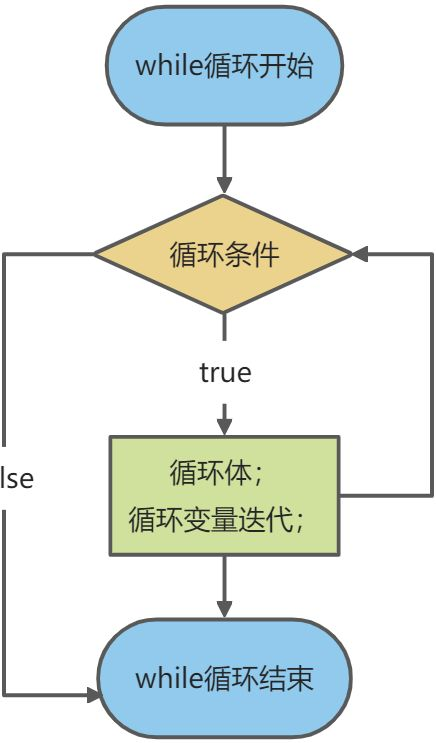

## 顺序控制

程序从上到下逐行执行，中间没有任何判断和跳转。

```java
public class Test{
    //正确形式
    int a = 1;
    int b = a;

    // 错误形式
    int c = d + 1;
    int d = 2;
}
```


## 块作用域

块（即复合语句）是指由一对大括号括起来的若干条简单的 Java 语句。块确定了变量的作用域。一个块可以嵌套在另一个块中。不能在嵌套的两个块中声明同名的变量。

```java
public static void main(String[] args) {
    int n;
    ...
    {
        int k; 
        // 这里就不能定义变量n了
    } // k的作用域只到这里
}
```


## 分支控制

如果判断的具体数值不多，而且符合 byte、short、int、char、enum\[枚举\]、String 这6种类型，建议使用 swtich语句。

对于区间判断，结果为 boolean 类型判断，建议使用 if，if 的使用范围更广。

### 单分支 if

```java
if(条件) {
    语句体;
}
```


当条件表达式为`ture`时，会执行 { } 中的代码。如果为`false`，则不执行。如果 { } 中只有一条语句，则可以省略 { }，建议写上。

**执行流程：**

1. 首先判断条件是true还是false
2. 如果是true就执行语句体
3. 如果是false就不执行语句体

```java
import java.util.Scanner;
public class If01 {
    public static void main(String[] args) {
        // 定义一个scanner对象
        Scanner scanner = new Scanner(System.in);
        System.out.print("请输入大小：");
        // 把大小保存到一个int变量age中
        int size = scanner.nextInt();
        // 使用if判断，输出对应的信息
        if (size >= 18) {
            System.out.println("我的很大，你忍一下");
        }
        System.out.println("程序继续运行....");
        scanner.close();
    }
}
```


### 双分支 if...else

```java
if(条件) { 
    语句体1; 
}else { 
    语句体2; 
}
```


当条件表达式成立，执行语句体1，否则执行语句体2。

**执行流程：**

1. 首先判断条件是true还是false
2. 如果是true就执行语句体1
3. 如果是false就执行语句体2

```java
import java.util.Scanner;
public class If02 {
    public static void main(String[] args) {
        // 定义一个scanner对象
        Scanner scanner = new Scanner(System.in);
        System.out.print("请输入大小：");
        // 把size保存到一个int变量size中
        int size = scanner.nextInt();
        // 使用if判断，输出对应的信息
        if (size >= 18) {
            System.out.println("我的很大，你忍一下");
        } else {
            System.out.println("吴签");
        }
        System.out.println("程序继续运行....");
        scanner.close();
    }
}
```


### 多分支 if...else if ...else

```java
if (判断条件1) { 
    执行语句1; 
} else if (判断条件2) { 
    执行语句2; 
} 
... 
}else if (判断条件n) { 
    执行语句n; 
} else { 
    执行语句n+1; 
}
```


多分支可以没有`else`，如果所有的条件都不成立则不执行分支中的代码。如果有`else`，当所有的条件不成立时，则默认执行`else`代码块中的代码。

**执行流程：**

1. 首先判断关系表达式1看其结果是true还是false
2. 如果是true就执行语句体1
3. 如果是false就继续判断关系表达式2看其结果是true还是false
4. 如果是true就执行语句体2
5. 如果是false就继续判断关系表达式…看其结果是true还是false
6. …
7. 如果没有任何关系表达式为true，就执行语句体n+1。

```java
import java.util.Scanner;
public class If03 {
    public static void main(String[] args) {
        /* 输入张三的信用分，
         * 如果信用分为100，输出信用极好
         * 信用分为(80-99]，输出信用优秀
         * 信用分为(60-80]，输出信用一般
         * 其他情况，输出信用不及格
         */
        // 定义一个scanner对象
        Scanner scanner = new Scanner(System.in);
        System.out.print("请输入信用分数(1-100)：");
        // 把信用分保存到一个int变量grade中
        int grade = scanner.nextInt();
        if (grade >= 1 && grade <= 100) {
            // 使用if判断，输出对应的信息
            if (grade == 100) {
                System.out.println("信用极好");
            } else if (grade > 80 && grade <= 99) {
                System.out.println("信用优秀");
            } else if (grade > 60 && grade <= 80) {
                System.out.println("信用一般");
            } else {
                System.out.println("信用不及格");
            }
            scanner.close();
        } else {
            System.out.println("信用分需要在1-100，请重新输入！");
        }
    }
}
```


### 嵌套分支

在一个分支结构中完整的嵌套了另一个完整的分支结构，里面的分支结构成为内层分支，外面的分支结构成为外层分支。建议不要超过3层，可读性不好。

```java
if() {
    if() {
        // if - else ...
    } else {
        // if - else
    }
}
```


## 选择语句 switch

```java
switch(表达式) { 
    case 常量值1: 
        语句体1; 
        break; 
    case 常量值2: 
        语句体2; 
        break; 
    ... 
    default: 
        语句体n+1; 
        break; 
}
```

* switch语句中，case后面的值不可以重复，必须是常量，并且类型保持一致或者可以自动转型。
* 表达式的数据类型，可以是byte，short，int，char，enum（枚举），JDK7后可以接收字符串。
* 如果case的后面不写break，将出现穿透现象，不会判断下一个case的值，直接向后运行，直到遇到break，或者整体switch结束。
* 如果都没有匹配上，则执行default中的语句，default也可以不写。

**执行流程**：

1. 首先计算出表达式的值
2. 和case依次比较，一旦有对应的值，就会执行相应的语句，在执行的过程中，遇到break就会结束。
3. 如果所有的case都和表达式的值不匹配，就会执行default语句体部分，然后程序结束掉。

```java
import java.util.Scanner;
public class Switch01 {
    public static void main(String[] args) {
        // 请编写一个程序，该程序可以接收一个字符，比如：a,b,c,d,e,f,g
        // a 表示星期一，b 表示星期二 …
        // 根据用户的输入显示相应的信息.要求使用 switch 语句完成
        Scanner scanner = new Scanner(System.in);
        System.out.println("请输入一个字符(a-g)：");
        char c1 = scanner.next().charAt(0); // .charAt(0) 表示获取第一个字符
        char c2 = 'e';
        switch (c1) {
            case 'a':
                System.out.println("今天是星期一");
                break;
            case 'b':
                System.out.println("今天是星期二");
                break;
            case 'c':
                System.out.println("今天是星期三");
//                break;
                // 会出现穿透情况

            case 'd':
                System.out.println("今天是星期四");
                break;

            // case 后面不能加变量，必须是常量或者常量表达式
//            case c2:
//                System.out.println("今天是星期五");
//                break;

            case 'f':
                System.out.println("今天是星期六");
                break;
                // case后的类型必须和switch表达式中结果的类型一致或者可以自动转成相互比较的类型

                //            case "g":
//                System.out.println("今天是星期日");
//                break;

              // default 语句可以不写
//            default:
//                System.out.println("你输入的字符不对，没有匹配的");
        }
        System.out.println("switch退出了，继续执行程序");
    }
}
```


## 循环控制

控制条件语句所控制的变量，在for循环结束后，就不能再被访问，而while循环结束还可以继续使用。原因是for循环结束，该变量就从内存中消失，能够提高内存的使用效率。在已知循环次数的时候使用推荐使用for，循环次数未知的时推荐使用while。

### 循环语句 for

```java
for(初始化表达式①; 布尔表达式②; 步进表达式④){ 
    循环体③ 
}
```


**循环结构的基本组成部分，一般可以分成四部分：**

* 初始化语句：在循环开始最初执行，而且只做唯一一次。
* 条件判断：如果成立，则循环继续；如果不成立，则循环退出。
* 循环体：重复要做的事情内容，若干行语句。
* 步进语句：每次循环之后都要进行的扫尾工作，每次循环结束之后都要执行一次。


循环条件是返回一个布尔值的表达式。

`for(;循环判断条件;)`中的初始化和变量迭代可以写到其它地方，但是两边的分号不能省略。

循环初始值可以有多条初始化语句，但要求类型一样，并且中间用逗号隔开，循环变量迭代也可以有多条变量迭代语句，中间用逗号隔开。

**执行流程：**

执行顺序：①②③④>②③④>②③④…②不满足为止

1. ①负责完成循环变量初始化
2. ②负责判断是否满足循环条件，不满足则跳出循环
3. ③具体执行的语句
4. ④循环后，循环条件所涉及变量的变化情况

```java
package javase;
public class For01 {
    public static void main(String[] args) {
        // 打印10句“我爱你”
        for (int i = 0; i < 10; i++) {
            System.out.println("我爱你" + i);
        }
        // 初始化语句和步进表达式可以不写
        int a = 0;
        for (; a < 10; ) {
            System.out.println("我不爱你" + a);
            a++;
        }
        // 死循环, 可以使用break跳出
        for (; ; ) {
            break;
        }
        // 初始化和步进表达式可以多句，用逗号分隔
        for (int i = 0, j = 0; i < 10; i++, j += 2) {
            System.out.println("i = " + i + ", j = " + j);
        }
    }
}
```


### 循环语句 while

```java
初始化表达式① 
while(布尔表达式②){ 
    循环体③ 
    步进表达式④ 
}
```


while 循环是先判断再执行语句

**执行流程：**

执行顺序：①②③④>②③④>②③④…②不满足为止。

1. ①负责完成循环变量初始化。
2. ②负责判断是否满足循环条件，不满足则跳出循环。
3. ③具体执行的语句。
4. ④循环后，循环变量的变化情况。



```java
public class While01 {
    public static void main(String[] args) {
        // 输出10句我爱你
        int i = 1;
        while (i <= 10) {
            System.out.println("我爱你" + i++);
        }
        // 输出1-100能被3整除的数
        int num = 1;
        while (num <= 100) {
            System.out.print(num % 3 == 0 ? num + "  " : "");
            num++;
        }
    }
}
```


### 循环语句 do...while

```java
初始化表达式① 
do{ 
    循环体③ 
    步进表达式④ 
}while(布尔表达式②); 
```


do...while 循环先执行，再判断，一定且至少执行一次。最后有个分号。

**执行流程：**

执行顺序：①③④>②③④>②③④…②不满足为止。

1. ①负责完成循环变量初始化。
2. ②负责判断是否满足循环条件，不满足则跳出循环。
3. ③具体执行的语句
4. ④循环后，循环变量的变化情况


```java
public class DoWhile01 {
    public static void main(String[] args) {
        // 输出10次我爱你
        int i = 1;
        do {
            System.out.println("我爱你" + i++);
        } while (i <= 10);
        // 统计1-200之间，能被5整除，但不能被3整除的数
        int count = 0;
        i = 1;
        do {
            if (i % 5 == 0 && i % 3 != 0) {
                System.out.print(i + "  ");
                count++;
            }
        } while (++i <= 200);
        System.out.println("count = " + count);

        Scanner scanner = new Scanner(System.in);
        char a;
        do {
            System.out.println("还钱吗？(y/n)");
            a = scanner.next().charAt(0);
            if (a != 'y') {
                System.out.println("抽死你个小王八犊子");
            }
        } while (a != 'y');
    }
}
```


### 多重循环

将一个循环放在另一个循环体内，就形成了嵌套循环。其中 for，while，do…while 均可以作为外层循环和内层循环。

嵌套循环就是把内层循环当成外层循环的循环体。当只有内层循环的循环条件为 false 时，才会完全跳出内层循环，才可结束外层的当次循环，开始下一次的循环。

设外层循环次数为 m 次，内层为 n 次，则内层循环体实际上需要执行 m\*n 次。

```java
public class MulForExercise {
    public static void main(String[] args) {
        for (int i = 1; i <= 9; i++) {
            for (int j = 1; j <= 9; j++) {
                if (j <= i){
                    System.out.print(j + " * " + i + " = " + (i * j) + "\t");
                }
            }
            System.out.println();
        }
    }
}
```


## 跳出语句

Java 还提供了一种带标签的 break语句，用于跳出多重嵌套的循环语句。标签必须放在希望跳出的最外层循环之前， 并且必须紧跟一个冒号。可以将标签应用到任何语句中， 甚至可以应用到 if语句或者块语句中。continue同理。

跳出语句出现在多层嵌套的语句块中，可以通过标签指明要跳出的是哪一层语句块。如果没有标签，默认退出最近的循环体。跳出语句后指定哪一个标签，就退出到哪里。

```java
Scanner in = new Scanner(System.in);
int n;
read_data:
while (. . .) // 会跳出这个循环
    for (. . .) { // 不会跳出这个循环
        Systen.out.print("Enter a number >= 0: ");
        n = in.nextlntO;
        if (n < 0) 
            break read_data; // 如果条件成立，则跳出read_data的循环
    }
}
if (n < 0) { // 跳出后开始执行此行
    // 处理不好的情况
} else {
    // 进行正常处理
}
```


### break

**break 语句用于终止某个语句块的执行**，一般使用在 switch 或者循环 for，while，do-while中。

```java
{
    // 代码
    break; 
    // 代码
}
```


```java
public class Break01 {
    public static void main(String[] args) {
        // 1-100以内的数求和，当和第一次大于20时的数字是多少
        int sum = 0;
        for (int i = 1; i <= 100; i++) {
            if ((sum += i) >= 20) {
                System.out.println("当前数是：" + i);
                System.out.println("和是：" + sum);
                break;
            }
        }
        Scanner scanner = new Scanner(System.in);
        for (int i = 2; i >= 0; i--) {
            System.out.print("请输入用户名：");
            String username = scanner.nextLine();
            System.out.print("请输入密码：");
            String password = scanner.nextLine();
            if ("丁真".equals(username) && "666".equals(password)) {
                System.out.println("登陆成功！");
                break;
            } else {
                System.out.println("密码错误！！还有" + i + "次机会");
            }
        }
    }
}
```


### continue

结束本次循环，继续下一次的循环

```java
public class Continue0 {
    public static void main(String[] args) {
        label1:
        for (int i = 0; i < 4; i++) {
            lable2:
            for (int j = 0; j < 5; j++) {
                if (j == 2) {
                    // continue;    该写法和continue lable2;等价
                    // continue lable2;
                    continue label1;
                }
                System.out.println("j = " + j);
            }
        }
    }
}
```