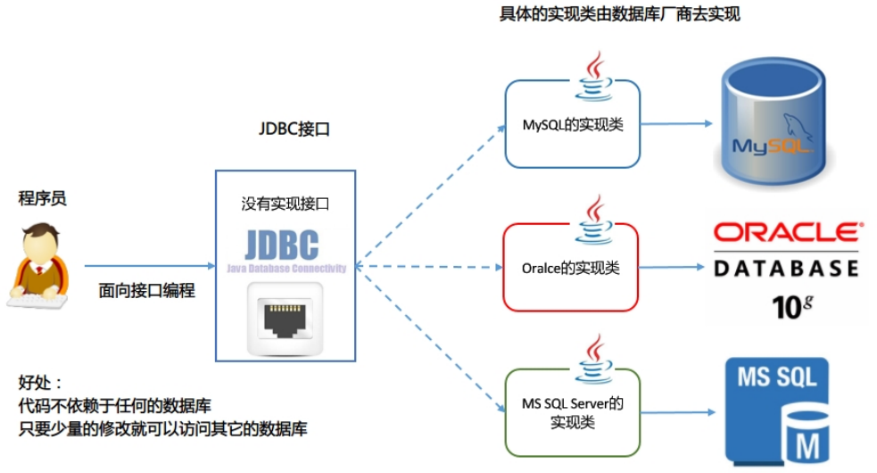
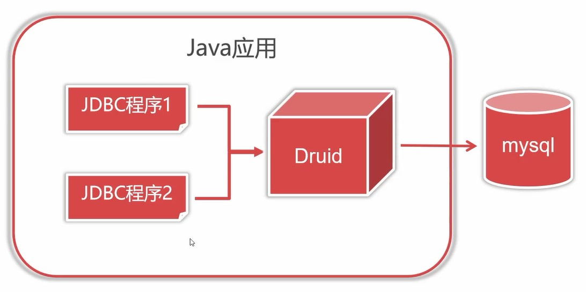

Java数据库连接 Java DataBase Connectivity。JDBC 规范定义接口，具体的实现由各大数据库厂商来实现。

JDBC可让Java通过程序操作关系型数据库，JDBC基于驱动程序实现与数据库的连接与操作。

JDBC 是 Java 访问数据库的标准规范，真正怎么操作数据库还需要具体的实现类，也就是数据库驱动。每个数据库厂商根据自家数据库的通信格式编写好自己数据库的驱动。

使用 JDBC 的好处：

* 程序员如果要开发访问数据库的程序，只需要会调用 JDBC 接口中的方法即可，不用关注类是如何实现的。  
* 使用同一套 Java 代码，进行少量的修改就可以访问其他 JDBC 支持的数据库  




**JDBC开发使用到的包：**

* `java.sql`：所有与 JDBC 访问数据库相关的接口和类
* `javax.sql`：数据库扩展包，提供数据库额外的功能。如：连接池。
* 数据库的驱动：由各大数据库厂商提供，需要额外去下载，是对 JDBC 接口实现的类。


**JDBC核心API：**

* `DriverManager`类：管理和注册数据库驱动、得到数据库连接对象。
* `Connection`接口：一个连接对象，可用于创建 Statement 和 PreparedStatement 对象。
* `Statement`接口：一个 SQL 语句对象，用于将 SQL 语句发送给数据库服务器。
* `PreparedStatemen`接口：一个 SQL 语句对象，是 Statement 的子接口。
* `ResultSet`接口：用于封装数据库查询的结果集，返回给客户端 Java 程序。


## 快速入门

1. 注册和加载驱动（可以省略）
2. 获取连接
3. Connection 获取 Statement 对象，执行SQL语句
4. 返回结果集
5. 释放资源

```java
import java.sql.*;

/**
 * 描述：标准JDBC操作步骤
 */
public class StandardJDBCSample {
    public static void main(String[] args) {
        Connection conn = null;
        try {
            // 一、加载并注册jdbc驱动
            // 先将MySQL的驱动包放入lib文件夹下，然后加载Driver类
            Class.forName("com.mysql.cj.jdbc.Driver");

            // 二、创建数据库连接
            // DriverManager.getConnection()：获取数据库连接
            conn = DriverManager.getConnection(
                    // 数据库连接地址
                    "jdbc:mysql://localhost:3306/arbor_study?useSSL=false&useUnicode=true&characterEncoding=UTF-8&serverTimezone=Asia/Shanghai",
                    // 数据库用户名
                    "root",
                    // 数据库密码
                    "1019"
            );

            // 三、创建Statement对象，用来执行sql语句
            Statement stmt = conn.createStatement();
            // executeQuery()：用于执行查询语句
            // ResultSet：结果集对象
            ResultSet rs = stmt.executeQuery("select * from jdbc_employee where dname = '研发部'");

            // 四、遍历查询结果
            // next()：每执行一次，会提取一条新的记录，有下一行返回true，没有下一行返回false
            // 循环遍历rs中的数据
            while (rs.next()) {
                // 将查询的这一行数据的第一列作为int类型输出，并用int接收
                int eno = rs.getInt(1);  // 1 代表的是字段的位置，就是这一行的第一列，jdbc字段索引从1开始
                String ename = rs.getString("ename");   // ename 代表的是字段的名称
                float salary = rs.getFloat("salary");
                String dname = rs.getString("dname");
                // 输出查询到的记录
                System.out.println(eno + " - " + ename + " - " + salary + " - " + dname);
            }
        } catch (Exception e) {
            e.printStackTrace();
        } finally {

            // 五、关闭连接，释放资源
            try {
                // 如果conn不是空的，并且连接没有被关闭，则执行close()方法关闭连接
                // isClosed()：判断当前连接是否关闭
                if (conn != null && !conn.isClosed()) {
                    // 关闭连接，释放资源
                    conn.close();
                }
            } catch (Exception ex) {
                ex.printStackTrace();
            }
        }
    }
}
```

## 加载和注册驱动

`Class.forName(数据库驱动实现类)`：加载和注册数据库驱动，数据库驱动由 mysql 厂商提供。

| **数据库** | **JDBC驱动类**                                 | **连接字符串**                                               |
| ---------- | ---------------------------------------------- | ------------------------------------------------------------ |
| MySQL5     | `com.mysql.jdbc.Driver`                        | `jdbc:mysql://主机ip:端口/数据库名`                          |
| MySQL8     | `com.mysql.cj.jdbc.Driver`                     | `jdbc:mysql://主机ip:端口/数据库名`                          |
| Oracle     | `oracle.jdbc.driver.OracleDriver`              | `jdbc:oracle:thin:@主机ip:端口:数据库名`                     |
| SQL Server | `com.mircosoft.sqlserver.jdbc.SQLServerDriver` | `jdbc:mircosoft:sqlserver:主机ip:端口:databasename=数据库名` |

从JDBC3开始，目前已经普遍使用的版本。可以不用注册驱动而直接使用。Class.forName这句话可以省略。


## DriverManager类(创建连接)

用于注册/管理JDBC驱动程序，创建数据库连接。

* `Connection getConnection (String url, String user, String password)`：通过连接字符串，用户名，密码来得到数据库的连接对象。
  * `String url`：数据库的连接字符串
  * `String user`：登录数据库的用户名
  * `String password`：登录数据库的密码

* `Connection getConnection (String url, Properties info)`：通过连接字符串，属性对象来得到连接对象。

> 数据库的连接字符串：`jdbc:mysql://[主机ip][:端口]/数据库名?参数列表` ，参数列表采用URL编码，格式：`参数值1=值1&参数值2=值3&...`

```url
jdbc:mysql://localhost:3306/arbor_study?useSSL=false&useUnicode=true&characterEncoding=UTF-8&serverTimezone=Asia/Shanghai&allowPublicKyeRetrieval=true
```


**MySQL连接字符串常用参数**

| 参数名 | 建议参数值 | 说明 |
|----|----|----|
| `useSSL` | true（生产）false（开发）| 是否禁用SSL |
| `useUnicode` | true | 启用unicode编码传输数据 |
| `characterEncoding` | UTF-8 | 使用UTF-8编码传输数据 |
| `serverTimezone` | Asia/Shanghai | 使用东8时区时间，UTC+8 |
| `allowPublicKyeRetrieval` | true | 允许从客户端获取公钥加密传输 |


## Connection接口

用于JDBC与数据库的网络通信对象，具体的实现类由数据库的厂商实现，代表一个连接对象。所有数据库的操作都建立在Connection。

- `Statement createStatement()`：创建一条SQL语句对象
- `PreparedStatement prepareStatement(String sql)`：指定预编译的 SQL 语句，SQL 语句中使用占位符`?`创建一个语句对象


## Statement接口

代表一条语句对象，用于发送 SQL 语句给服务器，用于执行静态 SQL 语句并返回它所生成结果的对象。

- `int executeUpdate(String sql)`：用于发送 DML 语句，增删改的操作，insert、update、delete，返回对数据库影响的行数
- `ResultSet executeQuery(String sql)`：用于发送 DQL 语句，执行查询的操作，select，返回查询的结果集

## PreparedStatement接口

PreparedStatement 是 Statement 接口的子接口，继承于父接口中所有的方法。对SQL进行参数化，预防SQL注入攻击，安全性更高。因为有预先编译的功能，比Statemen执行效率更高。提高了程序的可读性。


**常用方法**
int executeUpdate()：执行DML，增删改的操作，返回影响的行数。不用传参
返回值：返回对数据库影响的行数
ResultSet executeQuery()：执行DQL，查询的操作，返回结果集。不用传参
返回值：查询的结果集


**设置参数的方法**
- `setDouble(int parameterIndex, double x)`：将指定参数设置为给定double值
- `setFloat(int parameterIndex, float x)`：将指定参数设置为给定float值
- `setInt(int parameterIndex, int x)`：将指定参数设置为给定int值
- `setLong(int parameterIndex, long x)`：将指定参数设置为给定long值
- `setObject(int parameterIndex, Object x)`：使用给定对象设置指定参数的值
- `setString(int parameterIndex, String x)`：将指定参数设置为给定String值
时间类型转换


**批处理**
- `addBatch()`：将参数加入批处理任务，添加任务，不执行
- `executeBatch()`：执行批处理任务

```java
// 时间类型转换
SimpleDateFormat sdf = new SimpleDateFormat("yyyy-MM-dd");
Date udHiredate = null ;
try {
udHiredate = sdf.parse(strHiredate);
} catch (ParseException e) {
e.printStackTrace();
}
long time = udHiredate.getTime();
java.sql.Date sdHiredate = new java.sql.Date(time);

// 批处理
preparedStatement = conn.prepareStatement(sql);
for (int i = 200000; i < 300000; i++) {
preparedStatement.setInt(1, i);
preparedStatement.setString(2, "员工" + i);
preparedStatement.setFloat(3, 4000);
preparedStatement.setString(4, "测试部");
preparedStatement.addBatch();// 将参数加入批处理任务，添加任务，不执行
}
preparedStatement.executeBatch();// 执行批处理任务
```

**使用 PreparedStatement 的步骤：**
1. 编写SQL语句，未知内容使用`?`占位：`SELECT * FROM user WHERE name=? AND password=?;`
2. 获得 PreparedStatement 对象
3. 设置实际参数：setXxx(占位符的位置，真实的值)
4. 执行参数化 SQL 语句
5. 关闭资源


## ResultSet接口

封装数据库查询的结果集，对结果集进行遍历，取出每一条记录。


- `boolean next()`：游标向下移动 1 行，返回 boolean 类型，如果还有下一条记录，返回 true，否则返回 false
- `数据类型 getXxx(String str/int no)`：通过字段名，参数是 String 类型，返回不同的类型；通过列号，参数是整数，从 1 开始，返回不同的类型

| SQL 类型 | Jdbc 对应方法 | 返回类型 |
|----|----|----|
| BIT(1) bit(n) | getBoolean() | boolean |
| TINYINT | getByte() byte | byte |
| SMALLINT | getShort() | short |
| INT | getInt() | int |
| BIGINT | getLong() | long |
| CHAR,VARCHAR | getString() | String |
| Text(Clob) Blob | getClob getBlob() | Clob Blob |
| DATE | getDate() | java.sql.Date 只代表日期 |
| TIME | getTime() | java.sql.Time 只表示时间 |
| TIMESTAMP | getTimestamp() | java.sql.Timestamp 同时有日期和时间 |

`java.sql.Date、Time、Timestamp(时间戳)`，三个共同父类是：`java.util.Date`


> 1. 如果光标在第一行之前，使用 `rs.getXX()` 获取列值，报错：Before start of result set
> 2. 如果光标在最后一行之后，使用 `rs.getXX()` 获取列值，报错：After end of result set
> 3. 使用完毕以后要关闭结果集 ResultSet，再关闭 Statement，再关闭 Connection，先开的后关，后开的先关

## JDBC事务管理

**自动提交事务模式：** 指每执行一次写操作SQL，自动提交事务，是JDBC默认行为，此模式无法保证多数据一致性
**手动提交事务模式：** 可保证多数据一致性，但必须手动调用提交/回滚方法

**Connection接口中与事务有关的方法**
- `setAutoCommit(boolean autoCommit)`：参数是 true 或 false，如果设置为 false，表示关闭自动提交，相当于开启事务
- `commit()`：提交事务
- `rollback()`：回滚事务

```java
public class TransactionSample {
    public static void main(String[] args) {
        Connection conn = null;
        PreparedStatement ps = null;
        try {
            conn = DBUtils.getConnection();
            String sql = "insert into jdbc_employee (eno, ename, salary, dname) values (?, ?, ?, ?)";
            // 关闭自动事务，开启手动事务
            conn.setAutoCommit(false);
            for (int i = 1000; i < 2000; i++) {
                // 模拟一个异常
                /*if (i == 1005) {
                    throw new RuntimeException("插入失败");
                }*/
                ps = conn.prepareStatement(sql);
                ps = conn.prepareStatement(sql);
                ps.setInt(1, i);
                ps.setString(2, "员工" + i);
                ps.setFloat(3, 4000);
                ps.setString(4, "测试部");
                ps.executeUpdate();
            }
        } catch (Exception e) {
            e.printStackTrace();
            try {
                // 回滚事务
                if (conn != null && !conn.isClosed()) {
                    conn.rollback();
                }
            } catch (SQLException throwables) {
                throwables.printStackTrace();
            }
        } finally {
            // 提交事务
            try {
                if (conn != null && !conn.isClosed()) {
                    conn.commit();
                }
            } catch (SQLException e) {
                e.printStackTrace();
            }
            DBUtils.closeConnection(null, ps, conn);
        }
    }
}
```

## JDBC 连接池

连接池是一个容器(集合)，存放数据库连接的容器。当系统初始化好后，容器被创建，容器中会申请一些连接对象，当用户来访问数据库时，从容器中获取连接对象，用户访问完之后，会将连接对象归还给容器。

- 节约资源
- 用户访问高效

### 阿里巴巴Druid连接池

Druid是阿里巴巴开源连接池组件，是最好的连接池之一，Druid对数据库连接进行有效管理与重用，最大化程序执行效率，连接池负责创建管理连接，程序只负责取用与归还。



不使用连接池关闭资源的话是关闭连接，使用连接池关闭资源的话，是将连接回收至连接池中。

**第一步：** 导入jar包，下载地址：[https://github.com/alibaba/druid/releases](https://github.com/alibaba/druid/releases)
**第二步：** 定义配置文件 `druid-config.properties`（文件名可以更改）
```
driverClassName=com.mysql.cj.jdbc.Driver
url=jdbc:mysql://localhost:3306/arbor_study?useSSL=false&useUnicode=true&characterEncoding=UTF-8&serverTimezone=Asia/Shanghai&allowPublicKyeRetrieval=true
username=root
password=1019

# 初始连接数
initialSize=10
# 最大连接数
maxActive=20
```

**第三步：** 加载配置文件
**第四步：** 获取DataSource数据源对象
**第五步：** 创建数据库连接
**第六步：** 关闭资源

```java
/**
 * 描述：Druid连接池的配置和使用
 */
public class DruidSample {
    public static void main(String[] args) {
        // 一、加载属性文件
        Properties properties = new Properties();
        // 获取配置文件的路径
        String propertyFile = DruidSample.class.getResource("/druid-config.properties").getPath();
        try {
            // 设置获取到的路径的编码
            propertyFile = URLDecoder.decode(propertyFile, "UTF-8");
            // 加载配置文件
            properties.load(new FileInputStream(propertyFile));
        } catch (Exception e) {
            e.printStackTrace();
        }

        Connection connection = null;
        PreparedStatement preparedStatement = null;
        ResultSet resultSet = null;
        try {
            // 二、获取DataSource数据源对象
            DataSource dataSource = DruidDataSourceFactory.createDataSource(properties);
            // 三、创建数据库连接
            connection = dataSource.getConnection();
            preparedStatement = connection.prepareStatement("select * from jdbc_employee limit 0,10");
            resultSet = preparedStatement.executeQuery();
            while (resultSet.next()) {
                int eno = resultSet.getInt(1);
                String ename = resultSet.getString("ename");
                float salary = resultSet.getFloat("salary");
                String dname = resultSet.getString("dname");
                Date hiredate = resultSet.getDate("hiredate");
                // 输出查询到的记录
                System.out.println(eno + " - " + ename + " - " + salary + " - " + dname + " - " 
                                   + hiredate);
            }
        } catch (Exception e) {
            e.printStackTrace();
        }finally {
            DBUtils.closeConnection(resultSet, preparedStatement, connection);
        }
    }
}
```


### C3P0连接池

**第一步：** 导入jar包 (两个jar包) ，下载地址：[https://sourceforge.net/projects/c3p0/](https://sourceforge.net/projects/c3p0/)
**第二步：** 定义配置文件 `c3p0-config.xml`（文件名固定）
```xml
<?xml version="1.0" encoding="UTF-8" ?>
<c3p0-config>
    <default-config>
        <property name="driverClass">com.mysql.cj.jdbc.Driver</property>
        <property name="jdbcUrl">jdbc:mysql://localhost:3306/arbor_study?useSSL=false&amp;useUnicode=true&amp;characterEncoding=UTF-8&amp;serverTimezone=Asia/Shanghai&amp;allowPublicKyeRetrieval=true</property>
        <property name="user">root</property>
        <property name="password">1019</property>

        <!--初始连接数-->
        <property name="initialPoolSize">10</property>
        <!--最大连接数-->
        <property name="maxPoolSize">20</property>
    </default-config>
</c3p0-config>
```

**第三步：** 加载配置文件，并创建DataSource
**第四步：** 创建数据库连接
**第五步：** 关闭资源

```java
/**
 * 描述：C3P0连接池的配置和使用
 */
public class C3P0Sample {
    public static void main(String[] args) {
        // 一、加载配置文件，并创建DataSource
        DataSource dataSource = new ComboPooledDataSource();

        Connection connection = null;
        PreparedStatement preparedStatement = null;
        ResultSet resultSet = null;
        try {
            // 二、创建数据库连接
            connection = dataSource.getConnection();
            preparedStatement = connection.prepareStatement("select * from jdbc_employee limit 0,10");
            resultSet = preparedStatement.executeQuery();
            while (resultSet.next()) {
                int eno = resultSet.getInt(1);
                String ename = resultSet.getString("ename");
                float salary = resultSet.getFloat("salary");
                String dname = resultSet.getString("dname");
                Date hiredate = resultSet.getDate("hiredate");
                // 输出查询到的记录
                System.out.println(eno + " - " + ename + " - " + salary + " - " 
                                   + dname + " - " + hiredate);
            }
        } catch (Exception e) {
            e.printStackTrace();
        }finally {
            DBUtils.closeConnection(resultSet, preparedStatement, connection);
        }
    }
}
```

## JDBC工具类

### Apache Commons DBUtils

commons-dbutils是 Apache提供的开源 JDBC工具类库，它是对JDBC的简单封装，学习成本极低，使用commons-dbutils可以极大简化JDBC编码工作量。

**第一步：** 导入jar包，下载地址：[http://commons.apache.org/proper/commons-dbutils/download_dbutils.cgi](http://commons.apache.org/proper/commons-dbutils/download_dbutils.cgi)
**第二步：** 创建Druid数据库连接
**第三步：** 使用commons dbutils

查询：

```java
Properties properties = new Properties();
try {
	String propertyFile = DBUtilsSample.class.getResource("/druid-config.properties").getPath();
	propertyFile = URLDecoder.decode(propertyFile, "UTF-8");
	properties.load(new FileInputStream(propertyFile));
	DataSource dataSource = DruidDataSourceFactory.createDataSource(properties);
	// 使用commons dbutils
	QueryRunner runner = new QueryRunner(dataSource);
	List<Employee> list = runner.query("select * from jdbc_employee limit ?,10",
		new BeanListHandler<>(Employee.class),	// 返回的类型的定义
		new Object[]{10});	// 对应的是SQL语句中 ? 的值
    // 循环遍历查询到的数据
	for (Employee employee : list) {
		System.out.println(employee);
	}
} catch (Exception e) {
	e.printStackTrace();
}
```

更新：

```java
Properties properties = new Properties();
Connection connection = null;
try {
	String propertyFile = DBUtilsSample.class.getResource("/druid-config.properties").getPath();
	propertyFile = URLDecoder.decode(propertyFile, "UTF-8");
	properties.load(new FileInputStream(propertyFile));
	DataSource dataSource = DruidDataSourceFactory.createDataSource(properties);
	connection = dataSource.getConnection();
	// 开启事务，因为需要事务操作，所以需要获取Connection对象
	connection.setAutoCommit(false);
	String sql1 = "update jdbc_employee set salary = salary + 1000 where eno = ?";
	String sql2 = "update jdbc_employee set salary = salary - 500 where eno = ?";
	QueryRunner runner = new QueryRunner();
	runner.update(connection, sql1, 1000);
	runner.update(connection, sql2, 1001);
    // 提交事务
	connection.commit();
} catch (Exception e) {
	e.printStackTrace();
	try {
		if (connection != null && !connection.isClosed())
        // 回滚事务
		connection.rollback();
	} catch (Exception exception) {
		exception.printStackTrace();
	}
}finally {
	try {
	if (connection != null && !connection.isClosed())
        // 回收资源
		connection.close();
	} catch (Exception exception) {
		exception.printStackTrace();
	}
}
```


### Spring JDBC

Spring框架对JDBC的简单封装。提供了一个JDBCTemplate对象简化JDBC的开发。


**第一步：** 导入jar包
**第二步：** 创建JdbcTemplate对象。依赖于数据源DataSource
```java
JdbcTemplate template = new JdbcTemplate(ds);
```

**第三步：** 调用JdbcTemplate的方法来完成CRUD的操作
- `update()`：执行DML语句。增、删、改语句。
- `queryForMap()`：查询结果将结果集封装为map集合，将列名作为key，将值作为value 将这条记录封装为一个map集合。**这个方法查询的结果集长度只能是1。**
- `queryForList()`：查询结果将结果集封装为list集合，将每一条记录封装为一个Map集合，再将Map集合装载到List集合中。
- `query()`：查询结果，将结果封装为JavaBean对象。query的参数：RowMapper，一般使用`BeanPropertyRowMapper`实现类。可以完成数据到JavaBean的自动封装 `new BeanPropertyRowMapper<类型>(类型.class)`
- `queryForObject`：查询结果，将结果封装为对象，一般用于聚合函数的查询