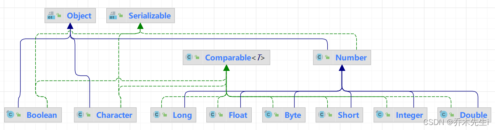
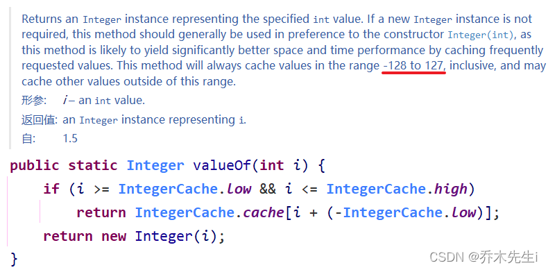

Java提供了两个类型系统，**基本类型与引用类型**，使用基本类型在于效率，然而很多情况，会创建对象使用，因为对象可以做更多的功能，如果想要我们的基本类型像对象一样操作，就可以使用基本类型对应的包装类，如下：

| 基本数据类型 | 包装类（位于`java.lang`包中） | 父类 |
|:----|:----|:----|
| boolean | Boolean |  |
| char | **Character** |  |
| byte | Byte | Number |
| short | Short | Number |
| int | **Integer** | Number |
| long | Long | Number |
| float | Float | Number |
| double | Double | Number |

有了类的特点，就可以调用类中的方法



## 装箱和拆箱

基本类型与对应的包装类对象之间，来回转换的过程称为“装箱”与“拆箱”：

**装箱：** 从基本类型转换为对应的包装类对象。
**拆箱：** 从包装类对象转换为对应的基本类型。


JDK5及之后的版本可以自动装箱和拆箱，自动装箱调用的是`valueOf`方法。

用 Integer 与 int 为例：（看懂代码即可）

**基本数值---->包装对象**：

```java
int a = 4;
Integer i = new Integer(a);//使用构造函数
Integer iii = Integer.valueOf(a);//使用包装类中的valueOf方法

// JDK5之后
Integer ii = a;	// 底层使用的是Integer.valueOf(a)方法
```

**包装对象---->基本数值**：

```java
int num = i.intValue();

// JDK5之后
int num2 = i;	// 底层使用的是i.intValue()方法
```

**自动装箱与自动拆箱：**

由于经常要做基本类型与包装类之间的转换，从Java 5（JDK 1.5）开始，基本类型与包装类的装箱、拆箱动作可以自动完成。例如：

```java
Integer i = 4;//自动装箱。相当于Integer i = Integer.valueOf(4);
i = i + 5;//等号右边：将i对象转成基本数值(自动拆箱) i.intValue() + 5;
//加法运算完成后，再次装箱，把基本数值转成对象。
```

## 包装类和字符串相互转换

除了Character类之外，其他所有包装类都具有parseXxx静态方法可以将字符串参数转换为对应的基本类型。

```java
public static void main(String[] args) {
    int num = Integer.parseInt("100");
}
```

如果字符串参数的内容无法正确转换为对应的基本类型，则会抛出`java.lang.NumberFormatException`异常。


**包装类转字符串：**

第一种方式：直接拼接字符串

```java
Integer i = 100;
String str1 = i + "";
```

第二种方式：使用toString方法

```java
String str2 = i.toString();
```

第三种方式：使用String类的valueOf方法

```java
String str3 = String.valueOf(i);

// 因为valueOf方法里面接收的参数是一个Object类型的
// 如果valueOf方法传入的不是包装类，是一个基本数据类型
// 系统会将基本数据类型自动装箱为包装类，然后再进行转换
```

**字符串转包装类：**

第一种方式：使用自动装箱

```java
String str = "123";
Integer a = Integer.parseInt(str);
```

第二种方式：使用构造器

```java
Integer a2 = new Integer(str);	// 构造器调用的还是parseInt方法
```

## 包装类的常用方法

**Integer中常用的属性：** 

`Integer.MIN_VALUE`：返回最小值
`Integer.MAX_VALUE`：返回最大值

其他五个有关数值的包装类也有这两个常量值

**Character中常用的方法：**
`Character.isDigit(char c)`：判断是不是数字，返回一个布尔值
`Character.isLetter(char c)`：判断是不是字母，返回一个布尔值
`Character.isUpperCase(char c)`：判断是不是大写，返回一个布尔值
`Character.isLowerCase(char c)`：判断是不是小写，返回一个布尔值
`Character.isWhitespace(char c)`：判断是不是空格，返回一个布尔值

`Character.toUpperCase(char c)`：转换成大写
`Character.toLowerCase(char c)`：转换成小写

## Integer创建机制

看下面一段代码，分别输出什么：

```java
public static void main(String[] args) {

    Integer i = new Integer(1);
    Integer j = new Integer(1);
    System.out.println(i == j);
    
    Integer m = 1;
    Integer n = 1;
    System.out.println(m == n);
    
    Integer x = 128;
    Integer y = 128;
    System.out.println(x == y);
}
```

**第一题：** 因为是用`==`比较运算符做比较的，所以会比较两个对象的内存地址，两个对象都是`new`出来的，所以内存地址是不一样的，所以会输出`flase`

**第二题：** 这里需要看`Interge`类的底层源码，因为这里是自动装箱，会调用`Integer`类中的`valueOf()`方法，通过阅读下面源码可以看到，当传入的值为`-128~127`之间时，会自动返回，**JVM在启动的时候会有一个该区间的数组，如果传入的数字在这个区间，可以直接拿来用，所以不用`new`一个对象**；如果超过了这个范围，会`new`一个`Integer`对象，这里`m`和`n`的值都是在这个范围之间的，所以没有`new`对象，所以为`true`。



**第三题：** 据第二题所述，这里超出了范围会`new`两个对象，所以会输出`flase`。

再看下面三道题：

```java
public static void main(String[] args) {
    Integer i = 127;
    Integer j = new Integer(127);
    System.out.println(i == j);
    
    int a = 127;
    Integer b = 127;
    System.out.println(a == b);
	
	int x = 128;
    Integer y = 128;
    System.out.println(x == y);
}
```

**第四题：** `i`的值是从数组中取出的，而`j`的值是通过`new`出来的，并且使用的是`==`符号比较，比较的也是内存地址，两个内存地址并不一样，所以答案为`flase`。

**第五题：** 只要有基本数据类型，包装类型就会自动拆箱为基本数据类型进行比较，所以答案为`true`。

**第六题：** 同第五题一样的思路，也是`true`。