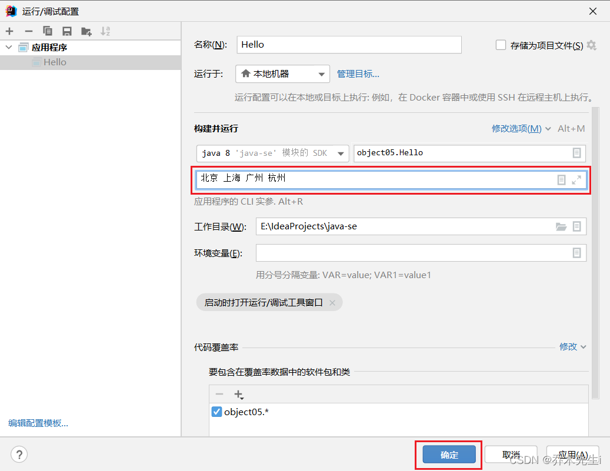

## 语法说明

`main()`方法是Java虚拟机调用的

Java虚拟机需要调用类的`main()`方法，所以该方法的访问权限必须是`public`

Java虚拟机在执行`main()`方法时不必创建对象，所以该方法必须是`static`

该方法接收`String`类型的数组参数，该数组保存执行Java命令时传递给所运行的类的参数

在`main()`方法中，可以直接调用`main()`方法所在类的静态方法或者静态属性，但是不能直接访问该类的非静态成员，可以创建一个本类的实例对象，通过该对象调用本类的非静态成员

## 动态传值

写一个程序，看一下数组中有什么东西：

```java
public class Hello {
    public static void main(String[] args) {
        for (int i = 0; i < args.length; i++) {
            System.out.println("第" + (i + 1) + "个参数的值为：" + args[i]);
        }
    }
}
```

此时直接执行，可以看到什么也没有输出


当在运行时加入参数的话，会依次存入`args`的数组中，可以在程序中根据传入的顺序根据索引值调用。
语法：`java 执行的程序 参数1 参数2 参数3 ...`


## idea动态传值
上面的方式是通过命令行传参的，而idea的传参方式也非常简单

在idea启动器上，点击**编辑配置**


将参数填入这个位置，并点击确定



执行程序可以看到参数的输出：


