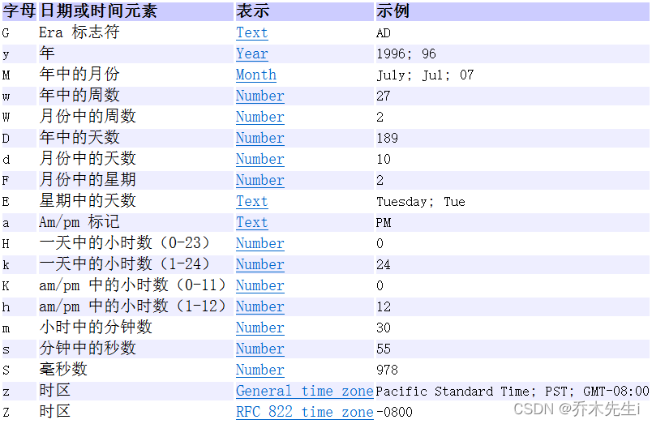

日期是有大小关系的，时间靠后，时间越大。

## Date类

`java.util.Date`类 表示特定的瞬间，精确到毫秒。
`Date`类对`Object`类中的`toString`方法进行了覆盖重写，所以结果为指定格式的字符串。

**常用方法**

**构造方法：**

`Date()`：获取当前系统时间，分配Date对象并初始化此对象，以表示分配它的时间（精确到毫秒）。
`Date(long date)`：分配Date对象并初始化此对象，以表示自从标准基准时间（称为“历元（epoch）”，即1970年1月1日00:00:00 GMT）以来的指定毫秒数。

> 由于我们处于东八区，所以我们的基准时间为1970年1月1日8时0分0秒。

使用无参构造，可以自动设置当前系统时间的毫秒时刻；指定long类型的构造参数，可以自定义毫秒时刻。例如：

```java
import java.util.Date;
public class Demo01Date {
    public static void main(String[] args) {
        // 创建日期对象，把当前的时间
        System.out.println(new Date()); // Tue Jan 16 14:37:35 CST 2022
        // 创建日期对象，把当前的毫秒值转成日期对象
        System.out.println(new Date(0L)); // Thu Jan 01 08:00:00 CST 1970
    }
}
```

**实例方法：**

`getTime()`：把日期对象转换成对应的时间毫秒值。

## DateFormat类(格式化Date对象)

`java.text.DateFormat`是日期/时间格式化子类的抽象类，通过这个类可以完成日期和文本之间的转换，也就是可以在`Date`对象与`String`对象之间进行来回转换。

**格式化：** 按照指定的格式，从Date对象转换为String对象。
**解析：** 按照指定的格式，从String对象转换为Date对象。

**常用方法**

**构造方法：**
由于`DateFormat`为抽象类，不能直接使用，所以需要常用的子类`java.text.SimpleDateFormat`。这个类需要一个模式（格式）来指定格式化或解析的标准。构造方法为：

`SimpleDateFormat(String pattern)`：用给定的模式和默认语言环境的日期格式符号构造SimpleDateFormat。参数pattern是一个字符串，代表日期时间的自定义格式。

**格式规则：**



创建SimpleDateFormat对象的代码如：

```java
import java.text.DateFormat;
import java.text.SimpleDateFormat;
public class Demo02SimpleDateFormat {
    public static void main(String[] args) {
        // 对应的日期格式如：2022-01-16 15:06:38
        DateFormat format = new SimpleDateFormat("yyyy-MM-dd HH:mm:ss");
    }    
}
```

**实例方法：**

`format(Date date)`：将Date对象格式化为字符串。

```java
public static void main(String[] args) {
    Date date = new Date();
    // 创建日期格式化对象,在获取格式化对象时可以指定风格
    DateFormat df = new SimpleDateFormat("yyyy年MM月dd日");
    String str = df.format(date);
    System.out.println(str); // 2008年1月23日
}
```

`parse(String source)`：将字符串解析为Date对象。

```java
public static void main(String[] args) {
    DateFormat df = new SimpleDateFormat("yyyy年MM月dd日");
    String str = "2018年12月11日";
    Date date = df.parse(str);
    System.out.println(date); // Tue Dec 11 00:00:00 CST 2018
}
```

## Calendar类

`java.util.Calendar`是日历类，在`Date`后出现，替换掉了许多`Date`的方法。该类将所有可能用到的时间信息封装为静态成员变量，方便获取。日历类就是方便获取各个时间属性的。

西方星期的开始为周日，中国为周一。

**常用方法**

**获取对象：**

`Calendar`为抽象类，由于语言敏感性，`Calendar`类在创建对象时并非直接创建，而是通过静态方法创建，返回子类对象，如下：

`static Calendar getInstance()`：使用默认时区和语言环境获得一个日历。

```java
import java.util.Calendar;
public class Demo06CalendarInit {
    public static void main(String[] args) {
        Calendar cal = Calendar.getInstance();
    }    
}
```


**实例方法：**

根据Calendar类的API文档，常用方法有：

`get(int field)`：返回给定日历字段的值。

```java
public static void main(String[] args) {
    // 创建Calendar对象
    Calendar cal = Calendar.getInstance();
    // 设置年 
    int year = cal.get(Calendar.YEAR);
    // 设置月
    int month = cal.get(Calendar.MONTH) + 1;
    // 设置日
    int dayOfMonth = cal.get(Calendar.DAY_OF_MONTH);
    System.out.print(year + "年" + month + "月" + dayOfMonth + "日");
}
```

`set(int field, int value)`：将给定的日历字段设置为给定值。

```java
public static void main(String[] args) {
    Calendar cal = Calendar.getInstance();
    cal.set(Calendar.YEAR, 2020);
    System.out.print(year + "年" + month + "月" + dayOfMonth + "日"); // 2020年1月17日
}
```

`add(int field, int amount)`：根据日历的规则，为给定的日历字段添加或减去指定的时间量。

```java
public static void main(String[] args) {
    Calendar cal = Calendar.getInstance();
    System.out.print(year + "年" + month + "月" + dayOfMonth + "日"); // 2018年1月17日
    // 使用add方法
    cal.add(Calendar.DAY_OF_MONTH, 2); // 加2天
    cal.add(Calendar.YEAR, -3); // 减3年
    System.out.print(year + "年" + month + "月" + dayOfMonth + "日"); // 2015年1月18日; 
}
```

`getTime()`：返回一个表示此Calendar时间值（从历元到现在的毫秒偏移量）的Date对象。

```java
public static void main(String[] args) {
    Calendar cal = Calendar.getInstance();
    Date date = cal.getTime();
    System.out.println(date); // Tue Jan 16 16:03:09 CST 2018
}
```

Calendar类中提供很多成员常量，代表给定的日历字段：

| 字段值 | 含义 |
|:----|:----|
| YEAR | 年 |
| MONTH | 月（从0开始，可以+1使用） |
| DAY_OF_MONTH | 月中的天（几号） |
| HOUR | 时（12小时制） |
| HOUR_OF_DAY | 时（24小时制） |
| MINUTE | 分 |
| SECOND | 秒 |
| DAY_OF_WEEK | 周中的天（周几，周日为1，可以-1使用） |

> 1. 西方星期的开始为周日，中国为周一。
> 2. 在Calendar类中，月份的表示是以0-11代表1-12月。
> 3. 日期是有大小关系的，时间靠后，时间越大。

## 第三代日期类 LocalDate、LocalTime、LocalDateTime

`Date`类在JDK1.1引入`Calendar`之后很多方法弃用了，而`Calendar`类也存在一些问题：

> 可变性：像日期和时间这样的类应该是不可变的。 
> 偏移性：Date中的年份是从1900年开始的，月份是从0开始的。
> 格式化：格式化只对Date有用，而Calendar不行。 
> 线程不安全；不能处理闰秒(每隔2天，多出1秒)。

**第三代日期类(JDK8加入)：**

LocalDate(日期/年月日)
LocalTime(时间/时分秒)
LocalDateTime(日期时间/年月日时分秒) 

**常用方法**

如果只需要年月日，可以使用LocalDate；如果只需要时分秒，可以使用LocalTime。

`static LocalDateTime now()`：构造一个表示当前日期时间的对象。
`static LocalDateTime of(int year, int month, int dayOfMonth, int hour, int minute, int second)`：构造一个表示给定日期时间的对象。

```java
LocalDateTime now = LocalDateTime.now();	// 会构造一个新对象， 表示构造这个对象时的日期。
```

`getYear()`：得到当前日期时间的年。
`getMonthValue()`：得到当前日期时间的月。
`getDayOfMonth()`：得到当前日期时间的日。
`getHour()`：得到当前日期时间的时。
`getMinute()`：得到当前日期时间的分。
`getSecond()`：得到当前日期时间的秒。

```java
int year = now.getYear(); // 2022
int month = now.getMonthValue(); // 3
int day = now.getDayOfMonth(); // 8
```

`DayOfWeek getDayOfWeek()`：得到当前日期是星期几，作为 DayOfWeek 类的一个实例返回。

> DayOfWeek类对象调用 getValue 来得到 1 ~ 7 之间的一个数，表示这是星期几，1 表示星期一，7 表示星期日。

`LocalDate plus(int n)`：可以将当前日期时间增加指定的日期时间，可以增加年月日周时分秒，具体可以看JDK1.8的文档
`LocalDate minus(int n)`：可以将当前日期时间减少指定的日期时间，可以减去年月日周时分秒，具体可以看JDK1.8的文档

## DateTimeFormatter类(格式化LocalDateTime对象)

用法和上面的`SimpleDateFormat`差不多。

`static DateTimeFormatter ofPattern(String pattern)`：用给定的模式和默认语言环境的日期格式符号构造DateTimeFormatter。参数pattern是一个字符串，代表日期时间的自定义格式。

`format(LocalDateTime date)`：将LocalDateTime对象格式化为字符串。

## 第三代日期类 Instant时间戳

跟Date类兼容。

**常用方法**

**Instant转换为Date：**

`static Date from(Instant instant)`：将Instant对象转换为Date对象。

**Date转换为Instant：**

`toInstant()`：将Date对象转换为Instant对象。

这两个方法都是Date类中的方法。

```java
Instant now = Instant.now();	// 获取当前时间的时间戳对象
Date date = Date.from(now);	// 将Instant对象转换为Date对象
Instant instant = date.toInstant();	// 将Date对象转换为Instant对象
```
