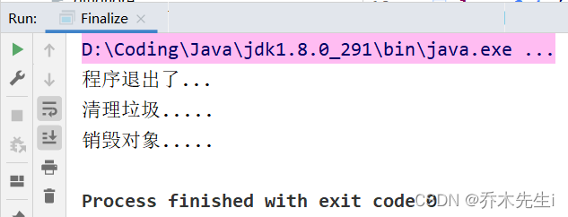

## equals方法

### 默认地址比较

如果没有覆盖重写equals方法，那么Object类中默认进行`==`运算符的对象地址比较，只要不是同一个对象，结果必然为false。

`==`既可以判断基本数据类型，又可以判断引用数据类型，如果判断基本数据类型，则判断的是值是否相等。
例如：
```java
int i = 10;
double d = 10.0;
boolean result = (i == d);
```

如果判断引用数据类型，判断的是地址是否相等，即判断是不是同一个对象。

```java
public class Equals {
    public static void main(String[] args) {
        A a = new A();
        A b = a;
        A c = b;
        System.out.println(a == c); // true
        System.out.println(b == c); // true
        B bObj = a;
        System.out.println(bObj == c);  // true
    }
}

class A extends B{}
class B {}
```

### 对象内容比较

`equals`是Object类中的方法，只能判断引用类型，默认是判断两个对象的地址值是否相等。

如果希望进行对象的内容比较，即所有或指定的部分成员变量相同就判定两个对象相同，则可以覆盖重写equals方法。

### equals源码：

#### Object类的equals

```java
// 返回一个布尔值
public boolean equals(Object obj) {
	// 上面讲过， == 是判断对象的地址引用是否相等
	// 如果调用者和传入的参数的对象地址相等，则返回true
	return (this == obj);
}
```

#### String类的equals

```java
// 返回一个布尔值
public boolean equals(Object anObject) {
	// 判断地址值是否相等，如果相等，则认为两个对象是相等的
    if (this == anObject) {
        return true;
    }
    // 判断传入的对象是否是String类或者是否是子类(因为String类被final修饰，所以没有子类)
    // 如果是的话则进行下一步判断
    if (anObject instanceof String) {
    	// 如果传入的对象是String，则将该对象转为String对象
        String anotherString = (String)anObject;
        int n = value.length;
        // 判断传入的字符串长度是否和调用者的字符串长度相等
        // 如果相等，则进行下一步判断
        if (n == anotherString.value.length) {
        	// 将调用者和传入的字符串转换为char类型的数组
            char v1[] = value;
            char v2[] = anotherString.value;
            int i = 0;
            while (n-- != 0) {
            	// 循环比较数组每个元素是否相等，如果有一个不相等
            	// 则返回false，两个字符串是不相等的
                if (v1[i] != v2[i])
                    return false;
                i++;
            }
            // 如果循环结束还没有返回false的话，则这两个字符串是相等的
            return true;
        }
    }
    // 如果传入的对象不是String类型的，或者两个字符串长度不同，则返回false
    return false;
}
```

#### Integer的equals

```java
// 返回一个布尔值
public boolean equals(Object obj) {
	// 判断传入的对象是否是Integer类的对象
    if (obj instanceof Integer) {
    	// 如果是的话，将该对象转为Integer类对象，并获取该对象的值
    	// 如果值相等，则返回true，不相等则返回false
        return value == ((Integer)obj).intValue();
    }
    // 如果传入的对象不是Integer类的对象，则返回false
    return false;
}
```

### 重写equals方法

```java
class Student {
    private String name;
    private int age;
    private char gender;

    public Student(String name, int age, char gender) {
        this.name = name;
        this.age = age;
        this.gender = gender;
    }
	
	// (省略)get方法和set方法.....
}
```

当没有重写`equals`方法的时候，执行如下代码返回的是`false`，因为`equals`方法默认比较的是对象的引用地址值是否相同，因为`new`了两次，两个对象的必然是不同的，所以返回`false`。

```java
    public static void main(String[] args) {
        Student stu1 = new Student("张三", 10, '男');
        Student stu2 = new Student("张三", 10, '男');
        System.out.println(stu1.equals(stu2));
    }
```

这里是重写`equals`的方法

```java
class Student {
    private String name;
    private int age;
    private char gender;

    // 重写Object类的equals的方法
    public boolean equals(Object obj) {
        // 首先判断传入的对象和该对象的地址值相同
        // 则直接返回true，  这里this指的是当前对象
        if (this == obj) {
            return true;
        }
        // 判断传入的对象是否是Student类型的对象
        // 如果是，再比较，如果不是，返回false
        if (obj instanceof Student) {
            // 类型转换，将转入的对象转换为Student类型的对象
            // 只有向下转型了，才能够比较两个对象里面的值
            Student stu = (Student) obj;
            // 这里判断的是，如果调用该方法的对象的名字和传入参数对象的名字相等，并且年龄相等，并且性别也相等
            // 则返回true，如果其中一个不相等，这个布尔表达式就会返回false
            return this.name.equals(stu.getName()) && this.age == stu.getAge() && this.gender == stu.gender;
        }
        return false;
    }

    public Student(String name, int age, char gender) {
        this.name = name;
        this.age = age;
        this.gender = gender;
    }
    
	// (省略)get方法和set方法.....
}
```

此时执行上面的`main`方法，则会返回`true`，这时，`Student`类中的`equals`方法，`this`指的是调用者的对象，也就是`stu1`，而传入的参数是`stu2`。

### Objects的equals方法

在**JDK7**添加了一个`Objects`工具类，它提供了一些方法来操作对象，它由一些静态的实用方法组成，这些方法是null-save（空指针安全的）或null-tolerant（容忍空指针的），用于计算对象的hashcode、返回对象的字符串表示形式、比较两个对象。

在比较两个对象的时候，`Object`的`equals`方法容易抛出空指针异常，而`Objects`类中的`equals`方法就优化了这个问题。方法源码如下：

```java
public static boolean equals(Object a, Object b) {
	return (a == b) || (a != null && a.equals(b));
}
```


## hashCode方法

hashCode可以提高具有哈希结构的容器的效率。
- 两个引用，如果指向的是同一个对象，则哈希值肯定是一样的。
- 两个引用，如果指向的是不同的对象，则哈希值是不一样的(也可能一样，后续详解)。
- 哈希值主要根据地址号来的，但是不能完全将哈希值等价于地址值。
- 在集合中，如果有需要hashCode的话，也会重写该方法(后续集合的时候详解)。


下面是jdk1.6中，对hashCode方法的中文解释：


## toString方法

toString方法返回该对象的字符串表示。

**默认返回：**`全类名(包名+类名) + @ + 哈希值的十六进制值`
这里哈希值的十六进制就是hashCode方法的哈希值转换成十六进制的形式

如果不希望使用toString方法的默认行为，则可以对它进行覆盖重写。重写后打印或者拼接对象时，都会调用该对象的toString形式。
**当直接输出一个对象时，`toString`方法会被默认调用**

Object类的toString源码

```java
public String toString() {
	// getClass().getName()：返回的是类的全类名(包名+类名)
	// Integer.toHexString()：返回的是将传入的对象转换成16进制的字符串
	// hashCode()：上面讲过，返回的是该对象的哈希值
    return getClass().getName() + "@" + Integer.toHexString(hashCode());
}
```

### 重写toString方法

```java
class BB {
    private String name;

    public BB(String name) {
        this.name = name;
    }
	// （省略）get方法和set方法.....
}
```

此时没有重写该方法，那么调用`toString`方法时实际上调用的是Object类的`toString`方法，运行下面main方法后可以得到下面的结果，就是`全类名(包名+类名) + @ + 哈希值的十六进制值`


```java
    public static void main(String[] args) {
        BB bb = new BB("小明");
        System.out.println(bb.toString());
    }
```

```java
class BB {
    private String name;
    
    // （省略）构造器、get方法和set方法.....

    public String toString() {
        return "BB{" + "name='" + name + '\'' + '}';
    }
}
```

重写后可以得到下面的结果：


重写的toString方法可以根据实际需要写，当然也可以使用idea的默认的格式

## finalize方法

当垃圾回收器确定不存在对该对象的更多引用时，由对象的垃圾回收器调用此方法。
当对象被回收时，系统自动调用该对象的finalize方法。子类可以重写该方法，做一些**释放资源**的操作。

**什么时候被回收？** 当某个对象没有人话引用时，jvm则认为这个对象是一个垃圾对象，就会使用垃圾回收机制来销毁该对象，再销毁对象前，会先调用`finalize`方法。
垃圾回收机制的调用是由系统来决定的，也可以通过`System.gc()`主动触发垃圾回收机制。

**默认回收：**
```java
public class Finalize {
    public static void main(String[] args) {
        Cat cat = new Cat();
        // 此时，当Cat对象没有被引用的时候，垃圾回收器就会销毁对象
        // 在销毁对象之前，会调用该对象的finalize方法
        // 可以在finalize方法中写入自己的业务代码
        // 如果不重写finalize方法则默认调用Object中的方法
        cat = null;
    }
}

class Cat {
    @Override
    protected void finalize() throws Throwable {
        System.out.println("清理垃圾.....");
        System.out.println("销毁对象.....");
    }
}
```

执行该main方法可以看到finalize方法中的代码并没有被执行，这是因为垃圾回收机制有自己的算法，根据自己的算法来确定什么时候进行垃圾回收。


可以调用`System.gc()`方法主动进行垃圾回收(虽然是主动调用，但是垃圾回收器不一定会立刻执行)。

```java
    public static void main(String[] args) {
        Cat cat = new Cat();
        cat = null;
        System.gc();
        System.out.println("程序退出了...");
    }
```

这里可以看到先执行的 **程序退出了** 后执行的finalize方法，因为调用`Sysem.gc()`方法后垃圾回收器可能不会立刻执行，此时的程序也不会阻塞在这行代码，所以会先执行下面的代码。




