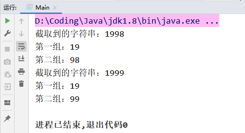

java.util.regex包主要包括三个类：

* Pattern
* Matcher
* PatternSyntaxExcepiton


## Pattern类

Pattern对象是一个正则表达式对象。Pattern类没有公共的构造方法。要创建一个Pattern对象，需要调用其公共静态方法。该方法接收一个正则表达式作为它的第一个参数。

**常用方法**

* `static Pattern compile(String regex)`：将给定的正则表达式编译到模式中。 
* `Matcher matcher(String input)`：使用创建的规则匹配input字符串。 
* `static boolean matches(String regex, CharSequence input)`
  ：使用传入的正则表达式整体匹配传入的字符串，如果满足返回true。 


## Matcher类

Matcher对象是对输入字符串进行解释和匹配的引擎。与Pattern类一样，Matcher也没有公共构造方法。需要调用Pattern对象的matcher方法来获得一个Matcher对象。

**常用方法**

* `boolean find()`：查找与该正则匹配的字符串的下一个匹配内容。 

> 根据正则的规则，定位到满足条件的字符串，然后将**开始索引**记录到Matcher对象的`int[] groups` 数组中，再把**结束索引 + 1**记录到到该数组中；将`oldLast` 属性的值设置为结束索引+1的值，这个属性表示下次从这个索引的位置开始匹配。**每次调用该方法，`groups` 数组会被重新赋值。**

> 如果正则表达式中有分组，`groups` 数组也会进行分组记录，数组的第一个索引是**开始索引**，第二个索引是**结束索引+1**，从第三个索引开始，是**分组的索引值**，也是左闭右开(组的开始索引和组的结束索引+1)。

* `boolean find(int start)`：重置此匹配器，从指定索引处开始查找与该正则匹配的字符串的下一个匹配内容。 


* `String group(int group)`：返回在以前匹配操作期间捕获的字符串。 

> 根据`groups` 数组中的索引位置值截取，左开右闭，不包含第二个索引值位置。根据`find()`方法的特性，该方法的参数如果传0，就是获取正则表达式截取到的所有内容；如果传大于0的值，就是获取分组的内容的值，分组的索引就是从0开始。


* `int start()`：返回以前匹配的初始索引。
* `int start(int group)`：返回在以前的匹配操作期间，给定组所捕获的子序列的初始索引。
* `int end()`：返回匹配的子字符串的结束索引+1。
* `int end(int group)`：返回在以前的匹配操作期间，给定组所捕获的子序列的结束索引+1。


* `boolean lookingAt()`：尝试将从区域开头的输入序列与该模式匹配。
* `boolean matches()`：尝试将整个区域与模式匹配。 


* `String replaceAll(String replacement)`：替换模式与给定替换字符串相匹配的输入序列的每个子序列。 


```java
public static void main(String[] args) {
    String content = "1998年12月8日，第二代Java平台的企业版J2EE发布。1999年6月，" +
            "Sun公司发布了第二代Java平台（简称为Java2）的3个版本”";

    // 正则表达式：匹配四个数字，两个数字为一组
    String regex = "(\\d\\d)(\\d\\d)";
    Pattern pattern = Pattern.compile(regex);
    Matcher matcher = pattern.matcher(content);
    while (matcher.find()) {
        System.out.println("截取到的字符串：" + matcher.group(0));
        System.out.println("第一组：" + matcher.group(1));
        System.out.println("第二组：" + matcher.group(2));
    }
}
```

输出结果：




## PatternSyntaxException

PatternSyntaxException类是一个非强制异常类，它表示一个正则表达式模式中的语法错误。