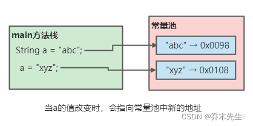
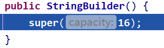

Java 没有内置的字符串类型， 而是在标准 Java 类库中提供了一个预定义类，很自然地叫做 String。每个用双引号括起来的字符串都是String类的一个实例。

String对象用于保存字符串，也就是一组字符序列，**字符串常量对象是用双引号括起的字符序列**，例如：`"你好"`，`"14.31"`，`"toy"`等。

字符串字符使用的是Unicode字符编码，一个字符(不区分字符汉字等)占两个字节。

## 剖析

### 结构剖析


> `String`类是一个`final`类，不能被其他类继承；根据`String`类的源码可以看到，字符串是使用一个`char`类型的数组存储的，并且是`final`修饰的 **(一旦赋值，不可修改，数组中的字符可以修改，内存地址是不变的)** 。


### 创建剖析

创建String对象有两种方式：

**第一种，直接赋值：**
```java
String s = "arbor";
```

> 先从常量池查询是否有`"arbor"`的数据空间，如果有，直接指向；如果没有，则在常量池中创建，然后指向。变量`s`的最终指向是常量池的空间地址。

**第二种，调用构造器：**

```java
String s = new String("arbor");
```

> 先在堆中创建空间，里面会有`value`属性，`value`属性指向的是常量池的`"arbor"`的数据空间，如果常量池中没有，会在常量池中创建，并且指向给`value`属性。变量`s`的最终指向是堆中的对象空间地址，而对象中的`value`属性指向的是常量池的空间地址。


### String特性

① String是一个final类，代表不可变的字符序列。
② 字符串是不可变的，一个字符串对象一旦被分配，内容是不变的。

比如下面代码：

```java
String a = "abc";
a = "xyz";
```



③ 当执行`String a = "hello" + "abc";`时，编译器会做一个优化，如果`"hello"`或`"abc"`没有其他变量引用，则直接会创建`"helloabc"`，而不是分开创建

**常量相加，值在池中**

**④ 下面第三行代码的执行流程：**

(1) 会先创建一个`StringBuilder`对象，通过追溯源码可以看到，会创建一个长度为16的`StringBuilder`对象。



(2) 调用`StringBuilder`中的`append`方法，先将`a`的值加入到`StringBuilder`对象中。


(3) 再次调用`append`方法，将`b`的值也加入到`StringBuilder`对象中。


(4) 调用`StringBuilder`中的`toString`方法，将`StringBuilder`转换为字符串的形式返回。


因为`StringBuilder`初始会创建空间为16的字符数组，而`a`和`b`的总字符数是8个，所以这里会返回字符数组中的前8个值。


执行完毕！！

**因为`toString`方法是`new`了一个`String`对象，所以`c`变量指向的是堆中的`String`对象，而这个`String`对象的`value`属性指向的是常量池中的`"helloabc"`**

常量池中最终会有三个值，分别是`"hello"`、`"abc"`、`"helloabc"`

**变量相加，对象在堆中**

```java
String a = "hello";
String b = "abc";
String c = a + b;
```

⑤ 字符串是“值传递”，因为字符串是常量。可以看下面代码：

当调用`change`方法时，是把`aaa.str`的在堆中的`String`对象地址传进来了，此时`change`方法中的局部变量`str`和`aaa.str`的指向是一样的，当执行`str = "java";`时，只是把局部变量`str`的指向改变了，并没有改变`aaa.str`的指向，所以下面的代码输出`arbor`

```java
public class String01 {

    String str = new String("arbor");

    public void change(String str) {
        str = "java";
    }

    public static void main(String[] args) {
        String01 aaa = new String01();
        aaa.change(aaa.str);
        System.out.println(aaa.str);
    }
}
```

## String类的常用方法

**判断功能的方法**

`equals(Object other)`：判断字符串内容是否相等，**区分大小写**；如果字符串与 other 相等，返回 true。

`equalsIgnoreCase(String other)`：判断字符串内容是否相等，**不区分大小写**；如果字符串与 other 相等（忽略大小写)，返回 true。

`startsWith(String prefix)`：如果字符串以 suffix 开头，则返回 true。
`endsWith(String suffix)`：如果字符串以 suffix 结尾，则返回 true。

`contains(String str)`：判断一个字符串中有没有str子串，有的话为true。

`compareTo(String anotherString)`：比较两个字符串的大小，前者大返回正数；后者大返回负数；如果相等，则返回0。

> 如果两个字符串长度相同，字符也相同，返回0；
> 如果字符不同(不考虑长度)，但是字符可以区分大小，返回的是字符的差值，比如：abc 和 acd，abc 和 acda。
> 如果字符相同，但是长度不同，返回的是字符串长度的差值，比如：abc 和 ab，xy 和 xyz。


---

**获取功能的方法**

`length()`：返回字符串的长度。

`concat(String str)`：将str拼接到原始字符串后面。

`charAt(int index)`：获取该字符串某处索引的字符。

`indexOf(...)`：获取字符(也可以是字符串)在字符串中第一次出现的索引，索引从0(或者可以自己指定)开始，如果找不到，返回-1。

`lastIndexOf(...)`：获取字符(也可以是字符串)在字符串中最后一次出现的索引，索引从0(或者可以自己指定)开始，如果找不到，返回-1。

`substring(...)`：截取指定范围的子串。只传入一个参数的话是从该数字的索引到最后一个字符。传入两个参数的话是从第一个索引值到第二个索引值，但是不包括第二个索引值，包头不包尾。

---

**转换功能的方法**

`toCharArray()`：将字符串转换为字符数组。

`getBytes()`：使用平台的默认字符集将该String编码转换为新的字节数组。

`replace(String str, String str2)`：返回一个新字符串。将一个字符串中的str更换为str2。

`toLowerCase()`：返回一个新字符串。将原始字符串中的大写字母改为小写。
`toUpperCase()`：返回一个新字符串。将原始字符串中的小写字母改为大写。

`trim()`：返回删除了原始字符串头部和尾部的空格的新字符串。


`format(...)`：格式化字符串。

> 占位符：每一个以`％`字符开始的格式说明符都用相应的参数替换。
> **最常用的占位符：**
> %s ：表示使用字符串替换
> %d ：表示使用整数替换
> %x.f ：表示使用浮点数替换，x表示一个数字，比如2的话，就说明是保留两位小数，并且进行四舍五入
> %c ：表示使用字符替换

```java
public static void main(String[] args) {
    String name = "乔木先生";
    int age = 18;
    String info = "我的名字是%s，年龄是%d";
    String formatStr = String.format(info, name, age);
    System.out.println(formatStr);
}
```

输出结果：


---

**分割功能的方法**

`split(...)`：根据传入的正则表达式将字符串分割，返回一个字符串数组。有些字符需要使用`\`转义。

`join(...)`：返回一个新字符串，用给的字符连接所有元素。

```java
String all = String.join(" / ", "S", "M", "L", "XL"); 
// all is the string "S / M / L / XL"
```

---

**其他方法**

`intern()`：如果池中已经包含一个等于此String对象的字符串，则返回池中的字符串。否则，将此字符串添加到池中，并且返回此String对象的引用。
该方法最终返回的是常量池的对象地址。