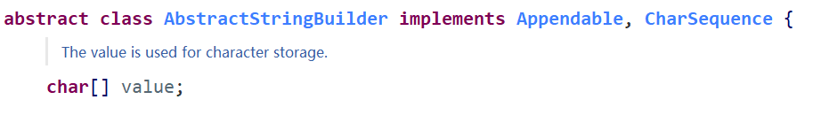
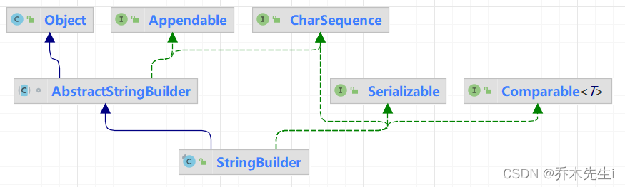

`StringBuffer`和`StringBuilder`，又称为可变字符序列，它是一个类似于 String 的字符串缓冲区，通过某些方法调用可以改变该序列的长度和内容。

`StringBuffer`和`StringBuilder`是个字符串的缓冲区，即它是一个容器，容器中可以装很多字符串。并且能够对其中的字符串进行各种操作。

它的内部拥有一个数组用来存放字符串内容，进行字符串拼接时，直接在数组中加入新内容。`StringBuffer`和`StringBuilder`会自动维护数组的扩容。

## StringBuffer

StringBuffer代表可变的字符序列，可以对字符内容进行增删，很多方法和String类相同，但是StringBuffer的长度是可变的，StringBuffer是一个容器。

`StringBuffer`是一个`final`类，不能被继承，父类是`AbstractStringBuilder`类，并且实现了`Serializable`接口。


在父类`AbstractStringBuilder`类中，有一个char数组类型的`value`属性，用于存放字符串内容，但是这个属性不是`final`修饰的，所以字符串的内容是可以修改并且是存放在堆中的。



### String和StringBuffer的区别

> String保存的是字符串常量，里面的值不能更改，每次String类的更新实际上就是修改地址(创建新的String对象)，效率较低。
> `private final char value[];`

> StringBuffer保存的是字符串变量，里面的值可以更改，每次StringBuffer的更新实际上更新的内容，而不是每次都修改地址，效率较高。
> `char[] value;`

### StringBuffer构造器

`StringBuffer()`：构造一个其中不带字符的字符串缓冲区，初始容量为 16 个字符。 

`StringBuffer(CharSequence seq)`：构造一个字符串缓冲区，它包含与指定的 CharSequence 相同的字符。 

`StringBuffer(int capacity)` ：构造一个不带字符，但具有指定初始容量的字符串缓冲区。 传入多少，就构建多少容量的数组大小。

`StringBuffer(String str)`：构造一个字符串缓冲区，并将其内容初始化为指定的字符串内容。 字符数组的长度为`str.length + 16`的大小。

### String和StringBuffer的转换

#### String转StringBuffer

> 方式一：使用构造器

```java
public static void main(String[] args) {
    String aaa = "hello";
    // 使用构造器
    StringBuffer stringBuffer = new StringBuffer(aaa);
}
```

> 方式二：使用append方法

```java
public static void main(String[] args) {
    String aaa = "hello";
    // 使用append方法
    StringBuffer stringBuffer = new StringBuffer();
    stringBuffer.append(aaa);
}
```

#### StringBuffer转String

> 方式一：使用StringBuffer的toString方法

```java
public static void main(String[] args) {
    StringBuffer stringBuffer = new StringBuffer("hello");
    // 使用toString方法
    String aaa = stringBuffer.toString();
}
```

> 方式二：使用构造器

```java
public static void main(String[] args) {
    StringBuffer stringBuffer = new StringBuffer("hello");
    // 使用构造器
    String aaa = new String(stringBuffer);
}
```

### 常用方法

`append(...)`：追加一个字符串并返回 this。

`delete(...)`：删除从a索引到b索引-1的字符并返回 this。第一个参数传入要删除的开始的位置的索引，第二个参数传入要删除的结束位置的索引+1。

`replace(...)`：修改从a索引到b索引-1的字符并返回 this。第一个参数传入要修改的开始的位置的索引，第二个参数传入要修改的结束位置的索引+1，第三个参数传入需要修改的字符串。

`indexOf(...)`：查找子串在字符串第一次出现的索引，如果找不到则返回-1。

`insert(...)`：在指定位置插入一个字符串并返回 this。第一个参数传入需要插入的位置的索引，第二个参数传入需要插入的字符串。

`length()`：获取长度

`setCharAt(int i, char c)`：将第 i 索引的字符修改为 c。

`reverse()`：导致该字符序列被序列的相反代替。比如 abc 变成 cba 。


## StringBuilder

这个类的前身是 StringBuffer，其效率稍有些低，但允许采用多线程的方式执行添加或删除字符的操作。如果所有字符串在一个单线程中编辑（通常都是这样 )，则应该用 StringBuilder 替代它。 这两个类的 API 是相同的。**简而言之：StringBuffer支持多线程，是线程安全的；StringBuilder速度更快，但线程不安全。**

采用字符串连接的方式达到此目的效率比较低。每次连接字符串，都会构建一个新的 String 对象，既耗时，又浪费空间。使用 StringBuilder 类就可以避免这个问题的发生。

> StringBuilder也是一个可变的字符序列，此类的API和StringBuffer兼容(除了线程问题)，一般用于单线程。
> 

> 
> **StringBuilder和StringBuffer使用方式一样**

## String、StringBuffer和StringBuilder的比较

String：不可变的字符序列，效率低，复用性高。
StringBuffer：可变字符序列，效率较高(增删)，线程安全。
StringBuilder：可变字符序列，效率最高，线程不安全。

> 如果对String做大量的修改，可以使用StringBuffer和StringBuilder，增加效率。
> 如果做大量修改并且在**单线程**的情况下，使用StringBuilder。
> 如果做大量修改并且在**多线程**的情况下，使用StringBuffer。
> 如果字符串不怎么修改，或者被多个对象引用，使用String。
