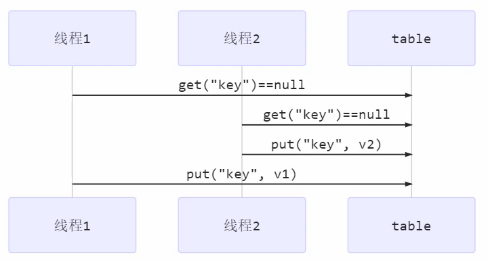

## 共享问题

Java 中对静态变量的自增，自减并不是原子操作，要彻底理解，必须从字节码来进行分析。
例如：

i++
```
getstatic i // 获取静态变量i的值
iconst_1    // 准备常量1
iadd        // 自增
putstatic i // 将修改后的值存入静态变量i
```

i--
```
getstatic i // 获取静态变量i的值
iconst_1    // 准备常量1
isub        // 自减
putstatic i // 将修改后的值存入静态变量i
```

当线程进行上下文切换的时候，例如`i++`没有执行第四行就进行了切换，当再次切换回来的时候，不管i的值是多少，`i`始终是第一次`+1`的值，由此引发共享问题。


### 临界区 Critical Section

一个程序运行多个线程本身是没有问题的，问题出在多个线程访问共享资源：

* 多个线程**读**共享资源没有问题
* 在多个线程对共享资源**读写**操作时发生指令交错，就会出现问题

一段代码块内如果存在对共享资源的多线程读写操作，称这段代码块为临界区。

例如，下面代码中的临界区：

```java
static int counter = 0;

static void increment() 
// 临界区
{
    counter++;
}

static void decrement() 
// 临界区
{
    counter--;
}
```


### 竞态条件 Race Condition

多个线程在临界区内执行，由于代码的执行序列不同而导致结果无法预测，称之为发生了**竞态条件**。

### 应用之互斥

为了避免临界区的竞态条件发生，有多种手段可以达到目的。

* 阻塞式的解决方案：synchronized，Lock
* 非阻塞式的解决方案：原子变量

这里使用阻塞式的解决方案：synchronized，即俗称的【对象锁】，它采用互斥的方式让同一时刻至多只有一个线程能持有【对象锁】，其它线程再想获取这个【对象锁】时就会阻塞住。这样就能保证拥有锁的线程可以安全的执行临界区内的代码，不用担心线程上下文切换。

> 虽然 java 中互斥和同步都可以采用 synchronized 关键字来完成，但它们还是有区别的：
> 1. 互斥是保证临界区的竞态条件发生，同一时刻只能有一个线程执行临界区代码
> 2. 同步是由于线程执行的先后、顺序不同、需要一个线程等待其它线程运行到某个点


## synchronized

synchronized 实际是用对象锁**保证了临界区内代码的原子性**，临界区内的代码对外是不可分割的，不会被线程切换所打断。

语法：

```java
synchronized(对象) // 线程1， 线程2(blocked)
{
    临界区
}
```


案例：

```java
static int counter = 0;
static final Object room = new Object();

public static void main(String[] args) throws InterruptedException {
    Thread t1 = new Thread(() -> {
        for (int i = 0; i < 5000; i++) {
            synchronized (room) {
                counter++;
            }
        }
    }, "t1");

    Thread t2 = new Thread(() -> {
        for (int i = 0; i < 5000; i++) {
            synchronized (room) {
                counter--;
            }
        }
    }, "t2");

    t1.start();
    t2.start();
    t1.join();
    t2.join();
    log.debug("{}",counter);
}
```


**面向对象的写法：**

```java
class Room {
    int value = 0;

    public void increment() {
        synchronized (this) {
            value++;
        }
    }

    public void decrement() {
        synchronized (this) {
            value--;
        }
    }

    public int get() {
        synchronized (this) {
            return value;
        }
    }

}
```


**方法上的synchronized：**

- 如果在普通方法上加synchronized，锁的是this对象
- 如果是在static方法上加synchronized，锁的是当前类的Class类对象

```java
class Test {  
    public synchronized void test() {  
  
    }  
}  
// 等价于  
class Test {  
    public void test() {  
        synchronized (this) {  
  
        }  
    }  
}
```


```java
class Test {  
    public synchronized static void test() {  
  
    }  
}  
// 等价于  
class Test {  
    public static void test() {  
        synchronized (Test.class) {  
  
        }  
    }  
}
```

## 变量的线程安全分析

### 成员变量和静态变量

* 如果它们没有共享，则线程安全
* 如果它们被共享了，根据它们的状态是否能够改变，又分两种情况

* 如果只有读操作，则线程安全
* 如果有读写操作，则这段代码是临界区，需要考虑线程安全


### 局部变量

* 局部变量是线程安全的
* 但局部变量引用的对象则未必

* 如果该对象没有逃离方法的作用访问，它是线程安全的
* 如果该对象逃离方法的作用范围，需要考虑线程安全

> private 或 final 提供【安全】的意义所在，开闭原则中的【闭】
> 当子类重写父类方法时，也需要考虑线程安全问题


## 常见线程安全类

* String
* Integer
* StringBuffer
* Random
* Vector
* Hashtable
* java.util.concurrent 包下的类

这里的线程安全是指，多个线程调用它们同一个实例的某个方法时，是线程安全的。也可以理解为：

```java
Hashtable table = new Hashtable();

new Thread(()->{
    table.put("key", "value1");
}).start();

new Thread(()->{
    table.put("key", "value2");
}).start();
```

它们的每个方法是原子的，但注意它们多个方法的组合不是原子的，比如：

```java
Hashtable table = new Hashtable();

// 线程1，线程2
if (table.get("key") == null) {
    table.put("key", value);
}
```



String、Integer 等都是不可变类，因为其内部的状态不可以改变，因此它们的方法都是线程安全的。

