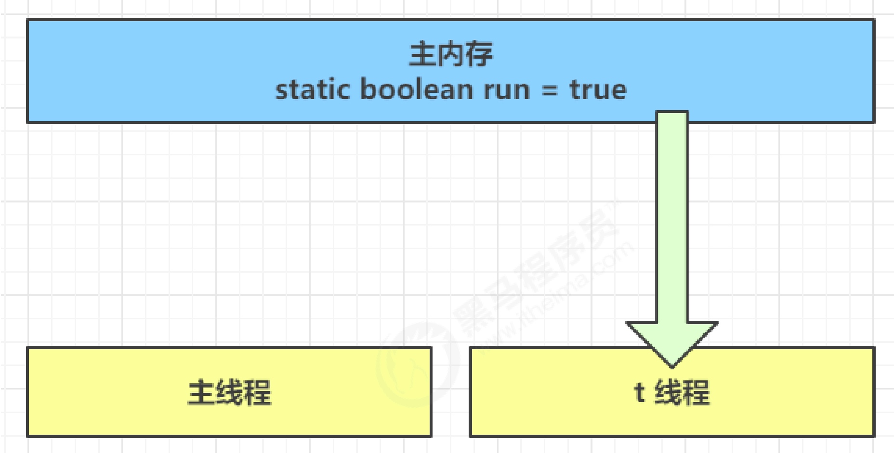
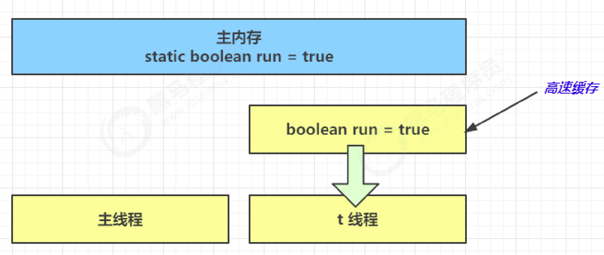
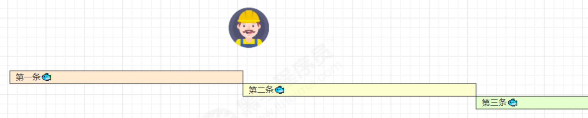
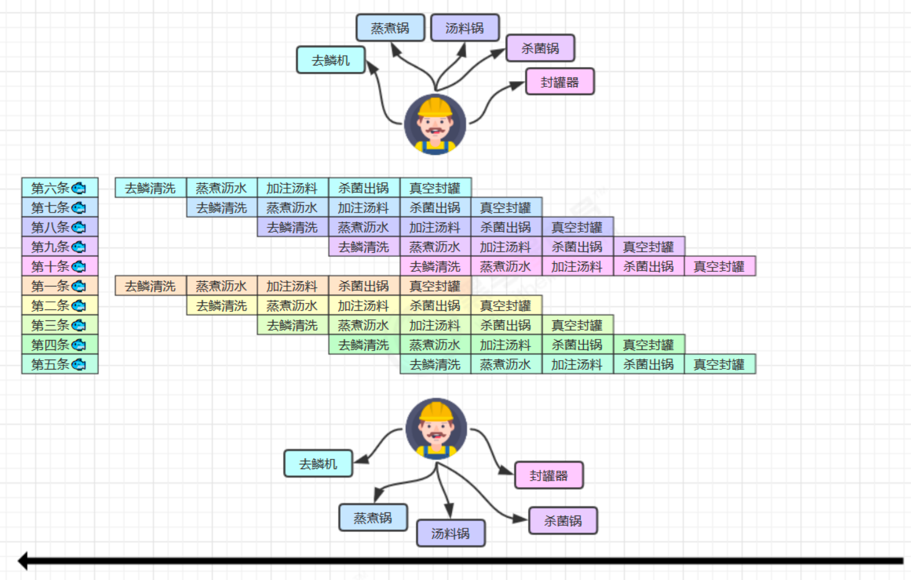
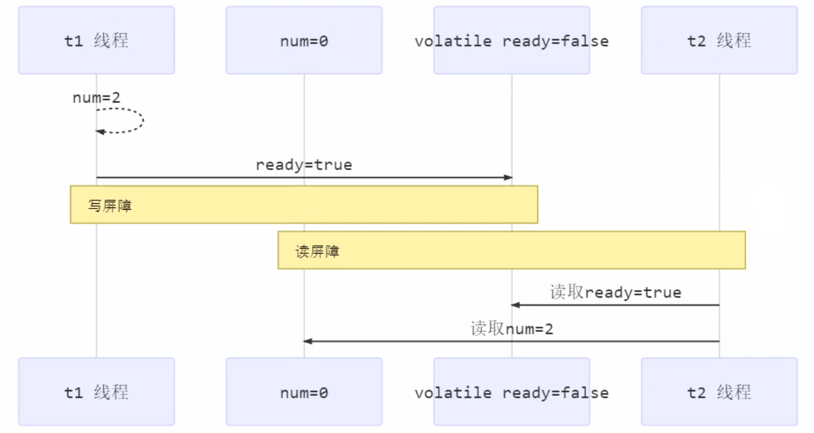
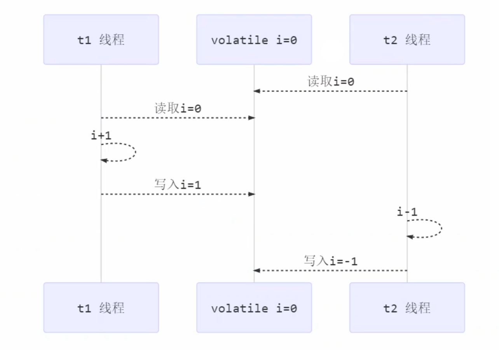
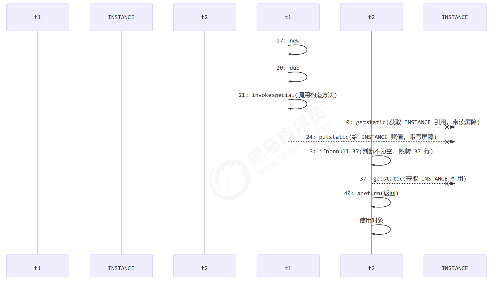

JMM 即 Java Memory Model，它定义了主存、工作内存抽象概念，底层对应着 CPU 寄存器、缓存、硬件内存、CPU 指令优化等。

JMM 体现在以下几个方面
- 原子性 - 保证指令不会受到线程上下文切换的影响
- 可见性 - 保证指令不会受 cpu 缓存的影响
- 有序性 - 保证指令不会受 cpu 指令并行优化的影响

## 原子性

即上下文切换时可以继续运行之前的代码。

## 可见性

例如：main 线程对 run 变量的修改对于 t 线程不可见，导致了 t 线程无法停止。

```java
static boolean run = true;

public static void main(String[] args) throws InterruptedException {
	Thread t = new Thread(()->{
		while(run){
			// ....
		}
	});
	
	t.start();
	sleep(1);
	run = false; // 线程t不会如预想的停下来
}
```

1. 初始状态， t 线程刚开始从主内存读取了 run 的值到工作内存。


2. 因为 t 线程要频繁从主内存中读取 run 的值，JIT 编译器会将 run 的值缓存至自己工作内存中的高速缓存中，减少对主存中 run 的访问，提高效率。


3. 1 秒之后，main 线程修改了 run 的值，并同步至主存，而 t 是从自己工作内存中的高速缓存中读取这个变量的值，结果永远是旧值。


**解决方法：** volatile（易变关键字）

> 它可以用来**修饰成员变量和静态成员变量**，他可以避免线程从自己的工作缓存中查找变量的值，必须到主存中获取它的值，线程操作 volatile 变量都是直接操作主存。

```java
volatile static boolean run = true;

// ...
```

可见性保证的是在多个线程之间，**一个线程对 volatile 变量的修改对另一个线程可见**， 不能保证原子性，仅用在一个写线程，多个读线程的情况。 

上例从字节码理解是这样的：

```java
getstatic    run    // 线程 t 获取 run true
getstatic    run    // 线程 t 获取 run true
getstatic    run    // 线程 t 获取 run true
getstatic    run    // 线程 t 获取 run true
putstatic    run    // 线程 main 修改 run 为 false， 仅此一次
getstatic    run    // 线程 t 获取 run false
```


volatile 只能保证看到最新值，不能解决指令交错。

两个线程一个 `i++` 一个 `i--`：

```java
// 假设i的初始值为0

getstatic i    // 线程2-获取静态变量i的值 线程内i=0

getstatic i    // 线程1-获取静态变量i的值 线程内i=0
iconst_1       // 线程1-准备常量1
iadd           // 线程1-自增 线程内i=1
putstatic i    // 线程1-将修改后的值存入静态变量i 静态变量i=1

iconst_1       // 线程2-准备常量1
isub           // 线程2-自减 线程内i=-1
putstatic i    // 线程2-将修改后的值存入静态变量i 静态变量i=-1
```


 synchronized 语句块既保证代码块的原子性，也保证代码块内变量的可见性。但缺点是 synchronized 是属于重量级操作，性能相对更低。


## 有序性

JVM 会在不影响正确性的前提下，可以调整语句的执行顺序。

```java
static int i = 1;
static int j = 2;
```

至于是先执行 i 还是 先执行 j ，对最终的结果不会产生影响。这种特性称之为**指令重排**，多线程下**指令重排**会影响正确性。

### 指令级并行原理

**名词解释：**

**Clock Cycle Time**：时钟周期时间，CPU 的 Clock Cycle Time（时钟周期时间），等于主频的倒数，意思是 CPU 能够识别的**最小时间单位**，比如说 4G 主频的 CPU 的 Clock Cycle Time 就是 0.25 ns（例如，墙上挂钟的 Cycle Time 是 1s）
- 例如，运行一条加法指令一般需要一个时钟周期时间

**CPI**：有的指令需要更多的时钟周期时间，所以引出了 CPI （Cycles Per Instruction）指令平均时钟周期数

**IPC**：（Instruction Per Clock Cycle） 即 CPI 的倒数，表示每个时钟周期能够运行的指令数

**CPU 执行时间**：程序的 CPU 执行时间，即前面提到的 user + system 时间，可以用下面的公式来表示

```
程序 CPU 执行时间 = 指令数 * CPI * Clock Cycle Time
```


### 鱼罐头故事举例

加工一条鱼需要 50 分钟，只能一条鱼、一条鱼顺序加工...


可以将每个鱼罐头的加工流程细分为 5 个步骤：


即使只有一个工人，最理想的情况是：他能够在 10 分钟内同时做好这 5 件事，因为对第一条鱼的真空装罐，不会影响对第二条鱼的杀菌出锅...

### 指令重排序优化

事实上，现代处理器会设计为一个时钟周期完成一条执行时间最长的 CPU 指令。

而指令还可以再划分成一个个更小的阶段，例如，每条指令都可以分为： `取指令 - 指令译码 - 执行指令 - 内存访问 - 数据写回` 这 5 个阶段


术语参考：
- instruction fetch (IF)
- instruction decode (ID)
- execute (EX)
- memory access (MEM)
- register write back (WB)

在不改变程序结果的前提下，这些指令的各个阶段可以通过重排序和组合来实现指令级并行，这一技术在 80's 中叶到 90's 中叶占据了计算架构的重要地位。(分阶段、分工是提升效率的关键)

指令重排的前提是，重排指令不能影响结果：
```java
// 可以重排的例子
int a = 10; // 指令1
int b = 20; // 指令2
System.out.println( a + b );

// 不能重排的例子
int a = 10; // 指令1
int b = a - 5; // 指令2
```


参考： [Scoreboarding](https://en.wikipedia.org/wiki/Scoreboarding) and the [Tomasulo algorithm](https://en.wikipedia.org/wiki/Tomasulo%27s_algorithm) (which is similar to scoreboarding but makes use of [register renaming](https://en.wikipedia.org/wiki/Register_renaming)) are two of the most common techniques for implementing out-of-order execution and instruction-level parallelism.


### 支持流水线的处理器

现代 CPU 支持多级指令流水线，例如支持同时执行 `取指令 - 指令译码 - 执行指令 - 内存访问 - 数据写回` 的处理器，就可以称之为五级指令流水线。这时 CPU 可以在一个时钟周期内，同时运行五条指令的不同阶段（相当于一条执行时间最长的复杂指令），IPC = 1，本质上，流水线技术并不能缩短单条指令的执行时间，但它变相地提高了指令地吞吐率。

> 奔腾四（Pentium 4）支持高达 35 级流水线，但由于功耗太高被废弃


### SuperScalar处理器

大多数处理器包含多个执行单元，并不是所有计算功能都集中在一起，可以再细分为整数运算单元、浮点数运算单元等，这样可以把多条指令也可以做到并行获取、译码等，CPU 可以在一个时钟周期内，执行多于一条指令，IPC > 1




## volatile原理

volatile 的底层实现原理是内存屏障，Memory Barrier（Memory Fence）

- 对 volatile 变量的写指令后会加入写屏障
- 对 volatile 变量的读指令前会加入读屏障

### 保证可见性

写屏障（sfence）保证在该屏障之前的，对共享变量的改动，都同步到主存当中

```java
public void actor2(I_Result r) {
	num = 2;
	ready = true; // ready 是 volatile 赋值带写屏障
	// 写屏障
}
```

而读屏障（lfence）保证在该屏障之后，对共享变量的读取，加载的是主存中最新数据

```java
public void actor1(I_Result r) {
	// 读屏障
	// ready 是 volatile 读取值带读屏障
	if(ready) {
		r.r1 = num + num;
	} else {
		r.r1 = 1;
	}
}
```





### 保证有序性

写屏障会确保指令重排序时，不会将写屏障之前的代码排在写屏障之后

```java
public void actor2(I_Result r) {
	num = 2;
	ready = true; // ready 是 volatile 赋值带写屏障
	// 写屏障
}
```

读屏障会确保指令重排序时，不会将读屏障之后的代码排在读屏障之前

```java
public void actor1(I_Result r) {
	// 读屏障
	// ready 是 volatile 读取值带读屏障
	if(ready) {
		r.r1 = num + num;
	} else {
		r.r1 = 1;
	}
}
```


### 不能保证原子性

不能解决指令交错：

- 写屏障仅仅是保证之后的读能够读到最新的结果，但不能保证读跑到它前面去
- 而有序性的保证也只是保证了本线程内相关代码不被重排序

而synchronized可以保证原子性、可见性与有序性。



### double-checked locking（双重检查锁）

#### 具体实现

[单例模式——双重检查锁](../设计模式/创建者模式/单例模式.md#双重检查锁)


#### 原理

上面第一部分代码的实现特点是：

- 懒惰实例化
- 首次使用 getInstance() 才使用 synchronized 加锁，后续使用时无需加锁
- **关键的一点：第一个 if 使用了 INSTANCE 变量，是在同步块之外**

但在多线程环境下，上面的代码是有问题的，getInstance 方法对应的字节码为：

```java
0: getstatic #2        // Field INSTANCE:Lcn/itcast/n5/Singleton;
3: ifnonnull 37
6: ldc #3              // class cn/itcast/n5/Singleton
8: dup
9: astore_0
10: monitorenter
11: getstatic #2       // Field INSTANCE:Lcn/itcast/n5/Singleton;
14: ifnonnull 27
17: new #3             // class cn/itcast/n5/Singleton
20: dup
21: invokespecial #4   // Method "<init>":()V
24: putstatic #2       // Field INSTANCE:Lcn/itcast/n5/Singleton;
27: aload_0
28: monitorexit
29: goto 37
32: astore_1
33: aload_0
34: monitorexit
35: aload_1
36: athrow
37: getstatic #2       // Field INSTANCE:Lcn/itcast/n5/Singleton;
40: areturn
```

- 17 表示创建对象，将对象引用入栈，new Singleton
- 20 表示复制一份对象引用，引用地址
- 21 表示利用一个对象引用，调用构造方法
- 24 表示利用一个对象引用，赋值给 static INSTANCE

也许 jvm 会优化为：先执行 24，再执行 21。如果两个线程 t1，t2 按如下时间序列执行：


关键在于 0: getstatic 这行代码在 monitor 控制之外，它就像之前举例中不守规则的人，可以越过 monitor 读取 INSTANCE 变量的值

这时 t1 还未完全将构造方法执行完毕，如果在构造方法中要执行很多初始化操作，那么 t2 拿到的是将是一个未初始化完毕的单例

对 INSTANCE 使用 volatile 修饰即可，可以禁用指令重排，但要注意在 JDK 5 以上的版本的 volatile 才会真正有效

#### 解决

在Singleton对象上加volatile关键字即可。

```java
private static volatile Singleton instance;
```

字节码上看不出来 volatile 指令的效果，所以大概的原理是：

```java
// -----------------> 加入对 INSTANCE 变量的读屏障，保证之后的代码不会到前面去
0: getstatic #2 // Field INSTANCE:Lcn/itcast/n5/Singleton;
3: ifnonnull 37
6: ldc #3 // class cn/itcast/n5/Singleton
8: dup
9: astore_0
10: monitorenter -----------------------> 保证原子性、可见性
11: getstatic #2 // Field INSTANCE:Lcn/itcast/n5/Singleton;
14: ifnonnull 27
17: new #3 // class cn/itcast/n5/Singleton
20: dup
21: invokespecial #4 // Method "<init>":()V
24: putstatic #2 // Field INSTANCE:Lcn/itcast/n5/Singleton;
// -----------------> 加入对 INSTANCE 变量的写屏障，保证之前的代码不会到后面去
27: aload_0
28: monitorexit ------------------------> 保证原子性、可见性
29: goto 37
32: astore_1
33: aload_0
34: monitorexit
35: aload_1
36: athrow
37: getstatic #2 // Field INSTANCE:Lcn/itcast/n5/Singleton;
40: areturn
```


如上面的注释内容所示，读写 volatile 变量时会加入内存屏障（Memory Barrier（Memory Fence）），保证下面两点：

可见性 
- 写屏障（sfence）保证在该屏障之前的 t1 对共享变量的改动，都同步到主存当
- 读屏障（lfence）保证在该屏障之后 t2 对共享变量的读取，加载的是主存中最新数据

有序性
- 写屏障会确保指令重排序时，不会将写屏障之前的代码排在写屏障之后
- 读屏障会确保指令重排序时，不会将读屏障之后的代码排在读屏障之前

更底层是读写变量时使用 lock 指令来多核 CPU 之间的可见性与有序性




## happens-before

happens-before 规定了对共享变量的写操作对其它线程的读操作可见，它是可见性与有序性的一套规则总结，抛开以下 happens-before 规则，JMM 并不能保证一个线程对共享变量的写，对于其它线程对该共享变量的读可见


- 线程解锁 m 之前对变量的写，对于接下来对 m 加锁的其它线程对该变量的读可见
```java
static int x;
static Object m = new Object();

new Thread(()->{
	synchronized(m) {
		x = 10;
	}
},"t1").start();

new Thread(()->{
	synchronized(m) {
		System.out.println(x);
	}
	},"t2").start();
```


- 线程对 volatile 变量的写，对接下来其它线程对该变量的读可见
```java
volatile static int x;

new Thread(()->{
	x = 10;
},"t1").start();

new Thread(()->{
	System.out.println(x);
},"t2").start();
```


- 线程 start 前对变量的写，对该线程开始后对该变量的读可见
```java
static int x;

x = 10;
new Thread(()->{
	System.out.println(x);
},"t2").start();
```


- 线程结束前对变量的写，对其它线程得知它结束后的读可见（比如其它线程调用 t1.isAlive() 或 t1.join()等待它结束）
```java
static int x;

Thread t1 = new Thread(()->{
	x = 10;
},"t1");

t1.start();
t1.join();

System.out.println(x);
```


- 线程 t1 打断 t2（interrupt）前对变量的写，对于其他线程得知 t2 被打断后对变量的读可见（通过t2.interrupted 或 t2.isInterrupted）
```java
static int x;

public static void main(String[] args) {

Thread t2 = new Thread(()->{

while(true) {

if(Thread.currentThread().isInterrupted()) {

System.out.println(x);

break;

}

}

},"t2");

t2.start();

new Thread(()->{

sleep(1);

x = 10;

t2.interrupt();

},"t1").start();

while(!t2.isInterrupted()) {

Thread.yield();

}

System.out.println(x);

}
```


