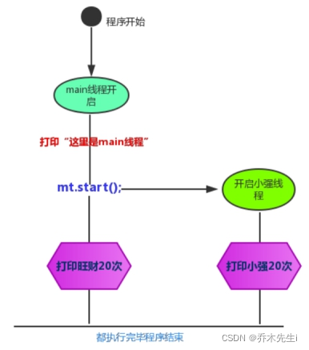

---
tags:
  - Java/并发编程
---

## 创建线程

多线程执行时，在栈内存中，每一个执行线程都有一片自己所属的栈内存空间。进行方法的压栈和弹栈。



**创建线程有两种方式：**

- 创建一个`Thread`类，或者一个`Thread`子类的对象

- 创建一个实现`Runnable`接口的类的对象

### 方式一：Thread类

Java使用 `java.lang.Thread` 类代表线程，所有的线程对象都必须 `Thread` 类或其子类的实例。每个线程的作用是完成一定的任务，实际上就是执行一段程序流即一段顺序执行的代码。Java使用线程执行体来代表这段程序流。

```java
// 创建线程对象
Thread t = new Thread() {
    public void run() {
        // 要执行的任务
    }
};

// 启动线程
t.start();
```


案例：

```java
@Slf4j
public class Main {
    public static void main(String[] args) {

        // 构造方法的参数可以执行线程的名字
        Thread t = new Thread("t1") {
            @Override
            public void run() {
                // run方法内指定了线程要执行的任务
                log.debug("hello");
            }
        };

        // 启动线程
        t.start();
    }
}
```

> 也可以创建一个类继承Thread类，然后调用子类的 `start`  方法。


**start底层：**
> 当调用`start`方法时，`start`方法会调用`start0`方法，而`start0`方法是本地方法，由JVM调用，底层是C/C++实现


### 方式二：Runnable接口

> Java不支持多继承，如果继承了其他类则无法继承Thread类，则需要实现 Runnable 接口。如果不打算重写Thread类的其他方法，也可以选择实现 Runnable 接口。

`java.lang.Runnable` 是Java中用以实现线程的接口，只需要重写 `run` 方法即可。任何实现线程功能的类都必须实现此接口。

把【线程】和【任务】（要执行的代码）分开：

* Thread 代表线程
* Runnable 可运行的任务（线程要执行的代码）

```java
Runnable runnable = new Runnable() {
    @Override
    public void run() {
        // run方法内指定了线程要执行的任务
    }
};
// 创建线程对象
Thread t = new Thread(runnable);
// 启动线程
t.start();
```


案例：

```java
@Slf4j
public class RunnableTest {
    public static void main(String[] args) {

        Runnable runnable = new Runnable() {
            @Override
            public void run() {
                // run方法内指定了线程要执行的任务
                log.debug("hello");
            }
        };

        // 创建线程对象
        Thread t = new Thread(runnable);

        // 启动线程
        t.start();
    }
}
```


java8以后可以使用lambda精简代码：

```java
Runnable runnable = () -> log.debug("hello");
// 创建线程对象，参数2是线程的名字
Thread t = new Thread(runnable, "r");
// 启动线程
t.start();
```


### Thread和Runnable的关系

实现 `Runnable` 接口比继承 `Thread` 类所具有的优势：

* 方法1 是把线程和任务合并在了一起，方法2 是把线程和任务分开了，所以 `Runnable` 接口适合多个相同的程序代码的线程去共享同一个资源
* 用 Runnable 让任务类脱离了 Thread 继承体系，避免java中的单继承的局限性
* 用 Runnable 更容易与线程池等高级 API 配合，线程池只能放入实现Runable或Callable类线程，不能直接放入继承Thread的类
* 增加程序的健壮性，实现解耦操作，代码可以被多个线程共享，代码和线程独立

在 Java 中，每次程序运行至少启动2个线程。一个是main线程，一个是垃圾收集线程。因为每当使用java命令执行一个类的时候，实际上都会启动一个JVM，每一个JVM其实在就是在操作系统中启动了一个进程。


### 方式三：FutureTask配合Thread

FutureTask 能够接收 Callable 类型的参数，用来处理有返回结果的情况。

FutureTask 实现了 RunnableFuture 接口，间接实现了 Runnable 接口和 Future 接口。

而 Callable 的 call 方法可以有方法的返回值并且可以抛出异常，从而实现线程间的参数传递。

```java
// 创建任务对象
FutureTask<Integer> futureTask = new FutureTask<>(() -> {
    log.debug("hello");
    return 100;
});

// 创建并启动一个线程，参数1是任务对象，参数2是线程名
new Thread(futureTask, "f").start();
// 主线程阻塞，同步等待futureTask执行完毕的结果
Integer result = futureTask.get();
log.debug("futureTask的结果是：{}", result);
```

结果：


## 查看进程线程的方法

### windows
任务管理器可以查看进程和线程数，也可以用来杀死进程

* `tasklist` ：查看进程
* `taskkill` ：杀死进程


### Linux
* `ps -fe` ：查看所有进程
* `ps -fT -p <PID>`  ：查看某个进程（PID）的所有线程
* `kill` ：杀死进程
* `top` ：按大写 H 切换是否显示线程
* `top -H -p <PID>`  ：查看某个进程（PID）的所有线程


### Java
* `jps` ：命令查看所有 Java 进程
* `jstack <PID>`  ：查看某个 Java 进程（PID）的所有线程状态
* `jconsole` ：来查看某个 Java 进程中线程的运行情况（图形界面）


## jconsole 远程监控配置
需要以如下方式运行 java 类：

```bash
java -Djava.rmi.server.hostname=`ip地址` -Dcom.sun.management.jmxremote -
Dcom.sun.management.jmxremote.port=`连接端口` -Dcom.sun.management.jmxremote.ssl=是否安全连接 -
Dcom.sun.management.jmxremote.authenticate=是否认证 java类
```


如果要认证访问，还需要做如下步骤：

* 复制 `jmxremote.password` 文件
* 修改 `jmxremote.password` 和 `jmxremote.access` 文件的权限为 600 即文件所有者可读写
* 连接时填入 controlRole（用户名），R&D（密码）
