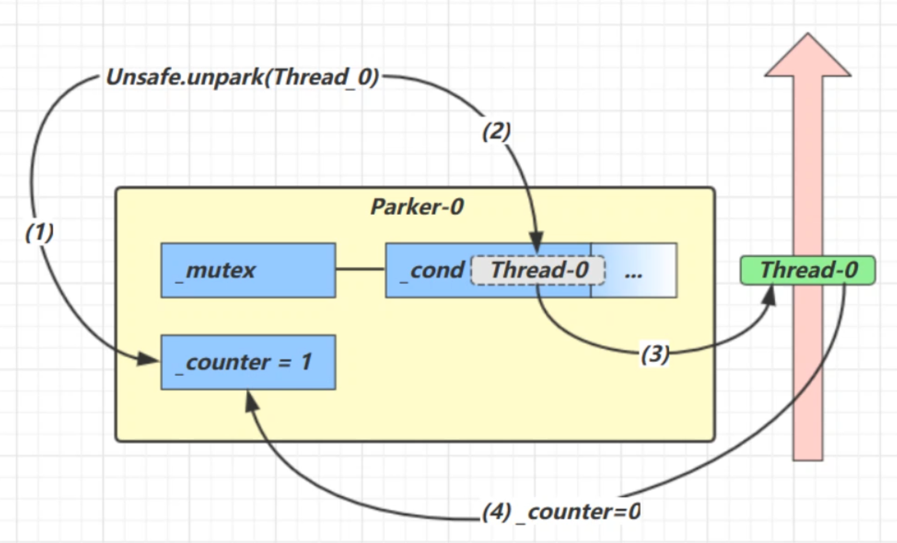
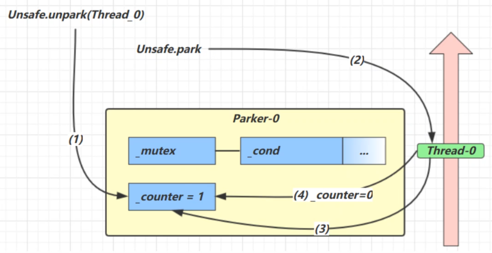

## 基本使用

它们是 LockSupport 类中的方法

```java
// 暂停当前线程
LockSupport.park();

// 恢复某个线程的运行
LockSupport.unpark(暂停线程对象)
```

先 park 再 unpark ，也可以先 unpark 再park ：

```java
Thread t1 = new Thread(() -> {
	log.debug("start...");
	sleep(1);
	log.debug("park...");
	LockSupport.park();
	log.debug("resume...");
},"t1");

t1.start();
sleep(2);

log.debug("unpark...");
LockSupport.unpark(t1);
```

## 特点

与 Object 的 wait & notify 相比
- `wait`，`notify` 和 `notifyAll` 必须配合 Object Monitor 一起使用，而 `park`，`unpark` 不必
- `park` & `unpark` 是以线程为单位来【阻塞】和【唤醒】线程，而 notify 只能随机唤醒一个等待线程，`notifyAll` 是唤醒所有等待线程，就不那么【精确】
- `park` & `unpark` 可以先 `unpark`，而 `wait` & `notify` 不能先 `notify`

## 原理

每个线程都有自己的一个 `Parker` 对象，由三部分组成 `_counter` ，`_cond` 和 `_mutex`。

线程就像一个旅人，Parker 就像他随身携带的背包，条件变量就好比背包中的帐篷。

`_counter`就好比背包中的备用干粮（0 为耗尽，1 为充足）

调用 park 方法就是要看需不需要停下来歇息：
- 如果备用干粮耗尽，那么钻进帐篷歇息
- 如果备用干粮充足，那么不需停留，继续前进

调用 unpark，就好比干粮充足：
- 如果这时线程还在帐篷，就唤醒让他继续前进
- 如果这时线程还在运行，那么下次他调用 park 时，仅是消耗掉备用干粮，不需停留继续前进
- 因为背包空间有限，多次调用 unpark 仅会补充一份备用干粮


调用park：

1. 当前线程调用 `Unsafe.park()` 方法
2. 检查 `_counter` ，本情况为 0，这时，获得 `_mutex` 互斥锁
3. 线程进入 `_cond` 条件变量阻塞
4. 设置 `_counter = 0`




调用unpark：

1. 调用 `Unsafe.unpark(Thread_0)` 方法，设置 `_counter` 为 1
2. 唤醒 `_cond` 条件变量中的 Thread_0
3. Thread_0 恢复运行
4. 设置 `_counter` 为 0




先调用unpark，再调用park：

1. 调用 `Unsafe.unpark(Thread_0)` 方法，设置 `_counter` 为 1
2. 唤醒 `_cond` 条件变量中的 Thread_0
3. Thread_0 恢复运行
4. 设置 `_counter` 为 0