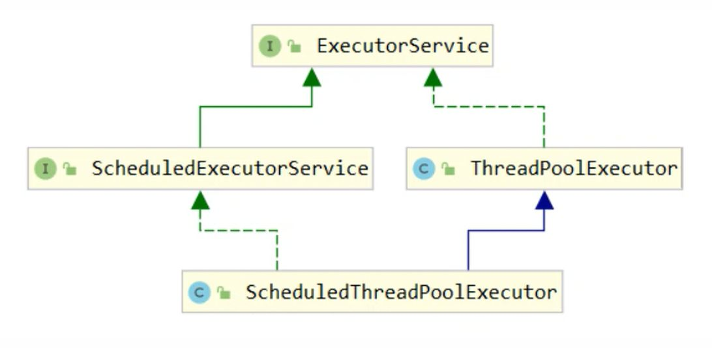

线程池是一个容纳多个线程的容器，其中的线程可以反复使用，省去了频繁创建线程对象的操作，无需反复创建线程而消耗过多资源。

1. **合理利用CPU和内存**。减少了创建和销毁线程的次数，每个工作线程都可以被重复利用，可执行多个任务。
2. **加快响应速度**。当任务到达时，任务可以不需要的等到线程创建就能立即执行。
3. **统一管理**。可以根据系统的承受能力，调整线程池中工作线线程的数目，防止因为消耗过多的内存，而把服务器累趴下（每个线程需要大约1MB内存，线程开的越多，消耗的内存也就越大，最后死机）。




Java里面线程池的顶级接口是**java.util.concurrent.Executor**，但是严格意义上讲Executor并不是一个线程池，而只是一个执行线程的工具。真正的线程池接口是**java.util.concurrent.ExecutorService**。


## 线程池状态


ThreadPoolExecutor 使用 int 的高 3 位来表示线程池状态，低 29 位表示线程数量

| 状态名 | 高3位 | 接收新任务 | 处理阻塞任务 | 说明 |
|:---|---|---|---|---|
| RUNNING | 111 | Y | Y | |
| SHUTDOWN | 000 | N | Y | 不会接收新任务，但会处理阻塞队列剩余任务|
| STOP | 001 | N | N |会中断正在执行的任务，并抛弃阻塞队列任务|
| TIDYING | 010 | Y | Y |任务全执行完毕，活动线程为 0 即将进入终结 |
| TERMINATED | 011 | Y | Y |终结状态 |

从数字上比较，TERMINATED > TIDYING > STOP > SHUTDOWN > RUNNING

这些信息存储在一个原子变量 ctl 中，目的是将线程池状态与线程个数合二为一，这样就可以用一次 cas 原子操作进行赋值。

```java
// c 为旧值， ctlOf 返回结果为新值
ctl.compareAndSet(c, ctlOf(targetState, workerCountOf(c))));

// rs 为高 3 位代表线程池状态， wc 为低 29 位代表线程个数，ctl 是合并它们
private static int ctlOf(int rs, int wc) { return rs | wc; }
```


## 构造方法

```java
public ThreadPoolExecutor(int corePoolSize,
                            int maximumPoolSize,
                            long keepAliveTime,
                            TimeUnit unit,
                            BlockingQueue<Runnable> workQueue,
                            ThreadFactory threadFactory,
                            RejectedExecutionHandler handler)
```


|参数名|类型|含义|
|---|---|---|
|corePoolSize|int|核心线程数，最多保留的线程数|
|maxPoolSize|int|最大线程数|
|keepAliveTime|long|保持存活时间，针对救急线程|
|unit|TimeUnit|时间单位，针对救急线程|
|workQueue|BlockingQueue|阻塞队列|
|threadFactory|ThreadFactory|线程工厂，可以为线程创建时起个好名字|
|handler|RejectedExecutionHandler|由于线程池无法接受你所提交的任务的拒绝策略|

- **corePoolSize**指的是核心线程数，线程池在完成初始化后，默认情况下，线程池中并没有任何线程，线程池会等待有任务到来时，再创建新线程去执行任务。
- 最大量**maxPoolSize**，在核心线程数的基础上，额外增加的线程数的上限。
- **keepAliveTime**如果线程池当前的线程数多于corePoolSize，那么如果多余的线程空闲时间超过keepAliveTime，它们就会被终止。
- **ThreadFactory**用来创建线程：
    - 新的线程是由ThreadFactory创建的，默认使Executors.defaultThreadFactory()
    - 创建出来的线程都在同一个线程组，拥有同样的NORM_PRIORITY优先级并且都不是守护线程。
    - 如果自己指定ThreadFactory，那么就可以改变线程名、线程组、优先级、是否是守护线程等。
    - 通常使用默认的ThreadFactory就可以了
- **workQueue**有3种最常见的队列类型：
    1. 直接交接：SynchronousQueue
    2. 无界队列：LinkedBlockingQueue
    3. 有界的队列：ArrayBlockingQueue


- 线程池中刚开始没有线程，当一个任务提交给线程池后，线程池会创建一个新线程来执行任务。
- 当线程数达到 corePoolSize 并没有线程空闲，这时再加入任务，新加的任务会被加入workQueue 队列排队，直到有空闲的线程。
- 如果队列选择了有界队列，那么任务超过了队列大小时，会创建 maximumPoolSize - corePoolSize 数目的线程来救急。
- 如果线程到达 maximumPoolSize 仍然有新任务这时会执行拒绝策略。拒绝策略 jdk 提供了 4 种实现，其它著名框架也提供了实现

    - AbortPolicy 让调用者抛出 RejectedExecutionException 异常，这是默认策略
    - CallerRunsPolicy 让调用者运行任务
    - DiscardPolicy 放弃本次任务
    - DiscardOldestPolicy 放弃队列中最早的任务，本任务取而代之

    - Dubbo 的实现，在抛出 RejectedExecutionException 异常之前会记录日志，并 dump 线程栈信息，方便定位问题
    - Netty 的实现，是创建一个新线程来执行任务
    - ActiveMQ 的实现，带超时等待（60s）尝试放入队列，类似我们之前自定义的拒绝策略
    - PinPoint 的实现，它使用了一个拒绝策略链，会逐一尝试策略链中每种拒绝策略

- 当高峰过去后，超过corePoolSize 的救急线程如果一段时间没有任务做，需要结束节省资源，这个时间由keepAliveTime 和 unit 来控制。


要配置一个线程池是比较复杂的，尤其是对于线程池的原理不是很清楚的情况下，很有可能配置的线程池不是较优的，因此在java.util.concurrent.Executors线程工厂类里面提供了一些静态工厂，生成一些常用的线程池。官方建议使用 Executors工程类来创建线程池对象。

## 线程池里的线程数量

- CPU密集型（加密、计算hash等）：最佳线程数为CPU核心数的1-2倍左右。
- 耗时IO型（读写数据库、文件、网络读写等）：最佳线程数一般会大于CPU核心数很多倍

参考Brain Goetz推荐的计算方法：

`线程数=CPU核心数 *（1+平均等待时间/平均工作时间）`


## 常见线程池

手动创建更好，因为这样可以更加明确线程池的运行规则，避免资源耗尽的风险。

- newFixedThreadPool：容易造成大量内存占用，可能会导致OOM错误。
- newSingleThreadExecutor：当请求堆积的时候，可能会占用大量的内存。
- newCachedThreadPool：弊端在于第二个参数maximumPoolSize被设置为了Integer.MAX_VALUE，这可能会创建数量非常多的线程，甚至导致OOM错误。
- newScheduledThreadPool：原因和newCachedThreadPool一样。


### newFixedThreadPool

```java
public static ExecutorService newFixedThreadPool(int nThreads) {
    return new ThreadPoolExecutor(nThreads, nThreads, 0L, 
        TimeUnit.MILLISECONDS, new LinkedBlockingQueue<Runnable>());
}
```

特点
- 核心线程数 == 最大线程数（没有救急线程被创建），因此也无需超时时间
- 阻塞队列是无界的，可以放任意数量的任务

> 适用于任务量已知，相对耗时的任务


### newCachedThreadPool

```java
public static ExecutorService newCachedThreadPool() {
    return new ThreadPoolExecutor(0, Integer.MAX_VALUE, 60L, TimeUnit.SECONDS,
        new SynchronousQueue<Runnable>());
}
```

特点
- 核心线程数是 0， 最大线程数是 Integer.MAX_VALUE，救急线程的空闲生存时间是 60s，意味着
    - 全部都是救急线程（60s 后可以回收）
    - 救急线程可以无限创建
- 队列采用了 SynchronousQueue 实现特点是，它没有容量，没有线程来取是放不进去的（一手交钱、一手交货）

> 整个线程池表现为线程数会根据任务量不断增长，没有上限，当任务执行完毕，空闲 1分钟后释放线程。 适合任务数比较密集，但每个任务执行时间较短的情况。


### newSingleThreadExecutor

```java
public static ExecutorService newSingleThreadExecutor() {
    return new FinalizableDelegatedExecutorService(new ThreadPoolExecutor(1, 1,
        0L, TimeUnit.MILLISECONDS, new LinkedBlockingQueue<Runnable>()));
}
```

使用场景：
- 希望多个任务排队执行。线程数固定为 1，任务数多于 1 时，会放入无界队列排队。任务执行完毕，这唯一的线程也不会被释放。

区别：
- 自己创建一个单线程串行执行任务，如果任务执行失败而终止那么没有任何补救措施，而线程池还会新建一个线程，保证池的正常工作
- Executors.newSingleThreadExecutor() 线程个数始终为1，不能修改
    - FinalizableDelegatedExecutorService 应用的是装饰器模式，只对外暴露了 ExecutorService 接口，因此不能调用 ThreadPoolExecutor 中特有的方法
- Executors.newFixedThreadPool(1) 初始时为1，以后还可以修改
    - 对外暴露的是 ThreadPoolExecutor 对象，可以强转后调用 setCorePoolSize 等方法进行修改


### ScheduledThreadPool

支持定时及周期性任务执行的线程池


## 提交任务

```java
// 执行任务
void execute(Runnable command);

// 提交任务 task，用返回值 Future 获得任务执行结果
<T> Future<T> submit(Callable<T> task);

// 提交 tasks 中所有任务
<T> List<Future<T>> invokeAll(Collection<? extends Callable<T>> tasks) 
    throws InterruptedException;

// 提交 tasks 中所有任务，带超时时间
<T> List<Future<T>> invokeAll(Collection<? extends Callable<T>> tasks, 
    long timeout, TimeUnit unit) throws InterruptedException;

// 提交 tasks 中所有任务，哪个任务先成功执行完毕，返回此任务执行结果，其它任务取消

<T> T invokeAny(Collection<? extends Callable<T>> tasks) 
    throws InterruptedException, ExecutionException;
    
// 提交 tasks 中所有任务，哪个任务先成功执行完毕，返回此任务执行结果，其它任务取消，带超时时间
<T> T invokeAny(Collection<? extends Callable<T>> tasks,
    long timeout, TimeUnit unit)
    throws InterruptedException, ExecutionException, TimeoutException;
```


## 关闭线程池

### shutdown

```java
/*
线程池状态变为 SHUTDOWN
- 不会接收新任务
- 但已提交任务会执行完
- 此方法不会阻塞调用线程的执行
*/
public void shutdown() {
    final ReentrantLock mainLock = this.mainLock;
    mainLock.lock();
    try {
        checkShutdownAccess();
        // 修改线程池状态
        advanceRunState(SHUTDOWN);
        // 仅会打断空闲线程
        interruptIdleWorkers();
        onShutdown(); // 扩展点 ScheduledThreadPoolExecutor
    } finally {
        mainLock.unlock();
    }
    // 尝试终结(没有运行的线程可以立刻终结，如果还有运行的线程也不会等)
    tryTerminate();
}
```


### shutdownNow

```java
/*
线程池状态变为 STOP
- 不会接收新任务
- 会将队列中的任务返回
- 并用 interrupt 的方式中断正在执行的任务
*/
public List<Runnable> shutdownNow() {
    List<Runnable> tasks;
    final ReentrantLock mainLock = this.mainLock;
    mainLock.lock();
    
    try {
        checkShutdownAccess();
        // 修改线程池状态
        advanceRunState(STOP);
        // 打断所有线程
        interruptWorkers();
        // 获取队列中剩余任务
        tasks = drainQueue();
    } finally {
        mainLock.unlock();
    }
    // 尝试终结
    tryTerminate();
    return tasks;
}
```

### 其它方法

```java
// 不在 RUNNING 状态的线程池，此方法就返回 true
boolean isShutdown();

// 线程池状态是否是 TERMINATED
boolean isTerminated();

// 调用 shutdown 后，由于调用线程并不会等待所有任务运行结束，
// 因此如果它想在线程池 TERMINATED 后做些事情，可以利用此方法等待
boolean awaitTermination(long timeout, TimeUnit unit) throws InterruptedException;
```


